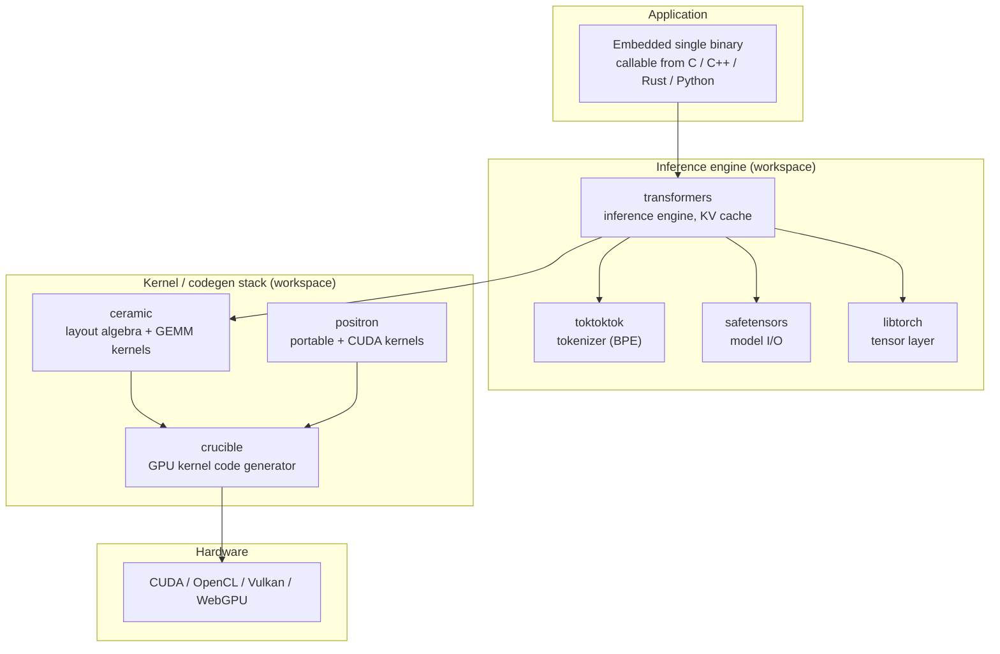

# Tattletale Architecture

Tattletale is a high-performance inference engine written in Nim.

Nim compiles to C, C++ or Javascript by default, it also provides some of the most powerful macros of all statically typed programming languages. Tattletale leverages that to implement a compiler directly in Nim macros that transforms Nim code into Cuda, OpenCL, Vulkan or WebGPU directly at Nim-compile-time (or runtime if preferable).

This document describes how the monorepo is organized and how the pieces connect, from a
high-level inference goal down to emitted GPU code.

The goals are stated in [`README.md`](README.md) (concurrent queries, 1M+
context, embeddable single binary, multi-hardware, multi-modality, maintainable)
and the development conventions live in [`AGENTS.md`](AGENTS.md). See
[`workspace/README.md`](workspace/README.md) for a per-project catalog.

## Layer stack

The codebase is layered so that each layer depends only on the one below it.
The inference engine (top) consumes a tokenizer, a tensor layer, and model I/O,
all of which ultimately run kernels produced by the GPU code-generation stack
(bottom).



Dependencies are transitive: the engine builds on the tensor, tokenizer and
model-I/O layers, and the code-generation stack builds on the layout algebra
(ceramic) and kernel specs (positron) to emit native GPU code (crucible).

## How the pieces connect

The data flow runs top-down from an inference goal to emitted GPU code.

1. **`transformers`** ([`workspace/transformers/transformers.nim`](workspace/transformers/transformers.nim))
   is the inference engine. Its `forward()` functions are stateless and pure
   (see [`workspace/transformers/docs/DESIGN.md`](workspace/transformers/docs/DESIGN.md)),
   which enables tensor/pipeline parallelism, prefill–decode disaggregation,
   continuous batching, prefix caching, speculative decoding and CUDA
   graphs. Stateful pieces such as the KV cache are isolated in
   [`workspace/transformers/src/stateful/`](workspace/transformers/src/stateful/).

2. **`toktoktok`** ([`workspace/toktoktok/toktoktok.nim`](workspace/toktoktok/toktoktok.nim))
   provides the BPE tokenizer used to turn text into token sequences
   ([`workspace/toktoktok/src/bpe_codec.nim`](workspace/toktoktok/src/bpe_codec.nim)).

3. **`safetensors`** ([`workspace/safetensors/safetensors.nim`](workspace/safetensors/safetensors.nim))
   loads model weights from safetensors files, with a libtorch bridge
   ([`workspace/safetensors/src/safetensors_libtorch.nim`](workspace/safetensors/src/safetensors_libtorch.nim)).

4. **`libtorch`** ([`workspace/libtorch/libtorch.nim`](workspace/libtorch/libtorch.nim))
   is the tensor layer wrapping the C++ libtorch runtime
   ([`workspace/libtorch/src/tensors.nim`](workspace/libtorch/src/tensors.nim),
   [`workspace/libtorch/src/tensors_nn.nim`](workspace/libtorch/src/tensors_nn.nim)).
   The README states the libtorch dependency is planned for removal.

5. **`ceramic`** ([`workspace/ceramic/ceramic.nim`](workspace/ceramic/ceramic.nim))
   is a layout-algebra library (a CuTe port): `Layout[Shape, Stride]`,
   `Int[N]`, and layout transformations `coalesce`, `complement`, `compose`,
   `logical_divide` ([`workspace/ceramic/src/layout_algebra.nim`](workspace/ceramic/src/layout_algebra.nim)),
   plus CPU/GPU fill, copy and GEMM kernels
   ([`workspace/ceramic/src/kernel_gemm_gpu.nim`](workspace/ceramic/src/kernel_gemm_gpu.nim)).

6. **`positron`** ([`workspace/positron/positron.nim`](workspace/positron/positron.nim))
   provides portable kernel specs
   ([`workspace/positron/src/kernels/portable/`](workspace/positron/src/kernels/portable/))
   and a prebuilt CUDA static library built from
   [`workspace/positron/make_libpositron_cuda.cu`](workspace/positron/make_libpositron_cuda.cu)
   (Hadamard FWHT-128 + RMSNorm), wired through
   [`workspace/positron/libpositron_cuda.nim`](workspace/positron/libpositron_cuda.nim).

7. **`crucible`** ([`workspace/crucible/crucible.nim`](workspace/crucible/crucible.nim))
   is the GPU kernel code generator: Nim macros consume ceramic layout algebra
   and positron kernel specs and emit native CUDA, OpenCL, Vulkan and WebGPU
   code ([`workspace/crucible/src/codegen/gpu_compiler.nim`](workspace/crucible/src/codegen/gpu_compiler.nim),
   targets under [`workspace/crucible/src/codegen/targets/`](workspace/crucible/src/codegen/targets/),
   ABIs under [`workspace/crucible/src/abis/`](workspace/crucible/src/abis/)).

## Repo layout

```
tattletale/
├── README.md              # project goals and highlights
├── AGENTS.md              # build/test/lint and conventions
├── ARCHITECTURE.md        # this document
├── config.nims            # Nim build configuration and task aliases
├── formalities/           # symlinks to Lean4 formal specs (kvcache, wavl_tree)
├── docs/                  # design notes (design/, dev/)
├── examples/              # end-to-end examples (currently build outputs only)
├── papers/                # reference material (CuTe layout, data structures, matmul)
├── _experimental/         # exploratory code (cutile, nimcuda)
└── workspace/
    ├── README.md          # per-project catalog (see below)
    ├── transformers/      # inference engine + KV cache
    ├── toktoktok/         # BPE tokenizer
    ├── safetensors/       # model I/O
    ├── libtorch/          # tensor layer
    ├── ceramic/           # layout algebra + GEMM kernels
    ├── crucible/          # GPU kernel code generator
    ├── positron/          # portable + CUDA kernels
    ├── data_structures/   # WAVL tree + longest-prefix-match
    ├── bencher/           # benchmarking
    ├── cpuplatforms/      # x86 CPU detection / SIMD
    └── pcre2/             # vendored PCRE2 bindings
```

Each `workspace/<name>/` directory has a `<name>.nim` entry file that re-exports
its `src/` modules.

## Extension points

- **New hardware target**: add a backend under
  [`workspace/crucible/src/codegen/targets/`](workspace/crucible/src/codegen/targets/)
  and the corresponding ABI under
  [`workspace/crucible/src/abis/`](workspace/crucible/src/abis/). Crucible's
  pass pipeline is registered in
  [`workspace/crucible/src/codegen/gpu_compiler.nim`](workspace/crucible/src/codegen/gpu_compiler.nim).
- **New kernel**: add a portable spec under
  [`workspace/positron/src/kernels/portable/`](workspace/positron/src/kernels/portable/)
  or a CUDA kernel under
  [`workspace/positron/src/kernels/cuda/`](workspace/positron/src/kernels/cuda/)
  (the latter must be listed in
  [`workspace/positron/make_libpositron_cuda.cu`](workspace/positron/make_libpositron_cuda.cu)).
- **New layout transform / GEMM**: extend
  [`workspace/ceramic/src/layout_algebra.nim`](workspace/ceramic/src/layout_algebra.nim)
  or add a kernel under
  [`workspace/ceramic/src/`](workspace/ceramic/src/).
- **New model**: add a model file under
  [`workspace/transformers/src/models/`](workspace/transformers/src/models/).

## Formal verification

Tattletale uses Lean4 to formalize its stateful data structures, a
differentiator for the correctness-critical pieces:

- [`workspace/data_structures/src/wavl_tree.lean`](workspace/data_structures/src/wavl_tree.lean)
  — intrusive WAVL tree formalization.
- [`workspace/transformers/src/stateful/kvcache.lean`](workspace/transformers/src/stateful/kvcache.lean)
  — PagedRadixTrie KV cache formalization.

Both are symlinked from [`formalities/`](formalities/) (see
[`formalities/README.md`](formalities/README.md)).

## Related documents

- [`workspace/README.md`](workspace/README.md) — per-project catalog.
- [`workspace/crucible/README.md`](workspace/crucible/README.md),
  [`workspace/crucible/ARCHITECTURE.md`](workspace/crucible/ARCHITECTURE.md)
- [`workspace/ceramic/README.md`](workspace/ceramic/README.md),
  [`workspace/ceramic/ARCHITECTURE.md`](workspace/ceramic/ARCHITECTURE.md)
- [`workspace/transformers/README.md`](workspace/transformers/README.md),
  [`workspace/transformers/ARCHITECTURE.md`](workspace/transformers/ARCHITECTURE.md)
- [`workspace/transformers/docs/DESIGN.md`](workspace/transformers/docs/DESIGN.md)
- [`docs/dev/CONVENTIONS.md`](docs/dev/CONVENTIONS.md), [`docs/dev/Nim-C++_compat.md`](docs/dev/Nim-C++_compat.md)
- Agent guidelines: [`AGENTS.md`](AGENTS.md), [`workspace/crucible/AGENTS.md`](workspace/crucible/AGENTS.md),
  [`workspace/ceramic/AGENTS.md`](workspace/ceramic/AGENTS.md)

## License

Dual-licensed under either of the MIT license or the Apache License, Version
2.0, at your option. Every source file carries this header (see, for example,
[`workspace/positron/libpositron_cuda.nim`](workspace/positron/libpositron_cuda.nim)).
