# Categorical Foundations for CuTe Layouts

Colfax Research

September 2025

## Abstract

NVIDIA's CUTLASS library provides a robust and expressive set of methods for describing and manipulating multi-dimensional tensor data on the GPU. These methods are conceptually grounded in the abstract notion of a CuTe layout and a rich algebra of such layouts, including operations such as composition, logical product, and logical division. In this paper, we present a categorical framework for understanding this layout algebra by focusing on a naturally occurring class of tractable layouts. To this end, we define two categories \textit{Tuple} and \textit{Nest} whose morphisms give rise to layouts. We define a suite of operations on morphisms in these categories and prove their compatibility with the corresponding layout operations. Moreover, we give a complete characterization of the layouts which arise from our construction. Finally, we provide a Python implementation of our categorical constructions, along with tests that demonstrate alignment with CUTLASS behavior. This implementation can be found at our git repository https://github.com/ColfaxResearch/layout-categories.

## Contents

1 Introduction 3    
1.1 Summary of main results 6    
1.2 Organization 8    
1.3 Implementation 10    
1.4 Notation 16    
2 Layouts and their algebra 17    
2.1 Flat Layouts 17    
2.1.1 Tuples 17    
2.1.2 Basic definitions 18    
2.1.3 Basic operations 26    
2.1.4 Flat coalesce 35    
2.1.5 Compact flat layouts 40    
2.1.6 Complements 43    
2.1.7 Further operations 53    
2.1.8 Tractable flat layouts 55    
2.2 Nested Tuples 57    
2.2.1 Profiles 57    
2.2.2 Basic definitions 59    
2.2.3 Substitution 62    
2.2.4 Refinement 63    
2.3 Layouts 66    
2.3.1 Basic definitions 66    
2.3.2 Basic operations 69    
2.3.3 Coalesce 71    
2.3.4 Relative coalesce 73    
2.3.5 Compact layouts 76    
2.3.6 Complements 77    
2.3.7 Composition 79    
2.3.8 Logical division 80    
2.3.9 Logical product 83    
2.3.10 Tractable layouts 84    
3 Categories of layouts 86    
3.1 The category Tuple 86    
3.1.1 Basic definitions 86

3.1.2 From tuple morphisms to flat layouts ..... 90    
3.1.3 Examples ..... 98    
3.1.4 Realization of tuple morphisms ..... 102    
3.1.5 Operations on tuple morphisms ..... 105    
3.2 The category  $ \text{Nest} $ ..... 123    
3.2.1 Basic definitions ..... 123    
3.2.2 From nested tuple morphisms to layouts ..... 124    
3.2.3 Examples ..... 127    
3.2.4 Realization of nested tuple morphisms ..... 129    
3.2.5 Refinements ..... 130    
3.2.6 Operations on nested tuple morphisms ..... 138    
4 Computations ..... 146    
4.1 Composition ..... 146    
4.1.1 Mutual refinements ..... 147    
4.1.2 From mutual refinements to composable morphisms ..... 151    
4.1.3 The composition algorithm ..... 152    
4.1.4 Examples ..... 153    
A An introduction to categories ..... 157    
A.1 What is a category? ..... 157    
A.2 What is a functor? ..... 160

### Chapter 1

## Introduction

In modern computing, particularly in GPU programming, performance depends critically on how multi-dimensional data is stored and accessed in memory. While most data that we care about—such as images, videos, and tensors in machine learning—are inherently multi-dimensional, a computer's memory is fundamentally one-dimensional. This means that when we want to load, store, or otherwise manipulate data, we need to map its multi-dimensional logical coordinates to one-dimensional physical coordinates. This mapping, known as a layout, is essential for reading from and writing to memory correctly and efficiently. Moreover, with respect to the GPU's SIMT execution model, layouts are used to describe and manipulate partitionings of threads over data. This is important to ensure optimized memory access patterns and correct invocation of specialized hardware instructions such as those used to target tensor cores.

As a motivating example, suppose we want to store the  $ 4 \times 8 $ matrix

$$ A=\begin{bmatrix}12.47&87.21&34.08&56.93&45.65&9.17&73.02&21.39\\ 64.88&30.41&1.72&88.04&92.55&17.06&50.91&68.77\\ 3.33&77.19&61.58&29.46&15.82&80.75&44.62&39.28\\ 91.40&26.12&6.97&53.03&58.66&33.79&11.20&70.55\end{bmatrix}$$

in memory. In order to do so, we need to specify a memory address for each entry of A. We do this by choosing some address for the  $ (0,0) $th entry of A, and specifying an offset for each other entry of A. One common choice is the row-major layout

<table border=1 style='margin: auto; word-wrap: break-word;'><tr><td style='text-align: center; word-wrap: break-word;'>0</td><td style='text-align: center; word-wrap: break-word;'>1</td><td style='text-align: center; word-wrap: break-word;'>2</td><td style='text-align: center; word-wrap: break-word;'>3</td><td style='text-align: center; word-wrap: break-word;'>4</td><td style='text-align: center; word-wrap: break-word;'>5</td><td style='text-align: center; word-wrap: break-word;'>6</td><td style='text-align: center; word-wrap: break-word;'>7</td></tr><tr><td style='text-align: center; word-wrap: break-word;'>8</td><td style='text-align: center; word-wrap: break-word;'>9</td><td style='text-align: center; word-wrap: break-word;'>10</td><td style='text-align: center; word-wrap: break-word;'>11</td><td style='text-align: center; word-wrap: break-word;'>12</td><td style='text-align: center; word-wrap: break-word;'>13</td><td style='text-align: center; word-wrap: break-word;'>14</td><td style='text-align: center; word-wrap: break-word;'>15</td></tr><tr><td style='text-align: center; word-wrap: break-word;'>16</td><td style='text-align: center; word-wrap: break-word;'>17</td><td style='text-align: center; word-wrap: break-word;'>18</td><td style='text-align: center; word-wrap: break-word;'>19</td><td style='text-align: center; word-wrap: break-word;'>20</td><td style='text-align: center; word-wrap: break-word;'>21</td><td style='text-align: center; word-wrap: break-word;'>22</td><td style='text-align: center; word-wrap: break-word;'>23</td></tr><tr><td style='text-align: center; word-wrap: break-word;'>24</td><td style='text-align: center; word-wrap: break-word;'>25</td><td style='text-align: center; word-wrap: break-word;'>26</td><td style='text-align: center; word-wrap: break-word;'>27</td><td style='text-align: center; word-wrap: break-word;'>28</td><td style='text-align: center; word-wrap: break-word;'>29</td><td style='text-align: center; word-wrap: break-word;'>30</td><td style='text-align: center; word-wrap: break-word;'>31</td></tr></table>

The notation  $ L^{\mathrm{row}} = (4, 8) : (8, 1) $ indicates that the offset of the  $ (i, j) $th entry of our matrix is
 

$$ (i,j)\cdot(8,1)=8i+j.$$

Another common choice is the column-major layout

<table border=1 style='margin: auto; word-wrap: break-word;'><tr><td style='text-align: center; word-wrap: break-word;'>0</td><td style='text-align: center; word-wrap: break-word;'>4</td><td style='text-align: center; word-wrap: break-word;'>8</td><td style='text-align: center; word-wrap: break-word;'>12</td><td style='text-align: center; word-wrap: break-word;'>16</td><td style='text-align: center; word-wrap: break-word;'>20</td><td style='text-align: center; word-wrap: break-word;'>24</td><td style='text-align: center; word-wrap: break-word;'>28</td></tr><tr><td style='text-align: center; word-wrap: break-word;'>1</td><td style='text-align: center; word-wrap: break-word;'>5</td><td style='text-align: center; word-wrap: break-word;'>9</td><td style='text-align: center; word-wrap: break-word;'>13</td><td style='text-align: center; word-wrap: break-word;'>17</td><td style='text-align: center; word-wrap: break-word;'>21</td><td style='text-align: center; word-wrap: break-word;'>25</td><td style='text-align: center; word-wrap: break-word;'>29</td></tr><tr><td style='text-align: center; word-wrap: break-word;'>2</td><td style='text-align: center; word-wrap: break-word;'>6</td><td style='text-align: center; word-wrap: break-word;'>10</td><td style='text-align: center; word-wrap: break-word;'>14</td><td style='text-align: center; word-wrap: break-word;'>18</td><td style='text-align: center; word-wrap: break-word;'>22</td><td style='text-align: center; word-wrap: break-word;'>26</td><td style='text-align: center; word-wrap: break-word;'>30</td></tr><tr><td style='text-align: center; word-wrap: break-word;'>3</td><td style='text-align: center; word-wrap: break-word;'>7</td><td style='text-align: center; word-wrap: break-word;'>11</td><td style='text-align: center; word-wrap: break-word;'>15</td><td style='text-align: center; word-wrap: break-word;'>19</td><td style='text-align: center; word-wrap: break-word;'>23</td><td style='text-align: center; word-wrap: break-word;'>27</td><td style='text-align: center; word-wrap: break-word;'>31</td></tr></table>

Again, the notation  $ L^{\mathrm{col}} = (4, 8) : (1, 4) $ indicates that the offset of the  $ (i, j) $th entry of our matrix is

$$ (i,j)\cdot(1,4)=i+4j.$$

These layouts are extremely useful, but do not suffice for all purposes. For example, in high-performance computing, one often computes matrix products AB by

1. dividing the operand matrices A and B into tiles,

2. computing matrix products of the various tiles, and

3. combining these partial results to obtain the full result AB.

For instance, we could divide our  $ 4 \times 8 $ matrix A into  $ 2 \times 2 $ tiles, as depicted below.

$$ A=\left[\begin{array}{l l l l l l}{\left[\begin{matrix}{12.47}&{87.21}\\ {64.88}&{30.41}\end{matrix}\right]}&{\left[\begin{matrix}{34.08}&{56.93}\\ {1.72}&{88.04}\end{matrix}\right]}&{\left[\begin{matrix}{45.65}&{9.17}\\ {92.55}&{17.06}\end{matrix}\right]}&{\left[\begin{matrix}{73.02}&{21.39}\\ {50.91}&{68.77}\end{matrix}\right]}\\ {\left[\begin{matrix}{3.33}&{77.19}\\ {91.40}&{26.12}\end{matrix}\right]}&{\left[\begin{matrix}{61.58}&{29.46}\\ {6.97}&{53.03}\end{matrix}\right]}&{\left[\begin{matrix}{15.82}&{80.75}\\ {58.66}&{33.79}\end{matrix}\right]}&{\left[\begin{matrix}{44.62}&{39.28}\\ {11.20}&{70.55}\end{matrix}\right]}\end{array}\right]$$

Suppose now that we wanted to slice out individual tiles of A, which we assume is laid out in column-major format in memory. To do this, one could manually compute offsets as follows: for the  $ (i,j) $th tile, the offset to index into the top-left entry of the tile is given by  $ 2i+8j $. On the other hand, to better organize this computation, we could use the interleaved layout of tiles

<table border=1 style='margin: auto; word-wrap: break-word;'><tr><td style='text-align: center; word-wrap: break-word;'>0</td><td style='text-align: center; word-wrap: break-word;'>2</td><td style='text-align: center; word-wrap: break-word;'>8</td><td style='text-align: center; word-wrap: break-word;'>10</td><td style='text-align: center; word-wrap: break-word;'>16</td><td style='text-align: center; word-wrap: break-word;'>18</td><td style='text-align: center; word-wrap: break-word;'>24</td><td style='text-align: center; word-wrap: break-word;'>26</td></tr><tr><td style='text-align: center; word-wrap: break-word;'>1</td><td style='text-align: center; word-wrap: break-word;'>3</td><td style='text-align: center; word-wrap: break-word;'>9</td><td style='text-align: center; word-wrap: break-word;'>11</td><td style='text-align: center; word-wrap: break-word;'>17</td><td style='text-align: center; word-wrap: break-word;'>19</td><td style='text-align: center; word-wrap: break-word;'>25</td><td style='text-align: center; word-wrap: break-word;'>27</td></tr><tr><td style='text-align: center; word-wrap: break-word;'>4</td><td style='text-align: center; word-wrap: break-word;'>6</td><td style='text-align: center; word-wrap: break-word;'>12</td><td style='text-align: center; word-wrap: break-word;'>14</td><td style='text-align: center; word-wrap: break-word;'>20</td><td style='text-align: center; word-wrap: break-word;'>22</td><td style='text-align: center; word-wrap: break-word;'>28</td><td style='text-align: center; word-wrap: break-word;'>30</td></tr><tr><td style='text-align: center; word-wrap: break-word;'>5</td><td style='text-align: center; word-wrap: break-word;'>7</td><td style='text-align: center; word-wrap: break-word;'>13</td><td style='text-align: center; word-wrap: break-word;'>15</td><td style='text-align: center; word-wrap: break-word;'>21</td><td style='text-align: center; word-wrap: break-word;'>23</td><td style='text-align: center; word-wrap: break-word;'>29</td><td style='text-align: center; word-wrap: break-word;'>31</td></tr></table>

where the columns are given by tiles of A and the rows are given by coordinates within the tile shape. Here, we use colexicographic ordering to linearly enumerate tiles and coordinates within tiles, hence the top-level shape (4, 8) of the layout  $ L^{tiled} $.

However, note that the interleaving pattern shown for  $ L^{tiled} $ means that it can't be expressed as a layout  $ (4,8):(a,b) $ for any strides  $ a,b $. Instead, we can factor the modes of the shape  $ (4,8) $ and define

$$ L^{\sf t i l e d}=((2,2),(2,4)):((1,4),(2,8)).$$

The prior offset calculation $2i+8j$ then appears through evaluating $L^{\mathrm{tiled}}$ on the coordinate $(0,(i,j))$ and the tile layout itself is given by the first mode. Thus, after endowing $A$ with the layout $L^{\mathrm{tiled}}$ to form $A^{\mathrm{tiled}}$, we can obtain the $(i,j)$th tile of $A$ as the slice

$$ A_{i,j}=A^{\operatorname{tiled}}(-,(i,j)).$$

A key idea developed in CUTLASS is that useful but more complex auxiliary layouts such as  $ L^{tiled} $ may be systematically deduced from simpler layouts via certain fundamental operations. In the case of  $ L^{tiled} $, the operation in question is called logical division. If we write

$$ T=\left(2,2\right):\left(1,4\right)=\begin{aligned}&\begin{bmatrix}{0}&{4}\\{1}&{5}\end{bmatrix}\\ \end{aligned}$$

for the tile layout, then  $ L^{\text{tiled}} $ is the logical division

$$ L^{\operatorname{tiled}}=L^{\operatorname{col}}\oslash T$$

as depicted below.

<table border=1 style='margin: auto; word-wrap: break-word;'><tr><td style='text-align: center; word-wrap: break-word;'>0</td><td style='text-align: center; word-wrap: break-word;'>4</td><td style='text-align: center; word-wrap: break-word;'>8</td><td style='text-align: center; word-wrap: break-word;'>12</td><td style='text-align: center; word-wrap: break-word;'>16</td><td style='text-align: center; word-wrap: break-word;'>20</td><td style='text-align: center; word-wrap: break-word;'>24</td><td style='text-align: center; word-wrap: break-word;'>28</td></tr><tr><td style='text-align: center; word-wrap: break-word;'>1</td><td style='text-align: center; word-wrap: break-word;'>5</td><td style='text-align: center; word-wrap: break-word;'>9</td><td style='text-align: center; word-wrap: break-word;'>13</td><td style='text-align: center; word-wrap: break-word;'>17</td><td style='text-align: center; word-wrap: break-word;'>21</td><td style='text-align: center; word-wrap: break-word;'>25</td><td style='text-align: center; word-wrap: break-word;'>29</td></tr><tr><td style='text-align: center; word-wrap: break-word;'>2</td><td style='text-align: center; word-wrap: break-word;'>6</td><td style='text-align: center; word-wrap: break-word;'>10</td><td style='text-align: center; word-wrap: break-word;'>14</td><td style='text-align: center; word-wrap: break-word;'>18</td><td style='text-align: center; word-wrap: break-word;'>22</td><td style='text-align: center; word-wrap: break-word;'>26</td><td style='text-align: center; word-wrap: break-word;'>30</td></tr><tr><td style='text-align: center; word-wrap: break-word;'>3</td><td style='text-align: center; word-wrap: break-word;'>7</td><td style='text-align: center; word-wrap: break-word;'>11</td><td style='text-align: center; word-wrap: break-word;'>15</td><td style='text-align: center; word-wrap: break-word;'>19</td><td style='text-align: center; word-wrap: break-word;'>23</td><td style='text-align: center; word-wrap: break-word;'>27</td><td style='text-align: center; word-wrap: break-word;'>31</td></tr></table>

$$ \begin{aligned}&T=\begin{vmatrix}{0}&{4}\\{1}&{5}\end{vmatrix}\\ \end{aligned}$$

<table border=1 style='margin: auto; word-wrap: break-word;'><tr><td style='text-align: center; word-wrap: break-word;'>0</td><td style='text-align: center; word-wrap: break-word;'>2</td><td style='text-align: center; word-wrap: break-word;'>8</td><td style='text-align: center; word-wrap: break-word;'>10</td><td style='text-align: center; word-wrap: break-word;'>16</td><td style='text-align: center; word-wrap: break-word;'>18</td><td style='text-align: center; word-wrap: break-word;'>24</td><td style='text-align: center; word-wrap: break-word;'>26</td></tr><tr><td style='text-align: center; word-wrap: break-word;'>1</td><td style='text-align: center; word-wrap: break-word;'>3</td><td style='text-align: center; word-wrap: break-word;'>9</td><td style='text-align: center; word-wrap: break-word;'>11</td><td style='text-align: center; word-wrap: break-word;'>17</td><td style='text-align: center; word-wrap: break-word;'>19</td><td style='text-align: center; word-wrap: break-word;'>25</td><td style='text-align: center; word-wrap: break-word;'>27</td></tr><tr><td style='text-align: center; word-wrap: break-word;'>4</td><td style='text-align: center; word-wrap: break-word;'>6</td><td style='text-align: center; word-wrap: break-word;'>12</td><td style='text-align: center; word-wrap: break-word;'>14</td><td style='text-align: center; word-wrap: break-word;'>20</td><td style='text-align: center; word-wrap: break-word;'>22</td><td style='text-align: center; word-wrap: break-word;'>28</td><td style='text-align: center; word-wrap: break-word;'>30</td></tr><tr><td style='text-align: center; word-wrap: break-word;'>5</td><td style='text-align: center; word-wrap: break-word;'>7</td><td style='text-align: center; word-wrap: break-word;'>13</td><td style='text-align: center; word-wrap: break-word;'>15</td><td style='text-align: center; word-wrap: break-word;'>21</td><td style='text-align: center; word-wrap: break-word;'>23</td><td style='text-align: center; word-wrap: break-word;'>29</td><td style='text-align: center; word-wrap: break-word;'>31</td></tr></table>

In addition to logical division, other fundamental layout operations include logical products, complements, and most importantly, composition. These layout operations are the backbone of CUTLASS, and a deep understanding of their behavior is helpful for writing correct and highly

performant code. However, the definitions and constructions of these operations are fairly subtle. For example, the composition  $ B \circ A $ of layouts A and B is well-defined only if A and B satisfy certain divisibility constraints, which CUTLASS checks under the hood. In particular, it is not always obvious when two layouts are composable, or how to interpret their composition.

## 1.1 Summary of main results

The main idea of this work is that we can develop an intuitive and powerful mathematical framework for working with layouts by restricting our attention to tractable layouts, whose entries satisfy a simple divisibility condition (see Definition 2.3.10.1). Tractable layouts include almost all layouts one encounters in practice, such as

- row-major and column-major layouts, which are ubiquitous.

- compact layouts, which store data in consecutive memory addresses.

• projections, which broadcast multiple copies of data, and

• dilations, which enable padded loads and stores.

If $L$ is a tractable layout, then we can represent $L$ with a diagram. For example, the layouts $L^{\mathrm{row}}$, $L^{\mathrm{col}}$, and $L^{\mathrm{tiled}}$ are represented by the following diagrams.

$$ (4,8):(8,1)\quad\leftrightarrow\quad\begin{array}{r}8\\4\end{array}\stackrel{4}{\longleftrightarrow}⋄$$

$$ (4,8):(1,4)\quad\leftrightarrow\quad\begin{array}{l}8\longmapsto8\\4\longmapsto4\end{array}$$

$$ \begin{array}{ccc}\left((2,2),(2,4)\right):\left((1,4),(2,8)\right)&\longleftrightarrow&& \begin{array}{c}8 \longrightarrow \\ 4 \longleftrightarrow 2\\ 2 \longleftrightarrow 2\\ 4 \longrightarrow 2 \longleftrightarrow 2\end{array}\end{array}$$

These diagrams may be interpreted as morphisms in a category. This allows us to leverage the power of category theory to describe layouts and their operations. $ ^{1}$

More precisely, we define a category  $ \text{Nest} $ whose objects are nested tuples of positive integers, and whose morphisms  $ f: S \to T $ correspond to diagrams such as those above (see Definition 3.1.1.13 and Definition 3.2.1.1 for details). If  $ L $ is a \textit{non-degenerate} tractable layout (see Definition 2.3.1.24), then there is an essentially unique \textit{Nest-morphism}  $ f $ which encodes  $ L $, as illustrated by the following correspondence theorem.

Theorem A. (see 3.2.2.15) There is a one-to-one correspondence

$$ \left\{\begin{matrix}Non-degenerate\\ tractable~layouts\end{matrix}\right\}\longleftrightarrow\left\{\begin{matrix}Non-degenerate\\ Nest-morphisms\\ of~standard~form\end{matrix}\right\}$$

Layout operations such as composition, logical division, and logical products may be interpreted naturally in the category Nest. If

$$ S\xrightarrow{f}T\xrightarrow{-g}U$$

are Nest-morphisms, then we may form the composite

$$ S\xrightarrow{g\circ f}U$$

by pasting the associated diagrams together. For example,

$$ \begin{array}{c}2\\\overrightarrow{2}\\\quad f\\\quad g\end{array}\quad\overrightarrow{\begin{array}{c}2\\2\\\overrightarrow{5}\end{array}}\quad\overrightarrow{\quad}\quad\overrightarrow{\quad}\quad\begin{array}{c}2\\\overrightarrow{2}\\\quad2\\\quad5\end{array}\quad\overrightarrow{\begin{array}{c}2\\\overrightarrow{2}\\\quad2\\\quad5\end{array}}$$

We prove that composition in Nest is compatible with layout composition.

Theorem B. (see 3.2.6.21) If f and g are non-degenerate composable Nest-morphisms, then

$$ L_{g\circ f}=L_{g}\circ L_{f}.$$

We can coalesce a Nest-morphism f by collapsing adjacent arrows. For example,

$$ \begin{array}{c}10\\10\xrightarrow{}\quad10\\10\xrightarrow{}\quad2\\2\longleftrightarrow2\\2\longleftrightarrow2\\f\end{array}\quad\leadsto\begin{array}{c}10\\100\xrightarrow{}\quad100\\2\\4\longleftrightarrow4\\ coal(f)\end{array}$$

We prove that this operation is compatible with layout coalesce.

Theorem C. (see 3.2.6.13) If f is a Nest-morphism, then

$$ L_{\operatorname{coal}(f)}=\operatorname{coal}(L_{f}).$$

The complement of a  $ \mathbf{Nest} $-morphism f is the inclusion of the entries not hit by f. For example,

$$ \begin{array}{c}5\\2\longrightarrow2\\2\longleftrightarrow2\\f\end{array}\quad\leadsto\quad\begin{array}{c}\approx\\ \quad5\\ 5\quad f^{c}\end{array}$$

We prove that complements in  $ \mathbf{Nest} $ are compatible with layout complements.

Theorem D. (see 3.2.6.20) If $f: S \to T$ is an injective $\mathsf{Nest}$-morphism and $N = \mathsf{size}(T)$, then

$$ \mathrm{coal}(L_{f^{c}})=\mathrm{comp}(L_{f},N).$$

We define divisibility of  $ \mathsf{Nest} $-morphisms, and a logical division operation

$$ f,g\mapsto f\oslash g$$

when $g$ divides $f$. For example,

$$ \begin{array}{ccc} 8 & \longrightarrow &  8 \\ \downarrow& & \\ 4 & \longrightarrow &  4 \\ 4 & \longrightarrow &  8 \\ 8 & \longrightarrow &  8 \\ \downarrow& & \\ 4 & \longrightarrow &  4 \\ g & & f \end{array} \quad \xrightarrow{ \sim} \quad \begin{array}{ccc} 64 & \longrightarrow &  8 \\ 4 & \swarrow &  4 \\ 16 & \longrightarrow &  4 \\ f & \otimes g & \end{array}$$

We prove that logical division in  $ \mathsf{Nest} $ is compatible with logical division of layouts.

Theorem E. (see 3.2.6.26) If f and g are non-degenerate Nest-morphisms and g divides f, then

$$ \operatorname{coal}(L_{f\oslash g})=\operatorname{coal}(L_{f}\oslash L_{g}).$$

We define product admissibility of  $ \mathbf{Nest} $-morphisms, and a logical product operation

$$ f,g\mapsto f\otimes g$$

when f and g are product admissible. For example,

$$ \begin{array}{c}5\\\quad5\\\quad2\longmapsto2\\\quad2\longmapsto2\\f\\\quad g\end{array}\overset{\quad5\leftrightarrow5}{\sim}\overset{\quad25\longleftarrow5\longleftrightarrow5}{\longrightarrow}\overset{\quad2\longmapsto2\longmapsto2}{\longrightarrow}f\otimes g$$

We prove that the logical products in  $ \mathsf{Nest} $ are compatible with logical products of layouts.

Theorem F. (see 3.2.6.31) If f and g are non-degenerate Nest-morphisms and f and g are product admissible, then

$$ L_{f\otimes g}=L_{f}\otimes L_{g}.$$

In Chapter 4, we illustrate how our new framework may be used to compute important layout operations such as composition, logical division, and logical products. In particular, we present an algorithm (Algorithm 4.1.3) for computing the composition  $ B \circ A $ of tractable layouts A and B. Eliding details, the basic idea of our algorithm is that if we want to compute the composition  $ B \circ A $, we can represent A and B by suitably chosen Nest-morphisms f and g, compose these morphisms to form  $ g \circ f $, then take the encoded layout to obtain

$$ B\circ A=L_{g\circ f}.$$

We illustrate this algorithm with many examples.

## 1.2 Organization

The current work is organized as follows.

In section 1.3, we provide details regarding the cute implementation of layouts. We provide a Python implementation of the category Nest in the form of a module tract, and illustrate the compatibility of tract with cute. Our Python implementation may be found at our git repository https://github.com/ColfaxResearch/layout-categories.

Chapter 2 serves as a comprehensive reference for layouts and their algebra. It provides rigorous definitions of layouts and the operations they support, and establishes the fundamental properties of these operations. This chapter is replete with examples, and may be of use to the working programmer.

In Chapter 3, we present a new mathematical framework for working with tractable layouts. In particular, we connect layouts and their algebra to the theory of categories and operads. The content of this chapter is of independent mathematical interest. It is also of practical value, as it provides a new framework for visualizing layouts and computing their various operations.

In Chapter 4, we provide an algorithm for computing the composite of tractable layouts A and B using the framework developed in Chapter 3. We illustrate the composition algorithm with many examples.

## 1.3 Implementation

In this section, we illustrate how to work with layouts in NVIDIA's CuTe DSL, which we denote as cute. We provide an implementation of our categorical framework in the form of a Python module tract in our git repository https://github.com/ColfaxResearch/layout-categories. Here, we show the compatibility of cute and tract.

1. Constructing tuples and nested tuples: We construct tuples and nested tuples in Python as follows.

1 S = (2,2,2)
2 T = ((2,2), (5,5))
3 U = ((2,2), 4, (9, (3,3)))

Note that if we want to construct a tuple of length 1, we must include a comma following the tuple's entry. For example,

1 S = (10,)
2 T = (10)

returns

1 S = (10,)
2 T = 10

2. Constructing layouts and morphisms: We construct a layout

L = S : D

in cute as follows.

L = cute.make_layout(shape=S, stride=D)

For example,

A = cute.make_layout(shape=((4,4),4), stride=((16,1),4))
B = cute.make_layout(shape=(8,64), stride=(64,1))
C = cute.make_layout(shape=100, stride=2)

returns

1 A = ((4,4),4):((16,1),4)
2 B = (8,64):(64,1)
3 C = 100:2

We construct a nested tuple morphism

$$ S\xrightarrow[\alpha]{f}T$$

in tract as follows.

f = tract.make_morphism(domain=S, codomain=T, map_=alpha)

For example,

f = tract.make_morphism(domain=(4,4), codomain=(4,2,4), map_=(1,3))
g = tract.make_morphism(domain=(2,2,2,2), codomain=(2,2,2,2), map_=(1,0,4,2))
h = tract.make_morphism(domain=(16,(4,4),(4,4)), codomain=(16,4,4), map_=(1,2,0,3,0))

returns

1 f = (4,4)--(1,3)-->(4,2,4)
2 g = (2,2,2,2)--(1,0,4,2)-->(2,2,2,2)
3 h = (16,(4,4),(4,4))--(1,2,0,3,0)-->(16,4,4)

Note that we use the symbol 0 rather than * when specifying maps in tract.

3. Translating between tractable layouts and morphisms: If $L$ is a layout, we can check if $L$ is tractable with

tract.is_tractable(L)

For example,

A = cute.make_layout(shape=(2,2,2), stride=(1,2,4))
B = cute.make_layout(shape=(2,2,2), stride=(1,7,4))
A_is_tractable = tract.is_tractable(A)
B_is_tractable = tract.is_tractable(B)

returns

1 A = (2,2,2):(1,2,4)
2 B = (2,2,2):(1,7,4)
3 A_is_tractable = True
4 B_is_tractable = False

If L is a tractable layout, then we can construct the standard representation  $ f_{L} $ with

tract.compute_morphism(L)

For example,

L = cute.make_layout(shape=(2,2,2), stride=(1,2,4))
f_L = tract.compute_morphism(L)

returns

1. L = (2,2,2): (1,2,4)
2. f_L = (2,2,2)--(1,2,3)-->(2,2,2)

If f is a nested tuple morphism, we can construct the layout Lf encoded by f with

tract.compute_layout(f)

For example,

f = tract.make_morphism(domain=(((5,5),8), codomain=(5,8,5), map_=(1,3,2)))
L_f = tract.compute_layout(f)

returns

f = ((5,5),8)--(1,3,2)-->(5,8,5)
L_f = ((5,5),8):((1,40),5)

4. Composition: When defined, this operation produces a layout $B \circ A$ from a pair of layouts A and B. See Definition 2.3.7.1 for a precise definition. We can compute the composition $B \circ A$ in cute with

cute.composition(B,A)

For example, running

A = cute.make_layout(shape=((4,4),4), stride=((16,1),4))
B = cute.make_layout(shape=(8,64), stride=(64,1))
B_o_A = cute.composition(B,A)

returns

1 A = ((4,4),4):((16,1),4)
2 B = (8,64):(64,1)
3 B_o_A = ((4,4),(2,2)):((2,64),(256,1))

If f and g are composable nested tuple morphisms, we can compute the composition  $ g \circ f $ in tract with

tract.compose(f,g)

For example,

f = tract.make_morphism(domain=(((2,2),(2,2)), codomain=(((2,2,2),(2,2,2)), map_=(3,2,6,5)))
g = tract.make_morphism(domain=(((2,2,2),(2,2,2)), codomain=((2,2,2,2), map_=(1,0,2,0,3,4)))
g_o_f = tract.compose(f,g)

returns

1 f = ((2,2), (2,2))--(3,2,6,5)-->((2,2,2), (2,2,2))
2 g = ((2,2,2), (2,2,2))--(1,0,2,0,3,4)-->(2,2,2,2)
3 g_o_f = ((2,2), (2,2))--(2,0,4,3)-->(2,2,2,2)

5. Coalesce: This operation produces a layout  $ \operatorname{coal}(A) $ from a layout A. See Definition 2.3.3.1 for details. We can compute  $ \operatorname{coal}(A) $ in cute with

cute.coalesce(A)

For example,

A = cute.make_layout(shape = ((2,2), (2,2), (5,5)), stride = ((1,2), (16,32), (64,640)))
coal_A = cute.coalesce(A)

A = ((2,2), (2,2), (5,5)): ((1,2), (16,32), (64,640))
coal_A = (4,20,5): (1,16,640)

There is also a relative coalesce operation  $ A \mapsto \text{coal}(A, S) $, which receives as input an additional nested tuple  $ S $ which is refined by the shape of  $ A $. See Definition 2.3.4.7 for details. We can compute  $ \text{coal}(A, S) $ in cute with

A = cute.make_layout(shape = ((2,2), (3,3), (5,5)), stride = ((1,2), (4,12), (36,180)))
S = ((2,2), 9,25)
coal_A_over_S = cute.coalesce(A, target_profile=S)

returns

1 A = ((2,2), (3,3), (5,5)): ((1,2), (4,12), (36,180))
2 S = ((2,2), 9,25)
3 coal_A_over_S = ((2,2), 9,25): ((1,2), 4,36)

If $f$ is a nested tuple morphism, we may form $\operatorname{coal}(f)$. See Definition 3.2.6.11 for details. We compute $\operatorname{coal}(f)$ in tract with

tract.coalesce(f)

For example,

f = tract.make_morphism(domain=(2,2,10,10), codomain = (2,2,2,10,10), map_=(1,2,4,5))
coal_f = tract.coalesce(f)

returns

1 f = (2,2,10,10)--(1,2,4,5)-->(2,2,2,10,10)
2 coal_f = (4,100)--(1,3)-->(4,2,100)

6. Complement: When defined, this operation produces a layout  $ \text{comp}(A, N) $ from a layout A and positive integer N. See Definition 2.3.6.5 for details. We can compute  $ \text{comp}(A, N) $ in cute with

cute.complement(A,N)

For example,

A = cute.make_layout(shape = ((2,2),(2,2)), stride = ((8,2),(64,256)))
comp_A = cute.complement(A,4096)

returns

A = ((2,2), (2,2)): ((8,2), (64,256))
comp_A = (2,2,4,2,8): (1,4,16,128,512)

If $f$ is a nested tuple morphism, then we may form the complement $f^{c}$ of $f$. See Definition 3.2.6.17 for details. We compute $f^{c}$ in tract with

tract.complement(f)

For example,

f = tract.make_morphism(domain=(2,2), codomain=(2,5,2,5), map_=(1,3))
comp_f = tract.complement(f)

returns

f = (2,2)--(1,3)-->(2,5,2,5)
comp_f = (5,5)--(2,4)-->(2,5,2,5)

7. Logical Division: When defined, this operation produces a layout  $ A \otimes B $ from a pair of layouts A and B. See Definition 2.3.8.1 for details. We compute  $ A \otimes B $ in cute with

cute.logical_divide(A,B)

For example,

A = cute.make_layout((64,32), stride = (32,1))
B = cute.make_layout((4,4), stride = (1,64))
quotient = cute.logical_divide(A,B)

returns

1 A = (64,32):(32,1)
2 B = (4,4):(1,64)
3 quotient = ((4,4),(16,8)):((32,1),(128,4))

If $f$ and $g$ are nested tuple morphisms and $g$ divides $f$, then we may form the logical division $f \oslash g$. See Definition 3.2.6.23 for details. We compute $f \otimes g$ in tract with

tract.logical_divide(f,g)

For example,

f = tract.make_morphism(domain=(4,8,4,8), codomain=(4,8,4,8), map_=(1,2,3,4))
g = tract.make_morphism(domain=(4,4), codomain=(4,8,4,8), map_=(1,3))
quotient = tract.logical_divide(f,g)

returns

1 f = (4,8,4,8)--(1,2,3,4)-->(4,8,4,8)
2 g = (4,4)--(1,3)-->(4,8,4,8)
3 quotient = ((4,4),(8,8))--(1,3,2,4)-->(4,8,4,8)

8. Logical Product: When defined, this operation produces a layout  $ A \otimes B $ from a pair of layouts A and B. See Definition 2.3.9.1 for details. We compute  $ A \otimes B $ in cute with

cute.logical_product(A,B)

For example, running

A = cute.make_layout((3,10,10), stride = (200,1,20))
B = cute.make_layout((2,2), stride = (1,2))
product = cute.logical_product(A,B)

1 A = (3,10,10):(200,1,20)
2 B = (2,2):(1,2)
3 product = ((3,10,10),(2,2)):((200,1,20),(10,600))

If $f$ and $g$ are nested tuple morphisms and $f$ and $g$ are product admissible, then we may form the logical product $f \otimes g$. See Definition 3.2.6.28 for details. We compute $f \otimes g$ in tract with

logical product  $ f \otimes g $. See Definition 3.2.6.28 for details. We compute  $ f \otimes g $ in tract with
tract.logical_product(f,g)

For example,

f = tract.make_morphism(domain=(2,2), codomain=(2,2,5,5), map_=(1,2))
g = tract.make_morphism(domain=(5,5), codomain=(5,5), map_=(2,1))
product = tract.logical_product(f,g)

returns

f = (2,2)--(1,2)-->(2,2,5,5)
g = (5,5)--(2,1)-->(5,5)
product = ((2,2),(5,5))--(1,2,4,3)-->(2,2,5,5)

## 1.4 Notation

\mathbb{Z} = \{\ldots, -1, 0, 1, 2, \ldots\}

\mathbb{N} = \{0, 1, 2, \ldots\}

\mathbb{Z}_{>0} = \{1, 2, \ldots\}

(0, n) = \{0, \ldots, n-1\}, \text{and } [0, 0) = \emptyset.

\langle n \rangle = \{1, 2, \ldots, n\}, \text{and } \langle 0 \rangle = \emptyset.

\langle n \rangle_* = \{*, 1, 2, \ldots, n\}

\delta_{i}^{m} = (0, \ldots, 1, \ldots, 0), \text{the tuple of length } m \text{ with } i

ith entry 1 and all other entries 0.

\Sigma_{n} = \text{the symmetric group on } \langle n \rangle.

X^{\sigma} = (x_{\sigma(1)}, \ldots, x_{\sigma(m)}) \text{for a tuple } X = (x_{1}, \ldots, x_{m})

and a permutation \sigma \in \Sigma_{m}.

X \star Y = \text{the flat concatenation of } X \text{ and } Y.

X^{\flat} = \text{the flattening of a nested tuple } X.

\textbf{prof}(X) = \text{the profile of a nested tuple } X.

(X_{1}, \ldots, X_{k}) = \text{the (nested) concatenation of } X_{1}, \ldots, X_{k}.

(X_{1}, \ldots, X_{k})_{Q} = \text{the } Q\text{-substitution of } X_{1}, \ldots, X_{k} \text{ for a profile } Q.

\textbf{Tuple}(V) = \text{the set of tuples with entries in a set } V.

\textbf{Nest}(V) = \text{the set of nested tuples with entries in a set } V.

\textbf{Profile} = \text{the set of profiles.}

\textbf{FlatLayout} = \text{the set of flat layouts.}

\textbf{Layout} = \text{the set of layouts.}

 $ B \circ A = \text{the composition of } A \text{ and } B.$

 $ A \oslash B = \text{the logical division of } A \text{ by } B.$

 $ A \otimes B = \text{the logical product of } A \text{ and } B.$

\textbf{Set} = \text{the category of sets.}

\textbf{FinSet} = \text{the category of finite sets.}

\textbf{Fin} = \text{the full subcategory of FinSet spanned by } \langle n \rangle \text{ for } n \geq 0.

\textbf{FinSet_*} = \text{the category of pointed finite sets.}

\textbf{Fin_*} = \text{the full subcategory of FinSet_* spanned by } \langle n \rangle_* \text{ for } n \geq 0.

\textbf{Tuple} = \text{the category of tuples and tuple morphisms.}

\textbf{Nest} = \text{the category of nested tuples and nested tuple morphisms.}

\textbf{Ref} = \text{the category of nested tuples and refinements.}

\textbf{Cat} = \text{the category of (small) categories and functors.}

# Chapter 2

# Layouts and their algebra

The goal of this chapter is to provide a comprehensive and mathematically grounded theory of layouts. We begin by developing a theory of flat layouts in section 2.1. We introduce the necessary background on nested tuples in section 2.2, so that we may cover layouts in full generality in section 2.3.

## 2.1 Flat Layouts

In this section, we examine flat layouts, an important subclass of layouts in which both shape and stride are tuples, rather than more general nested tuples. To formalize our discussion, we begin by fixing notation related to tuples.

#### 2.1.1 Tuples

Definition 2.1.1.1. If V is a set, then a tuple with entries in V is a finite ordered list

$$ X=(x_{1},\ldots,x_{m})$$

of elements  $ x_i \in V $ for each  $ 1 \leq i \leq m $. The length of such a tuple  $ X = (x_1, \ldots, x_m) $ is

$$ len(X)=m.$$

We write  $ \text{Tuple}(V) $ for the collection of all tuples with entries in  $ V $. We are especially interested in the case  $ V = \mathbb{Z} $, in which case we refer to  $ X \in \text{Tuple}(\mathbb{Z}) $ as a tuple of integers. If  $ X $ is a tuple of integers, then the size of  $ X $ is the product

$$ \mathrm{size}(X)=x_{1}\cdots x_{m}.$$

Example 2.1.1.2. Here are some examples of tuples, together with their length and size:

$$ \begin{aligned}&X=(3,128,128),\quad&len(X)=3,\quad&size(X)=49152\\&X=(512),\quad&len(X)=1,\quad&size(X)=512\\&X=(),\quad&len(X)=0,\quad&size(X)=1\\ \end{aligned}$$

Definition 2.1.1.3. If  $ X = (x_1, \ldots, x_m) $ and  $ Y = (y_1, \ldots, y_n) $ are tuples, then we write

$$ X\star Y=(x_{1},\ldots,x_{m},y_{1},\ldots,y_{n})$$

for the concatenation of X and Y.

Example 2.1.1.4. If  $ X = (64, 32) $ and  $ Y = (8, 8, 8) $, then

$$ X\star Y=(64,32,8,8,8).$$

Remark 2.1.1.5. If V is a set, then the collection

$$ \operatorname{Tuple}(V)=\coprod_{m\geq0}V^{\times m}$$

of all tuples with entries in V is the free associative monoid on V. The monoidal product is concatenation, and the unit is the empty tuple ().

Definition 2.1.1.6. If X and  $ X' $ are tuples, we say  $ X' $ divides X if there exists a tuple  $ X'' $ with

$$ X^{\prime}\star X^{\prime\prime}=X.$$

Example 2.1.1.7. If  $ X' = (81, 9) $ and  $ X = (81, 9, 64, 8) $, then  $ X' $ divides  $ X $, since the tuple  $ X'' = (64, 8) $ satisfies

$$ X^{\prime}\star X^{\prime\prime}=X.$$

Definition 2.1.1.8. If  $ X = (x_1, \ldots, x_m) $ is a tuple and  $ \sigma \in \Sigma_m $ is a permutation, then we write

$$ X^{\sigma}=\left(x_{\sigma(1)},\ldots,x_{\sigma(m)}\right)$$

for the permutation of  $ X $ by  $ \sigma $. This specifies a right action of  $ \Sigma_m $ on  $ \mathbb{Z}^{\times m}$

Example 2.1.1.9. If  $ X = (8, 16, 32, 64) $ and  $ \sigma = (12)(34) $, then

$$ X^{\sigma}=(16,8,64,32).$$

Notation 2.1.1.10. If n is a positive integer, we write

$$ [0,n)=\{0,1,\ldots,n-1\},$$

and if $S = (s_{1}, \ldots, s_{m})$ is a tuple of positive integers, we write

$$ [0,S)=[0,s_{1})\times\cdots\times[0,s_{m})$$

for the collection of tuples  $ (x_1, \ldots, x_m) $ with  $ 0 \leq x_i < s_i $.

Example 2.1.1.11. If  $ S = (3, 2) $, then

$$ [0,S)=\{(0,0),(1,0),(2,0),(0,1),(1,1),(2,1)\}$$

#### 2.1.2 Basic definitions

Having fixed notation, we are ready to define flat layouts.

Definition 2.1.2.1. A flat layout is a pair

$$ \begin{aligned}L&=S:D\\&=\left(s_{1},\cdots,s_{m}\right):\left(d_{1},\cdots,d_{m}\right)\end{aligned}$$

consisting of a tuple of positive integers

$$ \begin{aligned}\operatorname{shape}(L)&=S\\&=(s_{1},\ldots,s_{m})\end{aligned}$$

called the shape of L, and a tuple of non-negative integers

$$ \begin{aligned}stride(L)&=D\\&=(d_{1},\ldots,d_{m})\end{aligned}$$

called the stride of L.

Remark 2.1.2.2. If L is a flat layout, then by definition,  $ \operatorname{shape}(L) $ and  $ \operatorname{stride}(L) $ have the same length.

Remark 2.1.2.3. A flat layout is an example of the more general layout of Definition 2.3.1.1, so we sometimes refer to a flat layout L as a layout.

Example 2.1.2.4. Here are some examples of flat layouts:

$$ L_{1}=(2,2,2):(1,2,4),$$

$$ L_{2}=\left(128\right):(5),$$

$$ L_{3}=(16,12,512,512):(0,0,1,512),$$

$$ L_{4}=(6,1,12,2,2):(2,0,12,144,1),$$

$$ L_{5}=()\colon().$$

Example 2.1.2.5. We can depict the layout  $ L = (8) : (5) $ as

<table border=1 style='margin: auto; word-wrap: break-word;'><tr><td style='text-align: center; word-wrap: break-word;'>$ L= $</td><td style='text-align: center; word-wrap: break-word;'>0</td><td style='text-align: center; word-wrap: break-word;'>5</td><td style='text-align: center; word-wrap: break-word;'>10</td><td style='text-align: center; word-wrap: break-word;'>15</td><td style='text-align: center; word-wrap: break-word;'>20</td><td style='text-align: center; word-wrap: break-word;'>25</td><td style='text-align: center; word-wrap: break-word;'>30</td><td style='text-align: center; word-wrap: break-word;'>35</td></tr></table>

and we can depict the layout  $ L = (3, 5) : (2, 10) $ as

<table border=1 style='margin: auto; word-wrap: break-word;'><tr><td style='text-align: center; word-wrap: break-word;'>0</td><td style='text-align: center; word-wrap: break-word;'>10</td><td style='text-align: center; word-wrap: break-word;'>20</td><td style='text-align: center; word-wrap: break-word;'>30</td><td style='text-align: center; word-wrap: break-word;'>40</td></tr><tr><td style='text-align: center; word-wrap: break-word;'>2</td><td style='text-align: center; word-wrap: break-word;'>12</td><td style='text-align: center; word-wrap: break-word;'>22</td><td style='text-align: center; word-wrap: break-word;'>32</td><td style='text-align: center; word-wrap: break-word;'>42</td></tr><tr><td style='text-align: center; word-wrap: break-word;'>4</td><td style='text-align: center; word-wrap: break-word;'>14</td><td style='text-align: center; word-wrap: break-word;'>24</td><td style='text-align: center; word-wrap: break-word;'>34</td><td style='text-align: center; word-wrap: break-word;'>44</td></tr></table>

We make precise the sense in which these pictures represent the associated layout in Remark 2.1.2.17.

Perhaps the most important examples of flat layouts are the column-major and row-major layouts, which we define below.

Definition 2.1.2.6. Suppose

$$ L=\left(s_{1},\ldots,s_{m}\right):\left(d_{1},\ldots,d_{m}\right)$$

is a flat layout. We say L is column-major if

$$ d_{i}=s_{1}\cdots s_{i-1}$$

for each $1 \leq i \leq m$. We say $L$ is row-major if

$$ d_{i}=s_{i+1}\cdots s_{m}.$$

for each $1 \leq i \leq m$.

Example 2.1.2.7. The layout

$$ \begin{aligned}&L=(3,4):(1,3)=\quad\begin{aligned}\\ &0&&3&&6&&9\\&1&&4&&7&&10\\&2&&5&&8&&11\\ &\end{aligned}\\ \end{aligned}$$

is column-major, while the layout

$$ \begin{aligned}&L=(3,4):(4,1)=\quad\begin{aligned}\\ &0&&1&&2&&3\\&4&&5&&6&&7\\&8&&9&&10&&11\\ &\end{aligned}\\ \end{aligned}$$

is row-major. These pictures make clear the reason for the terminology: If $L$ is a column-major layout of rank 2, then the columns of $L$ are contiguous, and if $L$ is a row-major layout of rank 2, then the rows of $L$ are contiguous.

Example 2.1.2.8. The layouts

$$ L_{1}=\left(2,2,2,2,2\right):\left(1,2,4,8,16\right)$$

$$ L_{2}=\left(3,128,128\right):\left(1,3,384\right)$$

$$ L_{3}=\left(64\right):\left(1\right)$$

are column-major, while the layouts

$$ L_{4}=\left(2,2,2,2,2\right):\left(16,8,4,2,1\right)$$

$$ L_{5}=\left(3,128,128\right):\left(16384,128,1\right)$$

$$ L_{6}=\left(64\right):\left(1\right)$$

are row-major.

Now that we've seen a few examples, let's define some important attributes of flat layouts.

Definition 2.1.2.9. Suppose  $ L = (s_1, \ldots, s_m) : (d_1, \ldots, d_m) $ is a flat layout.

• The rank of L is

$$ rank(L)=m.$$

• The size of L is

$$ size(L)=\prod_{i=1}^{m}s_{i}.$$

- The cosize of L is

$$ \operatorname{cosize}(L)=1+\sum_{i=1}^{m}(s_{i}-1)\cdot d_{i}.$$

• For any  $ 1 \leq i \leq \text{rank}(L) $, the  $ i $th mode of  $ L $ is the pair

$$ mode_{i}(L)=s_{i}:d_{i}.$$

Example 2.1.2.10. The layout

$$ L=\left(64,32\right):\left(1,128\right)$$

has  $ \operatorname{rank}(L) = 2 $,  $ \operatorname{size}(L) = 2048 $, and  $ \operatorname{cosize}(L) = 4032 $. The modes of L are

$$ \begin{aligned}mode_{1}(L)&=64:1\\ mode_{2}(L)&=32:128.\end{aligned}$$

Example 2.1.2.11. The layout

$$ L=\left(3,8,8,8\right):\left(1,3,24,192\right).$$

has  $ \text{rank}(L) = 4 $,  $ \text{size}(L) = 1536 $, and  $ \text{cosize}(L) = 1536 $. The layout L has four modes, for example  $ \text{mode}_3(L) = 8 : 24 $.

Example 2.1.2.12. The layout

$$ L=(2,2,2,2,2):(160,80,40,20,10).$$

has  $ \text{rank}(L) = 5 $,  $ \text{size}(L) = 32 $, and  $ \text{cosize}(L) = 311 $. The layout L has 5 modes, for example  $ \text{mode}_5(L) = 2 : 10 $.

If $L$ is a flat layout, then $L$ encodes a coordinate function $\varphi_L$. The coordinate function of $L$ is a multi-dimensional to one-dimensional transformation given by taking a dot product with $\text{stride}(L)$. Recall that if $S = (s_1, \ldots, s_m)$ is a tuple of positive integers, then

$$ [0,S)=[0,s_{1})\times\cdots\times[0,s_{m})$$

is the set of all tuples $(x_1, \ldots, x_m)$ such that $0 \leq x_i < s_i$. In particular, if $S = ()$ is the empty tuple, then $[0, S) = \{()\}$.

Construction 2.1.2.13 (Coordinate functions). If

$$ L=\left(s_{1},\ldots,s_{m}\right):\left(d_{1},\ldots,d_{m}\right)$$

is a flat layout, then the coordinate function of L is the function

$$ [0,\operatorname{s h a p e}(L))\xrightarrow{\varphi_{L}}\mathbb{Z}$$

given by

$$ \begin{align*}\varphi_{L}(x_{1},\ldots,x_{m})&=(x_{1},\ldots,x_{m})\cdot(d_{1},\ldots,d_{m})\\&=x_{1}d_{1}+\cdots+x_{m}d_{m}.\end{align*}$$

The coordinate function  $ \varphi_L $ factors through the inclusion  $ [0, \cos(L)) \subset \mathbb{Z} $, and we write

$$ [0,\operatorname{s h a p e}(L))\xrightarrow{\varphi_{L}^{\operatorname{c o s i z e}(L)}}[0,\operatorname{c o s i z e}(L))\subset\mathbb{Z}$$

for the factored map. More generally, for any $N \geq \text{cosize}(L)$, we write $\varphi_L^N$ for the factorization of $\varphi_L$ through $[0, N) \subset \mathbb{Z}$, and by a mild abuse of terminology, we refer to such a map $\varphi_L^N$ as the coordinate function of $L$.

Example 2.1.2.14. If  $ L = (2, 3) : (1, 5) $, then the coordinate function

$$ \varphi_{L}:\left[0,2\right)\times\left[0,3\right)\to\mathbb{Z}$$

is given by

$$ \begin{align*}\varphi_{L}(0,0)&=(0,0)\cdot(1,5)=0,\\\varphi_{L}(1,0)&=(1,0)\cdot(1,5)=1,\\\varphi_{L}(0,1)&=(0,1)\cdot(1,5)=5,\\\varphi_{L}(1,1)&=(1,1)\cdot(1,5)=6,\\\varphi_{L}(0,2)&=(0,2)\cdot(1,5)=10,\\\varphi_{L}(1,2)&=(1,2)\cdot(1,5)=11.\end{align*}$$

Example 2.1.2.15. If  $ L = (2, 2) $: (64, 2), then the coordinate function

$$ \varphi_{L}:\left[0,2\right)\times\left[0,2\right)\to\mathbb{Z}$$

is given by

$$ \begin{aligned}&\varphi_{L}(0,0)=(0,0)\cdot(64,2)=0,\\&\varphi_{L}(1,0)=(1,0)\cdot(64,2)=64,\\&\varphi_{L}(0,1)=(0,1)\cdot(64,2)=2,\\&\varphi_{L}(1,1)=(1,1)\cdot(64,2)=66.\\ \end{aligned}$$

Example 2.1.2.16. If  $ E = () $ : () is the empty layout, then the coordinate function of E is the map

$$ \varphi_{E}:\left\{\left(\right)\right\}\to\mathbb{Z}$$

given by

$$ \varphi(())=0.$$

Remark 2.1.2.17. We can now, for example, give a precise description of the sense in which the image

<table border=1 style='margin: auto; word-wrap: break-word;'><tr><td style='text-align: center; word-wrap: break-word;'>0</td><td style='text-align: center; word-wrap: break-word;'>10</td><td style='text-align: center; word-wrap: break-word;'>20</td><td style='text-align: center; word-wrap: break-word;'>30</td><td style='text-align: center; word-wrap: break-word;'>40</td></tr><tr><td style='text-align: center; word-wrap: break-word;'>2</td><td style='text-align: center; word-wrap: break-word;'>12</td><td style='text-align: center; word-wrap: break-word;'>22</td><td style='text-align: center; word-wrap: break-word;'>32</td><td style='text-align: center; word-wrap: break-word;'>42</td></tr><tr><td style='text-align: center; word-wrap: break-word;'>4</td><td style='text-align: center; word-wrap: break-word;'>14</td><td style='text-align: center; word-wrap: break-word;'>24</td><td style='text-align: center; word-wrap: break-word;'>34</td><td style='text-align: center; word-wrap: break-word;'>44</td></tr></table>

depicts the layout  $ L = (3,5) $: (2,10): The  $ (i,j) $th cell of the grid is labeled by the value

$$ \varphi_{L}(i,j)=(i,j)\cdot(2,10)=2i+10j$$

of the coordinate function of L.

In practice, the most important invariant of a flat layout $L$ is its layout function $\Phi_{L}$, which is obtained by precomposing the coordinate function

$$ \varphi_{L}:\left[0,S\right)\to\mathbb{Z}$$

with the inverse of the colexicographic isomorphism

$$ \operatorname{colex}_{S}:[0,S)\to[0,\operatorname{size}(S)).$$

Definition 2.1.2.18. Suppose  $ S = (s_1, \ldots, s_m) $ is a tuple of positive integers and recall that

$$ [0,S)=[0,s_{1})\times\cdots\times[0,s_{m}).$$

The colexicographic isomorphism is the map

$$ [0,S)\xrightarrow{\quad\operatorname{c o l e x}_{S}\quad}[0,\operatorname{s i z e}(S))$$

$$ \left(x_{1},\cdots,x_{m}\right)\longmapsto\sum_{i=1}^{m}s_{1}\cdots s_{i-1}x_{i}.$$

We sometimes write  $ \text{colex} = \text{colex}_S $ when the tuple  $ S $ is clear from context. The inverse of the colexicographic isomorphism is the map

$$ [0,\operatorname{size}(S))\xrightarrow{\quad\operatorname{c o l e x}_{S}^{-1}\quad}[0,S)$$

given by

$$ \operatorname{colex}_{S}^{-1}(x)=(x_{1},\ldots,x_{m})$$

where

$$ x_{i}=\left\lfloor\frac{x}{s_{1}\cdots s_{i-1}}\right\rfloor\mod s_{i}.$$

Note that if $S = ()$ is the empty tuple, then

$$ \operatorname{colex}_{()}:\left\{\left(\right)\right\}\to\left\{0\right\}$$

and

$$ \operatorname{colex}_{()}^{-1}:\{0\}\to\{()\}$$

are the canonical isomorphisms.

Construction 2.1.2.19 (Layout functions). If

$$ L=(s_{1},\ldots,s_{m}):(d_{1},\ldots,d_{m}),$$

is a flat layout, then the layout function of L is the composite

$$ \begin{array}{r l r}&{[0,\operatorname{size}(L))}&{\quad\Phi_{L}\quad}\\ &{\quad\operatorname{colex}_{\operatorname{shape}(L)}^{-1}}&{\quad\varphi_{L}\quad}\\ &{\quad[0,\operatorname{shape}(L))}\end{array}\mathbb{Z}.$$

Explicitly,  $ \Phi_{L} $ is given by

$$ \Phi_{L}(x)=x_{1}d_{1}+\cdots+x_{m}d_{m}$$

where

$$ x_{i}=\left\lfloor\frac{x}{s_{1}\cdots s_{i-1}}\right\rfloor\mod s_{i}.$$

The layout function  $ \Phi_L $ factors through the inclusion  $ [0, \mathrm{cosize}(L)) \subset \mathbb{Z} $, and we write

$$ [0,\operatorname{size}(L))\xrightarrow{\Phi_{L}^{\operatorname{c o s i z e}(L)}}[0,\operatorname{c o s i z e}(L))\subset\mathbb{Z}$$

for the factored map. More generally, for any  $ N \geq \text{cosize}(L) $, we write  $ \Phi_L^N $ for the factorization of  $ \Phi_L $ through  $ [0, N) \subset \mathbb{Z} $, and by a mild abuse of terminology, we refer to such a map  $ \varphi_L^N $ as the layout function of  $ L $.

Example 2.1.2.20. If  $ L = (2, 3) : (1, 5) $, then the layout function

$$ \Phi_{L}:\left[0,6\right)\to\mathbb{Z}$$

is given by

$$ \Phi_{L}(0)=(0,0)\cdot(1,5)=0,$$

$$ \Phi_{L}(1)=(1,0)\cdot(1,5)=1,$$

$$ \Phi_{L}(2)=(0,1)\cdot(1,5)=5,$$

$$ \Phi_{L}(3)=(1,1)\cdot(1,5)=6,$$

$$ \Phi_{L}(4)=(0,2)\cdot(1,5)=10,$$

$$ \Phi_{L}(5)=(1,2)\cdot(1,5)=11.$$

Example 2.1.2.21. If  $ L = (2, 2) $: (64, 2), then the layout function

$$ \Phi_{L}:\left[0,4\right)\to\mathbb{Z}$$

is given by

$$ \Phi_{L}(0)=(0,0)\cdot(64,2)=0,$$

$$ \Phi_{L}(1)=(1,0)\cdot(64,2)=64,$$

$$ \Phi_{L}(2)=(0,1)\cdot(64,2)=2,$$

$$ \Phi_{L}(3)=(1,1)\cdot(64,2)=66.$$

Example 2.1.2.22. If  $ L = (4, 2, 2) : (3, 3, 100) $, then for example, the layout function of L satisfies

$$ \Phi_{L}(7)=(3,1,0)\cdot(3,3,100)=12,$$

$$ \Phi_{L}(9)=(1,0,1)\cdot(3,3,100)=103.$$

Example 2.1.2.23. If  $ E = () $ : () is the empty layout, then

$$ \Phi_{E}:\left\{0\right\}\to\mathbb{Z}$$

is given by

$$ \Phi_{E}(0)=0.$$

Example 2.1.2.24. If L is any flat layout, then the layout function  $ \Phi_{L} $ of L satisfies

$$ \Phi_{L}(0)=0.$$

Remark 2.1.2.25. If  $ S = (s_1, \ldots, s_m) $ is a tuple of positive integers, then the colexicographic isomorphism

$$ [0,S)\xrightarrow{\quad\operatorname{c o l e x}_{S}\quad}[0,\operatorname{s i z e}(S))$$

is equal to the coordinate function  $ \varphi_{L}^{\mathrm{cosize}(L)} $ of the column major layout

$$ L=\left(s_{1},s_{2},\ldots,s_{m}\right):\left(1,s_{1},\ldots,s_{1}\cdots s_{m-1}\right).$$

This implies that if a flat layout L is column-major, then

$$ \begin{aligned}\Phi_{L}^{cosize(L)}&=\varphi_{L}^{cosize(L)}\circ\mathsf{colex}_{\mathsf{shape}(L)}^{-1}\\&=\varphi_{L}^{cosize(L)}\circ\left(\varphi_{L}^{cosize(L)}\right)^{-1}\\&=\mathsf{id}_{[0,\mathsf{size}(L))}\\ \end{aligned}$$

is the identity map on  $ [0,\mathrm{size}(L)) $.

Remark 2.1.2.26. There exist distinct layouts  $ A \neq B $ with  $ \Phi_A = \Phi_B $. For example, the layouts

$$ A=\left(7,7\right):\left(1,7\right)$$

$$ B=(49):(1)$$

are not equal, yet  $ \Phi_A = \Phi_B $. Later, we will characterize precisely when two flat layouts  $ A $ and  $ B $ have the same layout function (see Proposition 2.1.4.18).

Before moving on to our discussion of layout operations, we need to define the notion of non-degeneracy.

Definition 2.1.2.27. Suppose

$$ L=\left(s_{1},\ldots,s_{m}\right):\left(d_{1},\ldots,d_{m}\right)$$

is a flat layout. We say $L$ is non-degenerate if for any $1 \leq i \leq m$, we have

$$ s_{i}=1\quad\Rightarrow\quad d_{i}=0.$$

Example 2.1.2.28. The layouts

$$ \begin{aligned}&L_{1}=(4,1):(1,0)\\&L_{2}=(8,1,8,1):(2,0,16,0)\\ \end{aligned}$$

are non-degenerate, while the layouts

$$ \begin{aligned}&L_{3}=\left(4,1\right):\left(1,4\right)\\ &L_{4}=\left(8,1,8,1\right):\left(2,16,16,256\right)\\ \end{aligned}$$

are degenerate.

Observation 2.1.2.29. There is no real loss of generality in assuming that a layout L is non-degenerate. More precisely, if

$$ \begin{aligned}\boldsymbol{L}&=(\boldsymbol{s}_{1},\cdots,\boldsymbol{s}_{m}):(\boldsymbol{d}_{1},\cdots,\boldsymbol{d}_{m})\\\boldsymbol{L}^{\prime}&=(\boldsymbol{s}_{1},\cdots,\boldsymbol{s}_{m}):(\boldsymbol{d}_{1}^{\prime},\cdots,\boldsymbol{d}_{m}^{\prime})\end{aligned}$$

are flat layouts with the same shape, and $d_{i}=d_{i}^{\prime}$ whenever $s_{i}>1$, then $\varphi_{L}=\varphi_{L^{\prime}}$, and $\Phi_{L}=\Phi_{L^{\prime}}$. In particular, we are free to set $d_{i}=0$ whenever $s_{i}=1$ without altering the coordinate function or layout function of $L$.

#### 2.1.3 Basic operations

Having established the basic vocabulary for flat layouts, we turn to the operations they support. In this section, we define basic operations that will be needed to construct more sophisticated operations such as coalesce, complement, and composition.

##### 2.1.3.1 Restriction

If  $ L $ is a flat layout, it is often useful to restrict to a subset of the modes of  $ L $. Recall that for a non-negative integer  $ m $, we write

$$ \langle m\rangle=\{1,\ldots,m\}.$$

Definition 2.1.3.1. Suppose

$$ L=\left(s_{1},\ldots,s_{m}\right):\left(d_{1},\ldots,d_{m}\right)$$

is a flat layout, and suppose

$$ I=\left\{i_{1}<\cdots<i_{k}\right\}\subset\left\langle m\right\rangle$$

is a subset. We define the restriction of L to I to be the flat layout

$$ L\mid_{I}=(s_{i_{1}},\ldots,s_{i_{k}}):(d_{i_{1}},\ldots,d_{i_{k}}).$$

Example 2.1.3.2. If

<table border=1 style='margin: auto; word-wrap: break-word;'><tr><td style='text-align: center; word-wrap: break-word;'>0</td><td style='text-align: center; word-wrap: break-word;'>5</td><td style='text-align: center; word-wrap: break-word;'>10</td><td style='text-align: center; word-wrap: break-word;'>15</td><td style='text-align: center; word-wrap: break-word;'>20</td><td style='text-align: center; word-wrap: break-word;'>25</td></tr><tr><td style='text-align: center; word-wrap: break-word;'>10</td><td style='text-align: center; word-wrap: break-word;'>15</td><td style='text-align: center; word-wrap: break-word;'>20</td><td style='text-align: center; word-wrap: break-word;'>25</td><td style='text-align: center; word-wrap: break-word;'>30</td><td style='text-align: center; word-wrap: break-word;'>35</td></tr><tr><td style='text-align: center; word-wrap: break-word;'>20</td><td style='text-align: center; word-wrap: break-word;'>25</td><td style='text-align: center; word-wrap: break-word;'>30</td><td style='text-align: center; word-wrap: break-word;'>35</td><td style='text-align: center; word-wrap: break-word;'>40</td><td style='text-align: center; word-wrap: break-word;'>45</td></tr></table>

and  $ I = \{2\} $, then

$$ L\mid_{I}=(6):(5)=\begin{array}{c}\hline0\quad5\quad10\quad15\quad20\quad25\end{array}$$

Example 2.1.3.3. If

$$ L=\left(3,8,8,8\right):\left(1,3,24,192\right)$$

and  $ I = \{1, 2, 3\} $, then

$$ L\mid_{I}=(3,8,8):(1,3,24).$$

Example 2.1.3.4. If

$$ L=\left(s_{1},\ldots,s_{m}\right):\left(d_{1},\ldots,d_{m}\right)$$

is a flat layout and  $ I = \langle m \rangle $, then

$$ L\mid_{I}=L.$$

Example 2.1.3.5. If

$$ L=\left(s_{1},\ldots,s_{m}\right):\left(d_{1},\ldots,d_{m}\right)$$

is a flat layout and  $ I = \varnothing $ is the empty set, then

$$ L\mid_{I}=\left(\right):\left(\right)$$

is the empty layout.

##### 2.1.3.2 Squeeze

If $L$ is a flat layout, then the operation $L \mapsto \text{squeeze}(L)$ removes all modes $s_i : d_i$ of $L$ where $s_i = 1$.

Construction 2.1.3.6. Suppose

$$ L=\left(s_{1},\ldots,s_{m}\right):\left(d_{1},\ldots,d_{m}\right)$$

is a flat layout, and let

$$ I=\left\{i\in\langle m\rangle\mid s_{i}>1\right\}$$

be the collection of indices whose corresponding shape entry is not equal to 1. We define

$$ s q u e e z e(L)=L\mid_{I}.$$

Example 2.1.3.7. If

$$ L=(64,64,1):(1,64,0),$$

then

$$ \mathsf{squeeze}(L)=(64,64):(1,64).$$

Example 2.1.3.8. If

$$ L=\left(64,64,1,32,1\right):\left(2048,32,0,1,0\right)$$

then

$$ \mathsf{squeeze}(L)=(64,64,32):(2048,32,1).$$

Example 2.1.3.9. If L is a flat layout, then

$$ squeeze(L)=L$$

if and only if  $ \operatorname{shape}(L) $ contains no entries equal to 1.

Example 2.1.3.10. If L is a flat layout, then

$$ squeeze(L)=():()$$

is the empty layout if and only if all entries of  $ \operatorname{shape}(L) $ are equal to 1.

An essential property of this construction is that  $ L \mapsto \mathsf{squeeze}(L) $ leaves the layout function of L unchanged.

Lemma 2.1.3.11. If L is a flat layout, then

1. size(squeeze(L)) = size(L),

2. cosize(squeeze(L)) = cosize(L), and

3.  $ \Phi_{squeeze}(L) = \Phi_L $.

Proof. Let

$$ I=\left\{i_{1}<\cdots<i_{k}\right\}\subset\left\langle m\right\rangle$$

denote the collection of indices with  $ s_{i_j} > 1 $, so that

$$ \operatorname{squeeze}(L)=(s_{i_{1}},\ldots,s_{i_{k}}):(d_{i_{1}},\ldots,d_{i_{k}}).$$

For the first assertion, we compute

$$ \operatorname{size}(\operatorname{squeeze}(L))=\prod_{j=1}^{k}s_{i_{j}}=\left(\prod_{j=1}^{k}s_{i_{j}}\right)\cdot\left(\prod_{\langle m\rangle\backslash I}1\right)=\prod_{i=1}^{m}s_{i}=\operatorname{size}(L).$$

For the second assertion, we compute

$$ \begin{aligned}\mathrm{cosize}(\mathrm{squeeze}(L))=1+\sum_{j=1}^{k}(s_{ij}-1)\cdot d_{i_{j}}&=1+\sum_{j=1}^{k}(s_{i_{j}}-1)\cdot d_{i_{j}}+\left(\sum_{\langle m\rangle\backslash I}0\right)\\&=1+\sum_{i=1}^{m}(s_{i}-1)\cdot d_{i}\\&=\mathrm{cosize}(L).\\ \end{aligned}$$

For the third assertion, it suffices to show that removing a mode of the form $1:d_{i}$ from a flat layout leaves the layout function unchanged. Suppose $L=(s_{1},\ldots,s_{m}):(d_{1},\ldots,d_{m})$, and suppose that some $s_{i}=1$. Let

$$ L^{\prime}=(s_{1}^{\prime},\ldots,s_{m-1}^{\prime}):(d_{1}^{\prime},\ldots,d_{m-1}^{\prime})$$

denote the flat layout obtained from L by removing its ith mode, so that

$$ s_{j}^{\prime}=\begin{cases}{s_{j}}&{j<i}\\ {s_{j+1}}&{i\leq j<m,}\\ \end{cases}\qquad\operatorname{and}\qquad d_{j}^{\prime}=\begin{cases}{d_{j}}&{j<i}\\ {d_{j+1}}&{i\leq j<m.}\\ \end{cases}$$

The layout function for L is given by

$$ \Phi_{L}(x)=x_{1}d_{1}+\cdots+x_{m}d_{m}$$

where  $ x_j = \left\lfloor \frac{x}{s_1 \cdots s_{j-1}} \right\rfloor $ mod  $ s_j $, and the layout function for  $ L' $ is given by

$$ \Phi_{L^{\prime}}(x)=x_{1}^{\prime}d_{1}^{\prime}+\cdots+x_{m-1}^{\prime}d_{m-1}^{\prime}$$

where  $ x'_j = \left\lfloor \frac{x}{s'_1 \cdots s'_{j-1}} \right\rfloor $ mod  $ s'_j $. We observe that

$$ x^{\prime}_{j}=\begin{cases}x_{j}&j<i\\x_{j+1}&i\leq j<m,\end{cases}$$

and since  $ x_i \in [0,1) $ is necessarily 0, we have

$$ \begin{aligned}\Phi_{L}(x)&=x_{1}d_{1}+\cdots+x_{m}d_{m}\\&=x_{1}d_{1}+\cdots+x_{i-1}d_{i-1}+x_{i+1}d_{i+1}+\cdots+x_{m}d_{m}\\&=x_{1}^{\prime}d_{1}^{\prime}+\cdots+x_{m-1}^{\prime}d_{m-1}^{\prime}\\&=\Phi_{L^{\prime}}(x).\\ \end{aligned}$$

##### 2.1.3.3 Filter zeros

If $L$ is a flat layout, then the operation $L \mapsto \text{filter}(L)$ removes all modes $s_i : d_i$ with $d_i = 0$.

Definition 2.1.3.12. Suppose

$$ L=\left(s_{1},\ldots,s_{m}\right):\left(d_{1},\ldots,d_{m}\right)$$

is a flat layout, and let

$$ I=\left\{i\in\langle m\rangle\mid d_{i}>0\right\}$$

be the collection of indices whose corresponding stride entry is not equal to 0. We define

$$ \operatorname{filter}(L)=L\mid_{I}.$$

Example 2.1.3.13. If

$$ L=\left(64,8,8,128\right):\left(8,1,0,512\right)$$

then

$$ \mathrm{filter}(L)=(64,8,128):(8,1,512).$$

Example 2.1.3.14. If

$$ \begin{aligned}&L=(3,2):(12,0)=\quad\begin{aligned}\\ &0&0\\&12&12\\&24&24\\ &\end{aligned}\\ \end{aligned}$$

then

$$ \begin{aligned}&filter(L)=(3):(12)=\begin{aligned}\\ &\quad0\\&\quad12\\&\quad24\\ &\end{aligned}\\ \end{aligned}$$

Example 2.1.3.15. If

$$ L=\left(3,8,8,8\right):\left(16,0,0,0\right)$$

then

$$ \mathrm{filter}(L)=(3):(16).$$

Example 2.1.3.16. If L is a flat layout, then

$$ \mathrm{filter}(L)=L$$

if and only if all entries of stride(L) are nonzero.

Example 2.1.3.17. If L is a flat layout, then

$$ \mathrm{filter}(L)=():()$$

is the empty layout if and only if all entries of stride $ (L) $ are equal to 0.

##### 2.1.3.4 Permute

Recall that if  $ X = (x_1, \ldots, x_m) $ is a tuple of length  $ m $ and  $ \sigma \in \Sigma_m $ is a permutation, then we write

$$ X^{\sigma}=\bigl(x_{\sigma(1)},\ldots,x_{\sigma(m)}\bigr).$$

for the permutation of $X$ by $\sigma$.

Definition 2.1.3.18. If  $ L = (s_1, \ldots, s_m) : (d_1, \ldots, d_m) $ is a flat layout of rank  $ m $ and  $ \sigma \in \Sigma_m $ is a permutation, we define

$$ \begin{align*}L^{\sigma}&=\mathsf{shape}(L)^{\sigma}:\mathsf{stride}(L)^{\sigma}\\&=(s_{\sigma(1)},\ldots,s_{\sigma(m)}):(d_{\sigma(1)},\ldots,d_{\sigma(m)}).\end{align*}$$

Example 2.1.3.19. If

$$ \begin{aligned}&L=(4,2):(12,2)=\begin{aligned}\\ &0&&2\\&12&&14\\&24&&26\\&36&&38\\ &\end{aligned}\\ \end{aligned}$$

and  $ \sigma = (1\ 2) \in \Sigma_2 $ is the transposition, then

$$ L^{\sigma}=\left(2,4\right):\left(2,12\right)=\begin{aligned}\\ &0&&12&&24&&36\\&\begin{array}{c}2\\ 2\end{array}&&14&&26&&38\\ &\end{aligned}$$

is the transposed layout.

Example 2.1.3.20. If

$$ L=\left(15,12,10\right):\left(240,1,24\right)$$

and  $ \sigma = (1\ 2) \in \Sigma_3 $, then

$$ L^{\sigma}=(12,15,10):(1,240,24).$$

Example 2.1.3.21. If

$$ L=\left(2,2,2,2,2,2\right):\left(1,2,4,8,16\right)$$

and  $ \sigma = (1\ 5)(3\ 2\ 4) \in \Sigma_5 $, then

$$ L^{\sigma}=(2,2,2,2,2,2):(16,8,2,4,1).$$

Example 2.1.3.22. If

$$ L=\left(s,\ldots,s\right):\left(d,\ldots,d\right)$$

is a flat layout all of whose modes are equal, then for any  $ \sigma \in \Sigma_m $, we have

$$ L^{\sigma}=L.$$

##### 2.1.3.5 Sort

If L is a flat layout, it is often useful to permute L so that its modes are increasing, in the following sense.

Definition 2.1.3.23. We define a linear ordering on pairs s : d of integers by

$$ \begin{array}{r}{s:d\preceq s^{\prime}:d^{\prime}\quad\Leftrightarrow\quad\begin{array}{r}{d<d^{\prime},\operatorname{or}}\\ {d=d^{\prime}\operatorname{and}s\leq s^{\prime}.}\end{array}}\end{array}$$

Example 2.1.3.24. We have

$$ 5:8\preceq4:12\preceq5:12.$$

Definition 2.1.3.25. Suppose $L$ is a flat layout. We say $L$ is sorted if for any $1 \leq i < \text{rank}(L)$, we have

$$ mode_{i}(L)\preceq mode_{i+1}(L).$$

Example 2.1.3.26. The layouts

$$ \begin{aligned}&L_{1}=\left(128,64,2,2\right):\left(1,128,8192,16384\right)\\&L_{2}=\left(2,2,2\right):\left(1,1,1\right)\\ \end{aligned}$$

are sorted, while the layouts

$$ L_{3}=\left(2,4,8,16\right):\left(64,1,2,4\right)$$

$$ L_{4}=\left(5,32,16\right):\left(1,5,5\right)$$

are not sorted.

Example 2.1.3.27. The empty layout  $ E = (): () $ is sorted.

Example 2.1.3.28. If

$$ L=\left(s_{1},\ldots,s_{m}\right):(0,\ldots,0)$$

is a flat layout with all entries of stride $ (L) $ equal to 0, then L is sorted if and only if

$$ s_{1}\leq s_{2}\leq\cdots\leq s_{m}.$$

Whether or not a flat layout L is sorted is intimately related to the behavior of the layout function  $ \Phi_{L} $ of L, as described in the following lemma.

Lemma 2.1.3.29. Suppose L is a flat layout. If  $ \Phi_{L} $ is non-decreasing, then L is sorted.

Proof. We prove the contrapositive. Suppose that $L$ is not sorted. We will show that there exists some $x \leq y$ in the domain of $\Phi_L$ with $\Phi_L(x) > \Phi_L(y)$. If there exists some $1 \leq i < m$ such that $d_i > d_{i+1}$, then we can let

$$ x=\prod_{j<i}s_{j},\quad\operatorname{and}\quad y=\prod_{j<i+1}s_{j},$$

in which case x < y, but

$$ \begin{aligned}\Phi_{L}(x)&=(0,\ldots,1,0,\ldots,0)\cdot(d_{1},\ldots,d_{i},d_{i+1},\ldots,d_{m})\\&=d_{i}\\&>d_{i+1}\\&=(0,\ldots,0,1,\ldots,0)\cdot(d_{1},\ldots,d_{m})\\&=\Phi_{L}(y).\\ \end{aligned}$$

On the other hand, if there exists some  $ 1 \leq i < m $ such that  $ d_i = d_{i+1} $ and  $ s_i > s_{i+1} $, we can set

$$ x=(s_{i}-1)\left(\prod_{j<i}s_{j}\right),\qquad\operatorname{and}\qquad y=(s_{i+1}-1)\left(\prod_{j<i+1}s_{j}\right),$$

in which case x < y, but

$$ \begin{align*}\Phi_{L}(x)&=(0,\ldots,s_{i}-1,0,\ldots,0)\cdot(d_{1},\ldots,d_{i},d_{i+1},\ldots,d_{m})\\&=(s_{i}-1)d_{i}\\&>(s_{i+1}-1)d_{i}\\&=(s_{i+1}-1)d_{i+1}\\&=(0,\ldots,0,s_{i+1}-1,\ldots,0)\cdot(d_{1},\ldots,d_{m})\\&=\Phi_{L}(y).\end{align*}$$

We conclude that  $ \Phi_{L} $ is not non-decreasing.

Remark 2.1.3.30. The converse of the previous lemma is false. For example, the flat layout

$$ L=\left(3,5,7\right):\left(1,1,1\right)$$

is sorted, but

$$ \Phi_{L}(7)=(0,2,0)\cdot(1,1,1)=2$$

is strictly greater than

$$ \Phi_{L}(16)=(0,0,1)\cdot(1,1,1)=1.$$

If L is a flat layout, then we can permute the modes of L to obtain a sorted layout sort(L).

Construction 2.1.3.31. Suppose

$$ L=\left(s_{1},\ldots,s_{m}\right):\left(d_{1},\ldots,d_{m}\right)$$

is a flat layout. Define a linear ordering  $ \preceq $ on  $ \langle m \rangle $ by  $ i \preceq j $ if

1. mode_{i}(L)  $ \preceq $ mode_{j}(L), and

2. if  $ \mathrm{mode}_i(L) = \mathrm{mode}_j(L) $ then  $ i \leq j $.

Let  $ \sigma \in \Sigma_m $ be the permutation associated to the linear ordering  $ \preceq $ of  $ \langle m \rangle $. We define  $ \text{sort}(L) $ to be permutation of  $ L $ by  $ \sigma $:

$$ \operatorname{sort}(L)=L^{\sigma}.$$

Example 2.1.3.32. If

$$ L=\left(2,4,8,16\right):\left(64,1,2,4\right)$$

then

$$ \operatorname{sort}(L)=(4,8,16,2):(1,2,4,64).$$

Example 2.1.3.33. If

$$ L=\left(5,32,16\right):\left(1,5,5\right)$$

then

$$ \operatorname{sort}(L)=(5,16,32):(1,5,5).$$

Example 2.1.3.34. If L is sorted, then  $ \text{sort}(L) = L $. In particular, this implies that  $ \text{sort}(-) $ is an idempotent operation:

$$ \mathrm{sort}(\mathrm{sort}(L))=\mathrm{sort}(L).$$

Observation 2.1.3.35. If $L$ is a flat layout, then typically $\Phi_{\mathrm{sort}(L)} \neq \Phi_L$. However, the layout functions $\Phi_L$ and $\Phi_{\mathrm{sort}(L)}$ always have the same image. To see this, let's write

$$ L=(s_{1},\ldots,s_{m}):(d_{1},\ldots,d_{m}),\operatorname{and}$$

$$ \operatorname{sort}(L)=(s_{\sigma(1)},\ldots,s_{\sigma(m)}):(d_{\sigma(1)},\ldots,d_{\sigma(m)})$$

for some permutation  $ \sigma \in \Sigma_m $. If an integer  $ n $ is in the image of  $ \Phi_L $, then there exists a tuple  $ (x_1, \ldots, x_m) \in \prod_{i=1}^m [0, s_i) $ such that

$$ x_{1}d_{1}+\cdots+x_{m}d_{m}=n$$

in which case the tuple  $ (x_{\sigma(1)},\ldots,x_{\sigma(m)})\in\prod_{i=1}^{m}[0,s_{\sigma(i)}) $ satisfies

$$ x_{\sigma(1)}d_{\sigma(1)}+\cdots+x_{\sigma(m)}d_{\sigma(m)}=n.$$

This proves that  $ \text{Image}(\Phi_{\text{sort}}(L)) \subseteq \text{Image}(\Phi_L) $, and the reverse inclusion is proved similarly.

##### 2.1.3.6 Concatenate

Recall that if  $ X = (x_1, \ldots, x_m) $ and  $ Y = (y_1, \ldots, y_n) $ are tuples, then the concatenation of X and Y is the tuple

$$ X\star Y=(x_{1},\ldots,x_{m},y_{1},\ldots,y_{n}).$$

This definition extends naturally to the concatenation of flat layouts.

Definition 2.1.3.36. Suppose

$$ \begin{aligned}&L_{1}=S_{1}:D_{1}\\&L_{2}=S_{2}:D_{2}\\ \end{aligned}$$

are flat layouts. Then the concatenation of  $ L_{1} $ and  $ L_{2} $ is the flat layout

$$ L_{1}\star L_{2}=S_{1}\star S_{2}:D_{1}\star D_{2}.$$

Concatenation of flat layouts is associative, so more generally, if  $ L_{1}, \ldots, L_{k} $ are flat layouts, we may form the concatenation

$$ L_{1}\star\cdots\star L_{k}.$$

Example 2.1.3.37. If  $ L_1 = (7,2) : (2,1) $ and  $ L_2 = (3,3,3) : (0,10,30) $, then

$$ L_{1}\star L_{2}=\left(7,2,3,3,3\right):\left(2,1,0,10,30\right).$$

Example 2.1.3.38. If  $ E = () $ : () is the empty layout, then for any flat layout L we have

$$ L\star E=L=E\star L.$$

Observation 2.1.3.39. Suppose

$$ L=\left(s_{1},\ldots,s_{m}\right):\left(d_{1},\ldots,d_{m}\right)$$

is a flat layout. If we write

$$ L_{i}=(s_{i}):(d_{i}),$$

then we can write L as the concatenation

$$ L=L_{1}\star\cdots\star L_{m}.$$

If  $ L_1, \ldots, L_k $ are flat layouts, then the layout function of the concatenation  $ L_1 \star \cdots \star L_k $ is determined by the layout functions of  $ L_1, \ldots, L_k $ as follows.

Proposition 2.1.3.40. Suppose  $ L_1, \ldots, L_k $ are flat layouts of shape  $ S_1, \ldots, S_k $, and size  $ N_1, \ldots, N_k $, respectively. Then the coordinate function

$$ [0,S_{1}\star\cdots\star S_{k})\xrightarrow{\varphi_{L_{1}\star}\cdots\star_{L_{k}}}\mathbb{Z}$$

of  $ L_{1} $  $ \star\cdots\star L_{k} $ is equal to the composite

$$ [0,S_{1}\star\cdots\star S_{k})\xrightarrow{\quad\cong\quad}[0,S_{1})\times\cdots\times[0,S_{k})\xrightarrow{\varphi_{L_{1}}+\cdots+\varphi_{L_{k}}}\mathbb{Z},$$

$$ X_{1}\star\cdots\star X_{k}\xleftarrow{\quad}\left(X_{1},\ldots,X_{k}\right)$$

and the layout function

$$ [0,N_{1}\cdots N_{k})\xrightarrow{\Phi_{L_{1}\star\cdots\star L_{k}}}\mathbb{Z}$$

of  $ L_{1} $  $ \star\cdots\star L_{k} $ is equal to the composite

$$ [0,N_{1}\cdots N_{k})\xrightarrow{\operatorname{colex}_{(N_{1},\cdots,N_{k})}^{-1}}[0,N_{1})\times\cdots\times[0,N_{k})\xrightarrow{\Phi_{L_{1}}+\cdots+\Phi_{L_{k}}}\mathbb{Z}.$$

Proof. Let's write $L_i = S_i : D_i$ for each $1 \leq i \leq k$. The first claim holds because if

$$ X\in[0,S_{1}\star\cdots\star S_{k})$$

corresponds to

$$ X_{1}\star\cdots\star X_{k}\in[0,S_{1})\times\cdots\times[0,S_{k})$$

under the canonical isomorphisms  $ [0, S_1 \star \cdots \star S_k) \cong [0, S_1) \times \cdots \times [0, S_k) $, then

$$ \begin{aligned}\varphi_{L_{1}\star\cdots\star L_{k}}(X)&=X\cdot(D_{1}\star\cdots\star D_{k})\\&=(X_{1}\star\cdots\star X_{k})\cdot(D_{1}\star\cdots\star D_{k})\\&=(X_{1}\cdot D_{1})+\cdots+(X_{k}\cdot D_{k})\\&=\varphi_{L_{1}}(X_{1})+\cdots+\varphi_{L_{k}}(X_{k}).\\ \end{aligned}$$

For the second claim, we argue that the diagram

$$ \begin{array}{c}\left[0,N_{1}\right)\times\cdots\times\left[0,N_{1}\right)\xrightarrow{\operatorname{c o l e x}_{S_{1}}^{-1}\times\cdots\times\operatorname{c o l e x}_{S_{k}}^{-1}}\left[0,S_{1}\right)\times\cdots\times\left[0,S_{1}\right)\\\operatorname{c o l e x}_{(N_{1},\cdots,N_{k})}^{-1}\bigg|\quad\cong\bigg|\quad\stackrel{\varphi_{L_{1}}+\cdots+\varphi_{L_{k}}}{\longrightarrow}\\ \left[0,N_{1}\cdots N_{k}\right)\xrightarrow{\operatorname{c o l e x}_{S_{1}\star\cdots\star S_{k}}^{-1}}\left[0,S_{1}\star\cdots\star S_{k}\right)\xrightarrow{\varphi_{L_{1}\star\cdots\star L_{k}}}\mathbb{Z}\end{array}$$

commutes. The left-hand square commutes since colexicographic isomorphisms are associative, and the right-hand triangle commutes by the first claim.

We can describe the important attributes of a concatenated layout as follows.

Proposition 2.1.3.41. Suppose  $ L_{1}, \ldots, L_{k} $ are flat layouts. Then

1. the rank of  $ L_1 \star \cdots \star L_k $ is

$$ \operatorname{rank}(L_{1}\star\cdots\star L_{k})=\sum_{i=1}^{k}\operatorname{rank}(L_{i}),$$

2. the size of  $ L_1 \star \cdots \star L_k $ is

$$ \operatorname{size}(L_{1}\star\cdots\star L_{k})=\prod_{i=1}^{k}\operatorname{size}(L_{i}),$$

3. the cosize of  $ L_1 \star \cdots \star L_k $ is

$$ \operatorname{cosize}(L_{1}\star\cdots\star L_{k})=1-k+\sum_{i=1}^{k}\operatorname{cosize}(L_{i}).$$

Proof. Let's write  $ L_i = S_i : D_i $ for each  $ 1 \leq i \leq k $. For 1, we compute

$$ \operatorname{rank}(L_{1}\star\cdots\star L_{k})=\operatorname{len}(S_{1}\star\cdots\star S_{k})=\sum_{i=1}^{k}\operatorname{len}(S_{i})=\sum_{i=1}^{k}\operatorname{rank}(L_{i}).$$

For 2, we compute

$$ \operatorname{size}(L_{1}\star\cdots\star L_{k})=\operatorname{size}(S_{1}\star\cdots\star S_{k})=\prod_{i=1}^{k}\operatorname{size}(S_{i})=\prod_{i=1}^{k}\operatorname{size}(L_{i}).$$

For 3, we compute

$$ \begin{aligned}cosize(L_{1}\star\cdots\star L_{k})&=1+\max(\Phi_{L_{1}\star\cdots\star L_{k}})\\&=1+\sum_{i=1}^{k}\max(\Phi_{L_{i}})\\&=1-k+(1+\max(\Phi_{L_{1}}))+\cdots+(1+\max(\Phi_{L_{1}}))\\&=1-k+cosize(L_{1})+\cdots+cosize(L_{k}).\end{aligned}$$

where we have used our identification of  $ \Phi_{L_1\star\cdots\star L_k} $ from Proposition 2.1.3.40.

#### 2.1.4 Flat coalesce

We have seen that the layout function  $ \Phi_L $ of a flat layout  $ L $ is an important invariant. In many cases, we are only interested in the layout function  $ \Phi_L $, and are free to work with any layout whose layout function is  $ \Phi_L $. The flat coalesce operation

$$ L\mapsto\operatorname{coal}^{\flat}(L)$$

provides us with the simplest flat layout whose layout function is  $ \Phi_{L} $ (see Proposition 2.1.4.19).

We begin by defining the notion of a coalesced flat layout.

Definition 2.1.4.1. Suppose  $ L = (s_1, \ldots, s_m) : (d_1, \ldots, d_m) $ is a flat layout. We say L is coalesced if

1. for any  $ 1 \leq i \leq m $, we have  $ s_i \neq 1 $, and

2. for any  $ 1 \leq i < m $, we have  $ s_i d_i \neq d_{i+1} $.

Example 2.1.4.2. The flat layout

$$ L=\left(3,5,2\right):\left(7,21,4\right)$$

is not coalesced because  $ 3 \cdot 7 = 21 $.

Example 2.1.4.3. The flat layout

$$ L=\left(2,7,6\right):\left(1,3,10\right)$$

is coalesced.

Example 2.1.4.4. The empty layout  $ E = (): () $ is coalesced.

Example 2.1.4.5. If  $ L = (s) : (d) $ and  $ s \neq 1 $, then L is coalesced.

Example 2.1.4.6. If  $ L = (s_1, \ldots, s_m) : (d_1, \ldots, d_m) $ is a column-major layout with  $ \text{rank}(L) > 1 $, then  $ L $ is not coalesced, since for any  $ 1 \leq i < m $, we have

$$ s_{i}d_{i}=s_{i}(s_{1}\cdots s_{i-1})=s_{1}\cdots s_{i}=d_{i+1}.$$

Example 2.1.4.7. If  $ L = (s_1, \ldots, s_m) : (d_1, \ldots, d_m) $ is a row-major layout with  $ s_i > 1 $ for all  $ 1 \leq i \leq m $, then  $ L $ is coalesced: If  $ 1 \leq i < m $, then

$$ s_{i}d_{i}=s_{i}s_{i+1}\cdots s_{m}>s_{i+2}\cdots s_{m}=d_{i+1}.$$

Example 2.1.4.8. A flat layout of the form

$$ L=\left(s_{1},\ldots,s_{m}\right):(0,\ldots,0)$$

is coalesced if and only if  $ m \leq 1 $.

If $L$ is a flat layout, then we may obtain a coalesced layout $\text{coal}^{\flat}(L)$ with the same layout function as $L$ by removing modes with $s_i = 1$, and combining modes with $s_i d_i = d_{i+1}$. More precisely, we make the following construction.

Construction 2.1.4.9. Suppose L is a flat layout, and write

$$ \mathsf{squeeze}(L)=(s_{1},\ldots,s_{m}):(d_{1},\ldots,d_{m}).$$

Let  $ \sim $ be the equivalence relation on  $ \langle m \rangle $ generated by  $ i \sim i + 1 $ if

$$ s_{i}d_{i}=d_{i+1}.$$

The quotient  $ \langle m \rangle/\sim $ is ordered by  $ [i] \leq [i'] $ if  $ i \leq i' $, so we may identify  $ \langle m \rangle/\sim $ with  $ \langle \bar{m} \rangle $, where  $ \bar{m} $ is the size of  $ \langle m \rangle/\sim $. If  $ i \in \langle \bar{m} \rangle $ corresponds to the equivalence class

$$ I=\{i^{\prime},i^{\prime}+1,\ldots,i^{\prime}+k\}\in\langle m\rangle/\sim,$$

then we define integers $\bar{s}_{i}$ and $\bar{d}_{i}$ as

$$ \bar{s}_{i}=s_{i^{\prime}}s_{i^{\prime}+1}\cdots s_{i^{\prime}+k}$$

and

$$ \bar{d}_{i}=d_{i^{\prime}},$$

and define

$$ \operatorname{coal}^{\flat}(L)=(\bar{s}_{1},\ldots,\bar{s}_{\bar{m}}):(\bar{d}_{1},\ldots,\bar{d}_{\bar{m}}).$$

Observation 2.1.4.10. Examining the definition, we could equivalently define  $ \text{coal}^{\flat}(L) $ to be the flat layout obtained from

$$ \mathsf{squeeze}(L)=(s_{1},\ldots,s_{m}):(d_{1},\ldots,d_{m})$$

by iteratively performing the operation

$$ s_{i},s_{i+1}:d_{i},s_{i}d_{i}\quad\leadsto\quad s_{i}s_{i+1}:d_{i}$$

until the result is coalesced.

Example 2.1.4.11. If  $ L = (2, 2, 2, 2, 2) $: (8, 16, 1024, 2048, 4096), then

$$ \operatorname{coal}^{\flat}(L)=(4,8):(8,1024).$$

Example 2.1.4.12. If  $ L = (3, 4, 1, 5) $: (1, 8, 3, 32), then

$$ \operatorname{coal}^{\flat}(L)=(3,20):(1,8).$$

Example 2.1.4.13. If  $ L = (s_1, \ldots, s_m) : (d_1, \ldots, d_m) $ is column-major, and not all  $ s_i $ are equal to 1, then

$$ \operatorname{coal}^{\flat}(L)=\left(s_{1}\cdots s_{m}\right):(1).$$

Example 2.1.4.14. If L is row-major, then

$$ \operatorname{coal}^{\flat}(L)=\operatorname{squeeze}(L).$$

Let's justify that the operation  $ L \mapsto \mathrm{coal}^{\flat}(L) $ results in a coalesced layout.

Lemma 2.1.4.15. If L is a flat layout, then  $ \operatorname{coal}^{\flat}(L) $ is coalesced.

Proof. Borrowing the notation of Construction 2.1.4.9, let

$$ \mathsf{squeeze}(L)=(s_{1},\ldots,s_{m}):(d_{1},\ldots,d_{m})$$

and let

$$ \operatorname{coal}^{\flat}(L)=(\bar{s}_{1},\ldots,\bar{s}_{\bar{m}}):(\bar{d}_{1},\ldots,\bar{d}_{\bar{m}}).$$

We want to show that  $ \text{coal}^{\flat}(L) $ is coalesced. Suppose  $ 1 \leq i \leq \bar{m} $. Then  $ i $ corresponds to a (non-empty) equivalence class  $ I \in \langle m \rangle / \sim $, and

$$ \bar{s}_{i}=\prod_{i^{\prime}\in I}s_{i^{\prime}}$$

is a product of integers  $ s_{i'} > 1 $, so  $ \bar{s}_{i} > 1 $.

Suppose  $ 1 \leq i < \bar{m} $. We claim that  $ \bar{s}_{i}d_{i} \neq d_{i+1} $. Suppose i corresponds to the equivalence class

$$ \{i^{\prime},i^{\prime}+1,\ldots,i^{\prime}+k\}\in\langle m\rangle/\sim,$$

and suppose  $ i+1 $ corresponds to the equivalence class

$$ \left\{i^{\prime}+k+1,i^{\prime}+k+2,\ldots,i^{\prime}+k+\ell\right\}\in\langle m\rangle/\sim.$$

Then by using the equalities  $ s_{i^{\prime}+t}d_{i^{\prime}+t}=d_{i^{\prime}+t+1} $ for  $ 0\leq t<k $, we may write

$$ \begin{aligned}\bar{s}_{i}\bar{d}_{i}=\bar{d}_{i}\bar{s}_{i}&=d_{i^{\prime}}s_{i^{\prime}}s_{i^{\prime}+1}\cdots s_{i^{\prime}+k}\\&=d_{i^{\prime}+1}s_{i^{\prime}+1}\cdots s_{i^{\prime}+k}\\&\vdots\\&=d_{i^{\prime}+k}s_{i^{\prime}+k}\\&=s_{i^{\prime}+k}d_{i^{\prime}+k}\end{aligned}$$

and since  $ i^{\prime} + k $ and  $ i^{\prime} + k + 1 $ do not lie in the same equivalence class, we have

$$ \bar{s}_{i}\bar{d}_{i}=s_{i^{\prime}+k}d_{i^{\prime}+k}\neq d_{i^{\prime}+k+1}=\bar{d}_{i+1}.$$

Example 2.1.4.16. If $L$ is coalesced, then $\mathrm{coal}^{\flat}(L)=L$. In particular, this implies that $\mathrm{coal}^{\flat}(-)$ is an idempotent operation:

$$ \operatorname{coal}^{\flat}(\operatorname{coal}^{\flat}(L))=\operatorname{coal}^{\flat}(L).$$

Next, we argue that coalescing a flat layout leaves the layout function unchanged.

Lemma 2.1.4.17. If L is a flat layout, then  $ \Phi_{\mathrm{coal}^{\flat}(L)} = \Phi_L $.

Proof. By Observation 2.1.4.10, it suffices to show that replacing an instance of  $ s_i, s_{i+1} : d_i, s_i d_i $ with  $ s_i s_{i+1} : d_i $ leaves the layout function unchanged. Suppose

$$ L=\left(s_{1},\ldots,s_{m}\right):\left(d_{1},\ldots,d_{m}\right)$$

is a flat layout, and there exists some  $ 1 \leq i < m $ such that  $ d_{i+1} = s_i d_i $. Let

$$ L^{\prime}=(s_{1}^{\prime},\ldots,s_{m-1}^{\prime}):(d_{1}^{\prime},\ldots,d_{m-1}^{\prime})$$

denote the flat layout obtained from L by combining the ith and  $ (i+1) $th modes of L. More precisely, we have

$$ s_{j}^{\prime}=\begin{cases}{s_{j}}&{j<i}\\ {s_{i}s_{i+1}}&{j=i}\\ {s_{j+1}}&{i<j<m,}\\ \end{cases}\qquad\operatorname{and}\qquad d_{j}^{\prime}=\begin{cases}{d_{j}}&{j\leq i}\\ {d_{j+1}}&{i<j<m.}\\ \end{cases}$$

The layout function for L is given by

$$ \Phi_{L}(x)=x_{1}d_{1}+\cdots+x_{m}d_{m}$$

where  $ x_j = \left\lfloor \frac{x}{s_1 \cdots s_{j-1}} \right\rfloor $ mod  $ s_j $, and the layout function for  $ L' $ is given by

$$ \Phi_{L^{\prime}}(x)=x_{1}^{\prime}d_{1}^{\prime}+\cdots+x_{m-1}^{\prime}d_{m-1}^{\prime}$$

where  $ x'_j = \left\lfloor \frac{x}{s'_1 \cdots s'_{j-1}} \right\rfloor $ mod  $ s'_j $. We observe that

$$ x^{\prime}_{j}=\begin{cases}x_{j}&j<i\\x_{i}+x_{i+1}s_{i}&j=i\\x_{j+1}&i<j<m,\end{cases}$$

and so

$$ \begin{aligned}\Phi_{L}(x)&=x_{1}d_{1}+\cdots+x_{m}d_{m}\\&=x_{1}d_{1}+\cdots+x_{i}d_{i}+x_{i+1}s_{i}d_{i}+\cdots+x_{m}d_{m}\\&=x_{1}d_{1}+\cdots+(x_{i}+x_{i+1}s_{i})d_{i}+\cdots+x_{m}d_{m}\\&=x_{1}^{\prime}d_{1}^{\prime}+\cdots+x_{m-1}^{\prime}d_{m-1}^{\prime}\\&=\Phi_{L^{\prime}}(x).\\ \end{aligned}$$

We can use the coalesce operation to characterize when two flat layouts have the same layout function. Proposition 2.1.4.18. Suppose A and B are flat layouts. Then

$$ \Phi_{A}=\Phi_{B}\quad\Leftrightarrow\quad\operatorname{coal}^{\flat}(A)=\operatorname{coal}^{\flat}(B).$$

Proof. If  $ \text{coal}^\flat(A) = \text{coal}^\flat(B) $, then by Lemma 2.1.4.17, we have

$$ \Phi_{A}=\Phi_{\tt c o a l^{\flat}(A)}=\Phi_{\tt c o a l^{\flat}(B)}=\Phi_{B}.$$

Inversely, suppose that  $ \operatorname{coal}^{\flat}(A) \neq \operatorname{coal}^{\flat}(B) $. We will argue that  $ \Phi_A \neq \Phi_B $. Let's write

$$ \operatorname{coal}^{\flat}(A)=(s_{1},\ldots,s_{m}):(d_{1},\ldots,d_{m}),$$

$$ \operatorname{coal}^{\flat}(B)=(t_{1},\ldots,t_{n}):(e_{1},\ldots,e_{m}).$$

If one of $m, n$ is nonzero and the other is $0$, then clearly $\Phi_A \neq \Phi_B$, so we may assume $m, n \geq 1$. Let $i$ denote the least integer such that $(s_i, d_i) \neq (t_i, e_i)$. Then, in particular, we have $s_1 \cdots s_j = t_1 \cdots t_j$ for any $j < i$. There are two cases to consider:

• (Case 1): Suppose  $ d_i \neq e_i $. Let  $ N = s_1 \cdots s_{i-1} = t_1 \cdots t_{i-1} $. Then

$$ \Phi_{\operatorname{coal}^{\flat}(A)}(N)=d_{i}\neq e_{i}=\Phi_{\operatorname{coal}^{\flat}(B)}(N)$$

so  $ \Phi_{\mathrm{coal}^{\flat}(A)} \neq \Phi_{\mathrm{coal}^{\flat}(B)} $, and hence  $ \Phi_{A} \neq \Phi_{B} $.

(Case 2): Suppose  $ d_i = e_i $, so that  $ s_i \neq t_i $. Without loss of generality we may assume  $ s_i < t_i $. Let  $ N = s_1 \cdots s_i = (t_1 \cdots t_{i-1}) s_i $. Then

$$ \Phi_{\operatorname{coal}^{\flat}(A)}(N)=d_{i+1}$$

while

$$ \begin{aligned}\Phi_{\mathrm{coal}^{\flat}(B)}(N)&=s_{i}e_{i}\\&=s_{i}d_{i},\end{aligned}$$

and since  $ \text{coal}^{\flat}(A) $ is coalesced, we have  $ d_{i+1} \neq s_i d_i $. We deduce that  $ \Phi_{\text{coal}^{\flat}(A)} \neq \Phi_{\text{coal}^{\flat}(B)} $, and hence  $ \Phi_A \neq \Phi_B $.

The previous proposition affords us the following abstract characterization of  $ \mathrm{coal}^{\flat}(L) $.

Proposition 2.1.4.19. If $L$ is a flat layout, then $\text{coal}^{\flat}(L)$ is the unique flat layout of minimal rank whose layout function is $\Phi_L$.

Proof. Suppose  $ L' $ is a flat layout with  $ \Phi_{L'} = \Phi_{L} $. Then by Proposition 2.1.4.18, we have

$$ \operatorname{coal}^{\flat}(L)=\operatorname{coal}^{\flat}(L^{\prime}),$$

and it follows that

$$ \operatorname{rank}(\operatorname{coal}^{\flat}(L))=\operatorname{rank}(\operatorname{coal}^{\flat}(L^{\prime}))\leq\operatorname{rank}(L^{\prime}),$$

where equality holds if and only if

$$ L^{\prime}=\operatorname{coal}^{\flat}(L^{\prime})=\operatorname{coal}^{\flat}(L).$$

#### 2.1.5 Compact flat layouts

Before treating layout complements, we must define an important family of layouts called compact flat layouts. These are the flat layouts whose layout functions are bijective. In terms of the standard grid diagrams depicting layouts, a flat layout $L$ is compact if each integer $0 \leq i < \text{size}(L)$ appears exactly once. For instance, the layout

$$ \begin{aligned}A&=(3,6):(1,3)=&\begin{aligned}\\ &0&3&6&9&12&15\\&1&4&7&10&13&16\\&2&5&8&11&14&17\\ &\end{aligned}\\ \end{aligned}$$

is compact, while the layouts

$$ \boldsymbol{B}=(3,6):(2,6)=\begin{aligned}&0&6&12&18&24&30\\ &2&8&14&20&26&32\\ &4&10&16&22&28&34\end{aligned}$$

and

$$ \begin{aligned}&\boldsymbol{C}=(3,6):(1,2)=\quad\begin{aligned}\\ &0&2&4&6&8&10\\&1&3&5&7&9&11\\&2&4&6&8&10&12\\ &\end{aligned}\\ \end{aligned}$$

are not compact. More precisely, we have the following definition.

Definition 2.1.5.1. Suppose L is a flat layout. We say L is compact if

$$ [0,\operatorname{size}(L))\xrightarrow{\Phi_{L}^{\operatorname{c o s i z e}(L)}}[0,\operatorname{cosize}(L))$$

is an isomorphism.

Example 2.1.5.2. The flat layout

$$ L=\left(2,2,2,2\right):\left(1,2,4,8\right)$$

is compact. More generally, if $L$ is column-major, then $L$ is compact.

Example 2.1.5.3. The flat layout

$$ L=\left(3,64,32\right):\left(2048,32,1\right)$$

is compact. More generally, if L is row-major, then L is compact.

Example 2.1.5.4. The empty layout

$$ E=\left(\right):\left(\right)$$

is compact.

Example 2.1.5.5. Suppose

$$ L=\left(s_{1},\ldots,s_{m}\right):\left(d_{1},\ldots,d_{m}\right)$$

is a flat layout. If there is some mode of L with  $ s_{i} > 1 $ and  $ d_{i} = 0 $, then L is not compact.

We can give an explicit characterization of compact layouts as follows.

Proposition 2.1.5.6. Suppose L is a flat layout, and write

$$ \mathsf{squeeze}(L)=(s_{1},\ldots,s_{m}):(d_{1},\ldots,d_{m}).$$

then $L$ is compact if and only if there exists a permutation $\sigma \in \Sigma_m$ such that

$$ d_{\sigma(i)}=s_{\sigma(1)}\cdots s_{\sigma(i-1)}$$

for all  $ 1 \leq i \leq m $. In other words,  $ L $ is compact if and only if there exists a permutation  $ \sigma \in \Sigma_m $ such that \textit{squeeze}(L)^{\sigma} $ is column-major.

Proof. Suppose L is a flat layout, and write

$$ \mathsf{squeeze}(L)=(s_{1},\ldots,s_{m}):(d_{1},\ldots,d_{m}).$$

Suppose first that $L$ is compact, so there exists a permutation $\sigma \in \Sigma_m$ such that $d_{\sigma(i)} = s_{\sigma(1)} \cdots s_{\sigma(i-1)}$ for each $1 \leq i \leq m$. If we write $S^\sigma = (s_{\sigma(1)}, \ldots, s_{\sigma(m)})$, then we can write $\Phi_L^{\mathrm{cosize}(L)}$ as the composite

$$ [0,\operatorname{size}(L))\xrightarrow{\operatorname{colex}_{S}^{-1}}[0,S)\xrightarrow{\quad\cong\quad}[0,S^{\sigma})\xrightarrow{\operatorname{colex}_{S^{\sigma}}}[0,\operatorname{cosize}(L))$$

$$ (x_{1},\ldots,x_{m})\longmapsto(x_{\sigma(1)},\ldots,x_{\sigma(m)})$$

and since each of these maps is an isomorphism, so is the composite  $ \Phi_{L}^{\mathrm{cosize}(L)} $.

Conversely, suppose that  $ \Phi_L^{\text{cosize}(L)} $ is an isomorphism. First, we note that the strides  $ d_1, \ldots, d_m $ must be pairwise distinct: Suppose  $ d_i = d_j $, and let  $ \delta_i^m $ and  $ \delta_j^m $ denote the tuples whose  $ i $th (resp.  $ j $th) entry is 1, and all of whose other entries are 0. These tuples satisfy

$$ \delta_{i}^{m}\cdot(d_{1},\ldots,d_{m})=d_{i}=d_{j}=\delta_{j}^{m}\cdot(d_{1},\ldots,d_{m}),$$

and since  $ \Phi_L^{\text{cosize}(L)} $ is injective, we must have  $ i = j $. Given that the strides  $ d_1, \ldots, d_m $ are pairwise distinct, let  $ \sigma \in \Sigma_m $ be the permutation such that

$$ d_{\sigma(1)}<d_{\sigma(2)}<\cdots<d_{\sigma(m)}.$$

We will argue by induction on $i \geq 1$ that $d_{\sigma(i)} = s_{\sigma(1)} \cdots s_{\sigma(i-1)}$. For the base case $i = 1$, we note that 1 is in the image of $\Phi_L^{\mathrm{cosize}(L)}$, and the smallest non-zero value of $\Phi_L^{\mathrm{cosize}(L)}$ is $d_{\sigma(1)}$, so it follows that $d_{\sigma(1)} = 1$. Suppose $i > 1$, and that we have proved the claim for all $j < i$. Consider the stride $d_{\sigma(i)}$. We know that there is no tuple of the form $(x_1, \ldots, x_{i-1}, 0, \ldots, 0)^\sigma$ such that

$$ (x_{1},\ldots,x_{i-1},0,\ldots,0)^{\sigma}\cdot(d_{1},\ldots,d_{m})=s_{\sigma(1)}\cdots s_{\sigma(i-1)},$$

since the largest possible value of such an expression is

$$ \sum_{j=1}^{i-1}(s_{\sigma(j)}-1)(s_{\sigma(1)}\cdots s_{\sigma(j-1)})=s_{\sigma(1)}\cdots s_{\sigma(i-1)}-1.$$

Since  $ \Phi_L^{\mathrm{cosize}}(L) $ is surjective, and  $ d_{\sigma(i)} < d_{\sigma(i+1)} < \cdots < d_{\sigma(m)} $, it follows that the next largest value of  $ \Phi_L^{\mathrm{cosize}(L)} $ is  $ d_{\sigma(i)} $, so we must have  $ d_{\sigma(i)} = s_{\sigma(1)} \cdots s_{\sigma(i-1)} $, as claimed.

We conclude this section by giving a family of equivalent conditions for a flat layout L to be compact.

Proposition 2.1.5.7. Suppose L is a flat layout. Then the following are equivalent.

1. L is compact.

2.  $ \text{coal}^{\flat}(L) $ is compact.

3. squeeze(L) is compact.

4. sort(L) is compact.

Proof. The equivalence of 1, 2, and 3, follows from the fact that

$$ \Phi_{L}=\Phi_{\tt c o a l^{\flat}(L)}=\Phi_{\tt s q u e e z e}(L).$$

It remains to prove that $L$ is compact if and only if $\mathrm{sort}(L)$ is compact. Using the fact that

$$ \mathsf{squeeze}(\mathsf{sort}(L))=\mathsf{sort}(\mathsf{squeeze}(L)),$$

we have

$$ {\sf s o r t}(L){\operatorname{iscompact.}}\quad\Leftrightarrow\quad{\sf s q u e e z e}({\sf s o r t}(L)){\operatorname{iscompact.}}$$

$$ \Leftrightarrow\quad\operatorname{sort}(\operatorname{squeeze}(L))\operatorname{iscompact}.$$

Now sort(squeeze $ (L) $) = squeeze $ (L)^{\tau} $ for some permutation  $ \tau \in \Sigma_m $, so there exists a permutation  $ \sigma $ such that squeeze $ (L)^{\sigma} $ is column-major if and only if there exists a permutation  $ \sigma' \in \Sigma_m $ such that sort(squeeze $ (L) $) is column-major, namely  $ \sigma' = \tau^{-1}\sigma $. It follows that

$$ \begin{aligned}sort(squeeze(L))is~compact.&\Leftrightarrow\quad squeeze(L)~is~compact.\\&\Leftrightarrow\quad L~is~compact.\end{aligned}$$

#### 2.1.6 Complements

In this section, we define the notion of complementary flat layouts. Recall from Definition 2.1.5.1 that a flat layout L is compact if the layout function

$$ \Phi_{L}^{cosize(L)}:[0,size(L))\rightarrow[0,cosize(L))$$

is an isomorphism.

Definition 2.1.6.1. Suppose $A$ and $B$ are flat layouts. We say $B$ is a complement of $A$, and write $A \perp B$, if the concatenated layout $A \star B$ is compact.

Example 2.1.6.2. If  $ A = (3) : (5) $ and  $ B = (5) : (1) $, then  $ A \perp B $ since

$$ \boldsymbol{A}\star\boldsymbol{B}=(3,5):(5,1)$$

is compact.

<table border=1 style='margin: auto; word-wrap: break-word;'><tr><td style='text-align: center; word-wrap: break-word;'>$ B= $</td><td style='text-align: center; word-wrap: break-word;'>0</td><td style='text-align: center; word-wrap: break-word;'>1</td><td style='text-align: center; word-wrap: break-word;'>2</td><td style='text-align: center; word-wrap: break-word;'>3</td><td style='text-align: center; word-wrap: break-word;'>4</td></tr></table>

<table border=1 style='margin: auto; word-wrap: break-word;'><tr><td style='text-align: center; word-wrap: break-word;'>0</td><td style='text-align: center; word-wrap: break-word;'>0</td><td style='text-align: center; word-wrap: break-word;'>1</td><td style='text-align: center; word-wrap: break-word;'>2</td><td style='text-align: center; word-wrap: break-word;'>3</td><td style='text-align: center; word-wrap: break-word;'>4</td><td rowspan="3">$ = A \star B $</td></tr><tr><td style='text-align: center; word-wrap: break-word;'>5</td><td style='text-align: center; word-wrap: break-word;'>5</td><td style='text-align: center; word-wrap: break-word;'>6</td><td style='text-align: center; word-wrap: break-word;'>7</td><td style='text-align: center; word-wrap: break-word;'>8</td><td style='text-align: center; word-wrap: break-word;'>9</td></tr><tr><td style='text-align: center; word-wrap: break-word;'>10</td><td style='text-align: center; word-wrap: break-word;'>10</td><td style='text-align: center; word-wrap: break-word;'>11</td><td style='text-align: center; word-wrap: break-word;'>12</td><td style='text-align: center; word-wrap: break-word;'>13</td><td style='text-align: center; word-wrap: break-word;'>14</td></tr></table>

Example 2.1.6.3. If  $ A = (4, 2, 10) $: (1400, 2, 20) and  $ B = (2, 5, 7, 2) $: (1, 4, 200, 5600), then  $ A \perp B $ since

$$ A\star B=\left(4,2,10,2,5,7,2\right):\left(1400,2,20,1,4,200,5600\right)$$

is compact.

Example 2.1.6.4. If A is a flat layout and  $ E = () $ : () is the empty layout, then  $ A \perp A $ if and only if A is compact, since

$$ \boldsymbol{A}\star\boldsymbol{E}=\boldsymbol{A}.$$

Example 2.1.6.5. If A and B are flat layouts, then

$$ A\perp B\quad\Leftrightarrow\quad B\perp A.$$

Example 2.1.6.6. If A is a flat layout, then  $ A \perp A $ if and only if size(A) = 1.

Observation 2.1.6.7. In order for $A$ to admit a complement, it is necessary that $\Phi_A$ is injective. There do, however, exist flat layouts $A$ such that $\Phi_A$ is injective, and $A$ does not admit a complement. For example, consider the layout

$$ A=(2,2):(1,3).$$

The layout function of A is injective since

$$ \Phi_{A}(0)=0,\Phi_{A}(1)=1,\Phi_{A}(2)=3,\operatorname{and}\Phi_{A}(3)=4,$$

but A does not admit a complement: Suppose

$$ B=\left(s_{1},\ldots,s_{m}\right):\left(d_{1},\ldots,d_{m}\right)$$

is any other flat layout. If there does not exist a tuple

$$ (x_{1},x_{2},y_{1},\ldots,y_{m})\in[0,2)\times[0,2)\times[0,s_{1})\times\cdots\times\cdots[0,s_{m})$$

such that  $ \varphi_{A\star B}(x_1,x_2,y_1,\ldots,y_m) = 2 $, then  $ A\star B $ is not compact. Suppose otherwise that there is such a tuple  $ (x_1,x_2,y_1,\ldots,y_m) $. Then  $ \varphi_B(y_1,\ldots,y_m) \in \{0,1,2\} $.

• (Case 1): If  $ \varphi_{B}(y_{1},\ldots,y_{m})=0 $, then

$$ \varphi_{A\star B}(0,0,0,\ldots,0)=0=\varphi_{A\star B}(0,0,y_{1},\ldots,y_{m}).$$

• (Case 2): If  $ \varphi_{B}(y_{1},\ldots,y_{m})=1 $, then

$$ \varphi_{A\star B}(1,0,0,\ldots,0)=1=\varphi_{A\star B}(0,0,y_{1},\ldots,y_{m}).$$

• (Case 3): If  $ \varphi_{B}(y_{1},\ldots,y_{m})=2 $, then

$$ \varphi_{A\star B}(0,1,0,\ldots,0)=3=\varphi_{A\star B}(1,0,y_{1},\ldots,y_{m}).$$

In any case, we deduce that  $ \varphi_{A\star B} $ is not injective, hence neither is  $ \Phi_{A\star B} $. This implies that  $ A\star B $ is not compact, so  $ B $ is not a complement of  $ A $.

Observation 2.1.6.8. Complements are not unique. For example, if

$$ A=(8,8):(2,32),$$

then each of the layouts

$$ B_{1}=\left(2,2\right):\left(1,16\right)$$

$$ B_{2}=\left(2,2\right):\left(16,1\right)$$

$$ B_{3}=\left(5,2,2,1\right):\left(256,1,16,0\right)$$

is a complement of A. Instead, there is a (possibly empty) set

$$ \mathtt{c o m p l e m e n t s}^{\flat}(A)=\{\mathtt{f l a t l a y o u t s~}B\mid B\ \mathtt{i s a c o m p l e m e n t o f}A\}.$$

of layouts which are complementary to A.

It will be useful to provide a family of equivalent conditions for B to be a complement of A (see Proposition 2.1.6.10). In order to do so, we need the following technical lemma, which describes the interplay between concatenation, and the operations squeeze(-), sort(-), and coal $ ^{\flat} $(-).

Lemma 2.1.6.9. Suppose A and B are flat layouts. Then

1. squeeze( $ A \star B $) = squeeze(A)  $ \star $ squeeze(B),

2. sort(A★B) = sort(L★sort(B)), and

$$ \begin{array}{r l}&{\operatorname{3.coal}^{\flat}(A\star B)=\operatorname{c o a l}^{\flat}(A\star\operatorname{c o a l}^{\flat}(B)).}\end{array}$$

Proof. Write

$$ A=\left(s_{1},\ldots,s_{m}\right):\left(d_{1},\ldots,d_{m}\right)$$

$$ B=(t_{1},\ldots,t_{n}):(e_{1},\ldots,e_{n}).$$

If we let $\{i_1 < \cdots < i_{m'}\} \subset \langle m \rangle$ denote the indices with $s_{i_k} \neq 1$, and $\{j_1, \ldots, j_{n'}\} \subset \langle n \rangle$ denote the indices with $t_{j_\ell} \neq 1$, then

$$ \begin{aligned}\mathsf{squeeze}(A\star B)&=(s_{i_{1}},\ldots,s_{i_{m^{\prime}}},t_{j_{1}},\ldots,t_{j_{n^{\prime}}}):(d_{i_{1}},\ldots,d_{i_{m^{\prime}}},e_{j_{1}},\ldots,e_{j_{n^{\prime}}})\\&=\mathsf{squeeze}(A)\star\mathsf{squeeze}(B).\end{aligned}$$

This proves 1. For 2, we note that for any flat layout $L$, and any permutation $\sigma \in \Sigma_{\mathrm{len}(L)$, we have $\mathrm{sort}(L)=\mathrm{sort}(L^\sigma)$. The result follows from the observation that

$$ \boldsymbol{A}\star\mathrm{sort}(\boldsymbol{B})=(\boldsymbol{A}\star\boldsymbol{B})^\sigma$$

where  $ \sigma $ is a block permutation of the form  $ \sigma = \text{id} \times \sigma' \in \Sigma_m \times \Sigma_n \subset \Sigma_{m+n} $. For 3., it suffices to show that  $ A \star B $ and  $ A \star \text{coal}^\flat(B) $ have the same layout function. This follows from Proposition 2.1.3.40.  $ \square$

Proposition 2.1.6.10. Suppose A and B are flat layouts. Then the following are equivalent.

1.  $ A \perp B $.

2.  $ B \perp A $.

3.  $ A \perp  $ squeeze(B).

4.  $ A \perp \mathrm{coal}^{\flat}(B) $.

5.  $ A \perp \text{sort}(B) $.

Proof. We use Proposition 2.1.5.7 and Lemma 2.1.6.9 to prove the equivalence of these conditions. First, we note that  $ \text{sort}(A \star B) = \text{sort}(B \star A) $, which implies the equivalence of 1 and 2. Next, we note that, by Lemma 2.1.6.9, if  $ \text{op}(-) $ is any of the operations  $ \text{squeeze}(-) $,  $ \text{sort}(-) $, or  $ \text{coal}^\flat(-) $, then

$$ \operatorname{o p}(A\star B)=\operatorname{o p}(A\star\operatorname{o p}(B)),$$

and so

$$ A\perp B\quad\Leftrightarrow\quad A\star B\text{is compact}.$$

 $ \Leftrightarrow $  $ \operatorname{op}(A\star B) $ is compact.

 $ \Leftrightarrow $  $ \operatorname{op}(A \star \operatorname{op}(B)) $ is compact.

$$ \Leftrightarrow\quad\operatorname{o p}(B)is a complement~of~A.$$

We would like to characterize when a flat layout admits a complement. To this end, we make the following definition.

Definition 2.1.6.11. Suppose A is a flat layout, and write

$$ \operatorname{sort}(\operatorname{squeeze}(A))=(s_{1},\ldots,s_{m}):(d_{1},\ldots,d_{m}).$$

We say $A$ is complementable if for any $1 \leq i < m$, the integer $s_i d_i$ divides $d_{i+1}$.

Example 2.1.6.12. The flat layout

$$ A_{1}=\left(4,1,1,4,4\right):\left(64,0,0,1,8\right)$$

is complementable, while the flat layout

$$ A_{2}=\left(4,4,4\right):\left(64,1,1\right)$$

is not complementable.

Example 2.1.6.13. The flat layout

$$ A_{1}=\left(10,2\right):\left(4,80\right)$$

complementable, while the flat layout

$$ A_{2}=\left(10,2\right):\left(80,4\right)$$

is not complementable.

Example 2.1.6.14. If A is compact, then by Proposition 2.1.5.6, A is complementable.

Example 2.1.6.15. Suppose

$$ A=(s_{1},\ldots,s_{m}):(d_{1},\ldots,d_{m})$$

is a flat layout. If there is any  $ 1 \leq i \leq m $ such that  $ s_i \neq 1 $ and  $ d_i = 0 $, then  $ A $ is not complementable.

If A is complementable, then we can construct a complement of A as follows.

Construction 2.1.6.16. Suppose A is a flat layout, and write

$$ \operatorname{sort}(\operatorname{squeeze}(A))=(s_{1},\ldots,s_{m}):(d_{1},\ldots,d_{m}).$$

If A is complementable, then we define a flat layout comp $ ^{\flat} $(A) as

$$ comp^{\flat}(A)=coal^{\flat}(C)$$

where

$$ C=\Big(d_{1},\frac{d_{2}}{s_{1}d_{1}},\frac{d_{3}}{s_{2}d_{2}},\ldots,\frac{d_{m}}{s_{m-1}d_{m-1}}\Big):\Big(1,s_{1}d_{1},s_{2}d_{2},\ldots,s_{m-1}d_{m-1}\Big).$$

Example 2.1.6.17. If  $ A = (8, 8) : (1, 8) $, then

$$ comp^{\flat}(A)=():()$$

is the empty layout. More generally, if $A$ is compact, then $\text{comp}^{\flat}(A) = ()$ : () is the empty layout.

Example 2.1.6.18. If  $ A = (2, 2) $: (2, 8), then

$$ comp^{\flat}(A)=(2,2):(1,4).$$

Example 2.1.6.19. If  $ A = (3, 3, 8) $: (16, 96, 1), then

$$ \mathrm{comp}^{\flat}(A)=(2,2):(8,48).$$

Let's justify that comp $ ^{b} $(A) is, in fact, a complement of A.

Lemma 2.1.6.20. Suppose A is a flat layout. If A is complementable, then

$$ A\perp comp^{\flat}(A).$$

Proof. Let's write

$$ \operatorname{sort}(\operatorname{squeeze}(A))=(s_{1},\ldots,s_{m}):(d_{1},\ldots,d_{m}),$$

so that  $ \mathrm{comp}^{\flat}(A) = \mathrm{coal}^{\flat}(C) $ where

$$ C=\Big(d_{1},\frac{d_{2}}{s_{1}d_{1}},\frac{d_{3}}{s_{2}d_{2}},\ldots,\frac{d_{m}}{s_{m-1}d_{m-1}}\Big):\Big(1,s_{1}d_{1},s_{2}d_{2},\ldots,s_{m-1}d_{m-1}\Big).$$

By Proposition 2.1.6.10, it suffices to prove that $C$ is a complement of $\text{sort}(\text{squeeze}(A))$. This is the case since the concatenation

$$ \operatorname{sort}(\operatorname{squeeze}(A))\star C$$

is equal to

$$ \left(s_{1},\ldots,s_{m},d_{1},\frac{d_{2}}{s_{1}d_{1}},\ldots,\frac{d_{m}}{s_{m-1}d_{m-1}}\right):(d_{1},\ldots,d_{m},1,s_{1}d_{1},\ldots,s_{m-1}d_{m-1}),$$

and its sorting is equal to

$$ \left(d_{1},s_{1},\frac{d_{2}}{s_{1}d_{1}},\ldots,\frac{d_{m}}{s_{m-1}d_{m-1}},s_{m}\right):\left(1,d_{1},s_{1}d_{1},\ldots,s_{m-1}d_{m-1},d_{m}\right)$$

which is column-major.

We have shown that if A is complementable, then A admits a complement. Next, we prove that the converse also holds.

Proposition 2.1.6.21. Suppose A is a flat layout. Then there exists a complement B of A if and only if A is complementable.

Proof. If $A$ is complementable, then by Lemma 2.1.6.20 the layout $B = \mathsf{comp}^{b}(A)$ is a complement of $A$. Conversely, suppose there exists a complement $B$ of $A$, and consider the flat layout

$$ \begin{aligned}L&=sort(squeeze(A)\star squeeze(B))\\&=(s_{1},\ldots,s_{m}):(d_{1},\ldots,d_{n}).\end{aligned}$$

Since $\Phi_L(0) = 0$, and $\Phi_L$ is injective, we know that $d_1 \neq 0$. We will argue that $d_i = s_1 \cdots s_{i-1}$, i.e., that $L$ is column-major. Since

$$ \Phi_{L}^{{c o s i z e}(L)}:[0,{s i z e}(L))\to[0,{c o s i z e}(L))$$

is a bijection, we know that 1 is in the image of $\Phi_L$, which implies that $d_1 = 1$. Suppose $1 < i \leq m$, and suppose we have proved that $d_j = s_1 \cdots s_{j-1}$ for all $j < i$. Consider the stride $d_i$. We know that there is no $(x_1, \ldots, x_{i-1}, 0, \ldots, 0)$ such that $(x_1, \ldots, x_{i-1}, 0, \ldots, 0) \cdot (d_1, \ldots, d_m) = s_1 \cdots s_{i-1}$, since the largest possible value of such an expression is

$$ \sum_{j=1}^{i-1}(s_{j}-1)(s_{1}\cdots s_{j-1})=s_{1}\cdots s_{i}-1.$$

Since $\Phi_L$ is surjective, and $d_i \leq d_{i+1} \leq \cdots \leq d_m$, it follows that the next largest value of $\Phi_L$ is $d_i$, so we must have $d_i = s_1 \cdots s_{i-1}$, as claimed.

Returning to our main goal, consider the layout

$$ \operatorname{sort}(\operatorname{squeeze}(A))=(s_{1}^{\prime},\ldots,s_{m^{\prime}}^{\prime}):(d_{1}^{\prime},\ldots,d_{m^{\prime}}^{\prime}).$$

Then there exist  $ j_1 < \cdots < j_{m'} $ such that  $ s'_i = s_{j_i} $ and  $ d'_i = d_{j_i} $ for each  $ 1 \leq i \leq m' $. If  $ 1 \leq i < m' $, then

$$ s_{i}^{\prime}d_{i}^{\prime}=s_{j_{i}}d_{j_{i}}=s_{j_{i}}s_{1}\cdots s_{j_{i}-1}$$

divides

$$ d_{i+1}^{\prime}=s_{1}\cdots s_{j_{i+1}-1},$$

so we conclude that A is complementable.

Our next goal is to give an abstract characterization of the complement  $ \text{comp}^{\flat}(A) $ of a flat layout  $ A $. In order to do so, we need the following lemma.

Lemma 2.1.6.22. Suppose A is a flat layout. If A is complementable and sorted, then the layout function

$$ \Phi_{A}:[0,\mathrm{size}(A))\to\mathbb{Z}$$

is increasing.

Proof. Write

$$ A=(s_{1},\ldots,s_{m}):(d_{1},\ldots,d_{m}).$$

If $1 \leq k \leq m$, we claim that

$$ d_{1}(s_{1}-1)+d_{2}(s_{2}-1)+\cdots+d_{k-1}(s_{k-1}-1)\leq d_{k}.$$

If k = 1, this holds vacuously, and by induction on k, we have

$$ \begin{align*}d_{1}(s_{1}-1)+\cdots+d_{k-2}(s_{k-2}-1)+d_{k-1}(s_{k-1}-1)&\leq d_{k-1}+d_{k-1}(s_{k}-1)\\&=d_{k-1}s_{k-1}\\&\leq d_{k}.\end{align*}$$

Now, suppose we have  $ x, y \in [0, \text{size}(A)) $ with  $ x \leq y $. These integers correspond, under the colexicographic isomorphism, to tuples.

$$ (x_{1},\ldots,x_{m}),(y_{1},\ldots,y_{m})\in[0,s_{1})\times\cdots\times[0,s_{m})$$

Since  $ x \leq y $, we know there is some maximal  $ 1 \leq k \leq m $ such that  $ x_k < y_k $, and  $ x_\ell = y_\ell $ for all  $ k < \ell \leq m $. Now we can compute

$$ \begin{align*}\Phi_{A}(x)&=d_{1}x_{1}+\cdots+d_{k-1}x_{k-1}+d_{k}x_{k}+d_{k+1}x_{k+1}+\cdots+d_{m}x_{m}\\&=d_{1}x_{1}+\cdots+d_{k-1}x_{k-1}+d_{k}x_{k}+d_{k+1}y_{k+1}+\cdots+d_{m}y_{m}\\&\leq d_{1}(s_{1}-1)+\cdots+d_{k-1}(s_{k-1}-1)+d_{k}x_{k}+d_{k+1}y_{k+1}+\cdots+d_{m}y_{m}\\&\leq d_{k}+d_{k}x_{k}+d_{k+1}y_{k+1}+\cdots+d_{m}y_{m}\\&=d_{k}(x_{k}+1)+d_{k+1}y_{k+1}+\cdots+d_{m}y_{m}\\&\leq d_{k}y_{k}+d_{k+1}y_{k+1}+\cdots+d_{m}y_{m}\\&\leq d_{1}y_{1}+\cdots d_{m}y_{m}\\&=\Phi_{A}(y).\end{align*}$$

Proposition 2.1.6.23. Suppose A and B are flat layouts. If

1.  $ A \perp B $,

2.  $ \text{size}(B) = \text{size}(\text{comp}^{\flat}(A)) $,

3. B is coalesced, and

4. B is sorted,

then  $ B = \mathrm{comp}^{\flat}(A) $.

Proof. Conditions 1 and 2 imply that $\Phi_B$ and $\Phi_{\mathrm{comp}^b(A)}$ have the same image. Since $B$ and $\mathrm{comp}^b(A)$ are sorted, we know by Lemma 2.1.6.22 that $\Phi_B$ and $\Phi_{\mathrm{comp}^b(A)}$ are increasing. Combining these two facts, it follows that $\Phi_B = \Phi_{\mathrm{comp}^b(A)}$. Proposition 2.1.4.18 and condition 3 then imply that

$$ \mathbf{B}=\operatorname{coal}^{\flat}(B)=\operatorname{coal}^{\flat}(\operatorname{comp}^{\flat}(A))=\operatorname{comp}^{\flat}(A).$$

Definition 2.1.6.24. Suppose A and B are flat layouts, and N is a positive integer. We say B is a N-complement of A if B is a complement of A and

$$ \mathrm{size}(A)\cdot\mathrm{size}(B)=N.$$

Definition 2.1.6.25. Suppose A is a flat layout, and write

$$ \operatorname{sort}(\operatorname{squeeze}(A))=(s_{1},\ldots,s_{m}):(d_{1},\ldots,d_{m}).$$

We say A is N-complementable if

1. for all  $ 1 \leq i < m $, the integer  $ s_i d_i $ divides  $ d_{i+1} $, and

2. the integer  $ s_{m}d_{m} $ divides N.

Observation 2.1.6.26. If $A$ is complementable, and $s_{m}:d_{m}$ is the last mode in the layout sort(squeeze$(A)$), then $A$ is $N$-complementable exactly when $N$ is a positive integer multiple of $s_{m}d_{m}$.

Observation 2.1.6.27. N-complements are not unique. For example, if  $ A = (2,2) : (1,50) $ and  $ N = 100 $, then each of the layouts  $ B_1 = (25) : (2) $, and  $ B_2 = (5,5) : (2,10) $ is a N-complement of  $ A $. As a more general example, if  $ B $ is a N-complement of  $ A $, then  $ \text{coal}^\flat(B) $ is also a N-complement of  $ A $.

Remark 2.1.6.28. Suppose $A$ is a flat layout and $B_1$ and $B_2$ are $N$-complements of $A$. Then the layout functions $\Phi_{B_1}$ and $\Phi_{B_2}$ need not be equal, but they necessarily have the same image. For example, if $A = (4) : (63)$ and $N = 252$ then $B_1 = (7,9) : (1,7)$ and $B_2 = (9,7) : (7,1)$ are $N$-complements of $A$, and $\Phi_{B_1} \neq \Phi_{B_2}$, since

$$ \Phi_{B_{1}}(1)=1\neq7=\Phi_{B_{2}}(1).$$

As a more general example, if $B$ is a $N$-complement of $A$, then $\mathsf{sort}(B)$ is also a $N$-complement of $A$.

Construction 2.1.6.29. Suppose A is a flat layout, N is a positive integer, and A is N-complementable. If we write

$$ \operatorname{sort}(\operatorname{squeeze}(A))=(s_{1},\ldots,s_{m}):(d_{1},\ldots,d_{m}),$$

then we define a flat layout comp $ ^{b} $(A, N) by

$$ \operatorname{comp}^{\flat}(A,N)=\operatorname{coal}^{\flat}(C)$$

where

$$ C=\Big(d_{1},\frac{d_{2}}{s_{1}d_{1}},\frac{d_{3}}{s_{2}d_{2}},\ldots,\frac{N}{s_{m}d_{m}}\Big):\Big(1,s_{1}d_{1},s_{2}d_{2},\ldots,s_{m}d_{m}\Big).$$

Example 2.1.6.30. If  $ A = (3, 10) $: (80, 4) and N = 2400, then

$$ comp^{\flat}(A,N)=(4,2,10):(1,40,240).$$

Lemma 2.1.6.31. Suppose A is a flat layout, N is a positive integer, and A is N-complementable. Then  $ \operatorname{comp}^{b}(A,N) $ is a N-complement of A.

Proof. Let's write

$$ \operatorname{sort}(\operatorname{squeeze}(A))=(s_{1},\ldots,s_{m}):(d_{1},\ldots,d_{m}),$$

so that  $ \mathrm{comp}^{\flat}(A, N) = \mathrm{coal}^{\flat}(C) $ where

$$ C=\left(d_{1},\frac{d_{2}}{s_{1}d_{1}},\frac{d_{3}}{s_{2}d_{2}},\ldots,\frac{N}{s_{m}d_{m}}\right):\left(1,s_{1}d_{1},s_{2}d_{2},\ldots,s_{m}d_{m}\right).$$

First, we compute

$$ \begin{align*}\mathsf{size}(A)\cdot\mathsf{size}(B)&=\left(\prod_{i=1}^{m}s_{i}\right)\cdot\left(d_{1}\cdot\left(\prod_{i=2}^{m}\frac{d_{i}}{s_{i-1}d_{i-1}}\right)\cdot\frac{N}{s_{m} d_{m}}\right)\\&=\frac{\left(\prod_{i=1}^{m}s_{i}\right)\left(\prod_{i=1}^{m}d_{i}\right)}{\left(\prod_{i=1}^{m}s_{i} d_{i}\right)}\cdot N\\&=N.\end{align*}$$

We need to check that  $ A \star B $ is compact. Equivalently, we need to check that  $ \Phi_{A \star B}^{N} $ is an isomorphism. By Lemma 2.1.5.6, it suffices to prove that

$$ squeeze(A)\star squeeze(B)$$

is compact. This is the case since this layout is equal to

$$ \left(s_{1},\ldots,s_{m},d_{1},\frac{d_{2}}{s_{1}d_{1}},\ldots,\frac{N}{s_{m}d_{m}}\right):\left(d_{1},\ldots,d_{m},1,s_{1}d_{1},\ldots,s_{m}d_{m}\right)$$

and so its sorting

$$ \operatorname{sort}(\operatorname{squeeze}(A)\star\operatorname{squeeze}(B))$$

is equal to

$$ \left(d_{1},s_{1},\frac{d_{2}}{s_{1}d_{1}},\ldots,\frac{d_{m}}{s_{m-1}d_{m-1}},s_{m},\frac{N}{s_{m}d_{m}}\right):\left(1,d_{1},s_{1}d_{1},\ldots,s_{m-1}d_{m-1},d_{m},s_{m}d_{m}\right)$$

which is column-major.

Proposition 2.1.6.32. Suppose A is a flat layout and N is a positive integer. Then there exists a N-complement B of A if and only if A is N-complementable.

Proof. If $A$ is $N$-complementable, then by Lemma 2.1.6.31 the layout $B = \text{comp}^{\flat}(L, N)$ is a $N$-complement of $A$.

On the other hand, suppose there exists a N-complement B of A. Consider the flat layout

$$ \begin{aligned}L&:=sort\big(squeeze(A)\star squeeze(B)\big)\\&=(s_{1},\ldots,s_{m}):(d_{1},\ldots,d_{n}).\end{aligned}$$

Since  $ \Phi_L(0) = 0 $, and  $ \Phi_L $ is injective, we know that  $ d_1 \neq 0 $. We will argue that  $ d_i = s_1 \cdots s_{i-1} $, i.e., that  $ L $ is column-major. Since

$$ \Phi_{L}^{N}:\left[0,N\right)\to\left[0,N\right)$$

is a bijection, we know that 1 is in the image of $\Phi_L$, which implies that $d_1 = 1$. Suppose $1 < i \leq m$, and suppose we have proved that $d_j = s_1 \cdots s_{j-1}$ for all $j < i$. Consider the stride $d_i$. We know that there is no $(x_1, \ldots, x_{i-1}, 0, \ldots, 0)$ such that $(x_1, \ldots, x_{i-1}, 0, \ldots, 0) \cdot (d_1, \ldots, d_m) = s_1 \cdots s_{i-1}$, since the largest possible value of such an expression is

$$ \sum_{j=1}^{i-1}(s_{j}-1)(s_{1}\cdots s_{j-1})=s_{1}\cdots s_{i}-1.$$

Since $\Phi_L$ is surjective, and $d_i \leq d_{i+1} \leq \cdots \leq d_m$, it follows that the next largest value of $\Phi_L$ is $d_i$, so we must have $d_i = s_1 \cdots s_{i-1}$, as claimed.

Returning to our main goal, consider the layout

$$ \operatorname{sort}(\operatorname{squeeze}(A))=(s_{1}^{\prime},\ldots,s_{m^{\prime}}^{\prime}):(d_{1}^{\prime},\ldots,d_{m^{\prime}}^{\prime}).$$

Then there exist  $ j_1 < \cdots < j_{m'} $ such that  $ s'_i = s_{j_i} $ and  $ d'_i = d_{j_i} $ for each  $ 1 \leq i \leq m' $. If  $ 1 \leq i < m' $, then

$$ s_{i}^{\prime}d_{i}^{\prime}=s_{j_{i}}d_{j_{i}}=s_{j_{i}}s_{1}\cdots s_{j_{i}-1}$$

divides

$$ d_{i+1}^{\prime}=s_{1}\cdots s_{j_{i+1}-1}.$$

If  $ i = m' $, then

$$ s_{m^{\prime}}^{\prime}d_{m^{\prime}}^{\prime}=s_{j_{m^{\prime}}}d_{j_{m^{\prime}}}=s_{j_{m^{\prime}}}s_{1}\cdots s_{j_{m^{\prime}}-1}$$

divides

$$ N=s_{1}\cdot\cdot\cdot s_{m}.$$

We conclude that A is N-complementable.

Proposition 2.1.6.33. Suppose N is a positive integer, and A is a N-complementable flat layout. If B is a flat layout such that

1. B is a N-complement of L.

2. B is coalesced, and

3. B is sorted.

then  $ B = \mathrm{comp}^{\flat}(A, N) $.

Proof. Conditions 1 and 2 imply that $\Phi_B$ and $\Phi_{\mathrm{comp}^b(A,N)}$ have the same image. Since $B$ and $\mathrm{comp}^b(A,N)$ are sorted, we know by Lemma 2.1.6.22 that $\Phi_B$ and $\Phi_{\mathrm{comp}^b(A,N)}$ are increasing. Combining these two facts, it follows that $\Phi_B = \Phi_{\mathrm{comp}^b(A,N)}$. Proposition 2.1.4.18 and condition 3 then imply that

$$ \mathbf{B}=\operatorname{coal}^{\flat}(B)=\operatorname{coal}^{\flat}(\operatorname{comp}^{\flat}(A,N))=\operatorname{comp}^{\flat}(A,N).$$

Lemma 2.1.6.34. Suppose  $ A $ is a flat layout. If  $ N_1 \leq N_2 $ are positive integers such that  $ A $ is  $ N_1 $-complementable and  $ A $ is  $ N_2 $-complementable, then

$$ \Phi_{\operatorname{comp}^{\flat}(A,N_{2})}\mid_{[0,N_{1})}=\Phi_{\operatorname{comp}^{\flat}(A,N_{1})}.$$

Proof. Write

$$ \operatorname{sort}(\operatorname{squeeze}(A))=(s_{1},\ldots,s_{m}):(d_{1},\ldots,d_{m}),$$

$$ C=\left(d_{1},\frac{d_{2}}{s_{1}d_{1}},\frac{d_{3}}{s_{2}d_{2}},\ldots,\frac{d_{m}}{s_{m-1}d_{m-1}}\right):\left(1,s_{1}d_{1},s_{2}d_{2},\ldots,s_{m-1}d_{m-1}\right)$$

and write

$$ E_{1}=\left(\frac{N_{1}}{s_{m}d_{m}}\right):(s_{m}d_{m}),$$

$$ E_{2}=\left(\frac{N_{2}}{s_{m}d_{m}}\right):(s_{m}d_{m}),$$

$$ C_{1}=C\star E_{1},$$

$$ C_{2}=C\star E_{2},$$

so that

$$ \operatorname{comp}^{\flat}(A)=coal^{\flat}(C)$$

$$ \operatorname{comp}^{\flat}(A,N_{1})=\operatorname{coal}^{\flat}(C_{1})$$

$$ \mathrm{comp}^{\flat}(A,N_{2})=\mathrm{coal}^{\flat}(C_{2}).$$

Then we have a commuting diagram

$$ \begin{array}{c}\left[0,\mathrm{size}(C_{1})\right)\xrightarrow{\mathrm{colex}_{(\mathrm{size}(C),N_{1})}^{-1}}\left[0,\mathrm{size}(C)\right)\times\left[0,N_{1}\right)\xrightarrow{\Phi_{C}\times s_{m}d_{m}}\mathbb{Z}\times\mathbb{Z}\xrightarrow{+}\mathbb{Z}\\\left\downarrow\subseteq\right.\\\left[0,\mathrm{size}(C_{2})\right)\xrightarrow{\mathrm{colex}_{(\mathrm{size}(C),N_{2})}^{-1}}\left[0,\mathrm{size}(C)\right)\times\left[0,N_{2}\right)\xrightarrow{\Phi_{C}\times s_{m}d_{m}}\mathbb{Z}\times\mathbb{Z}\xrightarrow{+}\mathbb{Z}\end{array}$$

where, by Proposition 2.1.3.40, the composite of the top row is the layout function of  $ C_1 = C \star E_1 $, and the composite of the bottom row is the layout function of  $ C_2 = C \star E_2 $. This tells us that the restriction of  $ \Phi_{C_2} $ to  $ [0, \text{size}(C_2)) $ is  $ \Phi_{C_1} $, and the result follow from the fact that

$$ \Phi_{\operatorname{comp}^{\flat}}(A,N_{1})=\Phi_{C_{1}}$$

$$ \Phi_{\operatorname{comp}^{\flat}}(A,N_{2})=\Phi_{C_{2}}.$$

#### 2.1.7 Further operations

In this section, we define several further operations on flat layouts, namely composition, flat division, and flat products. These are the flattened variants of more natural operations on (nested) layouts. We do not often work with these operations, but include them anyway for completeness.

##### 2.1.7.1 Composition

If A and B are flat layouts, then the composite  $ B \circ A $ is a flat layout whose layout function is the composite of the layout functions of A and B. More precisely, we have the following definition.

Definition 2.1.7.1. Suppose $A$ and $B$ are flat layouts. We say the flat layout $C$ is the composition of $A$ and $B$, and write $C = B \circ A$, if

1. C is non-degenerate.

2.  $ \operatorname{shape}(A) = \operatorname{shape}(R),$

3.  $ \Phi_R = \Phi_B \circ \Phi_A^{\text{size}(B)}$

Remark 2.1.7.2. Note that condition 2 in our definition ensures that  $ \Phi_R $ and  $ \Phi_A $ have the same domain, and condition 3 implies  $ \text{cosize}(A) \leq \text{size}(B) $.

Example 2.1.7.3. If  $ A = (2,3) : (5,6) $ and  $ B = (80) : (10) $, then

$$ B\circ A=(2,3):(50,60).$$

More generally, if

$$ A=(s_{1},\ldots,s_{m}):(d_{1},\ldots,d_{m})$$

is a non-degenerate flat layout, and

$$ \boldsymbol{B}=(t):(e)$$

is a rank 1 flat layout with  $ t \geq \text{cosize}(A) $, then  $ A $ and  $ B $ are composable, and

$$ B\circ A=(s_{1},\ldots,s_{m}):(t d_{1},\ldots,t d_{m}).$$

Example 2.1.7.4. If  $ A = (128, 128) : (0, 0) $ and  $ B = (64, 32) : (1, 64) $, then

$$ B\circ A=(128,128):(0,0).$$

More generally, if $A$ is a flat layout each of whose stride entries is zero, and $B$ is any flat layout, then $A$ and $B$ are composable with $B \circ A = A$.

Example 2.1.7.5. If  $ A = (64, 32) $:  $ (2, 256) $ and  $ B = (2048, 2048) $:  $ (1, 2048) $, then

$$ B\circ A=(64,32):(2,256).$$

More generally, if $A$ is any flat layout, and $B$ is a column-major flat layout with cosize($A$) $\leq$ size($B$), then $B \circ A = A$.

Example 2.1.7.6. If  $ A = (4) : (2) $ and  $ B = (2, 2, 6) : (12, 6, 1) $, then there is no flat layout  $ R $ with  $ R = B \circ A $.

Remark 2.1.7.7. If  $ B' $ and  $ B $ have the same layout function, then  $ B \circ A = B' \circ A $.

Remark 2.1.7.8. Flat layouts are a special case of the more general notion of layouts (Definition 2.3.1.1). It turns out that there are cases (such as Example 2.1.7.6) where there does not exist a flat layout C with  $ C = B \circ A $, but there does exist a (nested) layout C with  $ C = B \circ A $ (see Example 2.3.7.6). For this reason, we postpone further discussion and analysis of composition until we have defined layouts in their full generality.

##### 2.1.7.2 Flat division

If A and B are flat layouts, then the flat division of A by B is a flattened version of the more natural logical division of layouts. See Section 2.3.8 for details.

Definition 2.1.7.9. Suppose A and B are flat layouts, and that B is size(A)-complementable, with

$$ B^{c}=\operatorname{comp}^{\flat}(B,\operatorname{size}(A)).$$

We define the flat division of A by B to be the flat layout

$$ A\oslash^{\flat}B=A\circ(B\star B^{c}).$$

Example 2.1.7.10. If  $ A = (2,2,2,2) : (1,4,2,8) $ and  $ B = (2,2) : (4,2) $, then

$$ A\oslash^{\flat}B=(2,2,2,2):(4,2,1,8).$$

Example 2.1.7.11. If  $ A = (3, 5, 9, 6) $: (54, 0, 6, 1) and  $ B = (6, 3) $: (135, 1), then

$$ A\oslash^{\flat}B=(6,3,5,9):(1,54,0,6).$$

Example 2.1.7.12. If A is any flat layout and B = () : () is the empty layout, then

$$ A\oslash^{\flat}B=A.$$

##### 2.1.7.3 Flat products

If  $ A $ and  $ B $ are flat layouts, then the flat product  $ A \otimes^b B $ of  $ A $ and  $ B $ is a flattened version of the more natural logical product of layouts. See Section 2.3.9 for details.

Definition 2.1.7.13. Suppose $A$ and $B$ are flat layouts, and that $A$ is $\text{size}(A) \cdot \text{cosize}(B)$-complementable, with

$$ A^{c}=\operatorname{comp}^{\flat}(A,\operatorname{size}(A)\cdot\operatorname{cosize}(B)).$$

We define the flat product of A and B by

$$ \boldsymbol{A}\otimes{}^{\flat}\boldsymbol{B}=\boldsymbol{A}\star(\boldsymbol{A}^{c}\circ\boldsymbol{B}).$$

Example 2.1.7.14. If  $ A = (2,2,2) : (1,2,4) $ and  $ B = (2,2,2) : (1,2,4) $, then

$$ A\otimes^{\flat}B=(2,2,2,2,2,2):(1,2,4,8,16,32).$$

Example 2.1.7.15. If  $ A = (2, 2, 2) : (1, 2, 4) $ and  $ B = (3, 5) : (5, 1) $, then

$$ A\otimes^{\flat}B=(2,2,2,3,5):(1,2,4,40,8).$$

Example 2.1.7.16. If A is any flat layout and B = () : () is the empty layout, then

$$ A\otimes^{\flat}B=A.$$

#### 2.1.8 Tractable flat layouts

In this section we define an especially well-behaved class of flat layouts, called tractable flat layouts. Tractable flat layouts include the most important examples of interest, such as row-major, column-major, compact, and complementable layouts. Later on, we will see that tractable flat layouts are precisely the layouts which arise from a certain category  $ \text{Tuple} $.

Definition 2.1.8.1. Suppose L is a flat layout, and write

$$ \operatorname{sort}(L)=(s_{1},\ldots,s_{m}):(d_{1},\ldots,d_{m}).$$

We say $L$ is tractable if for each $1 \leq i < m$, we have

1.  $ d_{i}=0 $, or

2. $s_{i}d_{i}$ divides $d_{i+1}$.

Example 2.1.8.2. The flat layout

$$ L=\left(12\right):\left(17\right)$$

is tractable. More generally, any flat layout of rank 1 is tractable.

Example 2.1.8.3. The flat layout

$$ L=\left(2,4,32\right):\left(1,2,8\right)$$

is tractable. More generally, any column-major layout

$$ L=\left(s_{1},\ldots,s_{m}\right):\left(1,s_{1},\ldots,s_{1}\cdots s_{m-1}\right)$$

is tractable.

Example 2.1.8.4. The flat layout

$$ L=\left(2,4,32\right):\left(128,32,1\right)$$

is tractable. More generally, any row-major layout

$$ L=\left(s_{1},\ldots,s_{m}\right):\left(s_{2}\cdots s_{m},\ldots,s_{m},1\right)$$

is tractable.

Example 2.1.8.5. The flat layout

$$ L=\left(3,3,1,3,3,1,3\right):\left(81,1,0,9,3,0,27\right)$$

is tractable. More generally, any compact flat layout is tractable.

Example 2.1.8.6. The flat layout

$$ L=\left(3,7,7\right):\left(0,15,0\right)$$

is tractable. More generally, any flat layout with exactly one non-zero stride is tractable.

Example 2.1.8.7. The flat layout

$$ L=\left(2,2,2,2\right):\left(1,2048,16,64\right)$$

is tractable. More generally, any complementable flat layout is tractable.

Example 2.1.8.8. Suppose $L$ is a flat layout. If $L$ is tractable and $I \subset \langle m \rangle$ is any subset, then the restriction $L \mid_I$ is tractable. In particular, if $L$ is tractable, then \textit{squeeze}($L$) and \textit{filter}($L$) are tractable.

Example 2.1.8.9. The flat layout

$$ L=\left(4,8\right):\left(3,3\right)$$

is not tractable. In particular, this shows that the concatenation  $ L_1 \star L_2 $ of tractable flat layouts  $ L_1 $ and  $ L_2 $ need not be tractable.

Observation 2.1.8.10. If L is a tractable flat layout and no entry of stride(L) is equal to 0, then L is complementable. In particular, if L is tractable, then filter(L) is complementable.

We conclude this section by enumerating a family of equivalent conditions for a flat layout L to be tractable.

Proposition 2.1.8.11. Suppose L is a flat layout. Then the following conditions are equivalent.

1. L is tractable.

2. sort(L) is tractable.

3. filter(L) is tractable.

4. filter(L) is complementable.

Proof. Suppose L is a flat layout.

• (1 ⇔ 2): This follows from the fact that

$$ \mathrm{sort}(\mathrm{sort}(L))=\mathrm{sort}(L).$$

• (1 ⇔ 3): This follows from the fact that

$$ \operatorname{sort}(\operatorname{filter}(L))=\operatorname{filter}(\operatorname{sort}(L)).$$

• (3 ⇔ 4): This follows from the fact that if

$$ L=\left(s_{1},\ldots,s_{m}\right):\left(d_{1},\ldots,d_{m}\right)$$

is a flat layout such that each of the stride entries  $ d_{i} $ is nonzero, then the definition of tractability coincides with that of complementability.

## 2.2 Nested Tuples

In this section, we introduce nested tuples, which are the generalization of tuples needed to define layouts in full generality.

### 2.2.1 Profiles

A nested tuple S is determined by its flattening, which is an ordinary tuple, and its profile, which describes parenthesization pattern on S. We define profiles precisely as follows.

Definition 2.2.1.1. A profile P is either

1. P =  $ * $, or

2. a tuple  $ P = (P_1, \ldots, P_r) $ of profiles  $ P_1, \ldots, P_r $ for some  $ r \geq 0 $.

We write Profile for the set of profiles.

Example 2.2.1.2. Here are some examples of profiles.

$$ P_{1}=(*,*)$$

$$ P_{2}=\left(*,(*,*)\right)$$

$$ P_{3}=\left((*,*),(*,*)\right)$$

$$ P_{4}=\left((*,*,*),(*,())\right)$$

$$ P_{5}=\left(\right)$$

$$ P_{6}=*$$

Let's define some important attributes of profiles.

Definition 2.2.1.3. Suppose P is a profile.

• The rank of X is

$$ rank(P)=\begin{cases}1&P=\ast\\r&P=(P_{1},\ldots,P_{r})\text{is a tuple of profiles.}\end{cases}.$$

• The length of P is

$$ \operatorname{len}(P)=\begin{cases}{1}&{P=\ast}\\ {\sum_{i=1}^{r}\operatorname{len}(P_{i})}&{P=(P_{1},\ldots,P_{r})\operatorname{isatupleofprofiles}.}\\ \end{cases}$$

- The depth of P is

$$ \operatorname{depth}(P)=\begin{cases}{0}&{P=\ast}\\ {1+\operatorname{max}_{1\leq i\leq r}(\operatorname{depth}(P_{i}))}&{P=(P_{1},\ldots,P_{r})\operatorname{isatupleofprofiles}.}\\ \end{cases}$$

Example 2.2.1.4. Here are some examples of profiles, together with their rank, length, and depth:

$$ P=\ast\quad rank(P)=1,\quad len(P)=1,\quad depth(P)=0$$

$$ P=(*,*,*){\quad\operatorname{r a n k}(P)=3,\quad\operatorname{l e n}(P)=3,\quad\operatorname{d e p t h}(P)=1}$$

$$ P=(((*,*),*,*),*,*),\qquad\operatorname{r a n k}(P)=3,\quad\operatorname{l e n}(P)=6,\quad\operatorname{d e p t h}(P)=3$$

$$ P=(((),(),(),(*,(*,*))),{{\quad\operatorname{rank}}}(P)=2,{\quad\operatorname{len}}(P)=3,{\quad\operatorname{depth}}(P)=3$$

Definition 2.2.1.5. Suppose $P$ is a profile with $\text{rank}(P) = r$. If $1 \leq i \leq r$, then the $i$th mode of $P$ is

$$ \operatorname{mode}_{i}(P)=\begin{cases}{P}&{\operatorname{depth}(P)=0~(\mathit{h e n c e}~i=r=1),}\\ {P_{i}}&{P=(P_{1},\ldots,P_{r})~\mathit{h a s~d e p t h}~\geq1.}\\ \end{cases}$$

Example 2.2.1.6. If  $ P = ((*, *), (()) $,  $ ((*, (*, *)))) $) then the modes of P are

$$ mode_{1}(P)=(*,*)$$

$$ mode_{2}(P)=(\left(\right))$$

$$ mode_{3}(P)=(*,(*,*)).$$

The following notation will be useful.

Notation 2.2.1.7. Suppose $P$ is a profile of depth $>0$. For any $1\leq j\leq \mathrm{rank}(P)$, we write

$$ \operatorname{l e n}_{j}(X)=\operatorname{l e n}(\operatorname{m o d e}_{j}(P)),$$

$$ \operatorname{len}_{<j}(P)=\sum_{i=1}^{j-1}\operatorname{len}_{i}(X),$$

$$ \operatorname{len}_{\leq j}(X)=\operatorname{len}_{<j}(P)+\operatorname{len}_{j}(P)$$

The most important operation supported by profiles is substitution: If $Q$ is a profile of length $m$, and $P_1, \ldots, P_m$ are profiles, then we can obtain a new profile $(P_1, \ldots, P_m)_Q$ by substituting the $i$th entry of $Q$ with the profile $P_i$, for each $1 \leq i \leq m$. More precisely, we have the following definition.

Definition 2.2.1.8. Suppose Q is a profile of length m, and suppose  $ P_{1}, \ldots, P_{m} $ are profiles. Then the Q-substitution of  $ P_{1}, \ldots, P_{m} $ is the profile

$$ (P_{1},\cdots,P_{m})_{Q}$$

defined as follows. Write depth(Q) = d and rank(Q) = r.

• If d = 0, then m = 1, and we define

$$ (P_{1})_{Q}=P_{1}.$$

• Suppose next that d > 0, and that we have defined  $ Q' $-substitution for all profiles  $ Q' $ of depth < d. We can write

$$ Q=(Q_{1},\ldots,Q_{r})$$

where each mode  $ Q_i = \text{mode}_i(Q) $ has depth < d. If for each  $ 1 \leq i \leq r $, we set

$$ \ell_{i}=\operatorname{l e n}(P_{1})+\cdots+\operatorname{l e n}(P_{i-1}),$$

then we define

$$ (P_{1},\ldots,P_{r})_{Q}=((P_{1},\ldots,P_{\ell_{2}})_{Q_{1}},\ldots,(P_{\ell_{r}+1},\ldots,P_{\ell_{r+1}})_{Q_{r}}).$$

Example 2.2.1.9. If  $ Q = (*, *) $ and  $ P_1 = (*, *) $,  $ P_2 = (*, *, *) $,

$$ (P_{1},P_{2})_{Q}=((*,*),(*,*,*)).$$

More generally, if  $ Q = (*, \ldots, *) $ is the profile with  $ \text{depth}(Q) = 1 $ and  $ \text{len}(Q) = \text{rank}(Q) = r $, then

$$ (P_{1},\ldots,P_{r})_{Q}=(P_{1},\ldots,P_{r})$$

is ordinary concatenation.

Aside 2.2.1.10. There is an operadic interpretation of Q-substitution. The set Profile of profiles has the structure of a (non-symmetric) operand: the set

$$ \mathsf{Profile}(n)=\{P\in\mathsf{Profile}\mid\mathsf{len}(P)=n\}$$

forms the collection of n-ary operations of  $ \text{Profile} $, and if  $ n = m_1 + \cdots + m_r $, then the structure map

$$ Profile(m_{1})\times\cdots\times Profile(m_{r})\times Profile(n)\xrightarrow{\quad}\text{Profile}(m_{1}+\cdots+m_{r})$$

$$ (P_{1},\ldots,P_{r}),Q\longmapsto(P_{1},\ldots,P_{r})_{Q}$$

is given by Q-substitution. One can also form the cofree symmetric operad on this non-symmetric operad, which amounts to endowing the sets of n-ary operations with trivial symmetric group action.

#### 2.2.2 Basic definitions

Having defined profiles and their basic properties, we can now define nested tuples.

Definition 2.2.2.1. If V is a set, then a nested tuple X with entries in V is a pair  $ (X^{\flat}, P) $ consisting of

1. a tuple  $ X^{\flat} = (x_1, \ldots, x_m) $ with entries in V, called the flattening of X, and

2. a profile prof(X) = P of length m, called the profile of X.

We write  $ \mathrm{Nest}(V) $ for the set of all nested tuples with entries in a set V.

Example 2.2.2.2. Here are some examples of nested tuples, together with their flattening and profile.

$$ \begin{aligned}X&=(2,(2,2))&X^{\flat}&=(2,2,2)&\operatorname{prof}(X)&=(*,(*,*))\\X&=25&X^{\flat}&=(25)&\operatorname{prof}(X)&=*\quad\\X&=((2,2,2),8),64)&X^{\flat}&=(2,2,2,8,26)&\operatorname{prof}(X)&=((*,*,*),*),*)\\X&=((), (32,)), (4,8)&X^{\flat}&=(32,4,8)&\operatorname{prof}(X)&=((),(*,{})),(*,*)\\\end{aligned}$$

Notation 2.2.2.3. We sometimes write

$$ X=(x_{1},\ldots,x_{m})_{P}$$

to denote a nested tuple with  $ X^{\flat} = (x_1, \ldots, x_m) $ and profile  $ \operatorname{prof}(X) = P $.

Observation 2.2.2.4. If V is any set, then by definition, we have a pullback square

$$ \begin{array}{l}Nest(V)\xrightarrow{prof(-)}\text{Profile}\\\left(\text{−)}\right)^{\flat}\downarrow\\\text{Tuple}(V)\xrightarrow{\quad\quad}\underset{len(-)}{\text{↗}}\text{↗}\mathbb{N}.\end{array}$$

Remark 2.2.2.5. Given the recursive definition of profiles, we could equivalently define a nested tuple with entries in V to be either

1. an element of V, or

2. a tuple of nested tuples with entries in V.

Let's define some important attributes of nested tuples. Each such attribute of a nested tuple X is inherited by its flattening  $ X^{\flat} $ or its profile prof(X).

Definition 2.2.2.6. Suppose X is a nested tuple with entries in V.

• The rank of X is

$$ \operatorname{rank}(X)=\operatorname{rank}(P)$$

• The length of X is

$$ \operatorname{len}(X)=\operatorname{len}(P)=\operatorname{len}(X^{\flat})$$

- The depth of X is

$$ depth(X)=depth(P)$$

• If  $ V = \mathbb{Z} $, then the size of X is

$$ \mathrm{size}(X)=\mathrm{size}(X^{\flat}).$$

Example 2.2.2.7. Here are some examples of nested tuples of integers, together with their rank, length, depth, and size:

$$ X=27\quad rank(X)=1,\quad len(X)=1,\quad depth(X)=0,\quad size(X)=27$$

$$ X=(2,10,5)\quad\operatorname{rank}(X)=3,\quad\operatorname{len}(X)=3,\quad\operatorname{depth}(X)=1,\quad\operatorname{size}(X)=100$$

$$ X=(((3,4),2,2),8,9),\qquad\operatorname{r a n k}(X)=3,\quad\operatorname{l e n}(X)=6,\quad\operatorname{d e p t h}(X)=3,\quad\operatorname{s i z e}(X)=3096$$

$$ X=(((),(),),(2,(5,5))),{\quad\operatorname{rank}}(X)=2,\quad{\operatorname{len}}(X)=3,\quad{\operatorname{depth}}(X)=3,\quad{\operatorname{size}}(X)=50$$

Example 2.2.2.8. A nested tuple of integers with depth 0 is simply an integer.

Example 2.2.2.9. A nested tuple of integers with depth 1 is simply a tuple of integers. If X is such a nested tuple, then  $ \text{rank}(X) = \text{len}(X) $.

Definition 2.2.2.10. Suppose  $ X = (x_1, \ldots, x_m)_P $ is a nested tuple with  $ \text{rank}(X) = r $. If  $ 1 \leq i \leq r $, then the  $ i $th mode of  $ X $ to be the nested tuple

$$ \operatorname{mode}_{i}(X)=\left(x_{\operatorname{len}_{<i}(P)+1},\ldots,x_{\operatorname{len}_{\leq i}(P)}\right)_{\operatorname{mode}_{i}(P)}.$$

Example 2.2.2.11. If

$$ X=((3),4,((10,10),12)),$$

then the modes of X are

$$ \begin{aligned}mode_{1}(X)&=(3)\\ mode_{2}(X)&=4\\ mode_{3}(X)&=((10,10),12)\end{aligned}$$

Example 2.2.2.12. If  $ X = (32, 5, 6, 64) $, then the modes of X are

$$ \begin{aligned}&mode_{1}(X)=32\\&mode_{2}(X)=5\\&mode_{3}(X)=6\\&mode_{4}(X)=64\end{aligned}$$

It will be convenient to introduce the following notation.

Notation 2.2.2.13. Suppose $X$ is a nested tuple of integers with $\text{depth}(X) > 0$. For any $1 \leq j \leq \text{rank}(X)$, we write

$$ \operatorname{len}_{j}(X)=\operatorname{len}(\operatorname{mode}_{j}(X)),$$

$$ \operatorname{len}_{<j}(X)=\sum_{i=1}^{j-1}\operatorname{len}_{i}(X),$$

$$ \operatorname{len}_{\leq j}(X)=\operatorname{len}_{<j}(X)+\operatorname{len}_{j}(X)$$

and similarly, we write

$$ \begin{align*}\mathsf{size}_{j}(X)&=\mathsf{size}(\mathsf{mode}_{j}(X)),\\\mathsf{size}_{<j}(X)&=\prod_{i=1}^{j-1}\mathsf{size}_{j}(X),and\\\mathsf{size}_{\leq j}(X)&=\mathsf{size}_{<j}(X)\cdot\mathsf{size}_{j}(X).\end{align*}$$

Definition 2.2.2.14. If  $ X = (x_1, \ldots, x_m)_P $ is a nested tuple and  $ 1 \leq i \leq m $, then the  $ i $th entry of  $ X $ is

$$ entry_{i}(X)=\mathsf{entry}_{i}(X^{\flat})=x_{i}.$$

Example 2.2.2.15. If

$$ X=((3),4,((10,10),12)),$$

then the entries of X are

$$ \begin{aligned}entry_{1}(X)&=3\\entry_{2}(X)&=4\\entry_{3}(X)&=10\\entry_{4}(X)&=10\\entry_{5}(X)&=12.\end{aligned}$$

Example 2.2.2.16. If  $ X = (32, 5, 6, 64) $, then the entries of X are

$$ \begin{aligned}entry_{1}(X)&=32\\entry_{2}(X)&=5\\entry_{3}(X)&=6\\entry_{4}(X)&=4.\end{aligned}$$

Example 2.2.2.17. If $X$ is a nested tuple with depth 1, then $\mathsf{mode}_i(X) = \mathsf{entry}_i(X)$ for all $1 \leq i \leq \mathsf{rank}(X) = \mathsf{len}(X)$.

Observation 2.2.2.18. If X is a nested tuple of integers, then the entries of X are integers, while the modes of X are themselves nested tuples of integers.

Finally, we introduce the notion of congruence of nested tuples, which indicates when nested tuples have the same profile.

Definition 2.2.2.19. If  $ X_{1} $ and  $ X_{2} $ are nested tuples, we say  $ X_{1} $ and  $ X_{2} $ are congruent, if

$$ \mathrm{prof}(X_{1})=\mathrm{prof}(X_{2}).$$

Example 2.2.2.20. Here are some examples of nested tuples  $ X_{1} $ and  $ X_{2} $, and whether or not they are congruent

$$ \begin{aligned}&X_{1}=27&&X_{2}=100&&congruent\\&X_{1}=(2,2)&&X_{2}=(8,64)&&congruent\\&X_{1}=((4,8),(4,8))&&X_{2}=((1,1),(5,10))&&congruent\\&X_{1}=((64,(8,8)),(25,(5,5)))&&X_{2}=((2,(3,5)),(7,(11,13)))&&congruent\\&X_{1}=27&&X_{2}=(100)&&not~congruent\\&X_{1}=(2,2)&&X_{2}=(8,64,128)&&not~congruent\\&X_{1}=((4,8),(4,8))&&X_{2}=(((1,1),(5,10)))&&not~congruent\end{aligned}$$

#### 2.2.3 Substitution

Recall that if Q is a profile of length r and  $ P_{1}, \ldots, P_{r} $ are profiles, then we defined a profile

$$ (P_{1},\cdots,P_{r})_{Q}$$

called the Q-substitution of  $ P_{1}, \ldots, P_{r} $. This profile is obtained from Q by replacing the ith entry of Q with the profile  $ P_{i} $. We can extend this to an operation on nested tuples as follows.

Definition 2.2.3.1. Suppose  $ X_1, \ldots, X_m $ are nested tuples with profiles  $ P_1, \ldots, P_m $, and suppose Q is a profile of length m. We define the Q-substitution

$$ (X_{1},\cdots,X_{m})_{Q}$$

of X1, ..., Xm to be the nested tuple with flattening

$$ (X_{1},\ldots,X_{m})_{Q}^{\flat}=X_{1}^{\flat}\star\cdots\star X_{m}^{\flat}$$

and profile

$$ (P_{1},\cdots,P_{m})_{Q}.$$

More generally, if $X_{1},\ldots,X_{m}$ are nested tuples and $Y$ is a nested tuple of length $m$, we define

$$ (X_{1},\ldots,X_{m})_{Y}=(X_{1},\ldots,X_{m})_{\operatorname{prof}(Y)}.$$

Example 2.2.3.2. If  $ (X_1, X_2, X_3) = (64, 16, 4) $ and  $ Q = (*, (*, *)) $, then

$$ (X_{1},X_{2},X_{3})_{Q}=(64,(32,4))$$

Example 2.2.3.3. If  $ (X_1, X_2, X_3, X_4) = ((2,2), (3,3), (5,5), (7,7)) $ and  $ Q = ((*, *), (*, *)) $, then

$$ (X_{1},X_{2},X_{3},X_{4})_{Q}=(((2,2),(3,3)),((5,5),(7,7))).$$

Example 2.2.3.4. If  $ X = (12) $ and  $ Q = * $, then

$$ (X)_{Q}=12.$$

Example 2.2.3.5. If  $ X_1 = 2 $,  $ X_2 = 2 $,  $ X_3 = (5, 5) $, and  $ Q = (*, *, *) $, then

$$ (X_{1},X_{2},X_{3})_{Q}=(2,2,(5,5))=(X_{1},X_{2},X_{3}).$$

More generally, if  $ X_{1}, \ldots, X_{m} $ are any nested tuples and  $ P = (*, \ldots, *) $ then

$$ (X_{1},\cdots,X_{m})_{Q}=(X_{1},\cdots,X_{k})$$

is the concatenation of $X_{1},\ldots,X_{m}$.

Aside 2.2.3.6. There is an operadic interpretation of substitutions of nested tuples. The set  $ \mathbb{Z} $ of nested tuples of integers is an algebra over the operad Profile, with structure maps given by Q-substitution:

$$ \operatorname{Nest}(\mathbb{Z})\times\cdots\times\operatorname{Nest}(\mathbb{Z})\times\operatorname{Profile}(n)\;\xrightarrow{\quad}\operatorname{Nest}(\mathbb{Z})$$

$$ (X_{1},\ldots,X_{m}),Q\longmapsto(X_{1},\ldots,X_{m})_{Q}.$$

#### 2.2.4 Refinement

In this section, we introduce an important relation on nested tuples called refinement. Intuitively, if  $ X' $ and X are nested tuples of integers, we say  $ X' $ refines X if  $ X' $ may be obtained from X by replacing each entry of X with some nested tuple of the same size. More precisely, we have the following definition.

Definition 2.2.4.1. If  $ X' $ and  $ X $ are nested tuples, then we say  $ X' $ refines  $ X $ if either

1.  $ X = \text{size}(X') $, or

2. (a) depth $ (X') $, depth $ (X)>0$

(b) rank( $ X' $) = rank( $ X $), and

(c) for each  $ 1 \leq i \leq \text{rank}(X) $,  $ \text{mode}_i(X') $ refines  $ \text{mode}_i(X) $.

Notation 2.2.4.2. We write

$$ X^{\prime}\to X$$

to indicate that  $ X' $ refines X.

Example 2.2.4.3. Here are some examples of refinements of nested tuples.

$$ \begin{align*}(2,(2,2))&\twoheadrightarrow8\ (2,2),(3,3),(5,5))\twoheadrightarrow(4,9,25)\  64)\twoheadrightarrow64 8,((2,2,2),(1,4),(2,2))))&\twoheadrightarrow(8,(8,8))\end{align*}$$

Observation 2.2.4.4. Refinement of nested tuples is reflexive, transitive, and antisymmetric, so refinement specifies a partial ordering on the collection of nested tuples of positive integers.

If $X'$ refines $X$, then we can think of $X'$ as being obtained from $X$ by replacing each entry $x_i$ of $X$ with some nested tuple $X_i'$ of size $x_i$. We refer to the nested tuple $X_i'$ as the $i$th mode of $X'$ relative to $X$. More precisely, we have the following definition.

Construction 2.2.4.5. Suppose $X$ is a nested tuple of integers of length $m$, and suppose $X'$ refines $X$. For any $1 \leq i \leq m$, we define a nested tuple

$$ X_{i}^{\prime}=\operatorname{mode}_{i}(X^{\prime},X),$$

called the ith mode of  $ X' $ relative to X, by the formula

$$ \operatorname{mode}_{i}(X^{\prime},X)=\left\{\begin{aligned}{}&{{}X^{\prime}}&{}&{{}\operatorname{depth}(X)=0\operatorname{(hence}i=\ell=1\mathrm{)}}\\ {}&{{}\operatorname{mode}_{i-N}(\operatorname{mode}_{j}(X^{\prime}),\operatorname{mode}_{j}(X))}&{}&{{}j\operatorname{isthelargestintegersuchthat}}\\ {}&{{}}&{}&{{}N:=\operatorname{len}_{<j}(X)<i.}\\ \end{aligned}\right.$$

Example 2.2.4.6. If  $ X = ((4,9), (25,36)) $, and  $ X' = (((2,2), (3,3)), (25, (6, (2,3)))) $, then  $ X' $ refines X and the modes of  $ X' $ relative to X are

$$ \begin{aligned}\operatorname{mode}_{1}(X^{\prime},X)&=(2,2)\\\operatorname{mode}_{2}(X^{\prime},X)&=(3,3)\\\operatorname{mode}_{3}(X^{\prime},X)&=25\\\operatorname{mode}_{4}(X^{\prime},X)&=(6,(2,3)).\end{aligned}$$

Example 2.2.4.7. If $X$ is any nested tuple, then $X$ refines $X$, and for any $1 \leq i \leq \text{len}(X)$ we have

$$ mode_{i}(X,X)=entry_{i}(X).$$

Example 2.2.4.8. If  $ X = X^b $ is a tuple, and  $ X' $ refines  $ X $, then for any  $ 1 \leq i \leq \text{len}(X) $, we have

$$ \operatorname{mode}_{i}(X^{\prime},X)=\operatorname{mode}_{i}(X^{\prime}).$$

Example 2.2.4.9. If  $ X' $ is a nested tuple with size( $ X' $) = N, then  $ X' $ refines N, and the only mode of  $ X' $ relative to N is

$$ \operatorname{mode}_{1}(X^{\prime},N)=X^{\prime}.$$

Notation 2.2.4.10. If  $ X' \to X $ is a refinement and  $ 1 \leq i \leq \text{len}(X) $, then we write

$$ \begin{aligned}\mathsf{len}_{i}(X^{\prime},X)&=\mathsf{len}(\mathsf{mode}_{i}(X^{\prime},X))\\\mathsf{len}_{<i}(X^{\prime},X)&=\sum_{j<i}\mathsf{len}_{j}(X^{\prime},X)\\\mathsf{len}_{\leq i}(X^{\prime},X)&=\sum_{i<i}\mathsf{len}_{j}(X^{\prime},X)\end{aligned}$$

Definition 2.2.4.11. Suppose  $ X' $ refines X, and write  $ X'_i = \text{mode}_i(X', X) $. Then the flattening of  $ X' $ relative to X is the nested tuple

$$ \operatorname{flat}(X^{\prime},X)=(X_{1}^{\prime},\ldots,X_{m}^{\prime}).$$

Example 2.2.4.12. If  $ X' = (((2,2), (3,3)), ((5,5), (7,7))) $ and  $ X = ((4,9), (25,49)) $, then

$$ \operatorname{flat}(X^{\prime},X)=((2,2),(3,3),(5,5),(7,7)).$$

Example 2.2.4.13. If X is any nested tuple, then the flattening of X relative to X is

$$ flat(X,X)=X^{\flat}.$$

Example 2.2.4.14. If  $ X = X^{\flat} $ is a tuple, and  $ X^{\prime} $ refines  $ X $, then the flattening of  $ X^{\prime} $ relative to  $ X$

$$ \operatorname{flat}(X^{\prime},X)=X^{\prime}.$$

Example 2.2.4.15. If  $ X' $ is a nested tuple with size( $ X' $) = N, then  $ X' $ refines N, and the flattening of  $ X' $ relative to N is

$$ \operatorname{flat}(X^{\prime},N)=(N).$$

Observation 2.2.4.16. If  $ X' $ refines X, then  $ \mathrm{flat}(X', X) $ refines  $ X^{\flat} $.

## 2.3 Layouts

Having developed the necessary background on nested tuples, we turn our attention to layouts. These are a generalization of flat layouts in which shapes and strides are allowed to be nested tuples, rather than (flat) tuples.

#### 2.3.1 Basic definitions

Definition 2.3.1.1. A layout is a pair

$$ L=S:D$$

consisting of a nested tuple of positive integers

$$ shape(L)=S$$

called the shape of L, and a nested tuple of non-negative integers

$$ stride(L)=D$$

called the stride of L, such that S and D are congruent.

Definition 2.3.1.2. If $L = S : D$ is a layout, then the rank, length, depth, size, and profile of $L$ are defined to be the rank, length, depth, size, and profile of $S$, respectively.

Example 2.3.1.3. The layout  $ L = (3, (3,2)) : (3, (1,10)) $ may be pictured as follows.

<table border=1 style='margin: auto; word-wrap: break-word;'><tr><td style='text-align: center; word-wrap: break-word;'>0</td><td style='text-align: center; word-wrap: break-word;'>1</td><td style='text-align: center; word-wrap: break-word;'>2</td><td style='text-align: center; word-wrap: break-word;'>10</td><td style='text-align: center; word-wrap: break-word;'>11</td><td style='text-align: center; word-wrap: break-word;'>12</td></tr><tr><td style='text-align: center; word-wrap: break-word;'>3</td><td style='text-align: center; word-wrap: break-word;'>4</td><td style='text-align: center; word-wrap: break-word;'>5</td><td style='text-align: center; word-wrap: break-word;'>13</td><td style='text-align: center; word-wrap: break-word;'>14</td><td style='text-align: center; word-wrap: break-word;'>15</td></tr><tr><td style='text-align: center; word-wrap: break-word;'>6</td><td style='text-align: center; word-wrap: break-word;'>7</td><td style='text-align: center; word-wrap: break-word;'>8</td><td style='text-align: center; word-wrap: break-word;'>16</td><td style='text-align: center; word-wrap: break-word;'>17</td><td style='text-align: center; word-wrap: break-word;'>18</td></tr></table>

Example 2.3.1.4. The layout  $ L = ((2,2), (2,2)) : ((1,4), (2,8)) $ may be pictured as follows.

<table border=1 style='margin: auto; word-wrap: break-word;'><tr><td style='text-align: center; word-wrap: break-word;'>0</td><td style='text-align: center; word-wrap: break-word;'>2</td><td style='text-align: center; word-wrap: break-word;'>8</td><td style='text-align: center; word-wrap: break-word;'>10</td></tr><tr><td style='text-align: center; word-wrap: break-word;'>1</td><td style='text-align: center; word-wrap: break-word;'>3</td><td style='text-align: center; word-wrap: break-word;'>9</td><td style='text-align: center; word-wrap: break-word;'>11</td></tr><tr><td style='text-align: center; word-wrap: break-word;'>4</td><td style='text-align: center; word-wrap: break-word;'>6</td><td style='text-align: center; word-wrap: break-word;'>12</td><td style='text-align: center; word-wrap: break-word;'>14</td></tr><tr><td style='text-align: center; word-wrap: break-word;'>5</td><td style='text-align: center; word-wrap: break-word;'>7</td><td style='text-align: center; word-wrap: break-word;'>13</td><td style='text-align: center; word-wrap: break-word;'>15</td></tr></table>

Example 2.3.1.5. The layout

$$ L=10:4$$

has  $ \text{rank}(L) = 1 $,  $ \text{len}(L) = 1 $,  $ \text{depth}(L) = 0 $,  $ \text{size}(L) = 10 $, and  $ \text{prof}(L) = * $.

Example 2.3.1.6. The layout

$$ L=\left(7,(2,10,4),(3,7)\right):\left(1,(7,14,140),(560,1680)\right)$$

has  $ \text{rank}(L) = 3 $,  $ \text{len}(L) = 6 $,  $ \text{depth}(L) = 2 $,  $ \text{size}(L) = 11760 $, and  $ \text{prof}(L) = (*, (*, *, *), (*, *)) $.

Example 2.3.1.7. The layout

$$ L=\left(\left(2,2,2,\left(2,2\right)\right)\right):\left(\left(1,0,8,\left(0,16\right)\right)\right)$$

has  $ \text{rank}(L) = 1 $,  $ \text{len}(L) = 5 $,  $ \text{depth}(L) = 3 $,  $ \text{size}(L) = 32 $, and  $ \text{prof}(L) = (*,*,*,(*,*)) $.

Example 2.3.1.8. The pair

$$ S:D=(2,(2,2)): (1,2,4)$$

is NOT a layout because S and D are not congruent.

Definition 2.3.1.9. If $L = S : D$ is a layout, then for any $1 \leq i \leq \text{rank}(L)$ we define the $i$th mode of $L$ to be the layout

$$ \operatorname{mode}_{i}(L)=\operatorname{mode}_{i}(S):\operatorname{mode}_{i}(D),$$

and for any  $ 1 \leq i \leq \text{len}(L) $, we define the  $ i $th entry of  $ L $ to be the layout

$$ {\sf e n t r y}_{i}(L)={\sf e n t r y}_{i}(S):{\sf e n t r y}_{i}(D).$$

Example 2.3.1.10. If  $ L = ((2,2),9):((3,6),12) $, then the modes of L are

$$ mode_{1}(L)=(2,2):(3,6)$$

$$ mode_{2}(L)=9:12$$

and the entries of L are

$$ entry_{1}(L)=2:3$$

$$ entry_{2}(L)=2:6$$

$$ entry_{3}(L)=9:12.$$

Remark 2.3.1.11. If L is a layout, then the modes of L are also layouts, and the entries of L are layouts of depth 0.

Remark 2.3.1.12. A flat layout L is precisely a layout of depth 1. On the other hand, if L is a layout, we may obtain a flat layout  $ L^{b} $ as follows.

Definition 2.3.1.13. If $L = S : D$ is a layout, we define the flattening of $L$ to be the flat layout

$$ L^{\flat}=S^{\flat}:D^{\flat}.$$

Example 2.3.1.14. The flattening of  $ L = 10 : 4 $ is  $ L^{\flat} = (10) : (4) $.

Example 2.3.1.15. The flattening of

$$ L=\left((2,2,2,(2,2))\right):\left((1,0,8,(0,16))\right)$$

is

$$ L^{\flat}=(2,2,2,2,2):(1,0,8,0,16).$$

Remark 2.3.1.16. If $L$ is a layout then $\text{len}(L) = \text{rank}(L^\flat)$, and for any $1 \leq i \leq \text{len}(L)$, we have

$$ entry_{i}(L)=\mathsf{mode}_{i}(L^{\flat}).$$

We can use the flattening construction above to extend many concepts from flat layouts to nested layouts. For example:

Construction 2.3.1.17 (Layout function). If L is a nested layout, we define the layout function  $ \Phi_{L} $ of L by

$$ \Phi_{L}=\Phi_{L^{\flat}},$$

where  $ \Phi_{L^b} $ is the layout function of Construction 2.1.2.19. Similarly, if  $ N $ is such that  $ \text{Image}(\Phi_L) \subset [0, N) $, we define

$$ \Phi_{L}^{N}=\Phi_{L^{\flat}}^{N}$$

to be the factorization of  $ \Phi_L $ through the inclusion  $ [0, N) \subset \mathbb{Z} $.

Example 2.3.1.18. If  $ L = ((2,2),2):((3,0),10) $, then the layout function

$$ \Phi_{L}:\left[0,8\right)\to\mathbb{Z}$$

of L is given by

$$ \Phi_{L}\quad\begin{array}{c c c c c}{0}&{1}&{2}&{3}&{4}&{5}&{6}&{7}\\ {\downarrow}&{\downarrow}&{\downarrow}&{\downarrow}&{\downarrow}&{\downarrow}&{\downarrow}&{\downarrow}\\ {0}&{3}&{0}&{3}&{10}&{13}&{10}&{13}\\ \end{array}$$

Given a layout $L$, we can obtain a flat layout $L^{\flat}$, and a profile $P = \mathrm{prof}(L)$. Conversely, if we are given a flat layout $L$ and a profile $P$ with the same length as $L$, then we can construct a layout with flattening $L$ and profile $P$ as follows.

Construction 2.3.1.19. If $L$ is a flat layout, and $P$ is a profile with $\operatorname{len}(P) = \operatorname{len}(L)$, then we can define

$$ L=L_{P}$$

$$ \mathsf{shape}(L)=\mathsf{shape}(L)_{P}$$

to be the layout with shape

and stride

$$ \mathrm{stride}(L)=\mathrm{stride}(L)_{P}$$

where  $ (-) $P is the P-substitution operation of Definition 2.2.1.8.

Example 2.3.1.20. If  $ L = (8, 8, 8) : (1, 64, 8) $ and  $ P = (*, (*, *)) $, then

$$ L_{P}=(8,(8,8)),(1,(64,8)).$$

Example 2.3.1.21. If  $ L = (128) : (2) $ and  $ P = * $, then

$$ L_{P}=128:2.$$

Proposition 2.3.1.22. If  $ L' $ is a flat layout and  $ P $ is a profile with  $ \text{len}(L') = \text{len}(P) $, then there exists a unique layout  $ L $ whose flattening is  $ L^b = L' $ and whose profile is  $ \text{prof}(L) = P $, namely  $ L = L_P' $.

Proof. This follows from the definition of nested tuples, since a nested tuple is uniquely determined by its flattening and its profile.

Observation 2.3.1.23. The previous proposition tells us that we have a pullback square

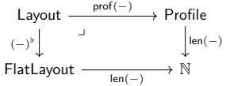

We can extend the notion of non-degeneracy to the nested case as follows.

Definition 2.3.1.24. Suppose $L$ is a layout. We say $L$ is non-degenerate if for all $1 \leq i \leq \text{len}(L)$, the following condition holds:

$$ entry_{i}(shape(L))\quad\Rightarrow\quad entry_{i}(stride(L))$$

Example 2.3.1.25. The layouts

$$ L_{1}=\left((2,2),1\right):\left((1,2),0\right)$$

$$ L_{2}=\left((8,8),(1,16)\right):\left((2,32),(0,128)\right)$$

are non-degenerate, while the layouts

$$ L_{3}=\left((2,2),1\right):\left((1,2),4\right)$$

$$ L_{4}=\left((8,8),(1,16)\right):\left((2,32),(1024,128)\right)$$

are degenerate.

#### 2.3.2 Basic operations

Having established the basic vocabulary for layouts, we turn to the operations they support. In this section, we define basic operations that will be needed to construct more sophisticated operations such as coalesce, complement, composition, logical division, and logical product.

##### 2.3.2.1 Flattening

If L is a layout, then we may obtain a flat layout  $ L^{\flat} $ by flattening the shape and stride of L.

Definition 2.3.2.1. If L = S : D is a layout, we define the flattening of L to be the flat layout

$$ L^{\flat}=S^{\flat}:D^{\flat}.$$

Example 2.3.2.2. The flattening of

$$ L=\left(\left(2,2,2,\left(2,2\right)\right)\right):\left(\left(1,0,8,\left(0,16\right)\right)\right)$$

is

$$ L^{\flat}=(2,2,2,2,2):(1,0,8,0,16).$$

Example 2.3.2.3. The flattening of  $ L = 10 : 4 $ is  $ L^{\flat} = (10) : (4) $.

Example 2.3.2.4. Suppose $L$ is a layout. Then depth($L)=1$ if and only if $L=L^{\flat}$.

##### 2.3.2.2 Concatenate

We can concatenate layouts by concatenating their shapes and concatenating their strides.

Definition 2.3.2.5. If $L = S : D$ and $L' = S' : D'$ are layouts, then the concatenation of $L$ and $L'$ is the layout $(L, L')$

$$ (L,L^{\prime})=(S,S^{\prime}):(D,D^{\prime}).$$

More generally, if $L_{1}, \ldots, L_{k}$ is any finite collection of layouts, with $L_{i}=S_{i}: D_{i}$, then the concatenation of $L_{1}, \ldots, L_{k}$ is the layout

$$ (L_{1},\ldots,L_{k})=(S_{1},\ldots,S_{k}):(D_{1},\ldots,D_{k}).$$

Remark 2.3.2.6. Concatenation of nested tuples (and hence of layouts) is not associative. For example, take  $ L_1 = 3 : 4 $,  $ L_2 = 2 : 2 $, and  $ L_3 = 5 : 1 $. Then

$$ \left(L_{1},\left(L_{2},L_{3}\right)\right)=\left(3,(2,5)\right):\left(4,(2,1)\right)\neq\left((3,2),5\right):\left((4,2),1\right)=\left(\left(L_{1},L_{2}\right),L_{3}\right).$$

Moreover, neither of these layouts is equal to the “three-fold” concatenation  $ (L_{1}, L_{2}, L_{3}) = (3, 2, 5) $: (4,2,1). However, we see that each of these layouts has the same flattening, so each of these layouts has the same layout function.

Example 2.3.2.7. If  $ L = (3, 7, 2) $:  $ (1, 3, 6) $ and  $ L' = (2, (2, (4, 3))) $:  $ (5, 3, (2, 2)) $, then

$$ (L,L^{\prime})=((3,7,2),(2,(2,(4,3)))):((1,3,6),(5,(3,(2,2))))$$

$$ \operatorname{depth}(L,L^{\prime})=1+\operatorname*{m a x}(\operatorname{depth}(L),\operatorname{depth}(L^{\prime})).$$

Remark 2.3.2.8. Concatenation increases the depth of layouts. More precisely, we have

Remark 2.3.2.9. When L and  $ L' $ are flat layouts, the concatenation of Definition 2.3.2.5 does NOT agree with the concatenation of flat layouts of Definition 2.1.3.36. Instead, these operations are related by the formula

$$ L\star L^{\prime}=(L,L^{\prime})^{\flat}.$$

Remark 2.3.2.10. If L is any layout with depth(L) > 0 and rank(L) = r, then we may write

$$ L=\left(\operatorname{mode}_{1}(L),\ldots,\operatorname{mode}_{r}(L)\right)$$

as the concatenation of its modes.

Example 2.3.2.11. If

$$ L=\left((5,(7,7)),2,(4,5)\right):\left((1,(35,5)),0,(1,8)\right)$$

then  $ L=(L_{1},L_{2},L_{3}) $ where

$$ \begin{aligned}&L_{1}=\left(5,(7,7)\right):\left(1,(35,5)\right),\\&L_{2}=2:0,and\\&L_{3}=\left(4,5\right):\left(1,8\right).\\ \end{aligned}$$

##### 2.3.2.3 Substitution

Recall that if $X_1, \ldots, X_k$ are nested tuples and $P$ is a profile with $\text{len}(P) = k$, then we may form the $P$-substitution

$$ (X_{1},\cdots,X_{k})_{P}$$

which is obtained by replacing the  $ i $th entry of  $ P $ with the nested tuple  $ X_i $. We can extend this construction from nested tuples to layouts as follows.

Definition 2.3.2.12. Suppose $L = S : D$ is a layout, and suppose $P$ is a profile with $\operatorname{len}(P) = \operatorname{rank}(L)$. We define

$$ L_{P}=S_{P}:D_{P}$$

where $S_{P}$ and $D_{P}$ are the $P$-substitutions of (the modes of) $S$ and $D$.

Example 2.3.2.13. If  $ P = (*, (*, *))) $ and  $ L = (8, 8, 8) : (1, 8, 64) $, then

$$ L_{P}=(8,(8,8)):{(1,(8,64)).}$$

Example 2.3.2.14. If  $ P = (*, (*, *))) $ and

$$ L=((2,2),(3,3),(5,5)):((2,1),(12,4),(180,36)),$$

then

$$ L_{P}=((2,2),((3,3),(5,5))):((2,1),((12,4),(180,36))).$$

Example 2.3.2.15. If  $ L = (16) : (1) $ and  $ P = * $, then

$$ L_{P}=16:1.$$

#### 2.3.3 Coalesce

Recall that if $L$ is a flat layout, then $\text{coal}^{\flat}(L)$ is the unique flat layout of minimal rank whose layout function is $\Phi_L$. We can make a similar construction in the setting of arbitrary (nested) layouts. We begin by defining the notion of a coalesced layout.

Definition 2.3.3.1. Suppose L is a layout. We say L is coalesced if one of the following conditions holds.

1. L = 1:0,

2. depth(L) = 0 and shape(L) > 1, or

3. depth(L) = 1, rank(L) > 1, and L is coalesced in the sense of Definition 2.1.4.1.

Example 2.3.3.2. The layout

$$ L=\left(2,\left(2,2\right)\right):\left(1,\left(16,512\right)\right)$$

is not coalesced since depth(L) > 1.

Example 2.3.3.3. The layout

$$ L=\left(64\right):\left(2\right)$$

is not coalesced, while the layout

$$ L^{\prime}=64:2$$

is coalesced.

Example 2.3.3.4. The layout

$$ L=1:8$$

is not coalesced, while the layout

$$ L^{\prime}=1:0$$

is coalesced.

Example 2.3.3.5. The empty layout

$$ E=\left(\right):\left(\right)$$

is not coalesced.

Observation 2.3.3.6. Recall that a layout L is non-degenerate if

$$ entry_{i}(shape(L))=1\quad\Rightarrow\quad entry_{i}(stride(L))=0.$$

If L is coalesced, then L is non-degenerate.

If L is any layout, we can obtain a coalesced layout  $ \operatorname{coal}(L) $ as follows.

Construction 2.3.3.7. Suppose L is a layout, and write

$$ \operatorname{coal}^{\flat}(L^{\flat})=(s_{1},\ldots,s_{m}):(d_{1},\ldots,d_{m}).$$

1. If m > 1, we define

$$ \mathrm{coal}(L)=\mathrm{coal}^{\flat}(L^{\flat})$$

2. If m = 1, we define

$$ coal(L)=s_{1}:d_{1}$$

3. If m = 0, we define

$$ coal(L)=1:0.$$

Example 2.3.3.8. If  $ E = () : () $ is the empty layout, then

$$ coal(E)=1:0.$$

Example 2.3.3.9. If  $ L = (1, 1) $: (2, 4), then

$$ coal(L)=1:0.$$

Example 2.3.3.10. If  $ L = (512) : (4) $, then

$$ coal(L)=512:4.$$

Example 2.3.3.11. If  $ L = (2, 2, 2) : (1, 2, 4) $, then

$$ coal(L)=8:1.$$

Example 2.3.3.12. If  $ L = ((2, 2, 2), (5, 5)) : ((1, 2, 4), (10, 50)) $, then

$$ coal(L)=(8,25):(1,10).$$

Remark 2.3.3.13. If L is a layout, then  $ \operatorname{coal}(L) $ has depth 0 or 1.

Proposition 2.3.3.14. If A and B are layouts, then

$$ \Phi_{A}=\Phi_{B}\quad\Leftrightarrow\quad\operatorname{c o a l}(A)=\operatorname{c o a l}(B).$$

Proof. Using Proposition 2.1.4.18, we have

$$ \begin{aligned}\Phi_{A}=\Phi_{B}\quad&\Leftrightarrow\quad\Phi_{A^{\flat}}=\Phi_{B^{\flat}}\\&\Leftrightarrow\quad coal^{\flat}(A^{\flat})=coal^{\flat}(B^{\flat})\\&\Leftrightarrow\quad coal(A)=coal(B).\end{aligned}$$

Definition 2.3.3.15. If L is a layout, define the complexity of L to be the integer

$$ \operatorname{complexity}(L)=\operatorname{l e n}(L)+\operatorname{depth}(L).$$

Proposition 2.3.3.16. If $L$ is a layout and $\text{size}(L) > 1$, then $\text{coal}(L)$ is the unique complexity minimizing layout whose layout function is $\Phi_L$.

Proof. Suppose  $ L' $ is a layout with the same layout function as L, and suppose  $ \operatorname{coal}(L') \neq 1 : 0 $. Then

$$ \operatorname{len}(L^{\prime})\geq\operatorname{len}(\operatorname{coal}(L^{\prime}))=\operatorname{len}(\operatorname{coal}(L)).$$

There are two cases to consider.

(Case 1): Suppose  $ \text{len}(L') > 1 $. Then  $ \text{depth}(L') \geq 1 \geq \text{depth}(\text{coal}(L)) $. Combining these inequalities, we observe that

$$ \operatorname{complexity}(L^{\prime})\geq\operatorname{complexity}(\operatorname{coal}(L)),$$

where equality holds if and only if  $ L' = \mathrm{coal}(L') = \mathrm{coal}(L) $.

• (Case 2): Suppose  $ \text{len}(L') = 1 $. Then  $ L' = (s) : (d) $ or  $ L' = s : d $ for some integers  $ s > 1 $ and  $ d \geq 0 $. In either case, we have  $ \text{coal}(L') = s : d $, and

$$ \operatorname{complexity}(L^{\prime})\geq\operatorname{complexity}(\operatorname{coal}(L)),$$

where equality holds if and only if  $ L' = s : d = \mathrm{coal}(L) $.

Remark 2.3.3.17. The only reason that we need to exclude the case  $ \text{size}(L) = 1 $ is that if  $ \text{size}(L) = 1 $, then 1 : 0 and the empty layout (): ( ) are distinct layouts with minimal complexity, and the same layout function as L (namely the trivial layout function  $ 0 \mapsto 0 $).

### 2.3.4 Relative coalesce

There is an important invariant of coalesce called relative coalesce, denoted  $ \text{coal}(L, \bar{S}) $. This operation receives as an additional input a nested tuple  $ \bar{S} $ which is refined by  $ \text{shape}(L) $. In this case, the relative coalesce operation simplifies the layout L has much as possible, while ensuring that the resulting shape still refines  $ \bar{S} $.

Definition 2.3.4.1. Suppose $L = S : D$ is a layout, and suppose $\bar{S}$ is some nested tuple of length $m$ which is refined by $S$. Recall that for any $1 \leq i \leq m$, we may consider the $i$th mode of $S$ relative to $\bar{S}$, denoted

$$ \mathrm{mode}_{i}(S,\bar{S}).$$

Since S and D are congruent, there is a nested tuple

$$ \mathrm{mode}_{i}(D,\bar{S})$$

corresponding to  $ mode_i(S,\bar{S}) $, and we define the  $ i $th mode of  $ L $ relative to  $ \bar{S} $ to be the layout

$$ mode_{i}(L,\bar{S})=mode_{i}(S,\bar{S}):mode_{i}(D,\bar{S}).$$

Example 2.3.4.2. If  $ \bar{S} = (4, (9, 25)) $ and

$$ L=\left(\left(2,2\right),\left(\left(3,3\right),\left(5,\left(1,5\right)\right)\right)\right):\left(\left(1,2\right),\left(\left(6,18\right),\left(90,\left(0,450\right)\right)\right)\right)$$

then

$$ \begin{align*}\mathrm{mode}_{1}(L,\bar{S})&=(2,2):(1,2)\\\mathrm{mode}_{2}(L,\bar{S})&=(3,3):(6,18)\\\mathrm{mode}_{3}(L,\bar{S})&=(5,(1,5)): (90,(0,450)).\end{align*}$$

Observation 2.3.4.3. Suppose  $ L = S : D $ is a layout, and suppose  $ \bar{S} $ is a nested tuple of length  $ m $ and profile  $ P $ which is refined by  $ S $. If for any  $ 1 \leq i \leq m $, we write

$$ L_{i}=\operatorname{mode}_{i}(L,\bar{S}),$$

then

$$ L=\left(L_{1},\cdots,L_{m}\right)_{P}$$

is the P-substitution of its relative modes.

Definition 2.3.4.4. Suppose  $ L = S $: D is a layout, and suppose  $ \bar{S} $ is a nested tuple of length m and profile P which is refined by S. We say L is coalesced over  $ \bar{S} $ if each relative mode

$$ \mathrm{mode}_{i}(L,\bar{S})$$

is coalesced.

Observation 2.3.4.5. In the setting of Definition 2.3.4.4, if $L$ is coalesced over $\bar{S}$, then $L$ is non-degenerate.

Example 2.3.4.6. If $L$ is a layout, then $L$ is coalesced over $\text{shape}(L)$ if and only if $L$ is non-degenerate, i.e.

$$ entry_{i}(shape(L))=1\quad\Rightarrow\quad entry_{i}(stride(L))=0.$$

Definition 2.3.4.7 (Relative coalesce). Suppose  $ L = S $: D is a layout, and suppose  $ \bar{S} $ is a nested tuple of length m and profile P which is refined by S. We define

$$ \mathrm{coal}(L,\bar{S})=(\mathrm{coal}(L_{1}),\ldots,\mathrm{coal}(L_{m}))_{P}.$$

Remark 2.3.4.8. In the setting of Definition 2.3.4.7, the shape of  $ \text{coal}(L,\bar{S}) $ refines  $ \bar{S} $.

Lemma 2.3.4.9. If $L = S : D$ is a layout and $S$ refines $\bar{S}$, then

$$ \Phi_{\operatorname{coal}(L,\bar{S})}=\Phi_{L}.$$

Proof. As above, let

$$ L_{i}=\operatorname{mode}_{i}(L,S)$$

denote the  $ i $th mode of  $ L $ relative to  $ S $, and set  $ \bar{L}_i = \mathrm{coal}(L_i) $. Then

$$ \begin{aligned}\Phi_{\mathrm{coal}(L,\bar{S})}&=\Phi_{(\bar{L}_{1},\ldots,\bar{L}_{m})_{\bar{S}}}\\&=\Phi_{(\bar{L}_{1},\ldots,\bar{L}_{m})}\\&=\Phi_{\mathrm{coal}((\bar{L}_{1},\ldots,\bar{L}_{m}))}\\&=\Phi_{\mathrm{coal}((L_{1},\ldots,L_{m}))}\\&=\Phi_{(L_{1},\ldots,L_{m})}\\&=\Phi_{(L_{1},\ldots,L_{m})_{\bar{S}}}\\&=\Phi_{L}.\\ \end{aligned}$$

Proposition 2.3.4.10. Suppose A and B are layouts, and suppose  $ \bar{S} $ is a nested tuple of length m such that shape(A) refines  $ \bar{S} $ and shape(B) refines  $ \bar{S} $. Then

$$ \Phi_{A}=\Phi_{B}\quad\Leftrightarrow\quad\operatorname{c o a l}(A,\bar{S})=\operatorname{c o a l}(B,\bar{S})$$

Proof. If  $ \text{coal}(A,\bar{S}) = \text{coal}(B,\bar{S}) $, the using Lemma 2.3.4.9, we have

$$ \Phi_{A}=\Phi_{\tt c o a l}(A,\bar{S})=\Phi_{\tt c o a l}(B,\bar{S})=\Phi_{B}.$$

Conversely, suppose that  $ \Phi_A = \Phi_B $. We will argue that  $ \text{coal}(A, \bar{S}) = \text{coal}(B, \bar{S}) $. Set  $ P = \text{prof}(\bar{S}) $, and for any  $ 1 \leq i \leq m $, set

$$ A_{i}=\operatorname{mode}_{i}(A,\bar{S})$$

$$ B_{i}=\operatorname{mode}_{i}(B,\bar{S}).$$

Since

$$ \mathrm{coal}(A,\bar{S})=(\mathrm{coal}(A_{1}),\ldots,\mathrm{coal}(A_{m}))_{P}$$

and

$$ \operatorname{coal}(B,\bar{S})=(\operatorname{coal}(B_{1}),\ldots,\operatorname{coal}(B_{m}))_{P}$$

it suffices to prove that  $ \text{coal}(A_i) = \text{coal}(B_i) $ for all  $ 1 \leq i \leq m $. By the associativity of colexicographic isomorphism, we can write the layout function  $ \Phi_A $ of  $ A $ as

$$ [0,\operatorname{size}(A))\xrightarrow{\operatorname{colex}^{-1}}\prod_{j=1}^{m}[0,\operatorname{size}(A_{j}))\xrightarrow{\prod^{\Phi_{A_{j}}}}\prod_{j=1}^{m}\mathbb{Z}\xrightarrow{~+~\longrightarrow~}\mathbb{Z}$$

and we can write the layout function  $ \Phi_{B} $ of B as

$$ [0,\operatorname{size}(B))\xrightarrow{\operatorname{colex}^{-1}}\prod_{j=1}^{m}[0,\operatorname{size}(B_{j}))\xrightarrow{\prod\Phi_{B_{j}}}\prod_{j=1}^{m}\mathbb{Z}\xrightarrow{~+~\longrightarrow~}\mathbb{Z}$$

For a fixed $1 \leq i \leq m$, consider the subset

$$ [0,\operatorname{size}(A_{i}))\subset\prod_{j=1}^{m}[0,\operatorname{size}(A_{j}))$$

and its image

$$ \operatorname{c o l e x}([0,\operatorname{s i z e}(A_{i})))\subset[0,\operatorname{s i z e}(A)).$$

Since  $ \mathrm{size}(A_j) = \mathrm{size}(B_j) $ for all  $ 1 \leq j \leq m $, this is the same as the image

$$ \operatorname{colex}([0,\operatorname{size}(B_{j})))\subset[0,\operatorname{size}(B))=[0,\operatorname{size}(B)).$$

The restriction of  $ \Phi_A $ to this subset is  $ \Phi_{A_i} $, and the restriction of  $ B $ to this subset is  $ \Phi_{B_i} $, so it follows that  $ \Phi_{A_i} = \Phi_{B_i} $, and by Proposition 2.3.3.14, we have  $ \text{coal}(A_i) = \text{coal}(B_i) $. We deduce that

$$ coal(A,\bar{S})=coal(B,\bar{S}),$$

as desired.

#### 2.3.5 Compact layouts

We can easily extend the concept of compact layouts to the nested case. Again, in terms of the standard grid diagrams depicting layouts, a layout $L$ is compact if each integer $0 \leq i < \text{size}(L)$ appears exactly once. More precisely, we have the following definition.

Definition 2.3.5.1. Suppose L is a layout. We say L is compact if the layout function

$$ \Phi_{L}^{cosize(L)}:[0,size(L))\rightarrow[0,cosize(L))$$

is an isomorphism.

Example 2.3.5.2. The layout

$$ \begin{aligned}A&=\left(\left(2,2\right),\left(2,2\right)\right):\left(\left(1,4\right),\left(2,8\right)\right)=&\begin{aligned}\\ &0&&2&&8&&10\\&1&&3&&9&&11\\&4&&6&&12&&14\\&5&&7&&13&&15\\ &\end{aligned}\\ \end{aligned}$$

is compact, while the layouts

$$ \begin{aligned}&B=\left((2,2),(2,2)\right):\left((1,4),(2,32)\right)=\\ &\begin{aligned}\\ &0&2&32&34\\&1&3&33&35\\&4&6&36&38\\&5&7&37&39\\ &\end{aligned}\\ \end{aligned}$$

and

$$ \begin{aligned}&\boldsymbol{C}=\left((2,2),(2,2)\right):\left((1,4),(2,0)\right)=\\ &\begin{aligned}\\ &0&2&0&2\\&1&3&1&3\\&4&6&4&6\\&5&7&5&7\\ &\end{aligned}\\ \end{aligned}$$

are not compact.

Example 2.3.5.3. The following layouts are compact:

$$ L_{1}=\left(2,\left(2,2\right)\right):\left(8,\left(1,4\right)\right)$$

$$ L_{2}=\left((8,1),(8,32)\right):\left((2,0),(16,128)\right)$$

$$ L_{3}=64:1$$

Example 2.3.5.4. The layout

$$ L=\left(2,\left(2,2\right)\right):\left(4,\left(8,16\right)\right)$$

is not compact since the integer $1 \in [0, 29) = [0, \mathrm{cosize}(L))$ is not in the image of $\Phi_L$. More generally, if $\mathrm{size}(L) \neq \mathrm{cosize}(L)$, then $L$ is not compact.

We conclude this section by listing some equivalent conditions for a layout L to be compact.

Proposition 2.3.5.5. Suppose L is a layout. Then the following conditions are equivalent.

1. L is compact.

2.  $ L^{\flat} $ is compact.

3. coal(L) is compact.

Proof. The equivalence of these conditions follows from the fact that

$$ \Phi_{L}=\Phi_{L^{\flat}}=\Phi_{\tt c o a l}(L).$$

#### 2.3.6 Complements

We can easily extend the concept of complement to the nested case as follows.

Definition 2.3.6.1. Suppose $A$ and $B$ are layouts. We say $B$ is a complement of $A$, and write $A \perp B$, if the concatenated layout $(A, B)$ is compact.

Lemma 2.3.6.2. Suppose A and B are layouts. Then

$$ A\perp B\quad\Leftrightarrow\quad A^{\flat}\perp B^{\flat}.$$

Proof. This follows from the observation that  $ (A, B)^{\flat} = A^{\flat} \star B^{\flat} $.

Definition 2.3.6.3. Suppose A is a layout. We say A is complementable if  $ A^{\flat} $ is complementable.

Lemma 2.3.6.4. Suppose A is a layout. Then there exists a complement B of A if and only if A is complementable.

Proof. If $A$ is complementable, then $A^{\flat}$ is complementable, so there exists a flat layout $B$ such that the flat concatenation $A^{\flat}\star B$ is compact. It follows that the concatenation $(A,B)$ is also compact, so $A$ admits a complement. Conversely, suppose there exists a layout $B$ such that $(A,B)$ is compact. Then $B^{\flat}$ is a complement of $A^{\flat}$, so by Proposition 2.1.6.21, $A^{\flat}$ is complementable, hence, by definition, so is $A$.

Definition 2.3.6.5. Suppose A is a layout. If A is complementable, then we define

$$ \operatorname{comp}(A)=\operatorname{coal}(\operatorname{comp}^{\flat}(A^{\flat})),$$

as in Construction 2.1.6.16. If N is a positive integer and A is N-complementable, then we define

$$ \operatorname{comp}(A,N)=\operatorname{coal}(\operatorname{comp}^{\flat}(A^{\flat},N))$$

as in Construction 2.1.6.29.

Remark 2.3.6.6. Suppose $A$ is complementable layout. Then we almost always have $\text{comp}(A) = \text{comp}^b(A^b)$. More precisely, if $\text{comp}^b(A^b)$ has length $>1$, then

$$ \mathrm{comp}(A)=\mathrm{comp}^{\flat}(A^{\flat}),$$

if  $ \mathrm{comp}^{\flat}(A^{\flat}) = (s) : (d) $ has length 1, then

$$ comp(A)=s:d,$$

and if  $ \mathrm{comp}^{\flat}(A^{\flat}) = () : () $, then

$$ comp(A)=1:0.$$

Definition 2.3.6.7. Suppose $A$ is a layout and $N$ is a positive integer. We say a layout $B$ is a $N$-complement of $A$ if $A \perp B$, and

$$ \mathrm{size}(A)\cdot\mathrm{size}(B)=N.$$

Definition 2.3.6.8. Suppose $A$ is a layout and $N$ is a positive integer. We say $A$ is $N$-complementable if the flat layout $A^{\flat}$ is $N$-complementable, as in Definition 2.1.6.24.

Proposition 2.3.6.9. Suppose A is a layout. Then there exists a N-complement of A if and only if A is N-complementable.

Proof. If $B$ is a $N$-complement of $A$, then $B^b$ is a $N$-complement $A^b$, and so by Proposition 2.1.6.32, $A^b$ is $N$-complementable, hence, so is $A$. Conversely, if $A$ is $N$-complementable, then $\text{comp}(A, N)$ is a $N$-complement of $A$.

Example 2.3.6.10. If  $ A = ((4,2), (2,2)) : ((3,24), (192,96)) $ and N = 768 then

$$ comp(A,N)=(3,2,2,2):(1,12,48,384).$$

Example 2.3.6.11. If  $ A = ((16, 4), 64): ((1, 16), 64) $ and N = 4096 then

$$ \begin{aligned}comp(A,N)&=coal(():())\\&=1:0.\end{aligned}$$

Example 2.3.6.12. If  $ A = ((16, 4), 64): ((1, 16), 64) $ and  $ N = 8192 $ then

$$ \begin{aligned}comp(A,N)&=coal((2):(4096))\\&=2:4096.\end{aligned}$$

Example 2.3.6.13. If  $ A = ((16,4), 64):((8,1), 128) $ and  $ N = 16384 $, then

$$ \begin{aligned}comp(A,N)&=coal((2,2):(4,8192))\\&=(2,2):(4,8192).\end{aligned}$$

#### 2.3.7 Composition

In this section, we discuss the most important operation on layouts, namely composition. If A and B are layouts, then the composition of A and B is a layout  $ B \circ A $ whose layout function is the composite of the layout functions of A and B. More precisely, we have the following definition.

Definition 2.3.7.1 (Composition of layouts). Suppose A and B are layouts. The composite of A and B is the unique layout  $ B \circ A $ satisfying the following properties.

1. shape(B  $ \circ $ A) refines shape(A),

2. $B \circ A$ is coalesced over shape(A), and

3.  $ \Phi_{B\circ A} = \Phi_B \circ \Phi_A^{\text{size}(B)}.$

Remark 2.3.7.2. In order for  $ B \circ A $ to exist, we must have

$$ \operatorname{l m a g e}(\Phi_{A})\subseteq[0,\operatorname{s i z e}(B)).$$

Remark 2.3.7.3. There is an implicit assertion in the definition of layout composition, namely that there is at most one layout satisfying the three conditions. This is justified by Proposition 2.3.4.10. We might define a weak composite of A and B to be a layout C satisfying conditions 1. and 3. (but not necessarily 2.), in which case

$$ B\circ A=\operatorname{coal}(C,shape(A))$$

We will see later on that when attempting to compute compositions of layouts, it is useful to compute any weak composite $C$ of $A$ and $B$, then coalesce over $\text{shape}(A)$ to form the actual composite $B \circ A$. Remark 2.3.7.4. Note that, by Observation 2.3.4.5, condition 2. in the definition of composition implies that $B \circ A$ is non-degenerate.

Example 2.3.7.5. If  $ A = (3, 5) : (10, 2) $ and  $ B = (100) : (7) $, then

$$ B\circ A=(3,5):(70,14).$$

Example 2.3.7.6. If  $ A = (4) : (2) $ and  $ B = (2, 2, 6) : (12, 6, 1) $, then the composition of A and B is

$$ B\circ A=((2,2)):((6,1)).$$

Remark 2.3.7.7. Example 2.3.7.6 illustrates the fact that the composition of flat layouts A and B need not be flat.

Example 2.3.7.8. If  $ A = ((2,4),8):((4,8),8) $ and  $ B = (4,4,4,4):(2,4,8,16) $, then

$$ B\circ A=((2,(2,2)),(2,4)):((4,(8,8)),(8,8)).$$

Example 2.3.7.9. If  $ A = ((3, (2, 2)), 24) : ((3, (9, 18)), 72) $ and  $ B = (9, 8, 3, 8) : (24, 3, 1, 384) $ then

$$ B\circ A=((3,(2,2)),(3,8)):((72,(3,6)),(1,384))$$

Next, we develop some useful properties for computing the composition of layouts.

Proposition 2.3.7.10. Suppose A is a layout, and suppose B and  $ \tilde{B} $ are layouts such that

• size(B) ≤ size( $ \tilde{B} $), and

•  $ \Phi_{\tilde{B}} \mid_{\text{size}(B)} = \Phi_{B}$

If A and B are composable, then

$$ B\circ A=\tilde{B}\circ A$$

Proof. Suppose  $ A $ and  $ B $ are composable. Then  $ \text{cosize}(A) \leq \text{size}(B) $, and the fact that  $ B \circ A $ is the composite of  $ A $ and  $ \tilde{B} $ follows from the equality

$$ \begin{aligned}\Phi_{\bar{B}}\circ\Phi_{A}^{\mathsf{size}(\bar{B})}&=\left(\Phi_{\bar{B}}\right)\mid_{\mathsf{size}(B)}\circ\Phi_{A}^{\mathsf{size}(B)}\\&=\Phi_{B}\circ\Phi_{A}^{\mathsf{size}(B)}.\end{aligned}$$

Corollary 2.3.7.11. If A and B are layouts, then A and B are composable if and only if A and coal(B) are composable, and

$$ \boldsymbol{B}\circ\boldsymbol{A}=\operatorname{c o a l}(\boldsymbol{B})\circ\boldsymbol{A}.$$

Now that we have developed the basic properties of layout composition, we turn our attention to the two most important instances of composition, namely logical division and logical products.

#### 2.3.8 Logical division

In this section, we define the logical division of layouts. As a motivating example, consider the layout

<table border=1 style='margin: auto; word-wrap: break-word;'><tr><td style='text-align: center; word-wrap: break-word;'>0</td><td style='text-align: center; word-wrap: break-word;'>4</td><td style='text-align: center; word-wrap: break-word;'>8</td><td style='text-align: center; word-wrap: break-word;'>12</td><td style='text-align: center; word-wrap: break-word;'>16</td><td style='text-align: center; word-wrap: break-word;'>20</td><td style='text-align: center; word-wrap: break-word;'>24</td><td style='text-align: center; word-wrap: break-word;'>28</td></tr><tr><td style='text-align: center; word-wrap: break-word;'>1</td><td style='text-align: center; word-wrap: break-word;'>5</td><td style='text-align: center; word-wrap: break-word;'>9</td><td style='text-align: center; word-wrap: break-word;'>13</td><td style='text-align: center; word-wrap: break-word;'>17</td><td style='text-align: center; word-wrap: break-word;'>21</td><td style='text-align: center; word-wrap: break-word;'>25</td><td style='text-align: center; word-wrap: break-word;'>29</td></tr><tr><td style='text-align: center; word-wrap: break-word;'>2</td><td style='text-align: center; word-wrap: break-word;'>6</td><td style='text-align: center; word-wrap: break-word;'>10</td><td style='text-align: center; word-wrap: break-word;'>14</td><td style='text-align: center; word-wrap: break-word;'>18</td><td style='text-align: center; word-wrap: break-word;'>22</td><td style='text-align: center; word-wrap: break-word;'>26</td><td style='text-align: center; word-wrap: break-word;'>30</td></tr><tr><td style='text-align: center; word-wrap: break-word;'>3</td><td style='text-align: center; word-wrap: break-word;'>7</td><td style='text-align: center; word-wrap: break-word;'>11</td><td style='text-align: center; word-wrap: break-word;'>15</td><td style='text-align: center; word-wrap: break-word;'>19</td><td style='text-align: center; word-wrap: break-word;'>23</td><td style='text-align: center; word-wrap: break-word;'>27</td><td style='text-align: center; word-wrap: break-word;'>31</td></tr></table>

For various purposes, we may want to tile the layout A. For example, here are the tilings of A by various layouts B.

<table border=1 style='margin: auto; word-wrap: break-word;'><tr><td style='text-align: center; word-wrap: break-word;'>0</td><td style='text-align: center; word-wrap: break-word;'>4</td><td style='text-align: center; word-wrap: break-word;'>8</td><td style='text-align: center; word-wrap: break-word;'>12</td><td style='text-align: center; word-wrap: break-word;'>16</td><td style='text-align: center; word-wrap: break-word;'>20</td><td style='text-align: center; word-wrap: break-word;'>24</td><td style='text-align: center; word-wrap: break-word;'>28</td></tr><tr><td style='text-align: center; word-wrap: break-word;'>1</td><td style='text-align: center; word-wrap: break-word;'>5</td><td style='text-align: center; word-wrap: break-word;'>9</td><td style='text-align: center; word-wrap: break-word;'>13</td><td style='text-align: center; word-wrap: break-word;'>17</td><td style='text-align: center; word-wrap: break-word;'>21</td><td style='text-align: center; word-wrap: break-word;'>25</td><td style='text-align: center; word-wrap: break-word;'>29</td></tr><tr><td style='text-align: center; word-wrap: break-word;'>2</td><td style='text-align: center; word-wrap: break-word;'>6</td><td style='text-align: center; word-wrap: break-word;'>10</td><td style='text-align: center; word-wrap: break-word;'>14</td><td style='text-align: center; word-wrap: break-word;'>18</td><td style='text-align: center; word-wrap: break-word;'>22</td><td style='text-align: center; word-wrap: break-word;'>26</td><td style='text-align: center; word-wrap: break-word;'>30</td></tr><tr><td style='text-align: center; word-wrap: break-word;'>3</td><td style='text-align: center; word-wrap: break-word;'>7</td><td style='text-align: center; word-wrap: break-word;'>11</td><td style='text-align: center; word-wrap: break-word;'>15</td><td style='text-align: center; word-wrap: break-word;'>19</td><td style='text-align: center; word-wrap: break-word;'>23</td><td style='text-align: center; word-wrap: break-word;'>27</td><td style='text-align: center; word-wrap: break-word;'>31</td></tr></table>

<table border=1 style='margin: auto; word-wrap: break-word;'><tr><td style='text-align: center; word-wrap: break-word;'>0</td><td style='text-align: center; word-wrap: break-word;'>4</td></tr><tr><td style='text-align: center; word-wrap: break-word;'>1</td><td style='text-align: center; word-wrap: break-word;'>5</td></tr></table>

<table border=1 style='margin: auto; word-wrap: break-word;'><tr><td style='text-align: center; word-wrap: break-word;'>0</td><td style='text-align: center; word-wrap: break-word;'>4</td><td style='text-align: center; word-wrap: break-word;'>8</td><td style='text-align: center; word-wrap: break-word;'>12</td><td style='text-align: center; word-wrap: break-word;'>16</td><td style='text-align: center; word-wrap: break-word;'>20</td><td style='text-align: center; word-wrap: break-word;'>24</td><td style='text-align: center; word-wrap: break-word;'>28</td></tr><tr><td style='text-align: center; word-wrap: break-word;'>1</td><td style='text-align: center; word-wrap: break-word;'>5</td><td style='text-align: center; word-wrap: break-word;'>9</td><td style='text-align: center; word-wrap: break-word;'>13</td><td style='text-align: center; word-wrap: break-word;'>17</td><td style='text-align: center; word-wrap: break-word;'>21</td><td style='text-align: center; word-wrap: break-word;'>25</td><td style='text-align: center; word-wrap: break-word;'>29</td></tr><tr><td style='text-align: center; word-wrap: break-word;'>2</td><td style='text-align: center; word-wrap: break-word;'>6</td><td style='text-align: center; word-wrap: break-word;'>10</td><td style='text-align: center; word-wrap: break-word;'>14</td><td style='text-align: center; word-wrap: break-word;'>18</td><td style='text-align: center; word-wrap: break-word;'>22</td><td style='text-align: center; word-wrap: break-word;'>26</td><td style='text-align: center; word-wrap: break-word;'>30</td></tr><tr><td style='text-align: center; word-wrap: break-word;'>3</td><td style='text-align: center; word-wrap: break-word;'>7</td><td style='text-align: center; word-wrap: break-word;'>11</td><td style='text-align: center; word-wrap: break-word;'>15</td><td style='text-align: center; word-wrap: break-word;'>19</td><td style='text-align: center; word-wrap: break-word;'>23</td><td style='text-align: center; word-wrap: break-word;'>27</td><td style='text-align: center; word-wrap: break-word;'>31</td></tr></table>

<table border=1 style='margin: auto; word-wrap: break-word;'><tr><td style='text-align: center; word-wrap: break-word;'>0</td><td style='text-align: center; word-wrap: break-word;'>4</td><td style='text-align: center; word-wrap: break-word;'>8</td><td style='text-align: center; word-wrap: break-word;'>12</td></tr><tr><td style='text-align: center; word-wrap: break-word;'>2</td><td style='text-align: center; word-wrap: break-word;'>6</td><td style='text-align: center; word-wrap: break-word;'>10</td><td style='text-align: center; word-wrap: break-word;'>14</td></tr></table>

<table border=1 style='margin: auto; word-wrap: break-word;'><tr><td style='text-align: center; word-wrap: break-word;'>0</td><td style='text-align: center; word-wrap: break-word;'>4</td><td style='text-align: center; word-wrap: break-word;'>8</td><td style='text-align: center; word-wrap: break-word;'>12</td><td style='text-align: center; word-wrap: break-word;'>16</td><td style='text-align: center; word-wrap: break-word;'>20</td><td style='text-align: center; word-wrap: break-word;'>24</td><td style='text-align: center; word-wrap: break-word;'>28</td></tr><tr><td style='text-align: center; word-wrap: break-word;'>1</td><td style='text-align: center; word-wrap: break-word;'>5</td><td style='text-align: center; word-wrap: break-word;'>9</td><td style='text-align: center; word-wrap: break-word;'>13</td><td style='text-align: center; word-wrap: break-word;'>17</td><td style='text-align: center; word-wrap: break-word;'>21</td><td style='text-align: center; word-wrap: break-word;'>25</td><td style='text-align: center; word-wrap: break-word;'>29</td></tr><tr><td style='text-align: center; word-wrap: break-word;'>2</td><td style='text-align: center; word-wrap: break-word;'>6</td><td style='text-align: center; word-wrap: break-word;'>10</td><td style='text-align: center; word-wrap: break-word;'>14</td><td style='text-align: center; word-wrap: break-word;'>18</td><td style='text-align: center; word-wrap: break-word;'>22</td><td style='text-align: center; word-wrap: break-word;'>26</td><td style='text-align: center; word-wrap: break-word;'>30</td></tr><tr><td style='text-align: center; word-wrap: break-word;'>3</td><td style='text-align: center; word-wrap: break-word;'>7</td><td style='text-align: center; word-wrap: break-word;'>11</td><td style='text-align: center; word-wrap: break-word;'>15</td><td style='text-align: center; word-wrap: break-word;'>19</td><td style='text-align: center; word-wrap: break-word;'>23</td><td style='text-align: center; word-wrap: break-word;'>27</td><td style='text-align: center; word-wrap: break-word;'>31</td></tr></table>

<table border=1 style='margin: auto; word-wrap: break-word;'><tr><td style='text-align: center; word-wrap: break-word;'>0</td><td style='text-align: center; word-wrap: break-word;'>4</td><td style='text-align: center; word-wrap: break-word;'>16</td><td style='text-align: center; word-wrap: break-word;'>20</td></tr><tr><td style='text-align: center; word-wrap: break-word;'>2</td><td style='text-align: center; word-wrap: break-word;'>6</td><td style='text-align: center; word-wrap: break-word;'>18</td><td style='text-align: center; word-wrap: break-word;'>22</td></tr></table>

When working with such tiled layouts, we would like to index into our layout with coordinates of the form (tile_coordinate,tile) where tile specifies which tile we are working with, and tile_coordinate specifies a coordinate within the specified tile. For example, if both A and B have rank 2, we would like to write ((i,j),(k,\ell)) as the index of the (i,j)th entry of the (k,\ell)th tile of A. The logical division of  $ A\otimes B $ is precisely the layout which affords us this ability.

Definition 2.3.8.1. Suppose A and B are layouts, and suppose

$$ B^{c}=\operatorname{comp}(B,\operatorname{size}(A))$$

is the complement of $B$ with respect to $\mathrm{size}(A)$. Then the logical division of $A$ by $B$ is the layout

$$ \begin{aligned}\boldsymbol{A}\oslash\boldsymbol{B}&=\boldsymbol{A}\circ(\boldsymbol{B},\boldsymbol{B}^{c})\\&=(\boldsymbol{A}\circ\boldsymbol{B},\boldsymbol{A}\circ\boldsymbol{B}^{c}).\end{aligned}$$

Example 2.3.8.2. If  $ A = (4, 8) $:  $ (1, 4) $ and  $ B = (2, 2) $:  $ (1, 4) $, then

$$ A\oslash B=((\mathrm{2,2}),(\mathrm{2,4})):((1,4),(\mathrm{2,8})),$$

as depicted below.

<table border=1 style='margin: auto; word-wrap: break-word;'><tr><td style='text-align: center; word-wrap: break-word;'>0</td><td style='text-align: center; word-wrap: break-word;'>4</td><td style='text-align: center; word-wrap: break-word;'>8</td><td style='text-align: center; word-wrap: break-word;'>12</td><td style='text-align: center; word-wrap: break-word;'>16</td><td style='text-align: center; word-wrap: break-word;'>20</td><td style='text-align: center; word-wrap: break-word;'>24</td><td style='text-align: center; word-wrap: break-word;'>28</td></tr><tr><td style='text-align: center; word-wrap: break-word;'>1</td><td style='text-align: center; word-wrap: break-word;'>5</td><td style='text-align: center; word-wrap: break-word;'>9</td><td style='text-align: center; word-wrap: break-word;'>13</td><td style='text-align: center; word-wrap: break-word;'>17</td><td style='text-align: center; word-wrap: break-word;'>21</td><td style='text-align: center; word-wrap: break-word;'>25</td><td style='text-align: center; word-wrap: break-word;'>29</td></tr><tr><td style='text-align: center; word-wrap: break-word;'>2</td><td style='text-align: center; word-wrap: break-word;'>6</td><td style='text-align: center; word-wrap: break-word;'>10</td><td style='text-align: center; word-wrap: break-word;'>14</td><td style='text-align: center; word-wrap: break-word;'>18</td><td style='text-align: center; word-wrap: break-word;'>22</td><td style='text-align: center; word-wrap: break-word;'>26</td><td style='text-align: center; word-wrap: break-word;'>30</td></tr><tr><td style='text-align: center; word-wrap: break-word;'>3</td><td style='text-align: center; word-wrap: break-word;'>7</td><td style='text-align: center; word-wrap: break-word;'>11</td><td style='text-align: center; word-wrap: break-word;'>15</td><td style='text-align: center; word-wrap: break-word;'>19</td><td style='text-align: center; word-wrap: break-word;'>23</td><td style='text-align: center; word-wrap: break-word;'>27</td><td style='text-align: center; word-wrap: break-word;'>31</td></tr></table>

$$ \begin{aligned}&\boldsymbol{B}=\begin{vmatrix}{{{0}}}&{{{4}}}\\{{{1}}}&{{{5}}}\end{vmatrix}\\ &\quad1&\quad5\\ \end{aligned}$$

<table border=1 style='margin: auto; word-wrap: break-word;'><tr><td style='text-align: center; word-wrap: break-word;'>0</td><td style='text-align: center; word-wrap: break-word;'>2</td><td style='text-align: center; word-wrap: break-word;'>8</td><td style='text-align: center; word-wrap: break-word;'>10</td><td style='text-align: center; word-wrap: break-word;'>16</td><td style='text-align: center; word-wrap: break-word;'>18</td><td style='text-align: center; word-wrap: break-word;'>24</td><td style='text-align: center; word-wrap: break-word;'>26</td></tr><tr><td style='text-align: center; word-wrap: break-word;'>1</td><td style='text-align: center; word-wrap: break-word;'>3</td><td style='text-align: center; word-wrap: break-word;'>9</td><td style='text-align: center; word-wrap: break-word;'>11</td><td style='text-align: center; word-wrap: break-word;'>17</td><td style='text-align: center; word-wrap: break-word;'>19</td><td style='text-align: center; word-wrap: break-word;'>25</td><td style='text-align: center; word-wrap: break-word;'>27</td></tr><tr><td style='text-align: center; word-wrap: break-word;'>4</td><td style='text-align: center; word-wrap: break-word;'>6</td><td style='text-align: center; word-wrap: break-word;'>12</td><td style='text-align: center; word-wrap: break-word;'>14</td><td style='text-align: center; word-wrap: break-word;'>20</td><td style='text-align: center; word-wrap: break-word;'>22</td><td style='text-align: center; word-wrap: break-word;'>28</td><td style='text-align: center; word-wrap: break-word;'>30</td></tr><tr><td style='text-align: center; word-wrap: break-word;'>5</td><td style='text-align: center; word-wrap: break-word;'>7</td><td style='text-align: center; word-wrap: break-word;'>13</td><td style='text-align: center; word-wrap: break-word;'>15</td><td style='text-align: center; word-wrap: break-word;'>21</td><td style='text-align: center; word-wrap: break-word;'>23</td><td style='text-align: center; word-wrap: break-word;'>29</td><td style='text-align: center; word-wrap: break-word;'>31</td></tr></table>

Remark 2.3.8.3. The color of each entry in  $ A \otimes B $ indicates the tile to which it belongs, and the opacity of each entry in  $ A \otimes B $ indicates which entry of the tile it represents. This is why each column of  $ A \otimes B $ has the same color, and each row of  $ A \otimes B $ has the same opacity.
 

Example 2.3.8.4. If  $ A = (4, 8) : (1, 4) $ and  $ B = (2, 2) : (4, 1) $, then

$$ A\oslash B=((\mathrm{2,2}),(\mathrm{2,4})):((4,1),(\mathrm{2,8})),$$

as depicted below.

<table border=1 style='margin: auto; word-wrap: break-word;'><tr><td style='text-align: center; word-wrap: break-word;'>0</td><td style='text-align: center; word-wrap: break-word;'>4</td><td style='text-align: center; word-wrap: break-word;'>8</td><td style='text-align: center; word-wrap: break-word;'>12</td><td style='text-align: center; word-wrap: break-word;'>16</td><td style='text-align: center; word-wrap: break-word;'>20</td><td style='text-align: center; word-wrap: break-word;'>24</td><td style='text-align: center; word-wrap: break-word;'>28</td></tr><tr><td style='text-align: center; word-wrap: break-word;'>1</td><td style='text-align: center; word-wrap: break-word;'>5</td><td style='text-align: center; word-wrap: break-word;'>9</td><td style='text-align: center; word-wrap: break-word;'>13</td><td style='text-align: center; word-wrap: break-word;'>17</td><td style='text-align: center; word-wrap: break-word;'>21</td><td style='text-align: center; word-wrap: break-word;'>25</td><td style='text-align: center; word-wrap: break-word;'>29</td></tr><tr><td style='text-align: center; word-wrap: break-word;'>2</td><td style='text-align: center; word-wrap: break-word;'>6</td><td style='text-align: center; word-wrap: break-word;'>10</td><td style='text-align: center; word-wrap: break-word;'>14</td><td style='text-align: center; word-wrap: break-word;'>18</td><td style='text-align: center; word-wrap: break-word;'>22</td><td style='text-align: center; word-wrap: break-word;'>26</td><td style='text-align: center; word-wrap: break-word;'>30</td></tr><tr><td style='text-align: center; word-wrap: break-word;'>3</td><td style='text-align: center; word-wrap: break-word;'>7</td><td style='text-align: center; word-wrap: break-word;'>11</td><td style='text-align: center; word-wrap: break-word;'>15</td><td style='text-align: center; word-wrap: break-word;'>19</td><td style='text-align: center; word-wrap: break-word;'>23</td><td style='text-align: center; word-wrap: break-word;'>27</td><td style='text-align: center; word-wrap: break-word;'>31</td></tr></table>

$$ \begin{array}{r}{B=\begin{array}{r l}{0}&{{}1}\\ {\frac{}{4}}&{{}5}\end{array}}\end{array}$$

<table border=1 style='margin: auto; word-wrap: break-word;'><tr><td style='text-align: center; word-wrap: break-word;'>0</td><td style='text-align: center; word-wrap: break-word;'>2</td><td style='text-align: center; word-wrap: break-word;'>8</td><td style='text-align: center; word-wrap: break-word;'>10</td><td style='text-align: center; word-wrap: break-word;'>16</td><td style='text-align: center; word-wrap: break-word;'>18</td><td style='text-align: center; word-wrap: break-word;'>24</td><td style='text-align: center; word-wrap: break-word;'>26</td></tr><tr><td style='text-align: center; word-wrap: break-word;'>4</td><td style='text-align: center; word-wrap: break-word;'>6</td><td style='text-align: center; word-wrap: break-word;'>12</td><td style='text-align: center; word-wrap: break-word;'>14</td><td style='text-align: center; word-wrap: break-word;'>20</td><td style='text-align: center; word-wrap: break-word;'>22</td><td style='text-align: center; word-wrap: break-word;'>28</td><td style='text-align: center; word-wrap: break-word;'>30</td></tr><tr><td style='text-align: center; word-wrap: break-word;'>1</td><td style='text-align: center; word-wrap: break-word;'>3</td><td style='text-align: center; word-wrap: break-word;'>9</td><td style='text-align: center; word-wrap: break-word;'>11</td><td style='text-align: center; word-wrap: break-word;'>17</td><td style='text-align: center; word-wrap: break-word;'>19</td><td style='text-align: center; word-wrap: break-word;'>25</td><td style='text-align: center; word-wrap: break-word;'>27</td></tr><tr><td style='text-align: center; word-wrap: break-word;'>5</td><td style='text-align: center; word-wrap: break-word;'>7</td><td style='text-align: center; word-wrap: break-word;'>13</td><td style='text-align: center; word-wrap: break-word;'>15</td><td style='text-align: center; word-wrap: break-word;'>21</td><td style='text-align: center; word-wrap: break-word;'>23</td><td style='text-align: center; word-wrap: break-word;'>29</td><td style='text-align: center; word-wrap: break-word;'>31</td></tr></table>

Remark 2.3.8.5. Note the difference between the previous two examples. The tiling of A in each of the two examples is identical, but the layout of each tile is different. In first example, the tiles have column-major layouts, while in the second example, the tiles have row-major layouts. This results in different layouts when one performs logical division.

Example 2.3.8.6. If  $ A = (4, 8) : (1, 4) $ and  $ B = (2, 4) : (2, 4) $, then

$$ A\oslash B=\left((2,4),(2,2)\right):\left((2,4),(1,16)\right).$$

Example 2.3.8.7. If  $ A = (4,6) $: (1,40) and  $ B = 6:4 $, then

$$ A\oslash B=(6,4):(40,1).$$

Example 2.3.8.8. If  $ A = (4, 6, 2, 4, 2, 5) $: (36, 1, 18, 0, 0, 144) and  $ B = (4, 10) $: (1, 192), then

$$ A\oslash B=(((4,(2,5)),(6,2,4)):((36,(0,144)),(1,18,0))$$

Example 2.3.8.9. If  $ A = (8, (4, 4)) $ and  $ B = (2, (8, 16)) $, then

$$ A\oslash B=((2,2),(2,(4,4))):((4,8),(2,(8,16))).$$

#### 2.3.9 Logical product

In this section, we define the logical product of layouts.

Definition 2.3.9.1. Suppose A and B are layouts, and suppose

$$ A^{c}=\operatorname{comp}\left(A,\operatorname{size}(A)\cdot\operatorname{cosize}(B)\right)$$

is the complement of $A$ with respect to $\mathrm{size}(A) \cdot \mathrm{cosize}(B)$. Then the logical product of $A$ and $B$ is the layout

$$ A\otimes B=(A,A^{c}\circ B).$$

Observation 2.3.9.2. By Proposition 2.3.7.10 and Proposition 2.3.7.11, if we let

$$ \tilde{A}^{c}=\operatorname{comp}(A,N)$$

for any valid  $ N \geq \text{size}(A) \cdot \text{cosize}(B) $, then

$$ A^{c}\circ B=\tilde{A}^{c}\circ B.$$

This means that when computing  $ A \otimes B $, we can take  $ A^c $ to be any sufficiently large (sorted) complement of A.

Example 2.3.9.3. If  $ A = (2,2): (5,10) $ and  $ B = (3,5): (5,1) $ are the layouts

$$ \begin{array}{r l r}{A=}&{{}}&{0\quad10}\\ {}&{{}}&{5\quad15}\end{array}$$

$$ \begin{aligned}&\boldsymbol{B}=\quad\begin{aligned}\\ &0&1&2&3&4\\&5&6&7&8&9\\&10&11&12&13&14\\ &\end{aligned}\\ \end{aligned}$$

then $A\otimes B$ is the layout

$$ A\otimes B=\left((2,2),(3,5)\right):\left((5,10),(20,1)\right)$$

as depicted below.

<table border=1 style='margin: auto; word-wrap: break-word;'><tr><td style='text-align: center; word-wrap: break-word;'>0</td><td style='text-align: center; word-wrap: break-word;'>20</td><td style='text-align: center; word-wrap: break-word;'>40</td><td style='text-align: center; word-wrap: break-word;'>1</td><td style='text-align: center; word-wrap: break-word;'>21</td><td style='text-align: center; word-wrap: break-word;'>41</td><td style='text-align: center; word-wrap: break-word;'>2</td><td style='text-align: center; word-wrap: break-word;'>22</td><td style='text-align: center; word-wrap: break-word;'>42</td><td style='text-align: center; word-wrap: break-word;'>3</td><td style='text-align: center; word-wrap: break-word;'>23</td><td style='text-align: center; word-wrap: break-word;'>43</td><td style='text-align: center; word-wrap: break-word;'>4</td><td style='text-align: center; word-wrap: break-word;'>24</td><td style='text-align: center; word-wrap: break-word;'>44</td></tr><tr><td style='text-align: center; word-wrap: break-word;'>5</td><td style='text-align: center; word-wrap: break-word;'>25</td><td style='text-align: center; word-wrap: break-word;'>45</td><td style='text-align: center; word-wrap: break-word;'>6</td><td style='text-align: center; word-wrap: break-word;'>26</td><td style='text-align: center; word-wrap: break-word;'>46</td><td style='text-align: center; word-wrap: break-word;'>7</td><td style='text-align: center; word-wrap: break-word;'>27</td><td style='text-align: center; word-wrap: break-word;'>47</td><td style='text-align: center; word-wrap: break-word;'>8</td><td style='text-align: center; word-wrap: break-word;'>28</td><td style='text-align: center; word-wrap: break-word;'>48</td><td style='text-align: center; word-wrap: break-word;'>9</td><td style='text-align: center; word-wrap: break-word;'>29</td><td style='text-align: center; word-wrap: break-word;'>49</td></tr><tr><td style='text-align: center; word-wrap: break-word;'>10</td><td style='text-align: center; word-wrap: break-word;'>30</td><td style='text-align: center; word-wrap: break-word;'>50</td><td style='text-align: center; word-wrap: break-word;'>11</td><td style='text-align: center; word-wrap: break-word;'>31</td><td style='text-align: center; word-wrap: break-word;'>51</td><td style='text-align: center; word-wrap: break-word;'>12</td><td style='text-align: center; word-wrap: break-word;'>32</td><td style='text-align: center; word-wrap: break-word;'>52</td><td style='text-align: center; word-wrap: break-word;'>13</td><td style='text-align: center; word-wrap: break-word;'>33</td><td style='text-align: center; word-wrap: break-word;'>53</td><td style='text-align: center; word-wrap: break-word;'>14</td><td style='text-align: center; word-wrap: break-word;'>34</td><td style='text-align: center; word-wrap: break-word;'>54</td></tr><tr><td style='text-align: center; word-wrap: break-word;'>15</td><td style='text-align: center; word-wrap: break-word;'>35</td><td style='text-align: center; word-wrap: break-word;'>55</td><td style='text-align: center; word-wrap: break-word;'>16</td><td style='text-align: center; word-wrap: break-word;'>36</td><td style='text-align: center; word-wrap: break-word;'>56</td><td style='text-align: center; word-wrap: break-word;'>17</td><td style='text-align: center; word-wrap: break-word;'>37</td><td style='text-align: center; word-wrap: break-word;'>57</td><td style='text-align: center; word-wrap: break-word;'>18</td><td style='text-align: center; word-wrap: break-word;'>38</td><td style='text-align: center; word-wrap: break-word;'>58</td><td style='text-align: center; word-wrap: break-word;'>19</td><td style='text-align: center; word-wrap: break-word;'>39</td><td style='text-align: center; word-wrap: break-word;'>59</td></tr></table>

Example 2.3.9.4. If  $ A = (3, 3) : (6, 1) $ and  $ B = (10, 12) : (24, 2) $, then

$$ A\otimes B=\left((3,3),(10,12)\right):\left((6,1),(216,18)\right).$$

Example 2.3.9.5. If  $ A = (2, 10) $: (1680, 4) and  $ B = (4, 9) $: (2, 56), then

$$ A\otimes B=((2,10),((2,2),(3,3))):((1680,4),((2,40),(560,3360))).$$

Example 2.3.9.6. If  $ A = (4, (2, 2)) : (9, (1, 3)) $ and  $ B = ((2, 4), 8) : ((1, 4), 2) $, then

$$ A\otimes B=((4,(2,2)),((2,4),8)):((9,(1,3)),((36,144),72)).$$

#### 2.3.10 Tractable layouts

In this section we define an especially well-behaved class of layouts, called tractable layouts. We will see that tractable layouts are precisely the layouts which arise from a certain category Nest.

Definition 2.3.10.1. We say a layout L is tractable if the flat layout  $ L^{b} $ is tractable, in the sense of Definition 2.1.8.1. Explicitly, L is tractable if the flat layout

$$ \mathrm{sort}(L^{\flat})=(s_{1},\ldots,s_{m}):(d_{1},\ldots,d_{m})$$

is such that for each $1 \leq i < m$, we have

1.  $ d_{i}=0 $, or

2. $s_{i}d_{i}$ divides $d_{i+1}$.

Example 2.3.10.2. The layout

$$ L=\left(\left(\left(12\right)\right)\right):\left(\left(\left(17\right)\right)\right)$$

is tractable. More generally, any layout L of length 1 is tractable.

Example 2.3.10.3. The layout

$$ L=\left((2,4),32\right):\left((1,2),8\right)$$

is tractable. More generally, any column-major layout is tractable.

Example 2.3.10.4. The layout

$$ L=\left(2,\left(4,32\right)\right):\left(128,\left(32,1\right)\right)$$

is tractable. More generally, any row-major layout L is tractable.

Example 2.3.10.5. The layout

$$ L=\left((3,3),(1,3),(3,1,3)\right):\left((81,1),(0,8),(3,0,27)\right)$$

is tractable. More generally, any compact layout is tractable.

Example 2.3.10.6. The layout

$$ L=\left(\left(3,7,7\right)\right):\left(\left(0,15,0\right)\right)$$

is tractable. More generally, any layout with exactly one non-zero stride entry is tractable.

Example 2.3.10.7. The layout

$$ L=\left(2,\left(2,\left(2,2\right)\right)\right):\left(1,\left(2048,\left(16,64\right)\right)\right)$$

is tractable. More generally, any complementable layout is tractable.

Example 2.3.10.8. The layout

$$ L=\left((8,8),(5,5)\right):\left((8,1),(10,2)\right)$$

is not tractable. In particular, this shows that the concatenation  $ (L_1, L_2) $ of tractable layouts  $ L_1 $ and  $ L_2 $ need not be tractable.

### Chapter 3

## Categories of layouts

Having thoroughly explored the algebra of layouts, we now turn our attention to the mathematical heart of this work: realizing layouts as morphisms in suitably-defined categories. Along the way, we develop a graphical calculus of layout diagrams that affords more straightforward computation of layout operations.

## 3.1 The category Tuple

In this section, we define a category \textbf{Tuple} whose objects are tuples of positive integers, and whose morphisms we call \textbf{tuple} morphisms. Each tuple morphism  $ f: S \to T $ encodes a flat layout  $ L_f $. Composition of tuple morphisms is compatible with layout composition, in that if f and g are composable tuple morphisms, then

$$ L_{g\circ f}=L_{g}\circ L_{f}.$$

We define a realization functor (Construction 3.1.4.4)

$$ \bullet{\textsf{:T u p l e}}\to{\operatorname{F i n S e t}}$$

which recovers the layout function of $L_{f}$ via the formula

$$ |f|=\Phi_{L_{f}}^{\operatorname{size}(T)}.$$

We develop an “algebra of tuple morphisms” which includes operations such as sort (Section 3.1.5.3), coalesce (Section 3.1.5.4), complement (Section 3.1.5.6), concatenate (Section 3.1.5.5), flat division (Section 3.1.5.7), and flat products (Section 3.1.5.8), which are compatible with the corresponding operations on flat layouts.

#### 3.1.1 Basic definitions

Definition 3.1.1.1. Let Fin $ ^{*} $ denote the category whose objects are the pointed finite sets

$$ \langle m\rangle_{*}=\{*,1,2,\ldots,m\}$$

for  $ m \geq 0 $, and whose morphisms  $ \alpha : \langle m \rangle_* \to \langle n \rangle_* $ are functions satisfying  $ \alpha(*) = * $. We call these morphisms pointed maps, or simply maps.

Aside 3.1.1.2. Fin* is a skeleton of the category FinSet* of finite pointed sets.

Notation 3.1.1.3. If the codomain of a pointed map  $ \alpha: \langle m \rangle_* \to \langle n \rangle_* $ is understood, we sometimes write

$$ \alpha=(\alpha(1),\cdots,\alpha(m))$$

as a tuple of length $m$ with entries in $\langle n\rangle_*$.

Example 3.1.1.4. There is a morphism  $ \alpha: \langle 4\rangle_* \to \langle 6\rangle_* $ in  $ \mathrm{Fin}_* $ given by

$$ \alpha=(2,1,*,6),$$

which we can visualize using the following diagram.

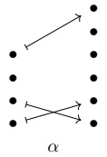

Note that the bullet corresponding to entry 3 does not support an arrow, reflecting the fact that it gets sent to  $ * $.

Example 3.1.1.5. There is a morphism  $ \beta: \langle 5 \rangle_* \to \langle 3 \rangle_* $ in  $ \mathrm{Fin}_* $ given by

$$ \beta=\left(*,1,2,3,*\right),$$

which we can visualize using the following diagram.

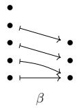

Example 3.1.1.6. For any  $ m \geq 0 $, there is a unique morphism in  $ \mathrm{Fin}_* $ of the form  $ \pi: \langle m \rangle_* \to \langle 0 \rangle_* $, namely

$$ \pi=(\ast,\ldots,\ast).$$

Example 3.1.1.7. For any  $ n \geq 0 $, there is a unique morphism in  $ \mathrm{Fin}_* $ of the form  $ \delta : \langle 0 \rangle_* \to \langle m \rangle_* $, namely

$$ \delta=\mathbf{\Lambda}(\mathbf{\Lambda}).$$

Aside 3.1.1.8. The category  $ \operatorname{Fin}_{*} $ is the category of operators for the commutative operand, so we sometimes write

$$ \operatorname{Fin}_{*}=\operatorname{Comm}^{\otimes}.$$

We are especially interested in tractable morphisms in  $ \mathrm{Fin}_{\ast} $, which we define below.

Definition 3.1.1.9. We say a pointed map  $ \alpha: \langle m \rangle_* \to \langle n \rangle_* $ is tractable if for any  $ j \in \langle n \rangle \subset \langle n \rangle_* $, the preimage  $ \alpha^{-1}(j) $ is empty or consists of a single element.

Example 3.1.1.10. The maps

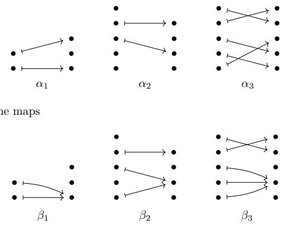

are tractable, while the maps

are not tractable

Remark 3.1.1.11. If we represent a morphism  $ \alpha: \langle m \rangle_* \to \langle n \rangle_* $ in  $ \mathrm{Fin}_* $ as a tuple, i.e.

$$ \alpha=(\alpha(1),\cdots,\alpha(m))$$

then  $ \alpha $ is tractable if and only if no positive integer occurs more than once in  $ \alpha $.

Aside 3.1.1.12. The wide subcategory

$$ \mathbf{E}_{0}^{\otimes}\subset\operatorname{Comm}^{\otimes}=\operatorname{Fin}_{*}$$

on the tractable pointed maps is the category of operators for the  $ \mathbf{E}_{0} $ operad.

Definition 3.1.1.13. Let \textbf{Tuple} denote the category whose objects are tuples.

$$ S=\left(s_{1},\ldots,s_{m}\right)$$

of positive integers, where a morphism

$$ f:\left(s_{1},\ldots,s_{m}\right)\to\left(t_{1},\ldots,t_{n}\right)$$

is specified by a tractable pointed map  $ \alpha: \langle m \rangle_* \to \langle n \rangle_* $ satisfying the property that

• if  $ 1 \leq i \leq m $ and  $ \alpha(i) \neq * $, then  $ s_i = t_{\alpha(i)} $.

We say that such a morphism $f$ lies over $\alpha$, and refer to $f$ as a tuple morphism.

Notation 3.1.1.14. If  $ f: (s_1, \ldots, s_m) \to (t_1, \ldots, t_n) $ is a tuple morphism which lies over  $ \alpha $, then we sometimes depict  $ f $ as

$$ (s_{1},\ldots,s_{m})\xrightarrow[\alpha]{f}(t_{1},\ldots,t_{n}).$$

The graphical calculus of layouts we develop is based on the natural visualizations of morphisms in \textbf{Tuple}, as exemplified below.

Example 3.1.1.15. The tuple morphism

$$ (3,128,128)\xrightarrow[ (1,3,5) ]{f}(3,2,128,2,128)$$

can be visualized using the following diagram.

$$ \begin{array}{c}128\\2\\128\\2\\3\xrightarrow{f}\end{array}$$

Example 3.1.1.16. The tuple morphism

$$ (3,128,128)\xrightarrow[(*,2,1)]{\quad g\quad}(128,128)$$

can be visualized using the following diagram.

$$ \begin{array}{ccc} 128 & & \\ 128 \quad & &\rightarrow\\ 3 & & 128 \\ g & & \end{array}$$

Example 3.1.1.17. The tuple morphism

$$ (16,16,16,1,32)\xrightarrow[(*,*,1,*,2)]{\quad h\quad}(16,32,1,1)$$

can be visualized using the following diagram.

$$ \begin{array}{ccc}32&&\\1&1&\\16&1&\\16&32&\\16&16&\end{array}$$

Observation 3.1.1.18. We can relate the category  $ \text{Tuple} $ to some well-known operads as follows. Let  $ \mathbb{Z}_{>0}^{\text{div}} $ denote the poset of positive integers under the divisibility relation, considered as a symmetric monoidal category with product given by multiplication of integers. Let  $ (\mathbb{Z}_{>0}^{\text{div}})^{\otimes} $ denote the category of operators of  $ \mathbb{Z}_{>0}^{\text{div}} $. Then there are evident functors

$$ \operatorname{Tuple}\to(\mathbb{Z}_{>0}^{\operatorname{div}})^{\otimes},$$

and

Tuple  $ \rightarrow E_0^\otimes $,

such that the diagram

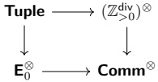

commutes. This exhibits  $ \underline{\text{Tuple}} $ as the wide subcategory of the pullback operad

$$ \operatorname{Tuple}\subset\mathbf{E}_{0}^{\otimes}\times_{\operatorname{Comm}^{\otimes}}(\mathbb{Z}_{>0}^{\operatorname{div}})^{\otimes}$$

on the morphisms

$$ \left(s_{1},\cdots,s_{m}\right)\xrightarrow[\alpha]{f}\left(t_{1},\cdots,t_{n}\right)$$

satisfying

$$ \alpha(i)\neq1\quad\Rightarrow\quad s_{i}=t_{\alpha(i)}.$$

#### 3.1.2 From tuple morphisms to flat layouts

The impetus for working with the category \textbf{Tuple} is that each tuple morphism  $ f $ encodes a flat layout  $ L_f $. Moreover, each tractable layout  $ L $ gives rise to a tuple morphism  $ f_L $. We prove as Proposition 3.1.2.10 that these constructions are in some sense inverses, and that tractable layouts are precisely those encoded by tuple morphisms.

Construction 3.1.2.1. Suppose

$$ (s_{1},\ldots,s_{m})\xrightarrow[\alpha]{f}(t_{1},\ldots,t_{n})$$

is a tuple morphism. We define $L_{f}$ to be the flat layout whose shape

$$ \mathsf{shape}(L_{f})=(s_{1},\ldots,s_{m})$$

is the domain of $f$, and whose stride

$$ \mathrm{stride}(L_{f})=(d_{1},\ldots,d_{m})$$

is defined by the formula

$$ d_{i}=\begin{cases}0&\alpha(i)=*\\ \prod_{j<\alpha(i)}t_{j}&\alpha(i)\neq*.\end{cases}$$

We refer to  $ L_{f} $ as the layout encoded by f or the layout associated to f.

Example 3.1.2.2. The tuple morphism

$$ \begin{array}{c}128\\2\\128\\2\\3\xrightarrow{f}\end{array}$$

of Example 3.1.1.15 encodes the layout

$$ L_{f}=(3,128,128):(1,6,1536).$$

Note that computing the stride via the formula in Construction 3.1.2.1 amounts to following the arrow from a specific shape entry to its target entry and multiplying together all entries below that one (taking the empty product to equal 1).

Example 3.1.2.3. The tuple morphism

$$ (3,128,128)\xrightarrow[(*,2,1)]{\quad g\quad}(128,128)$$

of Example 3.1.1.16 encodes the layout

$$ L_{g}=(3,128,128):(0,128,1).$$

Example 3.1.2.4. The tuple morphism

$$ (16,16,16,1,32)\xrightarrow[(*,*,1,*,2)]{\quad h\quad}(16,32,1,1)$$

of Example 3.1.1.17 encodes the layout

$$ L_{h}=(16,16,16,1,32):(0,0,1,0,16).$$

We have seen how to compute the flat layout  $ L_{f} $ encoded by a tuple morphism f. On the other hand, if L is tractable, then we can go in the other direction, constructing a tuple morphism f which encodes L. Recall from Definition 2.1.8.1 that a flat layout L is tractable if

$$ \mathrm{sort}(L)=(s_{1},\ldots,s_{m}):(d_{1},\ldots,d_{m})$$

satisfies the following property:

$$ \mathrm{If}~1\leq i<m,~\mathrm{then}~d_{i}=0,~\mathrm{or}~s_{i}d_{i}~\mathrm{divides}~d_{i+1}.$$

Construction 3.1.2.5. Suppose  $ L = (s_1, \ldots, s_m) : (d_1, \ldots, d_m) $ is tractable, and set

$$ \operatorname{sort}(L)=(s_{1}^{\prime},\ldots,s_{m}^{\prime}):(d_{1}^{\prime},\ldots,d_{m}^{\prime}),$$

so there is some permutation $\sigma \in \Sigma_m$ such that $\text{sort}(L) = L^\sigma$. In other words, $s_i' = s_{\sigma(i)}$ and $d_i' = d_{\sigma(i)}$ for each $1 \leq i \leq m$. If each $d_i'$ is nonzero, then let $k = 0$. Otherwise, let $k$ be the largest integer such that $d_k' = 0$. Let $\ell = 2(m - k)$, and let

$$ (t_{1}^{\prime},\ldots,t_{\ell}^{\prime})=\left(d_{k+1}^{\prime},s_{k+1}^{\prime},\frac{d_{k+2}^{\prime}}{s_{k+1}^{\prime}d_{k+1}^{\prime}},s_{k+2}^{\prime},\frac{d_{k+3}^{\prime}}{s_{k+2}^{\prime}d_{k+2}^{\prime}},\ldots,\frac{d_{m}^{\prime}}{s_{m-1}^{\prime}d_{m-1}^{\prime}},s_{m}^{\prime}\right).$$

We define

$$ f_{L}^{\prime}:\left(s_{1},\ldots,s_{m}\right)\to\left(t_{1}^{\prime},\ldots,t_{\ell}^{\prime}\right)$$

to be the tuple morphism lying over the map  $ \alpha: \langle m \rangle_* \to \langle \ell \rangle_* $ given by

$$ \alpha^{\prime}(i)=\begin{cases}{*}&{\sigma^{-1}(i)\leq k}\\ {2(\sigma^{-1}(i)-k)}&{k+1\leq\sigma^{-1}(i)\leq m.}\\ \end{cases}$$

Let  $ J = \{j_1 < \cdots < j_n\} \subset \langle \ell \rangle $ denote the collection of indices such that  $ j_i $ is even or  $ t_{j_i} \neq 1 $. Let

$$ (t_{1},\ldots,t_{n})=(t_{j_{1}}^{\prime},\ldots,t_{j_{n}}^{\prime}),$$

and let $\iota: \langle n \rangle_* \to \langle \ell \rangle_*$ be the inclusion map $i \mapsto j_i$. Then by construction, the map $\alpha'$ factors as $\alpha' = \iota \circ \alpha$, and we define the standard representation of $L$ to be the tuple morphism

$$ (s_{1},\ldots,s_{m})\xrightarrow[\alpha]{f_{L}}(t_{1},\ldots,t_{n}).$$

$$ L=(2,2):(3,30),$$

then L is tractable, and the standard representation of L is the tuple morphism

$$ \begin{array}{r}2\\5\\2\\3\\f_{L}\end{array}$$

Note that, informally, computing  $ f_{L} $ via Construction 3.1.2.5 amounts to

• initializing the codomain as (),

• traversing the non-zero strides of L in increasing order.

- if  $ d_{j} $ is the current stride, and  $ d_{i} $ is the previously visited stride, appending

$$ \begin{aligned}&-\ (s_{j})\text{if}s_{i}d_{i}=d_{j},\text{or}\\&-\ \left(\frac{d_{j}}{s_{i}d_{i}},s_{j}\right)\text{if}s_{i}d_{i}<d_{j},\\ \end{aligned}$$

and

• mapping  $ s_{j} \mapsto s_{j} $.

Example 3.1.2.7. If

$$ L=\left(128,128\right):\left(128,1\right),$$

then L is tractable, and the standard representation of L is the tuple morphism

$$ \begin{array}{l} 128 \\ 128 \quad 128 \\ 128 \end{array}$$

Example 3.1.2.8. If

$$ L=(2,2,2,2):(24,0,3,480),$$

then L is tractable, and the standard representation of L is the tuple morphism

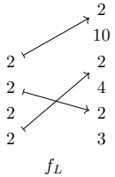

Let's justify that the tuple morphism $f_L$ of Construction 3.1.2.5 does, in fact, encode the layout $L$.

Lemma 3.1.2.9. Suppose L is a tractable flat layout, and $f = f_{L}$ is the standard representation of L. Then the layout encoded by f is

$$ L_{f}=L.$$

Proof. Suppose  $ L = (s_1, \ldots, s_m) : (d_1, \ldots, d_m) $ is tractable, and let

$$ \left(s_{1},\cdots,s_{m}\right)\xrightarrow[\alpha]{f}\left(t_{1},\cdots,t_{n}\right)$$

be the standard representation of L. Clearly

$$ \operatorname{shape}(L_{f})=(s_{1},\ldots,s_{m})=\operatorname{shape}(L).$$

We need to check that  $ \text{stride}(L_f) = \text{stride}(L) $. In other words, we need to check that for any  $ 1 \leq i \leq m $, we have

$$ d_{i}=\begin{cases}0&\alpha(i)=*\\ \prod_{j<\alpha(i)}t_{j}&\alpha(i)\neq*.\end{cases}$$

We borrow the notation of Construction 3.1.2.5. If  $ \alpha(i) = * $, then  $ \alpha'(i) = * $, and so  $ \sigma^{-1}(i) \leq k $. This implies

$$ d_{i}=d_{\sigma^{-1}(i)}^{\prime}=0.$$

Suppose otherwise that  $ \alpha(i) \neq * $. Then  $ \alpha'(i) \neq * $, and so  $ k + 1 \leq \sigma^{-1}(i) \leq m $. We compute

$$ \begin{align*}\prod_{j<\alpha(i)}t_{j}=\prod_{\substack{j^{\prime}<\alpha^{\prime}(i)\\ t_{j^{\prime}}^{\prime}\neq1}}t_{j^{\prime}}^{\prime}=\prod_{j^{\prime}<\alpha^{\prime}(i)}t_{j^{\prime}}^{\prime}=\prod_{j^{\prime}<2(\sigma^{-1}(i)-k)}t_{j^{\prime}}^{\prime}&=d_{k+1}^{\prime}\cdot\left(\prod_{v=1}^{\sigma^{-1}(i)-(k+1)}s_{k+v}^{\prime}\frac{d_{k+v+1}^{\prime}}{s_{k+v}^{\prime}d_{k+v}^{\prime}}\right)\\&=d_{\sigma^{-1}(i)}^{\prime}\\&=d_{i}.\end{align*}$$

We have proved that if $L$ is a tractable flat layout, then there exists a tuple morphism $f$ which encodes $L$. Next, we prove the converse, which implies that tractable flat layouts are precisely the layouts encoded by tuple morphisms.

Proposition 3.1.2.10. Suppose L is a flat layout. Then there exists a tuple morphism f encoding L if and only if L is tractable.

Proof. First, suppose $L$ is a flat layout, and $f:(s_1,\ldots,s_m)\to(t_1,\ldots,t_n)$ is a tuple morphism with $L_f=L$. We want to show that $L_f$ is tractable. Let

$$ \operatorname{sort}(L)=(s_{1}^{\prime},\ldots,s_{m}^{\prime}):(d_{1},\ldots,d_{m})$$

be the sorting of $L$, and suppose that $1 \leq i < m$. We will argue that $d_i = 0$, or $s'_i d_i$ divides $d_{i+1}$. If $d_i = 0$, then we are done. Suppose otherwise that $d_i \neq 0$. Then

$$ d_{i}=\prod_{j<k}t_{j}$$

for some  $ 1 \leq k \leq n $ with  $ s_i' = t_k $. Since  $ d_{i+1} \geq d_i $, we know that  $ d_{i+1} \neq 0 $, so  $ d_{i+1} $ has the form

$$ d_{i+1}=\prod_{j<\ell}t_{j}$$

for some  $ 1 \leq \ell \leq n $. There are two cases to consider:

• (Case 1) If  $ \ell > k $, then

$$ d_{i+1}=\prod_{j<\ell}t_{j}=\left(\prod_{j\leq k}t_{j}\right)\left(\prod_{k<j<\ell}t_{j}\right)=s_{i}^{\prime}d_{i}\left(\prod_{k<j<\ell}t_{j}\right),$$

so  $ s_{i}^{\prime}d_{i} $ divides  $ d_{i+1} $.

• (Case 2) If  $ \ell \leq k $, then since

$$ \prod_{j<\ell}t_{j}=d_{i+1}\geq d_{i}=\prod_{j<k}t_{j},$$

we must have

$$ t_{\ell}=\cdots=t_{k-1}=1,$$

and

$$ d_{i+1}=d_{i}.$$

In particular, we have  $ s'_{i+1} = t_\ell = 1 $. But since  $ \text{sort}(L_f) $ is sorted and  $ d_{i+1} = d_i $, we have  $ s'_i \leq s'_{i+1} = 1 $, so  $ s'_i = 1 $. We deduce that

$$ s_{i}^{\prime}d_{i}=d_{i+1},$$

so in particular,  $ s_{i}^{\prime}d_{i} $ divides  $ d_{i+1} $.

We conclude that L is tractable.

Next, suppose that $L$ is tractable. Then we can take $f = f_L$ to be the standard representation of $L$ (see Construction 3.1.2.5), in which case, by Lemma 3.1.2.9, we have $L = L_f$.

Remark 3.1.2.11. It is important to note that there are many different tuple morphisms which give rise to the same layout. For example, each of the tuple morphisms shown below

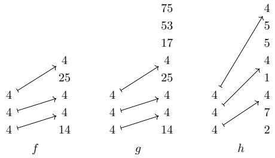

encodes the layout

$$ L_{f}=L_{g}=L_{h}=(4,4,4):(14,56,5600).$$

Among these, $f$ is the simplest: There are no extraneous entries lying above the image of $f$ (unlike $g$), and the entries not hit by $f$ are condensed (unlike $h$). To make precise the simplicity of $f$ among these morphisms, we introduce the notion of standard form.

Definition 3.1.2.12. Suppose

$$ (s_{1},\ldots,s_{m})\xrightarrow[\alpha]{f}(t_{1},\ldots,t_{n})$$

is a tuple morphism. We say f has standard form if the following conditions hold:

1. If $n > 1$, then $n \in \mathrm{Image}(\alpha)$.

2. If  $ 1 \leq j < n $, then

$$ \begin{array}{r l r}{j\notin\texttt{Image}(\alpha)}&{{}\Rightarrow}&{\texttt{t}_{j}\neq1,\operatorname{and}}\\ &{{}}&{j+1\in\texttt{Image}(\alpha)}\end{array}$$

Example 3.1.2.13. The tuple morphisms f of Remark 3.1.2.11 has standard form, while g and h do not.

Example 3.1.2.14. The tuple morphisms

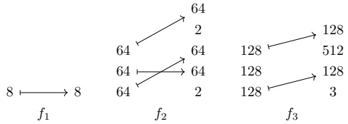

have standard form, while the tuple morphisms

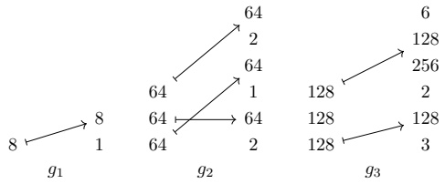

do not.

Example 3.1.2.15. If L is a tractable layout, then by construction, the standard representation  $ f_{L} $ of L has standard form.

If we restrict to tuple morphisms of standard form, then there is almost a one-to-one correspondence with tractable layouts. However, there is one problematic case we need to exclude, as explicated in the following example.

Example 3.1.2.16. Consider the tuple morphisms f and g shown below.

$$ \begin{array}{ccc}1\longmapsto1&&1\\1\longmapsto1&&1\\8\longmapsto8&&8\\f&&g\end{array}$$

Both f and g have standard form, and

$$ L_{f}=\left(8,1,1\right):\left(1,8,8\right)=L_{g}.$$

This example illustrates that the presence of entries of the form $s_{i}=1$ and $\alpha(i)\neq*$ can lead to non-uniqueness of a representing tuple morphism of standard form. On the layout side, this corresponds to shape entries $s_{i}=1$ with stride $d_{i}\neq0$. In order to exclude such pathological examples, we introduce the notion of non-degeneracy.

Definition 3.1.2.17. Suppose

$$ (s_{1},\ldots,s_{m})\xrightarrow[\alpha]{f}(t_{1},\ldots,t_{n})$$

is a tuple morphism and

$$ L=\left(s_{1},\ldots,s_{m}\right):\left(d_{1},\ldots,d_{m}\right)$$

is a flat layout.

1. We say $f$ is non-degenerate if

$$ s_{i}=1\quad\Rightarrow\quad\alpha(i)=*.$$

2. We say $L$ is non-degenerate if

$$ s_{i}=1\quad\Rightarrow\quad d_{i}=0.$$

Observation 3.1.2.18. If $f$ is a non-degenerate tuple morphism, then the layout $L_{f}$ encoded by $f$ is non-degenerate. Conversely, if $L$ is a non-degenerate flat layout, then the standard representation $f_{L}$ of $L$ is non-degenerate.

Observation 3.1.2.19. Restricting to non-degenerate flat layouts is no real loss of generality. If L is an arbitrary flat layout, then filter(L) is a non-degenerate flat layout with the same coordinate function and layout function as L.

The essential property of non-degenerate tuple morphisms of standard form is that they are characterized by the layouts which they encode. This is made precise as follows.

Lemma 3.1.2.20. Suppose f and g are non-degenerate tuple morphisms of standard form. If  $ L_{f} = L_{g} $, then f = g.

Proof. Suppose

$$ (s_{1},\ldots,s_{m})\xrightarrow[\alpha]{f}(t_{1},\ldots,t_{n})$$

and

$$ (s_{1},\ldots,s_{m})\xrightarrow[\beta]{g}(u_{1},\ldots,u_{p})$$

are non-degenerate tuple morphisms of standard form with

$$ L_{f}=\left(s_{1},\ldots,s_{m}\right):\left(d_{1},\ldots,d_{m}\right)=L_{g}.$$

We want to show that $f = g$. First, we will argue that $(t_{1}, \ldots, t_{n}) = (u_{1}, \ldots, u_{p})$. Let

$$ \begin{aligned}&X=\{t_{1}\cdots t_{j}\mid1\leq j\leq n\}\\&Y=\{u_{1}\cdots u_{k}\mid1\leq k\leq p\}\\ \end{aligned}$$

denote the sets of prefix products of $(t_1, \ldots, t_n)$ and $(u_1, \ldots, u_p)$, respectively. We claim $X = Y$, since each of these sets is equal to

$$ Z=\{d_{i},s_{i}d_{i}\mid1\leq i\leq m\operatorname{and}d_{i}\neq0\}.$$

Lets argue that $X = Z$. Suppose $1 \leq j \leq n$. If there exists some $i \in \langle m \rangle$ with $\alpha(i) = j$, then $t_1 \cdots t_j = s_i d_i$. On the other hand, if $j$ is not in the image of $\alpha$, then since $f$ has standard form, there exists some $i \in \langle m \rangle$ such that $\alpha(i) = j+1$, in which case $t_1 \cdots t_j = d_i$. This proves that $X \subseteq Z$.

Conversely, if  $ 1 \leq i \leq m $ and  $ d_i \neq 0 $, then  $ d_i = t_1 \cdots t_{\alpha(i)-1} $ and  $ s_i d_i = t_1 \cdots t_{\alpha(i)} $, which proves  $ Z \subseteq X $ We deduce that  $ X = Z $. The same argument proves  $ Y = Z $.

Since f and g are non-degenerate of standard form, we know that each  $ t_{j} $ and each  $ u_{k} $ is greater than 1, which implies

$$ t_{1}<t_{1}t_{2}<\cdots<t_{1}\cdots t_{n},$$

$$ u_{1}<u_{1}u_{2}<\cdots<u_{1}\cdots u_{p},$$

and since $X = Y$, it follows that $n = p$, and $t_1 \cdots t_j = u_1 \cdots u_j$ for each $1 \leq j \leq n$. We deduce that $(t_1, \ldots, t_n) = (u_1, \ldots, u_p)$.

Next, we need to argue that  $ \alpha = \beta $. Suppose for contradiction that there exists some  $ i \in \langle m \rangle $ with  $ \alpha(i) \neq \beta(i) $. There are two cases to consider.

• If  $ \alpha(i) = * \neq \beta(i) $, then

$$ 0=d_{i}=t_{1}\cdots t_{\beta(i)-1},$$

a contradiction. The case  $ \alpha(i) \neq * = \beta(i) $ is analogous.

• If  $ \alpha(i) \neq * \neq \beta(i) $, then without loss of generality we may assume  $ \alpha(i) < \beta(j) $, in which case

$$ d_{i}=t_{1}\cdots t_{\alpha(i)-1}<t_{1}\cdots t_{\beta(i)-1}=d_{i},$$

a contradiction.

We deduce that  $ \alpha = \beta $, so f = g.

We are now ready to prove our correspondence theorem, which identifies non-degenerate tuple morphisms of standard form with non-degenerate tractable flat layouts.

Theorem 3.1.2.21. The maps

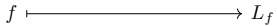

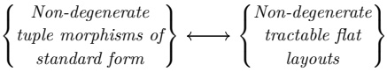

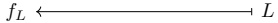

of Constructions 3.1.2.1 and 3.1.2.5 determine a one-to-one correspondence between non-degenerate tuple morphisms of standard form, and non-degenerate tractable flat layouts.

Proof. We want to show that the constructions $f \mapsto L_f$ and $L \mapsto f_L$ are inverses, when restricted to tuple morphisms and layouts of the stated form. If $L$ is a non-degenerate tractable flat layout, then by Lemma 3.1.2.9 we have $L_{f_L} = L$. Suppose next that $f$ is a non-degenerate tuple morphism of standard form and $L = L_f$ is the layout encoded by $f$. Since $f$ and $f_{L_f}$ are non-degenerate tuple morphisms of standard form, and the layouts encoded by these tuple morphisms are equal, it follows from Lemma 3.1.2.20 that $f = f_{L_f}$.

#### 3.1.3 Examples

In this section, we introduce some important families of tuple morphisms, and describe the flat layouts to which they give rise.

Example 3.1.3.1 (Identity morphisms). We say a tuple morphism $f$ is an identity morphism if $f = \mathsf{id}_S$ for some tuple $S$. If $f = \mathsf{id}_S$ is an identity morphism, then $L_f$ is the column-major layout with shape $S$. For instance, here is an example of an identity morphism $f$ together with its associated layout $L_f$.

$$ \begin{aligned}&4\longmapsto\longrightarrow4\\&4\longmapsto\longrightarrow4\\&2\longmapsto\longrightarrow2\\&2\longmapsto\longrightarrow2\\&2\longmapsto\longrightarrow2\\&\quad f\end{aligned}\quad\leadsto\quad L_{f}=(2,2,2,4,4):(1,2,4,8,32)$$

Example 3.1.3.2 (Isomorphisms). A tuple morphism $f: S \to T$ is an isomorphism if there is a tuple morphism $g: T \to S$ such that $g \circ f = \mathsf{id}_S$ and $f \circ g = \mathsf{id}_T$. If $f$ is an isomorphism, then its associated layout $L_f$ is compact. For instance, here is an isomorphism $f$ together with its associated layout $L_f$.

$$ \begin{array}{c}4\\2\\2\\2\\f\end{array}\overset{\begin{array}{c}2\\4\\4\\2\end{array}}{\longrightarrow}f\quad\sim\quad L_{f}=(2,2,2,4,4):(2,1,64,4,16)$$

Observation 3.1.3.3. Note that if a tuple morphism

$$ (s_{1},\ldots,s_{m})\xrightarrow[\alpha]{f}(t_{1},\ldots,t_{n})$$

is an isomorphism, then  $ \alpha : \langle m \rangle_* \to \langle m \rangle_* $ is a bijection, and so  $ \alpha \mid_{\langle m \rangle} \in \Sigma_m $ is a permutation. Conversely, if  $ \sigma \in \Sigma_m $ is a permutation, and  $ (s_1, \ldots, s_m) $ is a tuple of positive integers, then we may construct the isomorphism

$$ \big(s_{1},\ldots,s_{m}\big)\xrightarrow[\sigma_{*}]{\quad f\quad}\big(s_{\sigma(1)},\ldots,s_{\sigma(m)}\big).$$

We conclude that there is a one-to-one correspondence between tuple isomorphismss $f$ with domain $(s_1,\ldots,s_m)$, and permutations in $\Sigma_m$.

Example 3.1.3.4 (Projections). Suppose  $ S = (s_1, \ldots, s_m) $ is a shape, and suppose

$$ \{i_{1}<\cdots<i_{r}\}\subset\langle m\rangle$$

is some subset. Let

$$ \left(s_{1},\cdots,s_{m}\right)\xrightarrow[\alpha]{\quad p\quad}\left(s_{i_{1}},\cdots,s_{i_{r}}\right)$$

be the tuple morphism lying over the map  $ \alpha $ with

$$ \alpha(x)=\begin{cases}j&x=i_{j}\\ *&else.\end{cases}$$

We call $p$ the projection of $(s_{1},\ldots,s_{m})$ onto $(s_{i_{1}},\ldots,s_{i_{r}})$. The layout encoded by $p$ is

$$ L_{p}=(s_{1},\ldots,s_{m}):(d_{1},\ldots,d_{m}),$$

where

$$ d_{i}=\begin{cases}s_{i_{1}}\cdots s_{i_{j-1}}&i=i_{j}\text{for some}1\leq j\leq r\\0&\text{otherwise.}\end{cases}$$

For instance, here is a projection p of (64, 64, 3, 8) onto (64, 3), together with its associated layout.

$$ \begin{array}{ccc}8&&\\3&\swarrow&\\64&\rightarrow&3\\64&\longmapsto&\\p&&\end{array}\quad L_{p}=(64,64,3,8):(1,0,64,0)$$

Example 3.1.3.5 (Dilations). Suppose  $  S = (s_1, \ldots, s_m)  $ is a shape, and suppose  $  c_1, \ldots, c_m  $ are positive integers. The tuple morphism

$$ \left(s_{1},\cdots,s_{m}\right)\xrightarrow[(*,2,*,4,\cdots,*,2m)]{\begin{array}{l}f\\ \end{array}}\left(c_{1},s_{1},\cdots,c_{m},s_{m}\right)$$

is called the dilation of $(s_1,\ldots,s_m)$ by $(c_1,\ldots,c_m)$. The layout $L_f$ associated to this morphism is $L_f = (s_1,\ldots,s_m):(d_1,\ldots,d_m)$, where

$$ d_{i}=\prod_{j<i}c_{j}s_{j}.$$

For instance, here is the dilation f of (512, 512) by (2, 4), together with its associated layout.

$$ \begin{array}{c}\begin{array}{c}512\\4\\512\\\longrightarrow512\\2\\f\end{array}\quad\sim\quad L_{f}=(512,512):(2,4096)\\\end{array}$$

Example 3.1.3.6 (Expansions). Suppose  $ S = (s_1, \ldots, s_m) $ is a tuple of positive integers, and suppose  $ 1 \leq i \leq m' $, so that  $ S' = (s_1, \ldots, s_{m'} $ divides  $ S $. Then the tuple morphism

$$ \left(s_{1},\cdots,s_{m^{\prime}}\right)\xrightarrow[{(1,2,\ldots,m^{\prime})}]{\quad e\quad}\left(s_{1},\cdots,s_{m^{\prime}},\cdots,s_{m}\right)$$

is called the expansion of  $ S' $ to S. The layout encoded by e is the column-major layout with shape  $ (s_1, \ldots, s_{m}) $. For instance, here is the expansion of  $ S' = (4, 4) $ to  $ S = (4, 4, 8, 8) $.

$$ \begin{array}{c}8\\\quad8\\4\longmapsto4\\\quad\quad\quad\sim\quad L_{e}=(4,4):(1,4)\\4\longmapsto4\\e\end{array}$$

An important property of expansions is that if $f: S \to T$ is any tuple morphism and $e: T \to T'$ is an expansion, then

$$ L_{e\circ f}=L_{f}.$$

In other words, post-composing f with an expansion does not change the layout encoded by f.

Example 3.1.3.7 (Restrictions). Suppose

$$ (s_{1},\ldots,s_{m})\xrightarrow[\alpha]{f}(t_{1},\ldots,t_{n})$$

is a tuple morphism, and suppose

$$ I=\left\{i_{1}<\cdots<i_{r}\right\}\subset\left\langle m\right\rangle$$

is a subset of indices. Then the tuple morphism

$$ \left(s_{i_{1}},\ldots,s_{i_{r}}\right)\xrightarrow[\alpha\circ l]{f|_{I}}\left(t_{1},\ldots,t_{n}\right)$$

is called the restriction of f to I. If the layout encoded by f is

$$ L_{f}=(s_{1},\ldots,s_{m}):(d_{1},\ldots,d_{m}),$$

then the layout encoded by $f$ | $I$ is

$$ L_{f|_{I}}=(s_{i_{1}},\ldots,s_{i_{r}}):(d_{i_{1}},\ldots,d_{i_{r}}).$$

For instance, here is the restriction $f\mid_{I}$ of a tuple morphism $f$, where $I=\{2,4\}$.

$$ \begin{array}{c}4\\8\\16\\2\\4\\16\\f\end{array}\xrightarrow[f\mid I]{4}\quad\xrightarrow{\quad}\quad L_{f}=(2,16,8,4):(0,8,1,128)$$

Example 3.1.3.8 (Entry inclusions). An important special case of the previous construction is as follows. If $f: (s_1, \ldots, s_m) \to (t_1, \ldots, t_m)$ is a tuple morphism and $1 \leq i \leq m$, then the $ith$ entry $f_i$ of $f$ is

$$ (s_{i})\xrightarrow[{(i)}]{f_{i}}(t_{1},\ldots,t_{n})$$

If the layout encoded by f is

$$ L_{f}=(s_{1},\ldots,s_{m}):(d_{1},\ldots,d_{m}),$$

then the layout encoded by  $ f_{i}$

$$ L_{f_{i}}=(\boldsymbol{s}_{i}):(d_{i}).$$

For instance, here is a tuple morphism  $ f $, and its fourth entry  $ f_{4} $.

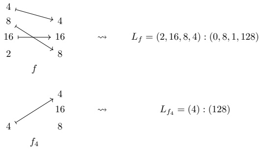

Remark 3.1.3.9. Given an  $ \langle n\rangle_* \in \text{Fin}_* $, there is a morphism  $ \varphi_i: \langle 1\rangle_* \to \langle n\rangle_* $ for each  $ i \in \langle n \rangle $ sending  $ * \mapsto * $ and  $ 1 \mapsto i $. For a tuple morphism  $ f: (s_1, \ldots, s_m) \to (t_1, \ldots, t_n) $ lying over  $ \alpha: \langle m\rangle_* \to \langle n\rangle_* $, the  $ i $-th entry lies over the composite  $ \alpha \circ \varphi_i: \langle 1\rangle_* \to \langle n\rangle_* $.

Example 3.1.3.10 (Factorizations). Suppose

$$ (s_{1},\ldots,s_{m})\xrightarrow[\alpha]{f}(t_{1},\ldots,t_{n})$$

is a tuple morphism, and suppose

$$ J=\left\{j_{1}<\cdots<j_\ell\right\}\subset\left\langle n\right\rangle$$

is a subset such that  $ \text{Image}(\alpha) \subseteq J \cup \{*\} $. If we write  $ \iota : \langle \ell \rangle_* \to \langle n \rangle_* $ for the map  $ k \mapsto j_k $, then  $ \alpha $ factors as  $ \alpha = \iota \circ \bar{\alpha} $ for a unique map  $ \bar{\alpha} : \langle m \rangle_* \to \langle \ell \rangle_* $, and we define the factorization of  $ f $ through  $ J $ to be the tuple morphism

$$ (s_{1},\ldots,s_{m})\xrightarrow[\bar{\alpha}]{\quad f\mid^{J}}\quad(t_{j_{1}},\ldots,t_{j_{\ell}}).$$

If the layout encoded by f is

$$ L_{f}=(s_{1},\ldots,s_{m}):(d_{1},\ldots,d_{m}),$$

then the layout encoded by  $ f\mid^{J} $ is

$$ L_{f\mid^{J}}=(\boldsymbol{s}_{1},\ldots,\boldsymbol{s}_{m}):(d_{1}^{\prime},\ldots,d_{m}^{\prime}),$$

where

$$ d_{i}^{\prime}=\frac{d_{i}}{\left(\prod_{\substack{k<\alpha(i)and k\notin J}}t_{j}\right)}.$$

For instance, here is the factorization  $ f\mid^{J} $ of a tuple morphism f, where  $ J=\{2,4,5\} $.

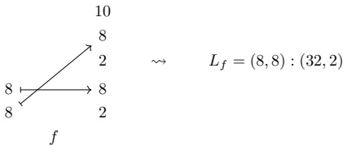

$$ \begin{array}{ccc}10&&\\8\xleftrightarrow{}\quad8&\quad\sim&\\8\xleftrightarrow{}\quad8&&\\f\mid^{J}&&\\\end{array}\quad L_{f\mid^{J}}=(8,8):(8,1)$$

Remark 3.1.3.11. There is a categorical interpretation of factorizations. Borrowing the notation of Example 3.1.3.10, we may observe that there is a tuple morphism  $ i: (t_{j_1}, \ldots, t_{j_\ell}) \to (t_1, \ldots, t_n) $ lying over  $ \iota $, and  $ f \mid^J $ is the pullback of  $ f $ along  $ i $:

$$ \begin{array}{c}(s_{1},\cdots,s_{m})\xrightarrow{f\mid^{J}}(t_{j_{1}},\cdots,t_{j_\ell})\\\downarrow\quad\quad\quad\quad\quad\downarrow^{i}\ s_{1},\cdots,s_{m})\xrightarrow[f]{}(t_{1},\cdots,t_{n})\end{array}$$

#### 3.1.4 Realization of tuple morphisms

As we have seen, a tuple morphism $f: S \to T$ encodes a flat layout $L_f$. In this section, we will construct a realization functor

$$ \textsf{T u p l e}\to\mathtt{F i n S e t}.$$

which makes this encoding explicit. The realization functor  $ |\cdot| $ sends a tuple morphism f to the layout function  $ |f| $ of  $ L_f $. In order to construct our realization functor  $ |\cdot| $, we first construct an auxiliary functor

$$ F:\textsf{Tuple}\to\mathsf{FinSet}$$

which we will use in our construction.

Construction 3.1.4.1. We define a functor

$$ F:\textsf{Tuple}\to\mathsf{FinSet}$$

as follows.

• For an object  $ S = (s_1, \ldots, s_m) $ in \textbf{Tuple}, we define

$$ FS=[0,S)=\prod_{i=1}^{m}[0,s_{i}).$$

• For a morphism $f: (s_1, \ldots, s_m) \to (t_1, \ldots, t_n)$ in $\mathsf{Tuple}$ lying over $\alpha$, we define $F f$ to be the map

$$ [0,S)\xrightarrow{F f}[0,T)$$

given by

$$ (F f)(x_{1},\ldots,x_{m})=(y_{1},\ldots,y_{n})$$

where

$$ y_{j}=\begin{cases}x_{i}&there exists1\leq i\leq m with\alpha(i)=j,\\0&else.\end{cases}$$

One may easily verify that  $ F(g \circ f) = Fg \circ Ff $ and  $ F\mathsf{id}_{S} = \mathsf{id}_{FS} $, so F is in fact a functor.

Example 3.1.4.2. Suppose  $ f : (4,4) \to (4,4,4) $ is the tuple morphism lying over  $ \alpha = (1,3) $. Then

$$ F f:[0,(4,4))\to[0,(4,4,4))$$

is given by

$$ (F f)(x_{1},x_{2})=(x_{1},0,x_{2}).$$

Example 3.1.4.3. Suppose  $ g : (3, 256, 256, 512) \to (3, 256, 256) $ is the tuple morphism lying over  $ \beta = (*, 3, 2, *) $. Then

$$ F g:[0,(3,256,256,512))\to[0,(3,256,256))$$

is given by

$$ (F g)(x_{1},x_{2},x_{3},x_{4})=(0,x_{3},x_{2}).$$

Construction 3.1.4.4. We define a functor

$$ \bullet\mid:\operatorname{Tuple}\to\operatorname{FinSet}$$

as follows.

• For an object  $ S = (s_1, \ldots, s_m) $ in \textbf{Tuple}, we define

$$ |S|=[0,\mathtt{s i z e}(S))=\{0,1,\ldots,\mathtt{s i z e}(S)-1\}.$$

• For a tuple morphism  $ f: S \to T $, we define

$$ |f|=\operatorname{colex}_{T}\circ F f\circ\operatorname{colex}_{S}^{-1}$$

(recall Definition 2.1.2.18).

If  $ f: S \to T $ and  $ g: T \to U $ are composable tuple morphisms then

$$ \begin{aligned}\left|g\circ f\right|&=\operatorname{colex}_{U}\circ F(g\circ f)\circ\operatorname{colex}_{S}^{-1}\\&=\operatorname{colex}_{U}\circ F g\circ F f\circ\operatorname{colex}_{S}^{-1}\\&=\operatorname{colex}_{U}\circ F g\circ\operatorname{colex}_{T}^{-1}\circ\operatorname{colex}_{T}\circ F f\circ\operatorname{colex}_{S}^{-1}\\&=\left|g\right|\circ\left|f\right|\\ \end{aligned}$$

and if $f = id_{S}$ is an identity morphism, then

$$ \begin{aligned}|\mathsf{id}_{S}|&=\mathsf{colex}_{S}\circ\mathsf{Fid}_{S}\circ\mathsf{colex}_{S}^{-1}\\&=\mathsf{colex}_{S}\circ\mathsf{id}_{S}\circ\mathsf{colex}_{S}^{-1}\\&=\mathsf{colex}_{S}\circ\mathsf{colex}_{S}^{-1}\\&=\mathsf{id}_{|S|},\\ \end{aligned}$$

so  $ |\cdot| $ does in fact specify a functor. Next, we observe that for a morphism  $ f $ in \textbf{Tuple}, the map  $ |f| $ is the layout function of  $ L_f $. This allows us to easily deduce that composition of morphisms in \textbf{Tuple} is compatible with composition of flat layouts (see Corollary 3.1.4.6).

Lemma 3.1.4.5. If  $ f: S \to T $ is a tuple morphism, then the realization  $ |f| $ of  $ f $ is the layout function of  $ L_f $:

$$ |f|=\Phi_{L_{f}}^{size(T)}$$

Proof. Let $S=(s_{1},\ldots,s_{m}),T=(t_{1},\ldots,t_{n})$, and let

$$ L_{f}=(s_{1},\ldots,s_{m}):(d_{1},\ldots,d_{m})$$

denote the layout associated to $f$, whose strides $d_{i}$ are defined by the formula

$$ d_{i}=\begin{cases}0&\alpha(i)=*\\ \prod_{j<\alpha(i)}t_{j}&\mathrm{else}.\end{cases}$$

By precomposing with  $ \text{colex}_S : \prod_{i=1}^m [0, s_i) \to [0, \text{size}(S)) $, it suffices to prove that for any  $ (x_1, \ldots, x_m) \in \prod_{i=1}^m [0, s_i) $, we have

$$ (\operatorname{colex}_{T}\circ F f)(x_{1},\ldots,x_{m})=(x_{1},\ldots,x_{m})\cdot(d_{1},\ldots,d_{m}).$$

For a general input  $ (x_1, \ldots, x_m) \in \prod_{i=1}^m [0, s_i) $, we have

$$ (F f)(x_{1},\ldots,x_{m})=(y_{1},\ldots,y_{n})$$

where $y_{j}$ is equal to $x_{i}$ if $\alpha(i)=j$, and 0 otherwise. It follows that

$$ \begin{align*}(\mathsf{colex}_{T}\circ Ff)(x_{1},\ldots,x_{m})&=(y_{1},\cdots,y_{n})\cdot(1,t_{1},\ldots,t_{1}\cdots t_{n-1})\\&=\sum_{j=1}^{n}y_{j}\cdot t_{1}\cdots t_{j-1}\\&=\sum_{i=1}^{m}x_{i}d_{i}\\&=(x_{1},\ldots,x_{m})\cdot(d_{1},\ldots,d_{m}),\end{align*}$$

as desired.

Corollary 3.1.4.6. If f and g are non-degenerate composable tuple morphisms, then

$$ L_{g\circ f}=L_{g}\circ L_{f}$$

Proof. Suppose $f: S \to T$ and $g: T \to U$ are morphisms in $\text{Tuple}$ lying over $\alpha$ and $\beta$, respectively. Write $S = (s_1, \ldots, s_m)$ and $T = (t_1, \ldots, t_n)$. We need to check that

1.  $ \operatorname{shape}(L_{g\circ f}) $ refines  $ \operatorname{shape}(L_f) $: This holds since the shape of  $ L_f $ and  $ L_{g\circ f} $ are both equal to S.

2.  $ L_{gof} $ is coalesced over shape( $ L_f $): This holds since the tuple morphism  $ g \circ f $ is non-degenerate, hence so is the layout  $ L_{gof} $.

3.  $ \Phi_{L_g \circ f} = \Phi_{L_g} \circ \Phi_{L_f}^{\text{size}(L_g)} $: Using Lemma 3.1.4.5, we have

$$ \begin{aligned}\Phi_{L_{g\circ f}}^{\mathsf{size}(U)}&=|g\circ f|\\&=|g|\circ|f|\\&=\Phi_{L_{g}}^{\mathsf{size}(U)}\circ\Phi_{L_{f}}^{\mathsf{size}(T)}.\end{aligned}$$

and by postcomposing with the inclusion  $ [0,\text{size}(U)) \subset \mathbb{Z} $, and observing that  $ \text{size}(T) = \text{size}(L_g) $, the result follows.

#### 3.1.5 Operations on tuple morphisms

Our next goal is to develop an “algebra of tuple morphisms”, which includes operations such as  $ coalesce $,  $ complement $,  $ composition $,  $ flat\ division $, and  $ flat\ products $. We will prove that each of these operations is compatible with a corresponding operation on flat layouts.

##### 3.1.5.1 Sum

The sum $f \oplus g$ of tuple morphisms $f$ and $g$ is obtained by concatenating the domains and codomains of $f$ and $g$. In order to define this operations precisely, we first define a corresponding operation on morphisms in $\mathrm{Fin}_*.$

Definition 3.1.5.1. Suppose  $ \alpha: \langle m \rangle_* \to \langle n \rangle_* $ and  $ \beta: \langle p \rangle_* \to \langle q \rangle_* $ are morphisms in  $ \mathrm{Fin}_* $. We define the sum of  $ \alpha $ and  $ \beta $ to be the morphism

$$ \alpha\oplus\beta:\langle m+p\rangle_{*}\to\langle n+q\rangle_{*}$$

given by

$$ \begin{align*}(\alpha\oplus\beta)(x)=\begin{cases}\alpha(x)&1\leq x\leq m\\n+\beta(x-m)&m+1\leq x\leq m+p\\*&x=*.\\\end{cases}\end{align*}$$

This operation is associative, so we can consider the sum  $ \alpha_1 \oplus \cdots \oplus \alpha_k $ for any finite collection of morphisms  $ \alpha_1, \ldots, \alpha_k $ in  $ \mathrm{Fin}_* $.

Remark 3.1.5.2. If  $ \alpha $ and  $ \beta $ are tractable pointed maps, then  $ \alpha \oplus \beta $ is tractable.

Now we can define the sum of morphisms in  $ \text{Tuple} $.

Definition 3.1.5.3. Suppose  $ f: S \to T $ and  $ g: U \to V $ are tuple morphisms lying over  $ \alpha $ and  $ \beta $, respectively. We define the sum of f and g to be the tuple morphism

$$ f\oplus g:S\star U\to T\star V$$

lying over $\alpha \oplus \beta$. This operation is associative, so we can consider the sum $f_1 \oplus \cdots \oplus f_k$ for any finite collection of morphisms $f_1, \ldots, f_k$ in $\mathsf{Tuple}$.

Example 3.1.5.4. Here is an example of the sum  $ f \oplus g $ of tuple morphisms f and g.

$$ \begin{array}{ccc}&&4\\4\longmapsto&4&\\2&&32\\\longmapsto&32&\\16\longmapsto&16&\\f&&g\end{array}\quad\begin{array}{ccc}&&4\\4\longmapsto&4&\\2\longmapsto&2&\\16\longmapsto&16&\\f\oplus g&&\\\end{array}$$

Example 3.1.5.5. Here is another example of the sum  $ f \oplus g $ of tuple morphisms f and g.

$$ \begin{array}{ccc}f&\quad&\quad\\64\longleftrightarrow64&\quad&64\\64\longleftrightarrow512&\quad&256\\256\longleftrightarrow512&\quad&128\\\end{array}$$

Remark 3.1.5.6. There is a categorical interpretation of the sum of tuple morphisms: if $f: S \to T$ and $g: U \to V$ are tuple morphisms, then

$$ f\oplus g:S\star U\to T\star V$$

is the coproduct of f and g in the arrow category Ar(Tuple).

##### 3.1.5.2 Squeeze

It is often the case that we want to remove any instances of the integer 1 from our tuples. This is accomplished by the squeeze functor.

Definition 3.1.5.7. We define a functor

$$ \operatorname{Tuple}\xrightarrow{\operatorname{squeeze}(-)}\operatorname{Tuple}$$

as follows. If $S = (s_1, \ldots, s_m)$ is an object in $\mathsf{Tuple}$, we define

$$ \mathsf{squeeze}(S)=(s_{i_{1}},\ldots,s_{i_{k}})$$

where $\{i_1 < \cdots < i_k\} \subset \langle m \rangle$ are the indices with $s_{i_j} \neq 1$. If $f: (s_1, \ldots, s_m) \to (t_1, \ldots, t_n)$ is a tuple morphism, we define

$$ \mathsf{squeeze}(f):\mathsf{squeeze}(S)\to\mathsf{squeeze}(T)$$

to be the tuple morphism

$$ squeeze(f)=(f\mid_{I})\mid^{J}$$

where  $ f\mid_{I} $ is the restriction of f to

$$ I=\left\{i\in\langle m\rangle\mid s_{i}\neq1\right\}$$

as in Definition 3.1.3.7, and where  $ (f\left|I\right|)^{J} $ is be the factorization of  $ f\left|I\right| $ through

$$ J=\{j\in\langle n\rangle\mid t_{j}\neq1\}.$$

as in Definition 3.1.3.10.

Example 3.1.5.8. Here is an example of a morphism f and the corresponding morphism squeeze(f).

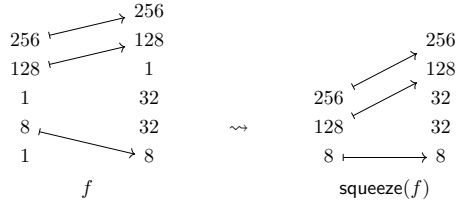

Example 3.1.5.9. If  $ f: (s_1, \ldots, s_m) \to (t_1, \ldots, t_n) $ is a tuple morphism, then

$$ f=\mathsf{squeeze}(f)\quad\Leftrightarrow\quad\mathrm{no~}s_{i},t_{j}\mathrm{~is~equal~to~}1.$$

Proposition 3.1.5.10. If f is a tuple morphism, then

$$ L_{\operatorname{squeeze}(f)}=\operatorname{squeeze}(L_{f}).$$

Proof. Suppose  $ f: (s_1, \ldots, s_m) \to (t_1, \ldots, t_m) $ is a tuple morphism, and let

$$ L_{f}=(s_{1},\ldots,s_{m}):(d_{1},\ldots,d_{m})$$

be the flat layout associated to $f$. Let $I = \{i_1 < \cdots < i_{m'}\} \subset \langle m \rangle$ denote the subset of indices with $s_{i_k} \neq 1$. Then

$$ \begin{aligned}\boldsymbol{L}_{f|_{I}}&=(\boldsymbol{s}_{i_{1}},\ldots,\boldsymbol{s}_{i_{k}}):(\boldsymbol{d}_{i_{1}},\ldots,\boldsymbol{d}_{i_{k}})\\&=\operatorname{squeeze}(\boldsymbol{L}_{f}).\end{aligned}$$

Let  $ J = \{j_1 < \cdots < j_{n'}\} \subset \langle n \rangle $ denote the subset of indices with  $ t_{jk} \neq 1 $, so that  $ \mathsf{squeeze}(f) = (f \mid_I)^J $. Let  $ \beta $ denote the map over which  $ \mathsf{squeeze}(f) $ lies. Then

$$ \begin{array}{r}{L_{\sf s q u e e z e}(f)=L_{(f|_{I})|^{J}}=\left(s_{i_{1}},\ldots,s_{i_{k}}\right):(d_{i_{1}}^{\prime},\ldots,d_{i_{k}}^{\prime})}\end{array}$$

where

$$ \begin{aligned}d_{i_{k}}^{\prime}&=\frac{d_{i_{k}}}{\left(\prod_{\substack{\ell<\beta(k)and\ell\notin J}}t_{\ell}\right)}\\&=d_{i_{k}}\end{aligned}$$

since  $ t_\ell = 1 $ for any  $ \ell \notin J $. We conclude that

$$ \begin{aligned}L_{\operatorname{squeeze}(f)}&=\left(s_{i_{1}},\ldots,s_{i_{k}}\right):(d_{i_{1}},\ldots,d_{i_{k}})\\&=\operatorname{squeeze}(L_{f}).\end{aligned}$$

Observation 3.1.5.11. If f is a tuple morphism, then

$$ \mathsf{squeeze}(\mathsf{squeeze}(f))=\mathsf{squeeze}(f),$$

SO

$$ \operatorname{Tuple}\xrightarrow{\operatorname{squeeze}(-)}\operatorname{Tuple}$$

is an idempotent functor.

##### 3.1.5.3 Sort

The sort operation  $ f \mapsto \text{sort}(f) $ permits the domain of f so that the resulting morphism is sorted, in the following sense.

Definition 3.1.5.12. We say a tuple morphism

$$ \left(s_{1},\cdots,s_{m}\right)\xrightarrow[\alpha]{f}\left(t_{1},\cdots,t_{n}\right)$$

is sorted if for any  $ 1 \leq i, j \leq m $, the following conditions hold.

1. If  $ \alpha(i) = * \neq \alpha(j) $, then  $ i < j $.

2. If  $ \alpha(i) = * = \alpha(j) $, then

$$ i\leq j\quad\Rightarrow\quad s_{i}\leq s_{j}.$$

3. If  $ \alpha(i) \neq * \neq \alpha(j) $, then

$$ i\leq j\quad\Rightarrow\quad\alpha(i)\leq\alpha(j).$$

Example 3.1.5.13. The morphisms  $ f_{1} $,  $ f_{2} $, and  $ f_{3} $ shown below

$$ \begin{array}{ccc}128&\xrightarrow{}\quad&4\\512&\xrightarrow{}\quad&128\\3&\xrightarrow{}&512\\f_{1}&&&f_{2}\\\end{array}\xrightarrow{}\begin{array}{ccc}4&&\\1&&\\8&&\\64&&\\&\end{array}\begin{array}{ccc}60&\xrightarrow{}\quad&60\\20&\xrightarrow{}\quad&2\\32&\xrightarrow{}&20\\8&\quad&4\\&&\end{array}$$

are sorted, while the morphisms  $ g_{1} $,  $ g_{2} $, and  $ g_{3} $ shown below

$$ 512,2,32,32,1,4,8,4,8,64,2,8,24,2,24,16$$

are not sorted. The morphisms  $ g_{1} $,  $ g_{2} $, and  $ g_{3} $ violate conditions 3, 1, and 2, respectively.

Proposition 3.1.5.14. If f is a sorted tuple morphism, then the flat layout  $ L_{f} $ is sorted.

Proof. Suppose

$$ \left(s_{1},\cdots,s_{m}\right)\xrightarrow[\alpha]{f}\left(t_{1},\cdots,t_{n}\right)$$

is sorted, and consider the layout

$$ L_{f}=(s_{1},\ldots,s_{m}):(d_{1},\ldots,d_{m}).$$

Suppose  $ 1 \leq i < m $. We want to show that  $ d_i < d_{i+1} $, or  $ d_i = d_{i+1} $ and  $ s_i \leq s_{i+1} $. There are two cases to consider.

(Case 1) Suppose that  $ \alpha(i) = * $, so that  $ d_i = 0 $. If  $ \alpha(i+1) = * $, then  $ d_{i+1} = 0 $ and since f is sorted we have  $ s_i \leq s_{i+1} $. If  $ \alpha(i+1) \neq * $, then  $ d_{i+1} \geq 1 > 0 = d_i $.

• (Case 2) Suppose that  $ \alpha(i) \neq * $, in which case  $ \alpha(i+1) \neq * $ and  $ \alpha(i) < \alpha(i+1) $. Then

$$ d_{i}=\prod_{j<\alpha(i)}t_{j}\leq\prod_{j<\alpha(i+1)}=d_{i+1},$$

where equality holds only if  $ s_i = t_{\alpha(i)} = 1 $, which implies  $ s_i \leq s_{i+1} $.

We conclude that $L_{f}$ is sorted.

Next, we define our sort(-) operation on Tuple. If $f$ is a tuple morphism, then sort(f) will be obtained by precomposing $f$ with an appropriate permutation $g$.

Construction 3.1.5.15. Suppose

$$ \left(s_{1},\cdots,s_{m}\right)\xrightarrow[\alpha]{f}\left(t_{1},\cdots,t_{n}\right)$$

is a tuple morphism. We define a permutation  $ \sigma \in \Sigma_m $ as follows. Set

$$ P=\{i\in\langle m\rangle\mid\alpha(i)=\ast\},$$

$$ Q=\{i\in\langle m\rangle\mid\alpha(i)\neq\ast\},$$

so  $ \langle m \rangle $ is the disjoint union of  $ P $ and  $ Q $. We define a linear ordering of  $ P $ by  $ i_1 \preceq_P i_2 $ if

1.  $ s_{i_1} < s_{i_2} $, or

2.  $ s_{i_1} = s_{i_2} $ and  $ i_1 \leq i_2$

We define a linear ordering on $Q$ by $j_1 \preceq_Q j_2$ if $\alpha(i_1) \leq \alpha(i_2)$. We define a linear ordering on $\langle m \rangle$ by $i_1 \preceq i_2$ if

1.  $ i_1 \in P $ and  $ i_2 \in Q $,

2.  $ i_1, i_2 \in P $ and  $ i_1 \preceq_P i_2 $, or

3.  $ i_1, i_2 \in Q $ and  $ i_1 \preceq_Q i_2 $.

Let $\sigma$ be permutation associated to the linear ordering $\preceq$ of $\langle m \rangle$, and let $\sigma^{-1}$ be its inverse. The map $\sigma_{*}^{-1} : \langle m \rangle_{*} \to \langle m \rangle_{*}$ is covered by a tuple morphism

$$ g:\big(s_{\sigma^{-1}(1)},\ldots,s_{\sigma^{-1}(m)}\big)\to\big(s_{1},\ldots,s_{m}\big),$$

and we define  $ \text{sort}(f) $ to be the composite

$$ \operatorname{sort}(f)=f\circ g.$$

Example 3.1.5.16. The sortings of the morphisms $g_{1}, g_{2}$, and $g_{3}$ of Example 3.1.5.13 are shown

below.

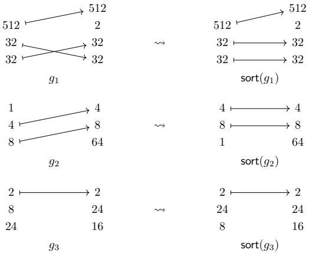

Lemma 3.1.5.17. Suppose $f: S \to T$ is a tuple morphism. Then $f$ is sorted if and only if $\mathrm{sort}(f) = f$.
 

Proof. Our construction of  $ \text{sort}(-) $ guarantees that  $ \text{sort}(f) $ is sorted for any tuple morphism  $ f $. In particular, if  $ f = \text{sort}(f) $, then  $ f $ is sorted. Conversely, if  $ f $ is sorted, then the permutation  $ \sigma \in \Sigma_m $ from Construction 3.1.5.15 is the identity permutation, so  $ g = \text{id}_S $, and so

$$ \operatorname{sort}(f)=f\circ\operatorname{id}_{S}=f.$$

Proposition 3.1.5.18. If f is a tuple morphism, then

$$ L_{sort(f)}=sort(L_{f}).$$

Proof. Borrowing our notation form Construction 3.1.5.15, we have  $ \text{sort}(f) = f \circ q $ where

$$ g:\left(s_{\sigma^{-1}(1)},\ldots,s_{\sigma^{-1}(m)}\right)\to\left(s_{1},\ldots,s_{m}\right)$$

lies over  $ \sigma_{*}^{-1} : \langle m \rangle_{*} \to \langle m \rangle_{*} $. If  $ L_f = (s_1, \ldots, s_m) : (d_1, \ldots, d_m) $, then

$$ \begin{align*}L_{\mathsf{sort}(f)}&=(s_{1}^{\prime},\ldots,s_{m}^{\prime}):(d_{1}^{\prime},\ldots,d_{m}^{\prime})\\&=(s_{\sigma^{-1}(1)},\ldots,s_{\sigma^{-1}(m)}):(d_{\sigma^{-1}(1)},\ldots,d_{\sigma^{-1}(m)}).\end{align*}$$

Since the modes of $L_{\mathrm{sort}}(f)$ are a permutation of the modes of $L_f$, it suffices to prove that $L_{\mathrm{sort}}(f)$ is sorted. Suppose $1 \leq i < m$. Suppose first that $\sigma^{-1}(i) \in P$, so that $d'_i = d_{\sigma^{-1}(i)} = 0$. If $\sigma^{-1}(i+1) \in P$, then $d'_{i+1} = d_{\sigma^{-1}(i+1)} = 0$. By construction of $\sigma$, we have $s'_i = s_{\sigma^{-1}(i)} \leq s_{\sigma^{-1}(i+1)} = s'_{i+1}$. If instead $\sigma^{-1}(i+1) \in Q$, then $d'_{i+1} = d'_{(\sigma^{-1}(i+1)} > 0 = d'_i$. Suppose next that $\sigma^{-1}(i) \in Q$. Then by construction of $\sigma$, we have $\sigma^{-1}(i+1) \in Q$ and $\alpha(\sigma^{-1}(i)) < \alpha(\sigma^{-1}(i+1))$, and we have

$$ \begin{align*}d_{i}^{\prime}=d_{\sigma^{-1}(i)}&=\prod_{j<\alpha(\sigma^{-1}(i))}t_{j}\\&\leq\prod_{j<\alpha(\sigma^{-1}(i+1))}t_{j}\\&=d_{\sigma^{-1}(i+1)}\\&=d_{i+1}^{\prime},\end{align*}$$

where equality holds if and only if  $ t_{\alpha(\sigma^{-1}(i))} = \cdots = t_{\alpha(\sigma^{-1}(i+1))-1} = 1 $. In particular, we have  $ s_i = s_{\sigma^{-1}(i)} = t_{\alpha(\sigma^{-1}(i))} = 1 $, and so  $ s'_i \leq s'_{i+1} $. We conclude that  $ L_{\text{sort}(f)} $ is sorted, so  $ L_{\text{sort}(f)} = \text{sort}(L_f) $.  $ \square$

Remark 3.1.5.19. The operation sort(-) is not functional. For example, consider the tuple morphisms

$$ (2,3)~\xrightarrow[\substack{(2,1)}]~(\mathrm{3,2})\quad and\quad(10,25)~\xrightarrow[\substack{(2,1)}]~(\mathrm{25,10})$$

Then $f$ and $g$ are composable with $g \circ f = \mathsf{id}_{(25,10)}$, but the sorted morphisms

$$ (10,25)\xrightarrow[{(1,2)}]{sort(f)}(10,25)\qquad\quad and\quad\quad(25,10)\xrightarrow[{(1,2)}]{sort(g)}(25,10)$$

are not composable.

##### 3.1.5.4 Coalesce

We begin by introducing the notion of a coalesced tuple morphism.

Definition 3.1.5.20. Suppose  $ f: S \to T $ is a tuple morphism lying over  $ \alpha $. We say  $ f $ is coalesced if

1. S = squeeze(S) and

2. for any  $ 1 \leq i < \text{len}(S) $, exactly one of the following conditions holds:

(a)  $ \alpha(i) = * \neq \alpha(i+1) $,

(b)  $ \alpha(i) \neq * = \alpha(i+1) $,

(c)  $ \alpha(i) > \alpha(i+1) $, or

(d)  $ \alpha(i) < \alpha(i+1) $, and there exists  $ \alpha(i) < j < \alpha(i+1) $ with  $ t_j > 1 $.

Example 3.1.5.21. If there exists some  $ 1 \leq i < \text{len}(S) $ with  $ \alpha(i+1) = \alpha(i) + 1 $, then  $ f $ is not coalesced.

Remark 3.1.5.22. If  $ f: S \to T $ is a tuple morphism such that  $ f = \text{squeeze}(f) $, then  $ f $ is coalesced if and only if for any  $ 1 \leq i < \text{len}(S) $, one of the following conditions holds:

1.  $ \alpha(i)=*\neq\alpha(i+1),$

2.  $ \alpha(i) \neq * = \alpha(i+1),$

3.  $ \alpha(i) > \alpha(i+1) $, or

4.  $ \alpha(i+1)\neq\alpha(i)+1 $.

Example 3.1.5.23. The morphisms

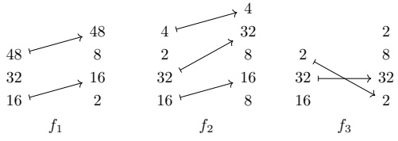

are coalesced, while the morphisms

\[\begin{array}{ccccc}{{{\begin{array}{c}8}}}&{{{\downarrow}}} \\{{{\downarrow}}}&{{{4}}}&{{{\downarrow}}} \\{{{4}}}&{{{2}}}&

are not coalesced.

Proposition 3.1.5.24. Suppose f is a tuple morphism. Then f is coalesced if and only if  $ L_{f} $ is coalesced.

Proof. Suppose  $ f: (s_1, \ldots, s_m) \to (t_1, \ldots, t_n) $ is a tuple morphism, and let

$$ L_{f}=(s_{1},\ldots,s_{m}):(d_{1},\ldots,d_{m})$$

be the layout encoded by f.

Suppose first that $f$ is coalesced. Then no entry of $\text{shape}(L_f) = \text{domain}(f)$ is equal to 1. Suppose $1 \leq i < m$. We want to show that $s_i d_i$ is not equal to $d_{i+1}$. If $d_i = 0$, then $\alpha(i) = *$, and we have

$$ \begin{array}{r l r}{s_{i}d_{i}=d_{i+1}}&{}&{\Leftrightarrow\quad d_{i+1}=0}\\ &{}&\\ &{}&{\Leftrightarrow\quad\alpha(i+1)=*}\end{array}$$

but by our assumption that $f$ is coalesced, we have $\alpha(i+1) \neq *$, hence $s_i d_i \neq d_{i+1}$. If $d_i \neq 0$, then $\alpha(i) \neq *$. If $\alpha(i+1) = *$, then $d_{i+1} = 0$, so $s_i d_i \neq d_{i+1}$. If $\alpha(i+1) < \alpha(i)$, then $d_i \geq d_{i+1}$, and since $s_i \neq 1$, we have $s_i d_i > d_{i+1}$. Finally, if $\alpha(i) < \alpha(i+1)$, then

$$ \begin{align*}s_{i}d_{i}=s_{i}\cdot\left(\prod_{j<\alpha(i)}t_{j}\right)&=\prod_{j\leq\alpha(i)}t_{j}\\&<\prod_{j<\alpha(i+1)}t_{j}\\&=d_{i+1}.\end{align*}$$

We conclude that $L_{f}$ is coalesced.

Suppose next that the layout $L_f$ is coalesced. Then no entry in $\text{domain}(f) = \text{shape}(L_f)$ is equal to 1. Suppose $1 \leq i < m$. If $\alpha(i) = *$, then $d_i = 0$, and since $L_f$ is coalesced, we must have $d_{i+1} \neq s_i d_i = 0$, hence $\alpha(i+1) \neq *$. Suppose $\alpha(i) \neq *$, and $\alpha(i) < \alpha(i+1)$. Since $L_f$ is coalesced, we have $s_i d_i \neq d_{i+1}$. But if we write

$$ s_{i}d_{i}=\prod_{j\leq\alpha(i)}t_{j},$$

and

$$ d_{i+1}=\prod_{j<\alpha(i+1)}t_{j},$$

this implies that  $ \prod_{\alpha(i)<j<\alpha(i+1)} t_j \neq 1 $. In particular, there exists some  $ \alpha(i) < j < \alpha(i+1) $ with  $ t_j > 1 $. We conclude that  $ f $ is coalesced.

Next, we define our coal(-) operation on tuple morphisms.

Construction 3.1.5.25. Suppose f is a tuple morphism. We define a morphism  $ \operatorname{coal}(f) $ as follows:

1. First, we set  $ g = \text{squeeze}(f) $, and we write  $ \beta : \langle m \rangle_* \to \langle n \rangle_* $ for the map over which  $ g $ lies.

2. Next, we define an equivalence relation  $ \sim $ on  $ \langle m \rangle $ where  $ i \sim i' $ if either

(a)  $ \beta(i'') = * $ for  $ i \leq i'' \leq i' $, or

(b)  $ \beta(i'') = \beta(i) + (i'' - i) $ for  $ i \leq i'' \leq i' $.

The quotient  $ \langle m \rangle/\sim $ is ordered by  $ [i_1] \leq [i_2] $ if  $ i_1 \leq i_2 $, so we can identify this quotient with  $ \langle \bar{m} \rangle $ where  $ \bar{m} $ is the size of  $ \langle m \rangle/\sim $.

3. Next, define an equivalence relation  $ \sim $ on  $ \langle n \rangle $ where  $ j \sim j' $ if there exists  $ i \in \langle m \rangle $ such that

$$ \beta(i+(j^{\prime\prime}-j))=\beta(i)+(j^{\prime\prime}-j)$$

for all  $ j \leq j'' \leq j' $. The quotient  $ \langle n \rangle / \sim $ is ordered by  $ [j_1] \leq [j_2] $ if  $ j_1 \leq j_2 $, so we can identify this quotient with  $ \langle \bar{n} \rangle $ where  $ \bar{n} $ is the size of  $ \langle n \rangle / \sim $.

4. Next, we observe that the map  $ \beta: \langle m \rangle_* \to \langle n \rangle_* $ descends to a map

$$ \bar{\beta}:\langle\bar{m}\rangle_{*}\to\langle\bar{n}\rangle_{*}$$

given by  $ \bar{\beta}([i]) = [\beta(i)] $.

5. The domain  $ \bar{S} = (\bar{s}_1, \ldots, \bar{s}_{\bar{m}}) $ of coal( $ f $) is defined by setting

$$ \bar{s}_{i}=\prod_{i^{\prime}\in I}s_{i^{\prime}}$$

if  $ i \in \langle \bar{m} \rangle $ corresponds to the equivalence class  $ I \in \langle m \rangle $/  $ \sim $. The codomain  $ \bar{T} = (\bar{t}_1, \ldots, \bar{t}_{\bar{n}}) $ of coal(f) is defined by setting

$$ \bar{t}_{j}=\prod_{j^{\prime}\in J}t_{j^{\prime}}$$

if  $ j \in \langle \bar{n} \rangle $ corresponds to the equivalence class  $ J \in \langle n \rangle $/  $ \sim $. We then define

$$ coal(f):\bar{S}\to\bar{T}$$

to be the tuple morphism lying over  $ \bar{\beta} $.

Example 3.1.5.26. Here is an example of a tuple morphism f and the coalesced morphism coal(f).

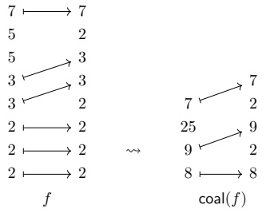

Example 3.1.5.27. We can coalesce the morphism f of Example 3.1.5.8 as follows

\[\begin{array}{ccccccc}256&256&&&\\256&\longrightarrow&128&&&\\128&\longrightarrow&1&&&\\1&32&&\longrightarrow&256&\\8&\longrightarrow&32&\quad\sim\quad&128&\\1&\longrightarrow&8&&&8\quad\longleftrightarrow&8\\f&&&&squeeze(f)&&\\&&&&&\quad coal(f)\end{array}\quad\sim\quad\begin{array}{c}32768\\32768\quad\longleftrightarrow\quad328\\8\longleftrightarrow\quad8\quad\longrightarrow&8\quad\longrightarrow&8\

Proposition 3.1.5.28. If f is a tuple morphism, then

1. coal(f) is coalesced, and

$$ 2.~L_{coal(f)}=coal(L_{f}).$$

Proof. First, we will argue that  $ \text{coal}(f) $ is coalesced. This is immediate from our construction, since applying \textit{squeeze} eliminates all modes equal to 1, and passing to the quotient in our construction consolidated all adjacent modes with  $ \alpha(i+1) = \alpha(i) + 1 $.

Next, we will prove that  $ L_{\mathrm{coal}(f)} = \mathrm{coal}(L_f) $. In light of Proposition 2.1.4.18 and Proposition 3.1.5.24, it suffices to prove that  $ \Phi_{\mathrm{coal}(f)} = \Phi_f $. Certainly applying \textit{squeeze}(-) to  $ f $ has no impact on the associated layout function, so we need to argue that passing to the quotient in our construction does not change the layout function of the associated layout. This follows from the fact that forming our quotient can be formed in steps, where in each step we combine adjacent modes with either  $ \alpha(i) = * = \alpha(i+1) $, or  $ \alpha(i+1) = \alpha(i)+1 $. These correspond to replacing adjacent modes of the form  $ s_i, s_{i+1} : 0, 0 $ with  $ s_i s_{i+1} : 0 $, and  $ s_i, s_{i+1} : d_i, s_i d_i $ with  $ s_i s_{i+1} : d_i $, respectively. Neither such operation changes the layout function of a layout, and so we conclude that  $ \Phi_{L_{\mathrm{coal}(f)}} = \Phi_{\mathrm{coal}(L_f)} $, as desired.  $ \square$

##### 3.1.5.5 Concatenate

Next, we will define a concatenation operation on tuple morphisms. This operation may be performed on tuple morphisms satisfying a “disjointness” condition, which we specify below.

Definition 3.1.5.29. Suppose  $ \alpha: \langle m \rangle_* \to \langle n \rangle_* $ and  $ \beta: \langle p \rangle_* \to \langle n \rangle_* $ are morphisms in  $ \mathrm{Fin}_* $ with the same codomain. We say  $ \alpha $ and  $ \beta $ have disjoint images if

$$ \operatorname{I m a g e}(\alpha)\cap\operatorname{I m a g e}(\beta)=\{\ast\}.$$

Construction 3.1.5.30. If  $ \alpha: \langle m \rangle_* \to \langle n \rangle_* $ and  $ \beta: \langle p \rangle_* \to \langle n \rangle_* $ have disjoint images, then we have a well-defined morphism

$$ \alpha\star\beta:\langle m+p\rangle_{*}\to\langle n\rangle_{*}$$

given by

$$ (\alpha\star\beta)(i)=\begin{cases}{\ast}&{i=\ast}\\ {\alpha(i)}&{1\leq i\leq m}\\ {\beta(i-m)}&{m+1\leq i\leq m+p.}\\ \end{cases}$$

This operation is associative, so we can consider  $ \alpha_1 \star \cdots \star \alpha_k $ for any collection of morphisms  $ \alpha_1, \ldots, \alpha_k $ in  $ \mathrm{Fin}_* $ with pairwise disjoint images.

Remark 3.1.5.31. If  $ \alpha $ and  $ \beta $ are tractable pointed maps and  $ \alpha $ and  $ \beta $ have disjoint images, then  $ \alpha \star \beta $ is tractable.

Definition 3.1.5.32. Suppose

$$ f:S\to T$$

and

$$ g:U \to T$$

are tuple morphisms lying over  $ \alpha $ and  $ \beta $, respectively. We say f and g have disjoint images if the morphisms  $ \alpha $ and  $ \beta $ have disjoint images.

Example 3.1.5.33. Consider the tuple morphisms  $ f $,  $ g $, and  $ h $ shown below.

\[\begin{array}{ccccccc}64&&&&64&&&64\\64&&32&&64&&64\\64\xrightarrow{64}

Then f and g have disjoint images, while h and g do not have disjoint images.

Construction 3.1.5.34. Suppose

$$ f:S\to T,\operatorname{and}g:U\to T$$

are tuple morphisms lying over  $ \alpha $ and  $ \beta $, respectively, and that f and g have disjoint images. We define the concatenation of f and g to be the morphism

$$ f\star g:S\star U\to T$$

lying over  $ \alpha \star \beta $. This operation is associative, so we can consider  $ f_1 \cdots f_k $ for any finite collection of morphisms  $ f_i $ with pairwise disjoint images.

Example 3.1.5.35. If f and g are the morphisms in \textbf{Tuple} from Example 3.1.5.33, then the concatenation of f and g is the morphism shown below.

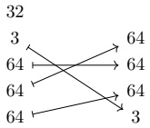

Example 3.1.5.36. Suppose  $ f : (s_1, \ldots, s_m) \to (t_1, \ldots, t_n) $ is a tuple morphism, and for any  $ 1 \leq i \leq m $, let

$$ f_{i}:\left(s_{i}\right)\to\left(t_{1},\cdots,t_{n}\right)$$

denote the  $ i $th entry of f, as in Example 3.1.3.8. Then we can write

$$ f=f_{1}\star\cdots\star f_{m}$$

as the concatenation of its entries.

Lemma 3.1.5.37. Suppose  $ f_1: S_1 \to T $ and  $ f_2: S_2 \to T $ are tuple morphisms with disjoint images. If  $ g: T \to U $ is any tuple morphism, then

$$ g\circ(f_{1}\star f_{2})=(g\circ f_{1})\star(g\circ f_{2}).$$

Proof. Suppose $f_1$, $f_2$, and $g$ lie over $\alpha_1 : \langle m_1 \rangle_* \to \langle n \rangle$, $\alpha_2 : \langle m_2 \rangle_* \to \langle n \rangle$, and $\beta : \langle n \rangle \to \langle p \rangle$, respectively. The two maps in question have the same domains and the same codomains, so it suffices to prove that

$$ \beta\circ(\alpha_{1}\star\alpha_{2})=(\beta\circ\alpha_{1})\star(\beta\circ\alpha_{2}).$$

We compute

$$ \begin{align*}(\beta\circ(\alpha_{1}\star\alpha_{2}))(i)&=\beta((\alpha_{1}\star\alpha_{2})(i))\\&=\begin{cases}\beta(*)&i=*\\ \beta(\alpha_{1}(i))&1\leq i\leq m_{1}\\ \beta(\alpha_{2}(i-m_{1}))&m_{1}+1\leq i\leq m_{1}+m_{2}\end{cases}\\&=\begin{cases}\ast&i=*\\\ (\beta\circ\alpha_{1})(i)&1\leq i\leq m_{1}\\ (\beta\circ\alpha_{2})(i-m_{1})&m_{1}+1\leq i\leq m_{1}+m_{2}\end{cases}\\&=(((\beta\circ\alpha_{1})\star(\beta\circ\alpha_{2}))(i)).\end{align*}$$

Proposition 3.1.5.38. Suppose  $ f_1, \ldots, f_k $ are morphisms in \textbf{Tuple} with the same codomain and with pairwise disjoint images. Then the layouts  $ L_{f_1}, \ldots, L_{f_k} $ satisfy

$$ L_{f_{1}\star\cdots\star f_{k}}=L_{f_{1}}\star\cdots\star L_{f_{k}}.$$

Proof. First, we prove the result for k = 2. Suppose

$$ f=(s_{1},\ldots,s_{m})\to(t_{1},\ldots,t_{n}),\operatorname{and}g:(u_{1},\ldots,u_{p})\to(t_{1},\ldots,t_{n})$$

have disjoint images, and write

$$ L_{f}=(s_{1},\ldots,s_{m}):(d_{1},\ldots,d_{m}),\operatorname{and}L_{g}=(u_{1},\ldots,u_{p}):(d_{1}^{\prime},\ldots,d_{p}^{\prime}).$$

Then the layout  $ L_{f\star g} $ is given by

$$ L_{f\star g}=\left(s_{1},\ldots,s_{m},u_{1},\ldots,u_{p}\right):\left(e_{1},\ldots,e_{m+m^{\prime}}\right)$$

where

$$ \begin{aligned}e_{i}&=\prod_{j<(\alpha\star\beta)(i)}t_{j}\\&=\left\{\begin{aligned}&\prod_{j<\alpha(i)}t_{j}&1\leq i\leq m\\&\prod_{j<\beta(i-m)}t_{j}&m+1\leq i\leq m+m^{\prime}.\end{aligned}\right.\\&=\left\{\begin{aligned}&d_{i}&1\leq i\leq m\\&d_{i-m}^{\prime}&m+1\leq i\leq m+m^{\prime}.\end{aligned}\right.\end{aligned}$$

This concludes the proof of the result when k = 2. The general case follows from the associativity of concatenation of tuple morphisms, and the associativity of concatenation of flat layouts. □

##### 3.1.5.6 Complement

We begin by defining the notion of complementary tuple morphisms.

Definition 3.1.5.39. Suppose  $ f : S \to T $ and  $ g : U \to T $ are tuple morphisms. We say  $ g $ is a complement of  $ f $ if

1. f and g have disjoint images, and

2. the concatenation

$$ f\star g:S\star U\xrightarrow{\cong}T$$

is an isomorphism.

Example 3.1.5.40. If f and g are the morphisms shown below

$$ \begin{array}{c}16\\32\\\downarrow\\32\\32\\f\end{array}\quad\begin{array}{c}16\\32\\32\\10\\10\\g\end{array}\quad\begin{array}{c}16\\32\\10\\32\\10\\g\end{array}$$

then g is a complement of f.

Example 3.1.5.41. If f is the morphism shown below

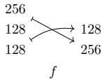

then f does not admit a complement.

Next, we prove that complementary tuple morphisms give rise to complementary flat layouts.

Proposition 3.1.5.42. If $f: S \to T$ is a tuple morphism and $g$ is a complement of $f$, then $L_g$ is a size($T$) - complement of $L_f$.

Proof. Write $S = \text{domain}(f)$, $U = \text{domain}(g)$, and $T = \text{codomain}(f) = \text{codomain}(g)$. First, we note that

$$ \begin{aligned}\operatorname{size}(L_{f})\cdot\operatorname{size}(L_{g})&=\operatorname{size}(L_{f}\star L_{g})\\&=\operatorname{size}(L_{f\star g})\\&=\operatorname{size}(S\star U)\\&=\operatorname{size}(T).\end{aligned}$$

Next, we note that  $ f \star g $ is an isomorphism, hence so is

$$ \left|f\star g\right|=\Phi_{L_{f\star g}}^{size(T)}$$

where we have used the identification of  $ \Phi_{L_{f\star g}}^{\mathrm{size}(T)} $ of Lemma 3.1.4.5.

Proposition 3.1.5.43. If f is an injective tuple morphism, then

$$ \operatorname{coal}^{\flat}(L_{f^{c}})=\operatorname{comp}^{\flat}(L_{f},\operatorname{size}(T)).$$

Proof. By Proposition 3.1.5.42, we know that  $ L_{fc} $ is a size $ (T) $-complement of  $ L_f $. Since  $ f^c $ is sorted, so is  $ L_{fc} $ and it follows from Proposition 2.1.6.33, it follows that

$$ \operatorname{coal}^{\flat}(L_{f^{c}})=\operatorname{comp}^{\flat}(L_{f},\operatorname{size}(T)),$$

since both of these layouts are flat, sorted, coalesced complements of  $ L_{f} $ of the same size.

Proposition 3.1.5.44. If  $ f: (s_1, \ldots, s_m) \to (t_1, \ldots, t_n) $ is an injective tuple morphism of standard form, then

$$ L_{f^{c}}=\operatorname{comp}^{\flat}(L_{f}).$$

Proof. Write

$$ L_{f}=\left(s_{1},\ldots,s_{m}\right):\left(d_{1},\ldots,d_{m}\right)$$

for the layout encoded by $f$. By Proposition 3.1.5.42, we know that $L_{fc}$ is a $\text{size}(T)$-complement of $L_f$. Where

$$ \begin{aligned}\mathsf{size}(T)=t_{1}\cdots t_{n}&=(t_{1}\cdots t_{n-1})t_{n}\\&=d_{m} s_{m}.\end{aligned}$$

By construction,  $ f^c $ is sorted, hence so is  $ L_{fe} $. Moreover, since  $ f $ has standard form, it follows that  $ f^c $ is coalesced. By Proposition 2.1.6.23, we deduce that

$$ L_{f^{c}}=\operatorname{comp}^{\flat}(L_{f}).$$

Definition 3.1.5.45. Suppose $f$ is a tuple morphism lying over $\alpha : \langle m \rangle_* \to \langle n \rangle_*$. We say $f$ is complementable if $\alpha$ is injective.

Construction 3.1.5.46. Suppose  $ f: (s_1, \ldots, s_m) \to (t_1, \ldots, t_n) $ is complementable tuple morphism. Let  $ j_1 < \cdots < j_{n-m} $ denote the collection of indices in  $ \langle n \rangle $ which are not in the image of  $ \alpha $. We define the complement of f to be the tuple morphism

$$ f^{c}:\left(t_{j_{1}},\ldots,t_{j_{k}}\right)\to\left(t_{1},\ldots,t_{n}\right)$$

lying over the map complement $ (\alpha) : \langle n - m \rangle_* \to \langle n \rangle_* \text{ given by } k \mapsto j_k $. By construction, we may observe that  $ f^c $ is a complement of  $ f $, in the sense of Definition 3.1.5.39

Example 3.1.5.47. Below is an example of a morphism f and its complement  $ f^c $.

$$ \begin{array}{ccc}f&\quad512&\quad512\\512&\quad512&\quad512\\256&\quad256&\quad512\\10&\quad10&\quad256\\f&\quad f^{c}&\quad10\end{array}$$

Proposition 3.1.5.48. If f is a tuple morphism and g is a complement of f, then

$$ \mathrm{sort}(g)=f^{c}.$$

Proof. Suppose $f$ lies over $\alpha : \langle m \rangle_* \to \langle n \rangle_*$, $\text{sort}(g)$ lies over $\beta : \langle n - m \rangle_* \to \langle n \rangle_*$ and $f^c$ lies over $\alpha^c : \langle n - m \rangle_* \to \langle n \rangle_*$. Then $\beta$ and $\alpha^c$ are increasing maps with the same image, namely

$$ \operatorname{Image}(\beta)=\langle n\rangle\setminus\operatorname{Image}(\alpha)=\operatorname{Image}(\alpha^{c}),$$

hence  $ \beta = \alpha^{c} $, and hence  $ \mathrm{sort}(g) = f^{c} $.

Proposition 3.1.5.49. Suppose f is a tuple morphism. Then f admits a complement if and only if f is complementable, in the sense of Definition 3.1.5.45.

Proof. If $f$ lies over a map $\alpha$ which is not injective, then for any morphism $f^*$ such that $f$ and $f^*$ have disjoint images, the morphism $f \star f^*$ lies over a map which is not injective, hence $f \star f^*$ is not an isomorphism. Conversely, if $f$ lies over an injective map, then the morphism $f^c$ of Construction 3.1.5.46 is a complement of $f$.

Proposition 3.1.5.50. If f is complementable tuple morphism, then

$$ \mathrm{sort}(f)=(f^{c})^{c}.$$

Proof. Both maps are increasing, injective, and have the same image, so they are equal.

##### 3.1.5.7 Flat division

In this section, we define a division operation on tuple morphisms.

Definition 3.1.5.51. If f and g are tuple morphisms, we say g divides f if g and f are composable. In other words,

$$ \operatorname{codomain}(g)=\operatorname{domain}(f).$$

Definition 3.1.5.52. Suppose  $ g: S \to T $ and  $ f: T \to U $ are tuple morphisms. The flat division of f by g is the tuple morphism

$$ f\oslash^{\flat}g=f\circ(g\star g^{c}).$$

Example 3.1.5.53. Here is an example of tuple morphisms  $ f $ and  $ g $ together with their flat quotient  $ f \otimes^b g $.

$$ \begin{array}{cccc}128\xrightarrow{128}2&\begin{array}{c}128\\\hline2\end{array}\begin{array}{c}128\\2\end{array}\xrightarrow{}\begin{array}{c}128\\2\end{array}\begin{array}{c}2\\128\end{array}\xrightarrow{128}2\\g&\begin{array}{c}f\\ \end{array}\begin{array}{c}f\otimes{}^\flat g\end{array}\end{array}$$

Example 3.1.5.54. Here is an example of tuple morphisms  $ f $ and  $ g $ together with their flat quotient  $ f \otimes^b g $.

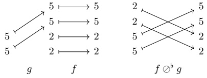

Example 3.1.5.55. Here is an example of tuple morphisms  $ f $ and  $ g $ together with their flat quotient  $ f \otimes^b g $.

$$ \begin{array}{ccc}g&\boldsymbol{f}&\boldsymbol{f}\otimes\boldsymbol{b}\boldsymbol{g}\\2&\begin{array}{c}512\\8\quad4\\2\quad8\\8\quad2\end{array}\end{array}$$

Proposition 3.1.5.56. If f and g are non-degenerate composable tuple morphisms, then

$$ \operatorname{coal}^{\flat}(L_{f\oslash^{b}g})=\operatorname{coal}^{\flat}(L_{f}\oslash^{\flat}L_{g})$$

Proof. By Proposition 3.2.6.20, we have

$$ \operatorname{coal}^{\flat}(L_{g^{c}})=\operatorname{comp}^{\flat}(L_{g},\operatorname{size}(L_{f})),$$

and we compute

$$ \begin{align*}\mathsf{coal}^{\flat}(L_{f}\oslash^{\flat}L_{g})&=\mathsf{coal}^{\flat}(L_{f}\circ(L_{g}\star\mathsf{comp}(L_{g},\mathsf{size}(L_{f}))))\\&=\mathsf{coal}(L_{f}\circ(L_{g}\star L_{g^{c}}))\\&=\mathsf{coal}(L_{f}\circ L_{g\star g^{c}})\\&=\mathsf{coal}(L_{f\circ(g\star g^{c})})\\&=\mathsf{coal}(L_{f\oslash^{b} g}).\end{align*}$$

##### 3.1.5.8 Flat products

In this section we define a product operation on tuple morphisms.

Definition 3.1.5.57. Suppose $f$ and $g$ are tuple morphisms. We say $f$ and $g$ are product admissible if $\text{codomain}(g) = \text{domain}(f^c)$. If $f$ and $g$ are product admissible, then we define $\text{flat}\ \text{product}\ of\ f$ and $g$ to be

$$ f\otimes^{\flat}g=f\star(f^{c}\circ g).$$

Example 3.1.5.58. If f and g are the tuple morphisms shown below

$$ \begin{array}{r l r}&{~}&{16}\\ &{~}&{}\\ &{16\longleftarrow\longrightarrow16}&{8\longleftarrow\longrightarrow8}\\ &{16\longleftarrow\longrightarrow16}&{8\longleftarrow\longrightarrow8}\\ &{g}&{f}\end{array}$$

then $f$ and $g$ are product-admissible, and $f\otimes^b g$ is the tuple morphism shown below.

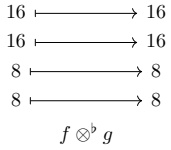

Example 3.1.5.59. If f and g are the tuple morphisms shown below

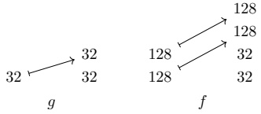

then $f$ and $g$ are product-admissible, and $f\otimes^b g$ is the tuple morphism shown below.

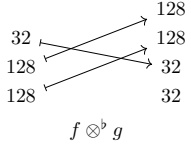

Lemma 3.1.5.60. If f and g are product admissible and g is injective, then  $ f \otimes^b g $ is injective and

$$ (f\otimes^{\flat}g)^{c}=f^{c}\circ g^{c}.$$

Proof. The tuple morphisms $(f\otimes^b g)^c$ and $f^c \circ g^c$ are injective, increasing, and have the same codomain, so it suffices to show that they have the same image. The image of $(f\otimes^b g)^c = (f\star(f^c \circ g))^c$ consists of those entries which are not in the image of $f$, and not in the image of $f^c \circ g$. The image of $f^c$ consists of those entries which are not in the image of $f$, and so the image of the composition $f^c \circ g^c$ consists of those entries which are not in the image of $f$, and not in the image of $f^c \circ g$.

Proposition 3.1.5.61. Suppose f and g are product admissible, and g and h are product admissible. Then

1.  $ f \otimes^b g $ and  $ h $ are product admissible,

2. f and  $ g \otimes^b h $ are product admissible, and

3.  $ (f\otimes^{\flat}g)\otimes^{\flat}h = f\otimes^{\flat}(g\otimes^{\flat}h) $.

Proof. Using Lemma 3.1.5.37 and Lemma 3.1.5.60, we compute

$$ \begin{aligned}f\otimes^{\flat}(g\otimes^{\flat}h)&=f\star(f^{c}\circ(g\otimes^{\flat}h))\\&=f\star(f^{c}\circ(g\star(g^{c}\circ h))))\\&=f\star((f^{c}\circ g)\star(f^{c}\circ(g^{c}\circ h)))\\&=f\star((f^{c}\circ g)\star((f^{c}\circ g^{c})\circ h))\\&=f\star(f^{c}\circ g)\star((f\otimes^{\flat}g)^{c}\circ h)\\&=(f\otimes^{\flat}g)\star((f\otimes^{\flat}g)^{c}\circ h)\\&=(f\otimes^{\flat}g)\otimes^{\flat}h.\\ \end{aligned}$$

Proposition 3.1.5.62. Suppose f and g are non-degenerate tuple morphisms and that f and g are product admissible. Then

$$ L_{f\otimes{^\flat}g}=L_{f}\otimes{^\flat}L_{g}.$$

Proof. Suppose $f: S \to T$ and $g: U \to V$ are product admissible, and set

$$ L_{f}^{*}=\operatorname{comp}^{\flat}(L_{f},\operatorname{size}(L_{f})\cdot\operatorname{cosize}(L_{g})).$$

Since f is injective and the codomain of g is the domain of  $ f^{c} $, it follows that

$$ \mathrm{size}(L_{f})\cdot\mathrm{cosize}(L_{g})\leq\mathrm{size}(S)\cdot\mathrm{size}(V)=\mathrm{size}(T).$$

Using this fact, and the fact that

$$ \Phi_{\operatorname{comp}(L_{f},\operatorname{size}(T))}=\Phi_{L_{f^{c}}},$$

we have

$$ \begin{aligned}{L_{f}^{*}\circ L_{g}}&{{}=\operatorname{comp}(L_{f},\operatorname{size}(T))\circ L_{g}}\\ {}&{{}=L_{f^{c}}\circ L_{g}.}\\ \end{aligned}$$

Using this fact, we compute

$$ \begin{aligned}L_{f}\otimes{}^{\flat}L_{g}&=L_{f}\star(L_{f}^{*}\circ L_{g})\\&=L_{f}\star(L_{f^{c}}\circ L_{g})\\&=L_{f}\star L_{f^{c}\circ g}\\&=L_{f\star(f^{c}\circ g)}\\&=L_{f\otimes{}^{\flat}g}\\ \end{aligned}$$

## 3.2 The category Nest

In the previous section, we introduced a category  $ \text{Tuple} $, whose morphisms encode flat tractable layouts. In this section, we introduce a category  $ \text{Nest} $, whose morphisms encode tractable layouts with arbitrary nesting.

#### 3.2.1 Basic definitions

Recall that for a nested tuple  $ S $, we write  $ S^{\flat} $ for the flattening of  $ S $. For example, if  $ S = (64, (8, 8)) $, then  $ S^{\flat} = (64, 8, 8) $.

Definition 3.2.1.1. Let  $ \text{Nest} $ denote the category whose objects are nested tuples of positive integers, and in which a morphism

$$ f:S\to T$$

in Nest is specified by a tuple morphism

$$ f^{\flat}:S^{\flat}\to T^{\flat}.$$

In other words,

$$ \operatorname{Hom}_{\operatorname{Nest}}(S,T)=\operatorname{Hom}_{\operatorname{Tuple}}(S^{\flat},T^{\flat}).$$

Explicitly, a morphism  $ f: S \to T $ in  $ \text{Nest} $ is specified by a tractable pointed map  $ \alpha: \langle \text{len}(S) \rangle_* \to \langle \text{len}(T) \rangle_* $ satisfying the following property:

• If  $ 1 \leq i \leq \text{len}(S) $ and  $ \alpha(i) \neq * $, then  $ \text{entry}_{i}(S) = \text{entry}_{\alpha(i)}(T) $.

We say such a morphism $f$ lies over $\alpha$, and refer to $f$ as a nested tuple morphism.

Notation 3.2.1.2. If $f: S \to T$ is a nested tuple morphism which lies over $\alpha$, we depict $f$ as

$$ S\xrightarrow[\alpha]{f}T$$

Example 3.2.1.3. Here are some examples of nested tuple morphisms.

$$ (64,(8,8))\xrightarrow[\scriptstyle f]{\scriptstyle (1,2,3)}$$

$$ ((2,2),2)\xrightarrow[(*,5,2)]{\quad g\quad}(10,2,2,(3,2,3))$$

$$ 64\xrightarrow{\quad h\quad}_{(2)}\left((64,64),512\right).$$

Observation 3.2.1.4. If X is a set, lets write  $ X^{ind} $ for the indiscrete category on X. This is the category whose objects are the elements of X, and in which there is a unique (iso)morphism between any two objects. Then by definition of Nest, we have a pullback square

\[\begin{array}{c}Nest\xrightarrow{prof(-)}Profile^{ind}\\\left(\text{−}\right)^{b}\downarrow\quad\quad

We may view this as a categorification of the pullback square 2.2.2.4.

Example 3.2.1.5. Suppose $S$ is a nested tuple of length $m$. If $1 \leq i \leq m$ then there is a nested tuple morphism

$$ entry_{i}(S)\to S$$

lying over the map  $ \langle 1\rangle_* \to \langle m\rangle_* $ given by  $ 1 \mapsto i $. For instance, if  $ S = (64, (8, 8)) $ and  $ i = 1 $, then we have a nested tuple morphism

$$ 64\xrightarrow[(1)]{\quad}(64,(8,8)).$$

Example 3.2.1.6. Suppose $S$ is a nested tuple of rank $r$. If $1 \leq i \leq r$, then there is a canonical nested tuple morphism

$$ mode_{i}(S)\to S$$

lying over the map  $ \langle \text{len}_i(S) \rangle_* \to \langle \text{len}(S) \rangle_* $ given by  $ j \mapsto j + \text{len}_{<i}(S) $. For instance, if  $ S = (64, (8, 8)) $, then we have a nested tuple morphism

$$ (8,8)\xrightarrow[(2,3)]{\quad}(64,(8,8)).$$

Observation 3.2.1.7. There are functors relating the categories Nest and Tuple. First, there is an inclusion functor

$$ \operatorname{Tuple}\xrightarrow{\quad\mathrm{C}\quad}\operatorname{Nest}$$

which considers a tuple morphism $f: S \to T$ as a nested tuple morphism. Next, there is a flattening functor

$$ Nest\xrightarrow{(-)^{\flat}}Tuple$$

which sends a nested tuple morphism $f: S \to T$ to the underlying tuple morphism $f^b: S^b \to T^b$. The composite

$$ \operatorname{Tuple}\xrightarrow{\mathrm{~C~}}\operatorname{Nest}\xrightarrow{(-)^{\flat}}\operatorname{Tuple}$$

is the identity functor on  $ \text{Tuple} $, so  $ \text{Tuple} $ is a retractive subcategory of  $ \text{Nest} $. Moreover, these functors form an adjoint equivalence of categories.

Remark 3.2.1.8. One might wish to consider some category C whose morphisms encode tractable layouts, but which is not equivalent to  $ \text{Tuple} $. The authors have considered several such examples, but leave their investigation to future work.

#### 3.2.2 From nested tuple morphisms to layouts

The key feature of the category \textbf{Nest} is that if  $ f: S \to T $ is a nested tuple morphism, then  $ f $ encodes a layout  $ L_f $. This layout is obtained by equipping the flat layout  $ L_{f^b} $ with the nesting profile of  $ S $. More precisely, we have the following construction.

Construction 3.2.2.1. Suppose

$$ f:S\to T$$

is a nested tuple morphism, and suppose $P = \mathrm{prof}(S)$. We define $L_f$ to be the layout

$$ L_{f}=\left(L_{f^{\flat}}\right)_{P}$$

where  $ (-) $P is the P-substitution operation of Definition 2.3.1.19. We refer to  $ L_f $ as the layout encoded by f.

Construction 3.2.2.2. Suppose

$$ (s_{1},\ldots,s_{m})_{P}\xrightarrow[\alpha]{\quad f\quad}(t_{1},\ldots,t_{n})_{Q}$$

is a nested tuple morphism. We define $L_{f}$ to be the layout whose shape

$$ \operatorname{shape}(L_{f})=(s_{1},\ldots,s_{m})_{P}$$

is the domain of f, and whose stride

$$ \operatorname{stride}(L_{f})=(d_{1},\ldots,d_{m})_{P}$$

has entries defined by the formula

$$ d_{i}=\begin{cases}0&\alpha(i)=*\\ \prod_{j<\alpha(i)}t_{j}&\alpha(i)\neq*.\end{cases}$$

We refer to $L_{f}$ as the layout encoded by $f$.

Example 3.2.2.3. The layout encoded by

$$ \left((8,8),(4,4)\right)\xrightarrow[_{(1,4,3,2)}]{f}$$

is

$$ L_{f}=((8,8),(4,4)):((1,128),(32,8)).$$

Example 3.2.2.4. The layout encoded by

$$ \left(128,(4,4,2)\right)\xrightarrow[ (3,1,2,*)]{g}\left((4,4),128\right)$$

is

$$ L_{g}=\left(128,(4,4,2)\right):(16,(1,4,0)).$$

Observation 3.2.2.5. The flattening functor

$$ Nest\xrightarrow{(-)^{\flat}}Tuple$$

is compatible with flattening of layouts, in that if f is a nested tuple morphism, then

$$ (L_{f})^{\flat}=L_{f^{\flat}}.$$

If $L$ is a tractable layout, then we can construct a nested tuple morphism which encodes $L$ as follows.

Construction 3.2.2.6. Suppose L is a tractable layout. We define the standard representation of L to be the nested tuple morphism

$$ f_{L}:S\to T$$

where  $ (f_L)^{\flat} = f_{L^{\flat}} $ is the standard representation of  $ L^{\flat} $,  $ S = \text{shape}(L) $ is the shape of  $ L $, and  $ T $ is the codomain of  $ f_{L^{\flat}} $.

Example 3.2.2.7. If

$$ L=\left(32,(2,2)\right):\left(192,(24,3)\right)$$

then the standard representation of L is

$$ (32,(2,2))\xrightarrow[ (6,4,2)]{f_{L}}(3,2,4,2,4,32).$$

Lemma 3.2.2.8. If L is a tractable layout, and  $ f = f_{L} $ is the standard representation of L, then

$$ L_{f}=L.$$

Proof. We have

$$ (L_{f})^{\flat}=L_{f^{\flat}}=L^{\flat}$$

and

$$ \operatorname{s h a p e}(L_{f})=\operatorname{s h a p e}(L).$$

Proposition 3.2.2.9. Suppose L is a layout. Then there exists a nested tuple morphism f encoding L if and only if L is tractable.

Proof. Suppose first that  $ L = L_f $ for some nested tuple morphism  $ f $. Then  $ (L_f)^{\flat} = L_{f^{\flat}} $, and by Proposition 3.1.2.10, we know that  $ L^{\flat} $ is tractable, hence so is  $ L $. Conversely, if  $ L $ is tractable, then we can take  $ f = f_L $ to be the standard representation of  $ L $, and by Lemma 3.2.2.8, we have  $ L_f = L $.  $ \square$

In order to establish a one-to-one correspondence between tractable layouts and certain nested tuple morphisms, we introduce the notion of standard form for nested tuple morphisms.

Definition 3.2.2.10. Suppose  $ f: S \to T $ is a nested tuple morphism. We say f has standard form if

1.  $ f^{b} $ has standard form, as in Definition 3.1.2.12, and

2. T is flat.

Example 3.2.2.11. The nested tuple morphism

$$ ((2,2),(3,3))\xrightarrow[ (4,6,2,3)]{f}{(10,3,3,2,10,2)}$$

has standard form.

Example 3.2.2.12. The nested tuple morphism

$$ \left((2,2),(3,3)\right)\xrightarrow[ (4,6,2,3 )]{f}\left((10,3,3),(2,10,2)\right)$$

does not have standard form since the codomain of g is not flat.

Just as in the flat case, we need to exclude non-degenerate nested tuple morphisms and non-degenerate layouts in order to obtain a one-to-one correspondence between nested tuple morphisms of standard form and tractable layouts. To this end, we make the following definition.

Definition 3.2.2.13. Suppose

$$ S\xrightarrow[\alpha]{f}T$$

is a nested tuple morphism, and suppose

$$ L=S:D$$

is a layout.

1. We say $f$ is non-degenerate if

$$ {\sf e n t r y}_{i}(S)=1\quad\Rightarrow\quad\alpha(i)=*.$$

2. We say $L$ is non-degenerate if

$$ {\sf e n t r y}_{i}(S)=1\quad\Rightarrow\quad{\sf e n t r y}_{i}(D)=0.$$

Remark 3.2.2.14. If $f$ is a nested tuple morphism, then $f$ is non-degenerate if and only if $f^{\flat}$ is non-degenerate. If $L$ is a layout, then $L$ is non-degenerate if and only if $L^{\flat}$ is non-degenerate.

Proposition 3.2.2.15. The maps

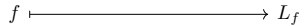

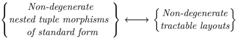

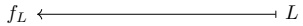

of Constructions 3.2.2.2 and 3.2.2.6 determine a one-to-one correspondence between nested tuple morphisms of standard form, and tractable layouts.

Proof. We have already shown in Proposition 3.2.2.9 that if $L$ is a tractable layout and $f = f_L$ is the standard form of $L$, then $L_f = L$. Suppose next that $f$ has standard form, and let $L = L_f$ be the layout encoded by $f$. We want to show that $f$ is equal to the standard representation $f_L$ of $L$. By Proposition 3.1.2.21, we know that $f^b$ is equal to the standard representation $f_L^b$ of $L^b$, and since

$$ \operatorname{domain}(f)=\operatorname{shape}(L)=\operatorname{domain}(f_{L}),$$

and

$$ \operatorname{c o d o m a i n}(f)=\operatorname{c o d o m a i n}(f^{\flat})=\operatorname{c o d o m a i n}(f_{L^{\flat}})=\operatorname{c o d o m a i n}(f_{L}),$$

we deduce that $f = f_{L}$.

#### 3.2.3 Examples

In this section, we list some important families of nested tuple morphisms.

Example 3.2.3.1 (Reparenthesizations). Suppose  $ S_1 $ and  $ S_2 $ are nested tuples with the same flattening

$$ S_{1}^{\flat}=S_{2}^{\flat}.$$

Then there is a reparenthesization isomorphism

$$ id^{S_{2}}_{S_{1}}:S_{1}\xrightarrow{\quad\cong\quad}S_{2}$$

lying over the identity. These morphisms are transitive, in that

$$ \operatorname{id}_{S_{2}}^{S_{3}}\circ\operatorname{id}_{S_{1}}^{S_{2}}=\operatorname{id}_{S_{1}}^{S_{3}},$$

and compatible with identities, in that

$$ \mathrm{id}_{S}^{S}=\mathrm{id}_{S}.$$

If  $ f = id_{S_1}^{S_2} $ is a reparenthesization isomorphism, then  $ L_f $ is the column major layout with shape  $ S_1 $.

Example 3.2.3.2 (Flattenings). As a special case of the previous example, if S is any nested tuple, then we have a flattening isomorphism

$$ \mathrm{id}_{S}^{S^{\flat}}:S\xrightarrow{\cong}S^{\flat}$$

and an unflattening isomorphism

$$ \mathrm{id}_{S^{\flat}}^{S}:S^{\flat}\xrightarrow{\quad\cong\quad}S$$

Observation 3.2.3.3. If $f: S \to T$ is a nested tuple, then $f$ is equal to the composite

$$ S\xrightarrow{\operatorname{id}_{S}^{S^{\flat}}}S^{\flat}\xrightarrow{f^{\flat}}T^{\flat}\xrightarrow{\operatorname{id}_{T^{\flat}}^{T}}T.$$

In other words, we have a canonical factorization

$$ f=\operatorname{id}_{T^{\flat}}^{T}\circ f^{\flat}\circ\operatorname{id}_{S}^{S^{\flat}}.$$

Example 3.2.3.4 (Entries). Suppose

$$ S\xrightarrow[\alpha]{f}T$$

is a nested tuple morphism. Suppose  $ 1 \leq i \leq \text{len}(S) $, and write  $ j = \alpha(i) $. Then we refer to the nested tuple morphism

$$ entry_{i}(S)\xrightarrow[\quad]{entry_{i}(f)}T$$

as the  $ i $th entry of f. The layout encoded by entry $ _i $(f) is

$$ L_{{\operatorname{entry}}_{i}(f)}={\operatorname{entry}}_{i}(L_{f}).$$

Example 3.2.3.5 (Entry inclusions). As a special case of the previous example, if $S$ is a nested tuple and $1 \leq i \leq len(S)$, we can take $f = \mathsf{id}_S$, in which case

$$ entry_{i}(id_{S}):entry_{i}(S)\xrightarrow{\quad}S$$

is the inclusion of the ith entry of S.

Example 3.2.3.6 (Modes). Suppose

$$ S\xrightarrow[\alpha]{f}T$$

is a nested tuple morphism. Suppose  $ 1 \leq i \leq \text{rank}(S) $ and, write

$$ N=\operatorname{len}_{<i}(S)$$

$$ \ell=\operatorname{len}_{i}(S).$$

Then we refer to the nested tuple morphism

$$ mode_{i}(S)\xrightarrow[ (N+1,\ldots,N+\ell) ]{mode_{i}(f)}T$$

as the ith mode of S. The layout encoded by mode $ _{i}(L_{f})$

$$ L_{\operatorname{mode}_{i}(f)}=\operatorname{mode}_{i}(L_{f}).$$

Example 3.2.3.7 (Mode inclusions). As a special case of the previous example we may take $f = \mathrm{id}_{S}$, in which case

$$ mode_{i}(id_{S}):mode_{i}(S)\to S$$

is the inclusion of the  $ i^{th} $ mode of S. We sometime denote this map by

$$ \operatorname{incl}_{i}(S)=\operatorname{mode}_{i}(\operatorname{id}_{S}).$$

#### 3.2.4 Realization of nested tuple morphisms

In the flat case, we constructed a realization functor

$$ \operatorname{Tuple}\xrightarrow{|\cdot|}\operatorname{FinSet}$$

which sends a tuple morphism $f$ to the layout function of $L_{f}$. We can extend this to a realization functor

$$ \operatorname{Nest}\xrightarrow{|\cdot|}\operatorname{FinSet}$$

by precomposing with the flattening functor  $ \mathsf{Nest} \to \mathsf{Tuple} $.

Definition 3.2.4.1. We define the realization functor

$$ Nest\ \xrightarrow{|\cdot|}\ FinSet$$

to be the composite

$$ \operatorname{Nest}\xrightarrow{(-)^{\flat}}\operatorname{Tuple}\xrightarrow{|\cdot|}\operatorname{FinSet}$$

Lemma 3.2.4.2. If $f: S \to T$ is a nested tuple morphism, then the realization $|f|$ of $f$ is the layout function of $L_f$:

$$ |f|=\Phi_{L_{f}}^{\operatorname{size}(T)}.$$

Proof. This follows immediately from 3.1.4.5, since

$$ |f|=|f^{\flat}|=\Phi_{L_{f^{\flat}}}^{\operatorname{size}(T)}=\Phi_{L_{f}}^{\operatorname{size}(T)}$$

#### 3.2.5 Refinements

In this section, we revisit the refinement of nested tuples from a categorical perspective. Recall from section 2.2.4 that a nested tuple  $ S' $ refines S, denoted

$$ S^{\prime}\xrightarrow{\quad}S$$

if  $ S' $ may be obtained from S by replacing each entry of S with some nested tuple of the same size. For example,

$$ (2,(2,2))\to8,$$

and

$$ ((2,2),(3,3),(5,5))\twoheadrightarrow(4,9,25).$$

If  $ \operatorname{len}(S) = m $ and  $ \operatorname{prof}(S) = P $, then we can write

$$ S^{\prime}=(S_{1}^{\prime},\ldots,S_{m}^{\prime})_{P}$$

as the P-substitution of the relative modes

$$ S_{i}^{\prime}=\operatorname{mode}_{i}(S^{\prime},S).$$

We refer to the ordinary concatenation

$$ (S_{1}^{\prime},\ldots,S_{m}^{\prime})=\operatorname{flat}(S^{\prime},S)$$

as the flattening of  $ S' $ relative to S.

Let  $ \mathbf{Ref} $ denote the poset category of nested tuples of positive integers under refinement, so that a morphism in  $ \mathbf{Ref} $ is a refinement  $ S' \to S $. If  $ S $ is a nested tuple, let

$$ \operatorname{Ref}(S)=\{S^{\prime}\mid S^{\prime}\operatorname{refines}S\}$$

denote the poset of nested tuples refining S. Equivalently,  $ \text{Ref}(S) $ is the slice category  $ \text{Ref}/S $.

Construction 3.2.5.1. [Relative mode inclusions] Suppose  $ S' \rightarrow S $ is a refinement, and write

$$ S_{i}^{\prime}=\operatorname{mode}_{i}(S^{\prime},S)$$

for the modes of  $ S' $ relative to  $ S $. Then  $ S' $ and  $ (S'_1, \ldots, S'_m) $ have the same flattening, so we have a reparenthesization isomorphism

$$ \mathrm{id}_{(S^{\prime}_{1},\ldots,S^{\prime}_{m})}^{S^{\prime}}:(S^{\prime}_{1},\ldots,S^{\prime}_{m})\xrightarrow{\quad\cong\quad}S^{\prime}$$

and we define

$$ \operatorname{incl}_{i}(S^{\prime},S):S_{i}^{\prime}\to S^{\prime}$$

to be the composite

$$ S_{i}^{\prime}\xrightarrow{\operatorname{incl}_{i}((S_{1}^{\prime},\ldots,S_{m}^{\prime}))}(S_{1}^{\prime},\ldots,S_{m}^{\prime})\xrightarrow{\operatorname{id}_{(S_{1}^{\prime},\ldots,S_{m}^{\prime})}^{S^{\prime}}}S^{\prime}$$

of the  $ i $th mode inclusion of  $ (S_1', \ldots, S_m') $ with the reparenthesization isomorphism  $ (S_1', \ldots, S_m') \cong S' $.

Example 3.2.5.2. If  $ S = (4, (9, 25)) $ and  $ S' = ((2, 2), ((3, 3), 25)) $, then  $ S' $ refines  $ S $, and  $ \mathrm{incl}_2(S', S) $ is the nested tuple morphism

$$ (3,3)\xrightarrow[{(3,4)}]{{\operatorname{incl}}_{2}(S^{\prime},S)}((2,2),({(3,3)},{25})).$$

Construction 3.2.5.3. [Relative modes] Suppose  $ f' : S' \to T' $ is a nested tuple morphism, and suppose  $ S' $ refines  $ S $. We define the  $ ith $ mode of  $ f' $ relative to  $ S $, denoted

$$ \operatorname{mode}_{i}(f^{\prime},S)=f^{\prime}\circ\operatorname{incl}_{i}(S^{\prime},S):S_{i}^{\prime}\to T^{\prime}$$

to be the composite

$$ S_{i}^{\prime}\xrightarrow{\operatorname{incl}_{i}(S^{\prime},S)}S^{\prime}\xrightarrow{f^{\prime}}T^{\prime}$$

In particular, we have

$$ mode_{i}(\mathsf{id}_{S^{\prime}},S)=\mathsf{incl}_{i}(S^{\prime},S).$$

Example 3.2.5.4. Suppose  $ S = (4, (9, 25)) $ and  $ S' = ((2, 2), ((3, 3), 25)) $, so that  $ S' $ refines S. If  $ f' $ is the nested tuple morphism

$$ \left((2,2),\left((3,3),25\right)\right)\xrightarrow[{(1,3,2,*,4)}]{f^{\prime}}(2,3,2,25).$$

then mode $ _{2} $(f', S) is the nested tuple morphism

$$ (3,3)\xrightarrow[{(2,*)}]{mode_{2}(f^{\prime},S)}(2,3,2,25).$$

Construction 3.2.5.5 (Pullbacks). Suppose  $ f: S \to T $ is a nested tuple morphism lying over  $ \alpha $, and suppose  $ T' \twoheadrightarrow T $ is a refinement. Let

$$ T_{j}^{\prime}=\operatorname{mode}_{j}(T^{\prime},T)$$

denote the  $ j $th mode of  $ T' $ relative to  $ T $, and for any  $ 1 \leq i \leq \text{len}(S) $, set

$$ S_{i}^{\prime}=\begin{cases}{\operatorname{entry}_{i}(S)}&{\alpha(i)=*}\\ {T_{j}^{\prime}}&{\alpha(i)=j.}\\ \end{cases}$$

We define the pullback of  $ T' $ along f to be the nested tuple

$$ S^{\prime}=f^{*}T^{\prime}=\operatorname{sub}(S,(S_{1}^{\prime},\ldots,S_{m}^{\prime})).$$

For any  $ 1 \leq i \leq m $, let

$$ f_{i}^{\prime}:S_{i}^{\prime}\to T^{\prime}$$

be the trivial map if  $ \alpha(i) = * $, and the inclusion

$$ \operatorname{incl}_{j}(T^{\prime},T):S_{i}^{\prime}=T_{j}^{\prime}\to T^{\prime}$$

if  $ \alpha(i) = j $. The maps  $ f_1', \ldots, f_m $ have disjoint images, so we form the concatenation

$$ (f_{1}^{\prime},\ldots,f_{m}^{\prime}):(S_{1}^{\prime},\ldots,S_{m}^{\prime})\to T^{\prime}.$$

We define  $ f' = T'^* f $ to be the composite

$$ S^{\prime}\xrightarrow{\operatorname{id}_{S^{\prime}}^{(S_{1}^{\prime},\ldots,S_{m}^{\prime})}}\left(S_{1}^{\prime},\ldots,S_{m}^{\prime}\right)\xrightarrow{(f_{1}^{\prime},\ldots,f_{m}^{\prime})}T^{\prime}.$$

We refer to  $ f' $ as the pullback of f along T, and depict such a pullback as a square

$$ \begin{array}{c} S^{\prime} \xrightarrow{f^{\prime}} T^{\prime} \\ \downarrow \\ \Downarrow \\ S \xrightarrow[f]{} T. \end{array}$$

Example 3.2.5.6. Suppose  $ f : (64, 32) \to (4, 64, 4, 32) $ lies over  $ \alpha = (2, 4) $. Then we have a pullback square

$$ \begin{array}{c}(16,4),(16,2))\xrightarrow{f^{\prime}}((2,2),(16,4),(2,2),(16,2))\\\downarrow\\\downarrow\ 64,32)\xrightarrow[f]{}\xrightarrow[(4,64,4,32)]{}\end{array}$$

where  $ f' $ lies over  $ \alpha' = (3, 4, 7, 8) $.

Example 3.2.5.7. Suppose S is a nested tuple with flattening

$$ S^{\flat}=(s_{1},\ldots,s_{m}),$$

and suppose  $ S' \to S $ is a refinement with relative flattening

$$ (S_{1}^{\prime},\ldots,S_{m}^{\prime}).$$

Then the pullback of  $ S' \rightarrow S $ along the unflattening isomorphism

$$ \mathrm{id}_{(s_{1},\ldots,s_{m})}^{S}:\left(s_{1},\ldots,s_{m}\right)\to S$$

is the reparenthesization isomorphism

$$ \begin{array}{c}(S_{1}^{\prime},\ldots,S_{m}^{\prime})\xrightarrow{\mathrm{id}_{(S_{1}^{\prime},\ldots,S_{m}^{\prime})}^{\mathcal{S}^{\prime}}}S^{\prime}\\\downarrow\quad\searrow\quad\downarrow\\\left(s_{1},\ldots,s_{m}\right)\xrightarrow{\mathrm{id}_{(s_{1},\ldots,s_{m})}^{\mathcal{S}}}\boldsymbol{S}.\end{array}$$

Example 3.2.5.8. Suppose  $ S' \rightarrow S $ is a refinement, and consider the  $ i $th entry inclusion

$$ s_{i}\to S$$

Then the pullback of  $ S' \twoheadrightarrow S $ along  $ s_i \to S $ is the  $ i $th relative mode inclusion

$$ \begin{array}{l}S_{i}^{\prime}\xrightarrow{\mathrm{incl}_{i}(S^{\prime},S)}S^{\prime}\\\downarrow\quad\downarrow\\\downarrow\\s_{i}\quad\longrightarrow S.\end{array}$$

Observation 3.2.5.9. The pullback construction above specifies a contravariant functor

$$ Nest^{op}\xrightarrow{\quad}Cat$$

$$ \begin{array}{ccc}S\longmapsto&\operatorname{Ref}(S)&&f^{*}T^{\prime}\leftarrow f^{*}T^{\prime \prime}\\ \downarrow&&\uparrow\\ T\longmapsto&\operatorname{Ref}(T)&&T^{\prime}\leftarrow T^{\prime \prime}\end{array}$$

The key property of pullbacks is that the layout function of  $ f' $ is equal to that of f.

Lemma 3.2.5.10. Suppose

$$ \begin{array}{c} S^{\prime} \xrightarrow{f^{\prime}} T^{\prime} \\ \downarrow \\ \downarrow \\ S \xrightarrow[f]{} T \end{array}$$

is a pullback square, where f lies over  $ \alpha $. Let

$$ f_{i}^{\prime}:S_{i}^{\prime}\to T$$

denote the ith mode of $f'$ relative to $S$, and let

$$ (L_{f})^{\flat}=(s_{1},\ldots,s_{m}):(d_{1},\ldots,d_{m}).$$

Then for any  $ 1 \leq i \leq m $, we have

$$ \operatorname{coal}(L_{f_{i}^{\prime}})=s_{i}:d_{i}.$$

Proof. Suppose  $ 1 \leq i \leq m $. If  $ \alpha(i) = * $, then  $ f_i' $ is the trivial map, so

$$ L_{f_{i}^{\prime}}=s_{i}:0=s_{i}:d_{i}.$$

In particular,  $ \text{coal}(L_{f'_i}) = s_i : 0 = s_i : d_i $. Suppose next that  $ \alpha(i) = j \neq * $. By construction of  $ f' $, we have that

$$ f_{i}^{\prime}=\operatorname{incl}_{j}(T^{\prime},T):T_{j}^{\prime}\to T^{\prime}.$$

which lies over the map $\alpha_i'$ given by $t \mapsto \text{len}_{<j}(T', T) + t$. For each $1 \leq t < \text{len}(T'_i)$, we have $\alpha'_i(t) = \alpha'_i(t+1)$, so $L_{f'_i}$ is a column major layout with size $\text{size}(T'_j) = t_j = s_i$. This implies that $\text{coal}(L_{f'_i})$ is a depth 0 layout of the form

$$ coal(L_{f_{i}^{\prime}})=s_{i}:e$$

for some integer  $ e \geq 0 $. We claim that  $ e = d_i $. If we write  $ {t'_{j'}}_i = \text{entry}_{j'}(T') $, then we have

$$ \begin{aligned}e=\mathsf{entry}_{1}(\mathsf{stride}(L_{f_{i}^{\prime}}))&=\prod_{j^{\prime}<\alpha_{i}^{\prime}(1)}t_{j^{\prime}}^{\prime}\\&=\prod_{j^{\prime}\leq\mathsf{len}<j}(t_{j^{\prime},T}^{\prime})\\&=\prod_{j^{\prime}<j}\mathsf{size}(T_{j^{\prime}}^{\prime})\\&=\prod_{j^{\prime}<j}t_{j^{\prime}}\\&=d_{i}.\\ \end{aligned}$$

Proposition 3.2.5.11. If

$$ \begin{array}{c} S^{\prime} \xrightarrow{f^{\prime}} T^{\prime} \\ \downarrow \\ \downarrow \\ S \xrightarrow[f]{} T \end{array}$$

is a pullback square, then  $ \Phi_{L_f} = \Phi_{L_{f'}} $.

Proof. We begin by fixing notation. Let  $ m = \text{len}(S) $, and let

$$ S^{\flat}=(s_{1},\ldots,s_{m}),$$

$$ S_{i}^{\prime}=\operatorname{mode}_{i}(S^{\prime},S),$$

$$ T_{j}^{\prime}=\operatorname{mode}_{j}(T^{\prime},T),$$

$$ (L_{f})^{\flat}=(s_{1},\ldots,s_{m}):(d_{1},\ldots,d_{m}).$$

Consider the reparenthesization isomorphism

$$ \operatorname{id}_{(S_{1}^{\prime},\ldots,S_{m}^{\prime})}^{S^{\prime}}:(S_{1}^{\prime},\ldots,S_{m}^{\prime})\to S^{\prime}$$

The composite of this map with $f'$ is the concatenation $(f_1', \ldots, f_m)$ where $f'_i$ is the trivial map if $\alpha(i) = *$, and the relative mode inclusion

$$ \operatorname{incl}_{i}(T^{\prime},T):S_{i}^{\prime}=T_{j}^{\prime}\to T^{\prime}$$

otherwise. Using Lemma 3.2.5.10, and the fact that  $ L_{f'} = L_{(f'_1,\ldots,f'_m)} $, we compute

$$ \begin{align*}\mathrm{coal}(L_{f^{\prime}})&=\mathrm{coal}(L_{(f_{1}^{\prime},\ldots,f_{m}^{\prime})})\\&=\mathrm{coal}((L_{f_{1}^{\prime}},\ldots,L_{f_{m}^{\prime}}))\\&=\mathrm{coal}(({\mathrm{coal}}(L_{f_{1}^{\prime}}),\ldots,{\mathrm{coal}}(L_{f_{m}^{\prime}})))\\&=\mathrm{coal}((s_{1},\ldots,s_{m}):(d_{1},\ldots,d_{m}))\\&=\mathrm{coal}(L_{f}).\end{align*}$$

By Proposition 2.3.3.14, we deduce that  $ \Phi_{L_f'} = \Phi_{L_f} $.

Construction 3.2.5.12 (Pushforwards). Suppose  $ f: S \to T $ is a nested tuple morphism lying over  $ \alpha $, and suppose  $ S' \twoheadrightarrow S $ is a refinement. Let

$$ S_{i}^{\prime}=\operatorname{mode}_{i}(S^{\prime},S)$$

denote the  $ i $th mode of  $ S' $ relative to  $ S $, and for any  $ 1 \leq j \leq \text{len}(T) $, set

$$ T_{j}^{\prime}=\begin{cases}{\operatorname{entry}_{j}(T)}&{j\notin\operatorname{Image}(\alpha)}\\ {S_{i}^{\prime}}&{\alpha(i)=j.}\\ \end{cases}$$

We define the pushforward of  $ S' $ along f to be the nested tuple

$$ T^{\prime}=f_{*}S^{\prime}=\operatorname{sub}(T,(T_{1}^{\prime},\ldots,T_{n}^{\prime})).$$

For any  $ 1 \leq i \leq m $, let

$$ f_{i}^{\prime}:S_{i}^{\prime}\to T^{\prime}$$

be the trivial map if  $ \alpha(i) = * $, and the relative mode inclusion

$$ \operatorname{incl}_{j}(T^{\prime},T):S_{i}^{\prime}=T_{j}^{\prime}\to T^{\prime}$$

if  $ \alpha(i) = j $. The morphisms  $ f'_1, \ldots, f'_m $ have disjoint images, so we can form the concatenation

$$ (f_{1}^{\prime},\ldots,f_{m}^{\prime}):(S_{1}^{\prime},\ldots,S_{m}^{\prime})\to T^{\prime}.$$

We define  $ f' = S'_* f $ to be the composite

$$ S^{\prime}\xrightarrow{\quad\operatorname{id}_{S^{\prime}}^{(S_{1}^{\prime},\ldots,S_{m}^{\prime})}\quad}(S_{1}^{\prime},\ldots,S_{m}^{\prime})\xrightarrow{\quad(f_{1}^{\prime},\ldots,f_{m}^{\prime})\quad}T^{\prime}.$$

We refer to  $ f' $ as the pushforward of f along T. We depict such a pushforward as

$$ \begin{array}{c} S^{\prime} \xrightarrow{f^{\prime}} T^{\prime} \\ \downarrow \quad \downarrow \\ \downarrow \\ S \xrightarrow[f]{} T \end{array}$$

Example 3.2.5.13. If  $ f : (64, 32) \to (4, 64, 4, 32) $ lies over  $ \alpha = (2, 4) $, then we have a pushforward square

$$ \begin{array}{c}(16,4),(16,2))\xrightarrow{f^{\prime}}(4,(16,4),4,(16,2))\\\downarrow\quad\quad\quad\quad\quad\quad\quad\quad\quad\quad\quad\quad\quad\quad\quad\downarrow\quad\quad\quad\quad\quad\quad\quad\downarrow\ 64,32)\xrightarrow[f]{}\quad(4,64,4,32)\end{array}$$

The key property of pullbacks is that the layout function of  $ f' $ is equal to that of f.

Lemma 3.2.5.14. Suppose

$$ \begin{array}{c} S^{\prime} \xrightarrow{f^{\prime}} T^{\prime} \\ \downarrow \\ \downarrow \\ S \longrightarrow_{f} T \end{array}$$

is a pushforward square, where f lies over  $ \alpha $. Let

$$ f_{i}^{\prime}:S_{i}^{\prime}\to T$$

denote the ith mode of $f'$ relative to $S$, and let

$$ (L_{f})^{\flat}=(s_{1},\ldots,s_{m}):(d_{1},\ldots,d_{m}).$$

Then for any  $ 1 \leq i \leq m $, we have

$$ \operatorname{coal}(L_{f_{i}^{\prime}})=s_{i}:d_{i}.$$

Proof. The proof is identical to that of Lemma 3.2.5.10

Proposition 3.2.5.15. If

$$ \begin{array}{c} S^{\prime} \xrightarrow{f^{\prime}} T^{\prime} \\ \downarrow \\ \downarrow \\ S \xrightarrow[f]{} T \end{array}$$

is a pushforward square, then  $ \Phi_{L_f} = \Phi_{L_{f'}} $.

Proof. The proof is identical to that of Proposition 3.2.5.11.

Observation 3.2.5.16. The pushforward construction defined above specifies a covariant functor

Nest  $ \longrightarrow $ Cat

$$ \begin{array}{ccc}S\longmapsto&\operatorname{Ref}(S)&&S^{\prime \prime}\to S^{\prime}\\ \downarrow&&\downarrow\\ T\longmapsto&\operatorname{Ref}(T)&&f_{*}S^{\prime \prime}\to f_{*}S^{\prime}\end{array}$$

Observation 3.2.5.17. If  $ f: S \to T $ is an isomorphism of nested tuples, then

$$ \mathbf{Ref}(T)\xrightarrow{\quad f^{*}\quad}\mathbf{Ref}(S)$$

and

$$ \mathbf{Ref}(S)\xrightarrow{f_{*}}\mathbf{Ref}(T)$$

are inverse isomorphisms of categories. Specifically,

$$ (f^{-1})^{*}=f_{*}\quad\operatorname{and}\quad(f^{-1})_{*}=f^{*}.$$

Observation 3.2.5.18. If  $ S_1 $ and  $ S_2 $ are nested tuples with  $ \text{flat}(S_1) = \text{flat}(S_2) $, then there is a canonical nested tuple isomorphism  $ S_1 \cong S_2 $, and hence, a canonical isomorphism of categories

$$ \operatorname{Ref}(S_{1})\cong\operatorname{Ref}(S_{2}).$$

There is one more concept we need to specify, called mutual refinements. The importance of this concept will be come clear in Chapter 4, when we use this concept in our layout composition algorithm.

Definition 3.2.5.19. Suppose T and U are nested tuples. A mutual refinement of  $ (T, U) $ is a diagram of the form

$$ \begin{array}{l}T^{\prime}\longrightarrow U^{\prime}\\ \downarrow\\ \downarrow\\ T\end{array}\quad U$$

Explicitly, this is a pair of nested tuples  $ (T', U') $ such that

1.  $ T' $ refines T.

2.  $ U' $ refines U, and

3. $T'$ divides $U$.

In addition to the definition of mutual refinements, we need the following fact.

Lemma 3.2.5.20. Suppose T and U are nested tuples. Then there is a one-to-one correspondence between mutual refinements of  $ (T,U) $, and mutual refinements of  $ (T^{\flat},U^{\flat}) $.

Proof. If  $ (T', U') $ is a mutual refinement of  $ (T, U) $, then pulling back along the unflattening isomorphism  $ \mathsf{id}_{T'}^{T} $ and  $ \mathsf{id}_{U'}^{U} $ yields a mutual refinement

$$ \begin{array}{c}(id_{T^{\flat}}^{T})*T^{\prime}\xrightarrow{\quad}(id_{U^{\flat}}^{U})*U^{\prime}\\\downarrow\quad\downarrow\quad\downarrow\quad\downarrow\\T^{\flat}\quad U^{\flat}\end{array}$$

of $(T^{\flat},U^{\flat})$. Conversely, if $((\mathit{T}^{\flat})^{\prime},(\mathit{U}^{\flat})^{\prime})$ is a mutual refinement of $T^{\flat},U^{\flat}$, then pulling back along the flattening isomorphism $\mathsf{id}_{T}^{T^{\flat}}$ and $\mathsf{id}_{U}^{U^{\flat}}$ yields a mutual refinement

$$ \begin{array}{c}(id_{T}^{T^{\flat}})^{*}(T^{\flat})^{\prime}\xrightarrow{\quad}(id_{U}^{U^{\flat}})^{*}(U^{\flat})^{\prime}\\\downarrow\quad\downarrow\quad\downarrow\\T\quad U\end{array}$$

of  $ (T^{\flat}, U^{\flat}) $.

#### 3.2.6 Operations on nested tuple morphisms

Our next task is to develop an “algebra of nested tuple morphisms”. Since we have already developed such an “algebra” for tuple morphisms, we can extend to the nested case by equipping the outputs of our various operations with an appropriate profile.

##### 3.2.6.1 Concatenate

Next, we define a concatenation operation on nested tuple morphisms, which is compatible with concatenation of layouts, in that

$$ L_{(f,g)}=\big(L_{f},L_{g}\big).$$

We concatenate nested tuple morphisms $f$ and $g$ by concatenating the domains of $f$ and $g$. In order for this to be well-defined, we need $f$ and $g$ to satisfy a disjointness condition, which we specify below.

Definition 3.2.6.1. Suppose $f$ and $g$ are nested tuple morphisms with the same codomain. We say $f$ and $g$ have disjoint images if $f^{\flat}$ and $g^{\flat}$ have disjoint images, as in Definition 3.1.5.32.

Example 3.2.6.2. If

$$ f:(3,(512,512))\to(2,512,2,512)$$

lies over  $ (*,2,4) $ and

$$ g:(2,2)\to(2,512,2,512)$$

lies over (1,3), then f and g have disjoint images.

Example 3.2.6.3. If

$$ f:(2,(32,64))\to(32,(2,2,2),64)$$

lies over  $ \alpha = (3,1,5) $ and

$$ g:((2,2))\to(32,(2,2,2),64)$$

lies over  $ \beta = (2,4) $, then f and g have disjoint images.

Construction 3.2.6.4. Suppose  $ f: S \to T $ and  $ g: U \to T $ are nested tuple morphisms lying over  $ \alpha $ and  $ \beta $, respectively, and that  $ f $ and  $ g $ have disjoint images. We define the concatenation of  $ f $ and  $ g $ to be the nested tuple morphism

$$ (f,g):(S,U)\to T$$

with

$$ \operatorname{flat}((f,g))=f^{\flat}\star g^{\flat}.$$

More generally, if  $ f_i : S_i \to T $ are nested tuple morphisms for  $ 1 \leq i \leq k $, and  $ f_1, \ldots, f_k $ have pairwise disjoint images, then we define the concatenation

$$ (f_{1},\cdots,f_{k}):(S_{1},\cdots,S_{k})\to T.$$

to be the nested tuple morphism with

$$ (f_{1},\ldots,f_{k})^{\flat}=f_{1}^{\flat}\star\cdots\star f_{k}^{\flat}.$$

Example 3.2.6.5. The concatenation of the morphisms f and g of Example 3.2.6.2 is the nested tuple morphism

$$ (f,g):((3,(512,512)),(2,2))\to(2,512,2,512)$$

lying over  $ \alpha \star \beta = (*, 2, 4, 1, 3) $.

Example 3.2.6.6. The concatenation of the morphisms f and g of Example 3.2.6.3 is the nested tuple morphism

$$ (f,g):((2,(32,64)),((2,2)))\to(32,(2,2,2),64)$$

lying over  $ \alpha \star \beta = (3, 1, 5, 2, 4) $.

Example 3.2.6.7. If

$$ f:(2,2)\to(2,3,5,2,3,5)$$

lies over  $ \alpha = (1,4)$

$$ g:(3,3)\to(2,3,5,2,3,5)$$

lies over  $ \beta=(2,5) $, and

$$ h:\left(5,5\right)\to\left(2,3,5,2,3,5\right)$$

lies over  $ \gamma = (3,6) $, then f, g and h have pairwise disjoint images, and the concatenation

$$ (f,g,h):((2,2),(3,3),(5,5))\to(2,3,5,2,3,5)$$

lies over  $ \alpha \star \beta \star \gamma = (1, 4, 2, 5, 3, 6) $.

Example 3.2.6.8. Suppose  $ f: S \to T $ is a nested tuple morphism, and suppose

$$ S^{\flat}=(s_{1},\ldots,s_{m}).$$

Recall from example 3.2.3.4 that for any  $ 1 \leq i \leq m $, there is a nested tuple morphism

$$ f_{i}:s_{i}\to T.$$

called the  $ i^{th} $ entry of f. These morphisms have pairwise disjoint images, and the concatenation

$$ (f_{1},\cdots,f_{m}):S^{\flat}\to T$$

is the composite

$$ (f_{1},\ldots,f_{m})=f\circ\operatorname{id}_{S^{\flat}}^{S}$$

of Example 3.2.3.2

Example 3.2.6.9. Suppose  $ f: S \to T $ is a nested tuple morphism, and suppose

$$ S=(S_{1},\ldots,S_{r}).$$

Recall from example 3.2.3.6 that for any  $ 1 \leq i \leq r $, there is a nested tuple morphism

$$ f_{i}:S_{i}\to T.$$

called the ith mode of f. These morphisms have pairwise disjoint images, and the concatenation

$$ (f_{1},\cdots,f_{r}):S\to T$$

is equal to f. In other words, every nested tuple morphism $f$ may be written as the concatenation of its modes:

$$ f=(f_{1},\ldots,f_{r}).$$

Proposition 3.2.6.10. If  $ f_{1}, \ldots, f_{k} $ are nested tuple morphisms with the same codomain and with pairwise disjoint images, then

$$ L_{(f_{1},\ldots,f_{k})}=\big(L_{f_{1}},\ldots,L_{f_{k}}\big).$$

Proof. By construction, we have

$$ \begin{aligned}\operatorname{shape}((L_{f_{1}},\ldots,L_{f_{k}}))&=(\operatorname{shape}(L_{f_{1}}),\ldots,\operatorname{shape}(L_{f_{k}}))\\&=\operatorname{shape}(L_{(f_{1},\ldots,f_{k})}).\end{aligned}$$

and using Proposition 3.1.5.38, we have

$$ \begin{align*}(L_{f_{1}},\ldots,L_{f_{k}})^{\flat}&=L_{f_{1}}^{\flat}\star\cdots\star L_{f_{k}}^{\flat}\\&=L_{f_{1}^{\flat}}\star\cdots\star L_{f_{k}^{\flat}}\\&=L_{f_{1}^{\flat}\star\cdots\star f_{k}^{\flat}}\\&=L_{(f_{1},\ldots,f_{k})^{\flat}}\\&=(L_{(f_{1},\ldots,f_{k})})^{\flat}.\end{align*}$$

##### 3.2.6.2 Coalesce

If $f$ is a nested tuple morphism, then we might define $\operatorname{coal}(f)$ to be $\operatorname{coal}^{\flat}(f^{\flat})$. Theoretically, this is a sound definition. However, in order to make our definitions compatible with the cute implementation, we make a small modification to our definition of $\operatorname{coal}(f)$.

Definition 3.2.6.11. Suppose  $ f: S \to T $ is a nested tuple morphism, and write

$$ \operatorname{coal}^{\flat}(f^{\flat}):(s_{1},\ldots,s_{m})\to(t_{1},\ldots,t_{n}).$$

• (Case 1): If m > 1, we define

$$ \mathrm{coal}(f)=\mathrm{coal}^{\flat}(f^{\flat}).$$

• (Case 2): If m = 1, we define  $ \operatorname{coal}(f) $ to be the composite

$$ s_{1}\xrightarrow[(1)]{\quad(1)\quad}(s_{1})\xrightarrow[]{\operatorname{c o a l}^{\flat}(f^{\flat})}(t_{1},\ldots,t_{n}).$$

• (Case 3): If m = 0, we define  $ \operatorname{coal}(f) $ to be the composite

$$ 1\ \xrightarrow[\quad]{(\ast)}\quad()\quad\xrightarrow[]{\operatorname{coal}^{\flat}(f^{\flat})}\quad(t_{1},\ldots,t_{n}).$$

Example 3.2.6.12. If

$$ f:((2,2),(3,3),(5,5))\to(5,5,3,3,2,2)$$

lies over  $ \alpha = (5, 6, 3, 4, 1, 2) $, then

$$ coal(f):(4,9,25)\to(25,9,4)$$

lies over  $ \alpha' = (3, 2, 1) $.

Proposition 3.2.6.13. If $f: S \to T$ is a nested tuple morphism, then

$$ \mathrm{coal}(L_{f})=L_{\mathrm{coal}(f)}.$$

Proof. Let's again write

$$ \big(s_{1},\ldots,s_{m}\big)\xrightarrow[\alpha]{\operatorname{coal}^{\flat}(f^{\flat})}\big(t_{1},\ldots,t_{n}\big).$$

There are three cases to consider.

• (Case 1): Suppose m > 1. Then

$$ \begin{aligned}L_{\mathrm{coal}(f)}&=L_{\mathrm{coal}^{\flat}(f^{\flat})}\\&=\mathrm{coal}^{\flat}(L_{f^{\flat}})\\&=\mathrm{coal}((L_{f})^{\flat})\\&=\mathrm{coal}(L_{f}).\\ \end{aligned}$$

• (Case 2): Suppose m = 1. Then

$$ \begin{aligned}L_{\mathrm{coal}(f)}&=s_{1}:t_{1}\ldots,t_{\alpha(1)-1}\\&=\mathrm{coal}((s_{1}):(t_{1}\cdots t_{\alpha(1)-1}))\\&=\mathrm{coal}(L_{\mathrm{coal}^{\flat}(f^{\flat})})\\&=\mathrm{coal}(\mathrm{coal}^{\flat}(L_{f^{\flat}}))\\&=\mathrm{coal}((L_{f})^{\flat})\\&=\mathrm{coal}(L_{f}).\\ \end{aligned}$$

• (Case 3): Suppose m = 0. Then

$$ \begin{aligned}L_{coal(f)}&=1:0\\&=coal(():())\\&=coal(L_{coal^{\flat}(f^{\flat})})\\&=coal(coal^{\flat}(L_{f^{\flat}}))\\&=coal((L_{f})^{\flat})\\&=coal(L_{f}).\\ \end{aligned}$$

##### 3.2.6.3 Complement

In this section, we define the notion of complementary nested tuple morphisms.

Definition 3.2.6.14. Suppose  $ f: S \to T $ and  $ g: U \to T $ are nested tuple morphisms with disjoint images. We say g is a complement of f if

$$ (f,g):(S,U)\to T$$

is an isomorphism.

Remark 3.2.6.15. If $f: S \to T$ and $g: U \to T$ are nested tuple morphisms, then $g$ is a complement of $f$ if and only if $g^{\flat}$ is a complement of $f^{\flat}$, since $(f, g)^{\flat} = f^{\flat} \star g^{\flat}$.

Proposition 3.2.6.16. If $f: S \to T$ is a nested tuple morphism and $g: U \to T$ is a complement of $f$, then $L_g$ is a size$(T)$-complement of $L_f$.

Proof. Observation 3.2.2.5 implies that

$$ \begin{aligned}(\boldsymbol{L}_{f})^{\flat}&=\boldsymbol{L}_{f^{\flat}},and\ \boldsymbol{L}_{g})^{\flat}&=\boldsymbol{L}_{g^{\flat}}\end{aligned}$$

and Lemma 2.3.6.2 allows us to reduce to the flat case (Proposition 3.1.5.42).

Construction 3.2.6.17. Suppose  $ f: S \to T $ is a nested nested tuple morphism. We define the complement of f to be the composite

$$ U\xrightarrow{(f^{\flat})^{c}}\underset{T^{\flat}}{\overset{f^{c}}{\longrightarrow}}\underset{id_{T^{\flat}}^{T}}{\longrightarrow}T$$

where  $ (f^b)^c $, is as defined in Construction 3.1.5.46, and  $ \mathrm{id}_{T^b}^T : T^b \cong T $ is the unflattening isomorphism.

Example 3.2.6.18. The complement of the nested tuple morphism

$$ \left((2,2),(5,5)\right)\xrightarrow[ (1,4,2,5) ]{f}\left((2,5,7),(2,5,7)\right)$$

is

$$ (7,7)\xrightarrow[ (3,6) ]{f^{c}}((2,5,7),(2,5,7)).$$

Proposition 3.2.6.19. Suppose  $ f: S \to T $ and  $ g: U \to T $ are nested tuple morphisms. If  $ f $ is injective and  $ g $ is a complement of  $ f $, then  $ L_g $ is a \textit{size}(T)-complement of  $ L_f $.

Proof. This follows from Proposition 3.1.5.42 and Lemma 2.3.6.2 since

$$ \begin{aligned}\left(L_{f}\right)^{\flat}&=L_{f^{\flat}}\\\left(L_{g}\right)^{\flat}&=L_{g^{\flat}}.\end{aligned}$$

Proposition 3.2.6.20. If $f: S \to T$ is an injective nested tuple morphism, then

$$ \operatorname{c o a l}(L_{f^{c}})=\operatorname{c o m p}(L_{f},\operatorname{s i z e}(T)).$$

Proof. Since  $ f^c $ is obtained from  $ (f^b)^c $ by post-composing with a reparenthesization isomorphism, it follows that

$$ L_{f^{c}}=L_{(f^{\flat})^{c}}$$

so by Proposition 3.2.6.20, it follows that

$$ \operatorname{coal}^{\flat}(L_{f^{c}})=\operatorname{comp}^{\flat}(L_{f},\operatorname{size}(T)).$$

Applying coal(-) to both sides yields the result.

##### 3.2.6.4 Composition

We can use the realization functor of Section 3.2.4 to prove that composition of nested tuple morphisms is compatible with composition of the associated layouts.

Theorem 3.2.6.21. If f and g are non-degenerate composable nested tuple morphisms, then

$$ L_{g\circ f}=L_{g}\circ L_{f}.$$

Proof. Suppose $f: S \to T$ and $g: T \to U$ are non-degenerate nested tuple morphisms. We need to check that

1. shape $  (L_{gof})  $ refines shape $  (L_f) $: This holds since

$$ \operatorname{shape}(L_{f})=S=\operatorname{shape}(L_{g\circ f}).$$

2.  $ L_{g\circ f} $ is coalesced over  $ \text{shape}(L_f) $: This holds since the nested tuple morphism  $ g \circ f $ is non-degenerate, hence so is the layout  $ L_{g\circ f} $.

3.  $ \Phi_{L_g \circ f} = \Phi_{L_g} \circ \Phi_{L_f}^{\text{size}(L_g)} $: Using Lemma 3.2.4.2, we have

$$ \begin{aligned}\Phi_{L_{g\circ f}}^{\mathsf{size}(U)}&=|g\circ f|\\&=|g|\circ|f|\\&=\Phi_{L_{g}}^{\mathsf{size}(U)}\circ\Phi_{L_{f}}^{\mathsf{size}(T)}\end{aligned}$$

and by postcomposing with the inclusion  $ [0,\mathrm{size}(U)) \subset \mathbb{Z} $, and observing that  $ \mathrm{size}(T) = \mathrm{size}(L_g) $, the result follows.

##### 3.2.6.5 Logical division

Next, we introduce logical division of nested tuple morphisms. This construction is obtained from flat division by introducing nesting profiles, with no compatibility constraints.

Definition 3.2.6.22. Suppose f and g are nested tuple morphisms. We say g divides f if g and f are composable. In other words,

$$ \operatorname{codomain}(g)=\operatorname{domain}(f).$$

Definition 3.2.6.23. Suppose  $ g: S \to T $ and  $ f: T \to U $ are nested tuple morphisms. We define the logical division of f by g to be the nested tuple morphism

$$ f\oslash g=f\circ(g,g^{c}).$$

Example 3.2.6.24. The logical division of

$$ ((2,2),2)\xrightarrow[_{(2,4,*)}]{f}((4,2),(4,2))$$

by

$$ (2,2)\xrightarrow[(1,3)]{\quad g\quad}((2,2),2)$$

is

$$ ((2,2),2)\xrightarrow[{(2,*,4)}]{f\otimes g}((4,2),(4,2)).$$

Example 3.2.6.25. The logical division of

$$ (8,8,512,512,512)\xrightarrow[(*,*,1,2,3)]{\quad f\quad}(512,512,512)$$

by

$$ (8,512)\xrightarrow[ (1,5) ]{g}(8,8,512,512,512)$$

is

$$ \left((8,512),(8,512,512)\right)\xrightarrow[(*,1,*,2,3)]{f\oslash g}\times\left((4,2),(4,2)\right).$$

Proposition 3.2.6.26. If  $ g: S \to T $ and  $ f: T \to U $ are non-degenerate nested tuple morphisms, then

$$ \operatorname{coal}(L_{f\oslash g})=\operatorname{coal}(L_{f}\oslash L_{g}).$$

Proof. By Proposition 3.2.6.20, we have

$$ coal(comp(L_{g},size(L_{f})))=coal(L_{g^{c}})$$

and we compute

$$ \begin{aligned}\operatorname{coal}(L_{f}\oslash L_{g})&=\operatorname{coal}(L_{f}\circ(L_{g},\operatorname{comp}(L_{g},\operatorname{size}(L_{f}))))\\&=\operatorname{coal}(L_{f}\circ(L_{g},L_{g^{c}}))\\&=\operatorname{coal}(L_{f}\circ L_{(g,g^{c})})\\&=\operatorname{coal}(L_{f}\circ L_{(g,g^{c})})\\&=\operatorname{coal}(L_{f\circ(g,g^{c})})\\&=\operatorname{coal}(L_{f\oslash g}).\end{aligned}$$

Proposition 3.2.6.27. If f and g are nested tuples and g divides f, then

$$ (f\oslash g)^{\flat}=f^{\flat}\oslash^{\flat}g^{\flat}.$$

Proof. We compute

$$ \begin{aligned}(f\oslash g)^{\flat}&=(f\circ(g,g^{c}))^{\flat}\\&=f^{\flat}\circ(g,g^{c})^{\flat}\\&=f^{\flat}\circ(g^{\flat}\star(g^{c})^{\flat})\\&=f^{\flat}\circ(g^{\flat}\star(g^{\flat})^{c})\\&=f^{\flat}\oslash^{\flat}g^{\flat}.\\ \end{aligned}$$

##### 3.2.6.6 Logical products

In this section, we define the logical product of nested tuple morphisms.

Definition 3.2.6.28. Suppose $f$ and $g$ are nested tuple morphisms. We say $f$ and $g$ are product admissible if $\mathsf{codomain}(g) = \mathsf{domain}(f^c)$. If $f$ and $g$ are product admissible we define the logical product of $f$ and $g$ to be the nested tuple morphism

$$ f\otimes g=(f,f^{c}\circ g).$$

Example 3.2.6.29. The nested tuple morphisms

$$ (8,8)\xrightarrow[{(1,2)}]{f}(8,8,16,16)$$

and

$$ (16,16)\xrightarrow[(1,2)]{\quad g\quad}(16,16)$$

are product admissible, and their logical product is

$$ \left((8,8),(16,16)\right)\xrightarrow[{(1,2,3,4)}]{f\otimes g}(8,8,16,16).$$

Example 3.2.6.30. The nested tuple morphisms

$$ (128,128)\xrightarrow[ (3,4) ]{f}(32,32,128,128)$$

and

$$ (32)\xrightarrow[\quad]{g}(32,32)$$

are product admissible, and their logical product is

$$ \left(\left(128,128\right),\left(32\right)\right)\xrightarrow[3,4,2]{\quad f\otimes g\quad}\left(32,32,128,128\right).$$

Proposition 3.2.6.31. Suppose f and g are non-degenerate nested tuple morphisms and that f and g are product-admissible. Then

$$ L_{f\otimes g}=L_{f}\otimes L_{g}.$$

Proof. Suppose $f: S \to T$ and $g: U \to V$ are product admissible, and set

$$ L_{f}^{*}=\operatorname{comp}(L_{f},\operatorname{size}(L_{f})\cdot\operatorname{cosize}(L_{g}))$$

Since $f$ is injective and $\text{codomain}(g) = \text{domain}(f^c)$, it follows that

$$ \mathrm{size}(L_{f})\cdot\mathrm{cosize}(L_{g})\leq\mathrm{size}(S)\cdot\mathrm{size}(V)=\mathrm{size}(T).$$

Using this fact, and the fact that

$$ \Phi_{\operatorname{comp}(L_{f},\operatorname{size}(T))}=\Phi_{L_{f^{c}}},$$

we have

$$ \begin{aligned}{L_{f}^{*}\circ L_{g}}&{{}=\operatorname{comp}(L_{f},\operatorname{size}(T))\circ L_{g}}\\ {}&{{}=L_{f^{c}}\circ L_{g}.}\\ \end{aligned}$$

Using this fact, we compute

$$ \begin{aligned}L_{f}\otimes L_{g}&=(L_{f},L_{f}^{*}\circ L_{g})\\&=(L_{f},L_{f^{c}}\circ L_{g})\\&=(L_{f},L_{f^{c}\circ g})\\&=L_{(f,f^{c}\circ g)}\\&=L_{f\otimes g}\\ \end{aligned}$$

### Chapter 4

## Computations

The categories \textbf{Tuple} and \textbf{Nest} offer a powerful framework for computing with tractable layouts. It is frequently the case that in practice, however, one comes across tractable layouts A and B that are composable in the context of cute but whose standard representations are neither composable in \textbf{Tuple} nor \textbf{Nest}. This chapter is dedicated to the explication of how one may nevertheless use the categories \textbf{Tuple} and \textbf{Nest} to compute the composition, logical division, and logical product of tractable layouts, using the notion of \textbf{mutual} refinement. We introduce this notion in Section 4.1.1, present an algorithm for computing mutual refinements in Algorithm 4.1.1, and work through many explicit examples.

## 4.1 Composition

Suppose we want to compute the composition  $ B \circ A $ of the tractable layouts

$$ \begin{aligned}&A=(6,6):(6,1),\\&B=(12,3,6):(1,72,12).\\ \end{aligned}$$

We might try to compute  $ B \circ A $ by computing the composite of the standard representations f and g of A and B:

$$ \begin{array}{ccc}6&&\\6\xrightarrow{}&6&\\f&&\end{array}\quad\begin{array}{c}6\\3\\12\\\hline g\end{array}\xrightarrow{3}$$

However, these morphisms are not composable, since the codomain  $ (6,6) $ of  $ f $ is not equal to the domain  $ (12,3,6) $ of  $ g $. This means that we can not use the morphisms  $ f $ and  $ g $ to compute the composite  $ B \circ A $ directly. We can, however, proceed with our computation by finding a mutual refinement of  $ (6,6) $ and  $ (12,3,6) $, as depicted below

$$ \begin{array}{l}6\\\underline{6}\underline{2}\underline{6}\underline{12}\end{array}$$

This is a device which converts f and g into composable morphisms  $ f' $ and  $ g' $:

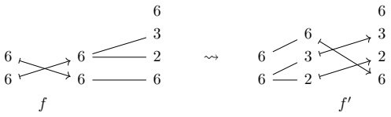

$$ \begin{array}{ccc}6&&\\6&\stackrel{\leftrightarrow}{\longleftrightarrow}&3\\3&\stackrel{\leftrightarrow}{\longleftrightarrow}&6\\2&\stackrel{\leftrightarrow}{\longleftrightarrow}&6\\6&\stackrel{\longleftrightarrow}{\longleftrightarrow}&12\\6&\stackrel{\leftrightarrow}{\longleftrightarrow}&12\\g&&&\end{array}\quad\leadsto\begin{array}{ccc}6&&\\6&\stackrel{\leftrightarrow}{\longleftrightarrow}&3\\3&\stackrel{\leftrightarrow}{\longleftrightarrow}&6\\2&\stackrel{\longleftrightarrow}{\longleftrightarrow}&2\\6&\stackrel{\leftrightarrow}{\longleftrightarrow}&6\\g^{\prime}&&&\end{array}$$

The morphisms  $ f' $ and  $ g' $ are composable, so we may form the composite

$$ \begin{array}{ccc}6&&\\6&\overbrace{3}&\overbrace{2}\\6&&\overbrace{f^{\prime}}\\6&&6\end{array}\xrightarrow{6}\begin{array}{ccc}3&&\\6&\overbrace{2}&\overbrace{6}\\\end{array}\quad\leadsto\quad\begin{array}{ccc}6&&\\6&\overbrace{2}&\overbrace{6}\\\end{array}\quad\begin{array}{ccc}3&&\\6&\overbrace{3}&\overbrace{2}\\\end{array}$$

and computing the encoded layout yields

$$ B\circ A=L_{g^{\prime}\circ f^{\prime}}=((2,3),6):((6,72),1).$$

The goal of this section is to formalize this computational process into an algorithm for computing the composite of tractable layouts A and B. As we saw in our example, the non-trivial steps in our computation were

1. finding a mutual refinement of certain (nested) tuples, and

2. using the mutual refinement to convert f and g into composable morphisms  $ f' $ and  $ g' $.

We dedicate the following two sections to the explication of these steps.

#### 4.1.1 Mutual refinements

Before giving a precise definition of mutual refinements using the categorical framework of Chapter 3, we give an informal overview. Consider the tuples  $ (6,6) $ and  $ (12,3,6) $ of our motivating example. We asserted that the diagram

$$ \begin{array}{l}6\\6\underline{\quad}2\\6\underline{\quad}6\quad12\end{array}\begin{array}{l}6\\3\quad6\\2\quad3\\6\quad12\end{array}$$

is a mutual refinement of  $ (6,6) $ and  $ (12,3,6) $. We can give a more precise description of this mutual refinement as follows. The left half of the diagram represents the refinement  $ (6,6) \leftarrow (6,(2,3)) $, and

the right half of the diagram represents the refinement  $ (6,2),3,6)\rightarrow(12,3,6) $:

$$ \begin{array}{ccc}6\xrightarrow{\quad}3&0&0\\6-2&\leftrightarrow&(6,6)\not\longleftarrow(6,(2,3))\\6-6&\end{array}$$

$$ \begin{array}{ccc}6&\swarrow&\\3&\swarrow&6\\2&\swarrow&3\\6&\swarrow&12\end{array}\qquad\leftrightarrow\qquad((6,2),3,6)\longrightarrow(12,3,6)$$

The fact that the two halves of the diagram may be glued together corresponds to the fact that the nested tuple  $ (6,\ (2,3)) $ divides  $ ((6,2),3,6) $, which we denote

$$ (6,(2,3))\xrightarrow{\quad}\left((6,2),3,6\right).$$

Putting these observations together, we may express our mutual refinement precisely as

$$ \begin{array}{ccc}6&&\\3&\swarrow&6\\6\xrightarrow{\quad}2&\swarrow&3\\6\xrightarrow{\quad}6&\swarrow&12\end{array}\quad\leftrightarrow\quad\begin{array}{c}(6,(2,3))\longmapsto((6,2),3,6)\\\downarrow\\\downarrow(6,6)\end{array}$$

where we opt to depict the refinements  $ (6,6) \leftarrow (6,(2,3)) $ and  $ ((6,2),3,6) \rightarrow (12,3,6) $ vertically. We can now give a precise definition of mutual refinements.

Definition 4.1.1.1. Suppose T and U are nested tuples. A mutual refinement of  $ (T, U) $ is a diagram of the form

$$ \begin{array}{l}T^{\prime}\longrightarrow U^{\prime}\\ \downarrow\\ \downarrow\\ T\end{array}$$

Explicitly, this is a pair of nested tuples  $ (T', U') $ such that

1.  $ T' $ refines T.

2.  $ U' $ refines U, and

3. $T'$ divides $U$.

Example 4.1.1.2. A mutual refinement of  $ T = (6,6) $ and  $ U = (2,6,3) $ is given by

$$ \begin{array}{c}(2,3),(2,3))\xrightarrow{\quad}(2,(3,2),3)\\\downarrow\\\downarrow\ 6,6)\quad(2,6,3)\end{array}$$

We depict this mutual refinement as follows.

$$ \begin{array}{l}6\underline{\quad}2\underline{\quad}3\\6\underline{\quad}2\underline{\quad}2\end{array}$$

Example 4.1.1.3. A mutual refinement of  $ T = (8, 8, 8) $ and  $ U = (2, 8, 8, 8) $ is given by

$$ \begin{array}{c}(2,4),(2,4),(2,4))\xrightarrow{\quad}(2,(4,2),(4,2),(4,2))\\\downarrow\\\downarrow\ 8,8,8)\quad(2,8,8,8)\end{array}$$

We depict this mutual refinement as follows.

$$ \begin{array}{c}2\\8\angle2\\8\angle2\\8\angle2\end{array}\begin{array}{c}\angle8\\8\\8\\8\angle2\end{array}$$

Example 4.1.1.4. A mutual refinement of  $ T = (4, 2, 2, 32) $ and  $ U = (32, 32) $ is given by

$$ \begin{array}{c}(4,2,2,(2,16))\longleftrightarrow((4,2,2,2),(16,2))\\\downarrow\\\downarrow\ 4,2,2,32)\quad(32,32)\end{array}$$

We depict this mutual refinement as follows.

$$ \begin{array}{c}2\\16\quad32\\32\quad2\\2\quad2\\2\quad2\\4\quad4\quad32\\\end{array}$$

Example 4.1.1.5. If  $ T = (8, 8) $ and  $ U = (3, 8, 8) $, then there does not exist a mutual refinement of T and U.

Observation 4.1.1.6. In each of the previous examples, we have considered mutual refinements of flat tuples  $ T $ and  $ U $. The definition of mutual refinement, however, allows  $ T $ and  $ U $ to be any nested tuples. In any case, restricting to the flat case is no loss of generality, because there is a one-to-one correspondence between mutual refinements of a pair of nested tuples  $ (T, U) $, and mutual refinements of their flattenings  $ (T^{\flat}, U^{\flat}) $ (see Lemma 3.2.5.20). In particular, there exists a mutual refinement of  $ (T, U) $ if and only if there exists a mutual refinement of  $ (T^{\flat}, U^{\flat}) $.

Having made the appropriate definitions, we provide an algorithm for computing a mutual refinement of  $ (T, U) $.

Algorithm 4.1.1: Mutual refinement algorithm

1 Input: Nested tuples T and U.

Algorithm 4.1.1 (continued): Mutual refinement algorithm

2 Output: A mutual refinement  $ (T', U') $ of  $ (T, U) $, if one exists, else None.

3  $ X \leftarrow T $;  $ Y \leftarrow U$
4  $ X', Y', X_{mode}, Y_{mode} \leftarrow ()$
5  $ i \leftarrow 1 $;  $ j \leftarrow 1$
6 while  $ i \leq len(X) $ and  $ j \leq len(Y) $ do
7 if  $ entry_i(X) = entry_j(Y) $ then
8 append  $ entry_i(X) $ to  $ X_{mode} $; append  $ X_{mode} $ to  $ X' $;  $ X_{mode} \leftarrow ()$
9 append  $ entry_j(Y) $ to  $ Y_{mode} $;
10 append  $ Y_{mode} $ to  $ Y' $;
11  $ Y_{mode} \leftarrow ()$
12  $ i \leftarrow i + 1 $;
13  $ j \leftarrow j + 1$
14 else if  $ entry_i(X) $ divides  $ entry_j(Y) $ then
15 append  $ entry_i(X) $ to  $ X_{mode} $;
16 append  $ X_{mode} $ to  $ X' $;
17  $ X_{mode} \leftarrow ()$
18 append  $ entry_i(X) $ to  $ Y_{mode}$
19  $ entry_j(Y) \leftarrow entry_j(Y)/entry_i(X) $;
20  $ i \leftarrow i + 1$
21 else if  $ entry_j(Y) $ divides  $ entry_i(X) $ then
22 append  $ entry_j(Y) $ to  $ X_{mode} $;
23 append  $ entry_j(Y) $ to  $ Y_{mode} $;
24 append  $ Y_{mode} $ to  $ Y' $;
25  $ Y_{mode} \leftarrow ()$
26  $ entry_i(X) \leftarrow entry_i(X)/entry_j(Y) $;
27  $ j \leftarrow j + 1$
28 else
29 return None
30 end if
31 end while
32 if  $ Y_{mode} \neq () $ then
33 append  $ entry_j(Y) $ to  $ Y_{mode} $;
34 append  $ Y_{mode} $ to  $ Y' $;
35  $ j \leftarrow j + 1$
36 end if
37 while  $ j < len(Y) $ do
38 append  $ entry_j(Y) $ to  $ Y' $;
39  $ j \leftarrow j + 1$
40 end while
41  $ T' \leftarrow (X')_{prof(T)} $;
42  $ U' \leftarrow (Y')_{prof(U)}$
43 return  $ (T', U')$

#### 4.1.2 From mutual refinements to composable morphisms

Recall that in order to compute the composition  $ B \circ A $ of

$$ A=(6,6):(6,1)and$$

$$ B=(12,3,6):(1,72,12),$$

we constructed tuple morphisms

$$ \begin{array}{ccc}6&&\\6\xrightarrow{}&6&\\f&&\end{array}\quad\begin{array}{c}6\\3\\12\\\hline g\end{array}\xrightarrow{3}$$

and a mutual refinement.

$$ \begin{array}{c}6\\3\\2\\6\underline{\quad}12\end{array}\begin{array}{c}6\\3\\3\\6\underline{\quad}12\end{array}$$

The next step in our computation is to use our mutual refinement to convert $f$ and $g$ into composable morphisms $f'$ and $g'$. Before giving a formal, categorical definition of this process, let's illustrate the process with an example.

We construct  $ f' $ from f and the left half of our mutual refinement:

$$ \begin{array}{c}6\\6\xrightarrow[f]{6}\xrightarrow{\quad3\quad}2\\\quad6\xrightarrow{\quad6\quad}6\end{array}\quad\rightsquigarrow\quad\begin{array}{c}6\\6\xrightarrow{\quad6\quad}3\\6\xrightarrow{\quad2\quad}6\\f^{\prime}\end{array}$$

This construction is made by making the replacement

$$ 6\stackrel{6}{\longrightarrow}_{6}\xrightarrow{\quad}\stackrel{\sim}{\quad}\quad6\xrightarrow{\quad}6\stackrel{6}{\longrightarrow}_{6}$$

and making the replacement

\[\overset{\frown}{6}\overset{\longrightarrow}{6}\overset{\frown}{2}\overset{\overset{\overset{3}{3}}{}}{\sim}\overset{\overset{\overset{3}{3}}{}}{\sim}\overset{\overset{\overset{3}{3}}{}}{\sim}\overset{\overset{\overset{\overset{6}{6}}{}}{\underset{\underset{\underset{\delta}{6}}{}}{}}}{6}\overset{\overset{\overset{\overset{\overset{\overset{\overset{\overset{\overset{\overset{\overset{\overset{\overset{\overset{\overset{\overset{\overset{\overset{\overset{\overset{\overset{\overset{\overset{\overset{\overset{\overset{\overset{\overset{\overset{\overset{\overset{\overset{\overset{\overset{\overset{\overset{\overset{\overset{\overset{\overset{\overset{\overset{\overset{\overset{\overset{\overset{\overset{\overset{\overset{\overset{\overset{\overset{\overset{\overset{\overset{\overset{\overset{\overset{\overset{\overset{\overset{\overset{\overset{\overset{\overset{\overset{\overset{\overset{\overset{\overset{\overset{\overset{\overset{\overset{\overset{\overset{\overset{\overset{\overset{\overset{\overset{\overset{\overset{\overset{\overset{\overset{\overset{\overset{\overset{\overset{\overset{\overset{\overset{\overset{\overset{\overset{\overset{\overset{\overset{\overset{\overset{\overset{\overset{\overset{\overset{\overset{\overset{\overset{\overset{\overset{\overset{\overset{\overset{\overset{\overset{\overset{\overset{\overset{\overset{\overset{\overset{\overset{\overset{\overset{\overset{\overset{\overset{\overset{\overset{\overset{\overset{\overset{\overset{\overset{\overset{\overset{\overset{\overset{\overset{\overset{\overset{\overset{\overset{\overset{\overset{\overset{\overset{\overset{\overset{\overset{\overset{\overset{\overset{\overset{\overset{\overset{\overset{\overset{\overset{\overset{\overset{\overset{\overset{\overset{\overset{\overset{\overset{\overset{\overset{\overset{\overset{\overset{\overset{\overset{\overset{\overset{\overset{\overset{\overset{\overset{\overset{\overset{\overset{\overset{\overset{\overset{\overset{\overset{\overset{\overset{\overset{\overset{\overset{\overset{\overset{\overset{\overset{\overset{\overset{\overset{\overset{\overset{\overset{\overset{\overset{\overset{\overset{\overset{\overset{\overset{\overset{\overset{\overset{\overset{\overset{\overset{\overset{\overset{\overset{\overset{\overset{\overset{\overset{\overset{\overset{\overset{\overset{\overset{\overset{\overset{\overset{\overset{\overset{\overset{\overset{\overset{\overset{\overset{\overset{\overset{\overset{\overset{\overset{\overset{\overset{\overset{\overset{\overset{\overset{\overset{\overset{\overset{\overset{\overset{\overset{\overset{\overset{\overset{\overset{\overset{\overset{\overset{\overset{\overset{\overset{\overset{\overset{\overset{\overset{\overset{\overset{\overset{\overset{\overset{\overset{\overset{\overset{\overset{\overset{\overset{\overset{\overset{\overset{\overset{\overset{\overset{\overset{\overset{\overset{\overset{\overset{\overset{\overset{\overset{\overset{\overset{\overset{\overset{\overset{\overset{\overset{\overset{\overset{\overset{\overset{\overset{\overset{\overset{\overset{\overset{\overset{\overset{\overset{\overset{\overset{\overset{\overset{\overset{\overset{\overset{\overset{\overset{\overset{\overset{\overset{\overset{\overset{\overset{\overset{\overset{\overset{\overset{\overset{\overset{\overset{\overset{\overset{\overset{\overset{\overset{\overset{\overset{\overset{\overset{\overset{\overset{\overset{\overset{\overset{\overset{\overset{\overset{\overset{\overset{\overset{\overset{\overset{\overset{\overset{\overset{\overset{\overset{\overset{\overset{\overset{\overset{\overset{\overset{\overset{\overset{\overset{\overset{\overset{\overset{\overset{\overset{\overset{\overset{\overset{\overset{\overset{\overset{\overset{\overset{\overset{\overset{\overset{\overset{\overset{\overset{\overset{\overset{\overset{\overset{\overset{\overset{\overset{\overset{\overset{\overset{\overset{\overset{\overset{\overset{\overset{\overset{\overset{\overset{\overset{\overset{\overset{\overset{\overset{\overset{\overset{\overset{\overset{\overset{\overset{\overset{\overset{\overset{\overset{\overset{\overset{\overset{\overset{\overset{\overset{\overset{\overset{\overset{\overset{\overset{\overset{\overset{\overset{\overset{\overset{\overset{\overset{\overset{\overset{\overset{\overset{\overset{\overset{\overset{\overset{\overset{\overset{\overset{\overset{\overset{\overset{\overset{\overset{\overset{\overset{\overset{\overset{\overset{\overset{\overset{\overset{\overset{\overset{\overset{\overset{\overset{\overset{\overset{\overset{\overset{\overset{\overset{\overset{\overset{\overset{\overset{\overset{\overset{\overset{\overset{\overset{\overset{\overset{\overset{\overset{\overset{\overset{\overset{\overset{\overset{\overset{\overset{\overset{\overset{\overset{\overset{\overset{\overset{\overset{\overset{\overset{\overset{\overset{\overset{\overset{\overset{\overset{\overset{\overset{\overset{\overset{\overset{\overset{\overset{\overset{\overset{\overset{\overset{\overset{\overset{\overset{\overset{\overset{\overset{\overset{\overset{\overset{\overset{\overset{\overset{\overset{\overset{\overset{\overset{\overset{\overset{\overset{\overset{\overset{\overset{\overset{\overset{\overset{\overset{\overset{\overset{\overset{\overset{\overset{\overset{\overset{\overset{\overset{\overset{\overset{\overset{\overset{\overset{\overset{\overset{\overset{\overset{\overset{\overset{\overset{\overset{\overset{\overset{\overset{\overset{\overset{\overset{\overset{\overset{\overset{\overset{\overset{\overset{\overset{\overset{\overset{\overset{\overset{\overset{\overset{\overset{\overset{\overset{\overset{\overset{\overset{\overset{\overset{\overset{\overset{\overset{\overset{\overset{\overset{\overset{\overset{\overset{\overset{\overset{\overset{\overset{\overset{\overset{\overset{\overset{\overset{\overset{\overset{\overset{\overset{\overset{\overset{\overset{\overset{\overset{\overset{\overset{\overset{\overset{\overset{\overset{\overset{\overset{\overset{\overset{\overset{\overset{\overset{\overset{\overset{\overset{\overset{\overset{\overset{\overset{\overset{\overset{\overset{\overset{\overset{\overset{\overset{\overset{\overset{\overset{\overset{\overset{\overset{\overset{\overset{\overset{\overset{\overset{\overset{\overset{\overset{\overset{\overset{\overset{\overset{\overset{\overset{\overset{\overset{\overset{\overset{\overset{\overset{\overset{\overset{\总括}}}}}}}}}}}}}}}}}}}}}}}}}}}}}}}}}}}}}}}}}}}}}}}}}}}}}}}}}}}}}}}}}}}}

More generally, we make the replacement

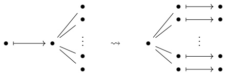

The process for constructing  $ g' $ from g, and the right half of our mutual refinement is similar.

$$ \begin{array}{ccc}6&&\\6&\stackrel{\leftrightarrow}{\longleftrightarrow}&3\\3&\stackrel{\leftrightarrow}{\longleftrightarrow}&6\\2&\stackrel{\leftrightarrow}{\longleftarrow}&3\\6&\stackrel{\longleftarrow}{12}&\longmapsto12\\g&&6\end{array}\quad\leadsto\begin{array}{ccc}6&&3\\3&\stackrel{\leftrightarrow}{\longleftrightarrow}&6\\2&\longmapsto2&6\\6&\longmapsto6&g^{\prime}\end{array}$$

This construction is made by making the replacements

$$ 6\ \operatorname{\longrightarrow}6\\longleftarrow\rightarrow6\quad\mathrm{\quad\sim}\quad6\\longleftarrow\rightarrow6$$

$$ 3\ \operatorname{\longrightarrow}31\longrightarrow3\quad \operatorname{\quad\sim\quad}\quad 3\ 1\longrightarrow3$$

$$ \begin{array}{r l r l r l}{{2}}&{\searrow}&&&&{\quad2\longmapsto2}\\ {6}&{\searrow-12\longmapsto12}&&{\quad\sim\quad}&&{6\longmapsto6}\end{array}$$

More generally, we make the replacement

\[\begin{array}{c} \text{●} \\ \downarrow

Having given an informal description of our procedure, we make things precise as follows.

Construction 4.1.2.1. Suppose  $ f: S \to T $ and  $ g: U \to V $ are nested tuple morphisms, and  $ (T', U') $ is a mutual refinement of  $ (T, U) $. Then we may use the pullback and pushforward constructions of section 3.2.5 to form the diagram:

$$ \begin{array}{ccc}S^{\prime}\xrightarrow{\tilde{f}}T^{\prime}\xrightarrow{i}&U^{\prime}\xrightarrow{\tilde{g}}V^{\prime}\\\downarrow\downarrow\downarrow&&\downarrow\\S\xrightarrow[f]{}T&U\xrightarrow[g]{}V\end{array}$$

If we set  $ f' = i \circ \tilde{f} $ and  $ g' = \tilde{g} $, then

$$ S^{\prime}\xrightarrow{\quad f^{\prime}\quad}U^{\prime}\xrightarrow{\quad g^{\prime}\quad}V^{\prime}$$

are composable nested tuple morphisms.

#### 4.1.3 The composition algorithm

Algorithm 4.1.2: Tractable layout Composition Algorithm

1 Input: Tractable layouts A and B.

Algorithm 4.1.2 (continued): Tractable layout Composition Algorithm

2 Output: A weak composite $C$ of $A$ and $B$, if one exists, else None..

3 Take the standard representations

$S \xrightarrow{f} T \quad U \xrightarrow{g} V$

of $A$ and coal($B$), respectively.

4 Use Algorithm 4.1.1 to produce a mutual refinement

$T' \xrightarrow{\downarrow} U'$

$T \xrightarrow{\downarrow} U$

of $(T, U)$. If there does not exist a mutual refinement of $(T, U)$, return None.

5 Use Construction 4.1.2.1 to obtain the composable nested tuple morphisms

$S' \xrightarrow{f'} U' \xrightarrow{g'} V'$

6 Compose $f'$ and $g'$, and compute the encoded layout

$C = L_{g' \circ f'}$

7 return $C$

Theorem 4.1.3.1. If A and B are tractable layouts, then the output C of the previous algorithm is a weak composite of A and B. Consequently,

$$ \boldsymbol{B}\circ\boldsymbol{A}=\operatorname{c o a l}(C,\operatorname{s h a p e}(A)).$$

Proof. Proposition 3.2.5.15 and tells us that

$$ \Phi_{L_{g^{\prime}}}=\Phi_{L_{g}}=\Phi_{\tt c o a l}(B)=\Phi_{B},$$

and Proposition 3.2.5.11 and Example 3.1.3.6 tell us that

$$ \Phi_{L_{f^{\prime}}}=\Phi_{L_{f}}=\Phi_{A}.$$

Theorem 3.2.6.21 then implies that

$$ \begin{align*}\Phi_{C}=\Phi_{L_{g^{\prime}}\circ f^{\prime}}&=\Phi_{g^{\prime}}\circ\Phi_{f^{\prime}}^{\mathsf{size}(U^{\prime})}\\&=\Phi_{B}\circ\Phi_{A}^{\mathsf{size}(B)}.\end{align*}$$

By construction, the shape $S'$ of $L_{f'}$ refines the shape $S$ of $A$, so we conclude that $C$ is a weak composite of $A$ and $B$.

#### 4.1.4 Examples

In this section we illustrate how Algorithm 4.1.3 may be used to compute the composition  $ B \circ A $ of tractable layouts A and B.

Example 4.1.4.1. Suppose  $ A = (4) : (1) $, and  $ B = (2, 2) : (2, 1) $.

1. Take the standard representations of A and  $ \operatorname{coal}(B) = B $.

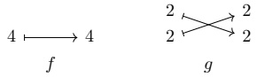

2. Apply Algorithm 4.1.1 to obtain the mutual refinement

$$ \begin{aligned}4\xlongequal{}&2\quad\begin{aligned}&2&-&2\\ &2&-&2\end{aligned}\end{aligned}$$

3. Form the diagram

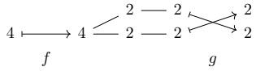

4. Resolve the diagram

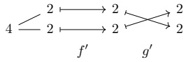

5. Compose $f'$ and $g'$ to obtain

$$ \begin{array}{r} \begin{array}{r} \angle4=\angle2 \\ \angle2=\angle2 \\ g^{\prime}\circ f^{\prime} \end{array} \end{array}$$

6. Compute the associated layout

$$ L_{g^{\prime}\circ f^{\prime}}=((2,2)):((2,1)).$$

7.  $ L_{g' \circ f'} $ is coalesced over (4), so

$$ B\circ A=\left((2,2)\right):\left((2,1)\right).$$

Example 4.1.4.2. Suppose  $ A = (6, 6) : (6, 1) $, and  $ B = (12, 3, 6) : (1, 72, 12) $.

1. Take the standard representations of A and  $ \operatorname{coal}(B) = B $.

$$ \begin{array}{ccc}6&&\\6\xrightarrow{}&6&\\f&&\end{array}\quad\begin{array}{c}6\\3\\12\\\hline g\end{array}\xrightarrow{3}$$

2. Apply Algorithm 4.1.1 to obtain the mutual refinement

$$ \begin{array}{l}\underline{6}\\\underline{3}\\\underline{2}\\\underline{6}\\\underline{12}\\\end{array}$$

3. Form the diagram

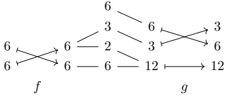

4. Resolve the diagram to obtain

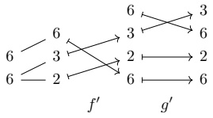

5. Compose  $ f' $ and  $ g' $ to obtain

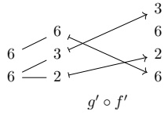

6. Compute the associated layout

$$ L_{g^{\prime}\circ f^{\prime}}=((2,3),6):((6,72),1).$$

7.  $ L_{g' \circ f'} $ is coalesced over (6,6), hence

$$ B\circ A=((2,3),6):((6,72),1).$$

Example 4.1.4.3. Suppose  $ A = (6, 6) : (5, 60) $, and  $ B = (10, 360) : (2, 60)$

1. Take the standard representations of A and  $ \operatorname{coal}(B) = B $.

$$ \begin{array}{c}6\\6\\6\\f\end{array}\quad\begin{array}{c}2\\6\\5\\6\end{array}\quad\begin{array}{c}360\\10\\g\end{array}\quad\begin{array}{c}360\\3\\10\\2\end{array}$$

2. Apply algorithm 4.1.1 to obtain the mutual refinement

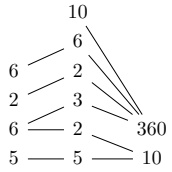

3. Form the diagram

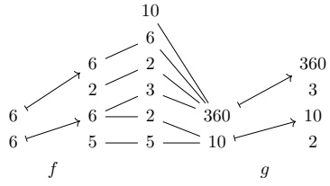

4. Resolve the diagram to obtain

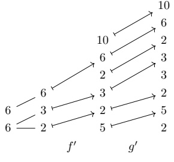

5. Compose  $ f' $ and  $ g' $ to obtain

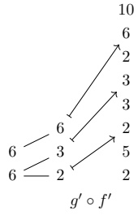

6. Compute the associated layout

$$ L_{g^{\prime}\circ f^{\prime}}=((2,3),6):((10,60),360).$$

7. The layout  $ L_{g' \circ f'} $ is coalesced over (6,6), so

$$ B\circ A=((2,3),6):((10,60),360).$$

# Appendix A

# An introduction to categories

Throughout this work, we freely use the language of categories which are mathematical objects which abstract the notion of morphisms and their composition. The purpose of this appendix is to provide a concise and user-friendly introduction to the basics of categories. In particular, we aim to the answer the following questions:

1. What is a category?

2. What is a functor?

Those capable of answering these questions with confidence, and with examples in mind, will be able to understand the most important concepts and constructions in the current work. For those interested in learning the more advanced concepts from category theory, such as natural transformations, adjunctions, and (co)limits, we recommend [1].

### A.1 What is a category?

We begin by addressing the first question. Before giving a definition, let's consider a motivating example. Suppose $X$ and $Y$ are sets. A function $f: X \to Y$ assigns to each element $x \in X$ some element $f(x) \in Y$. We refer to $X$ as the domain of $f$ and to $g$ as the codomain of $f$.

Example A.1.0.1. There is a function  $ f: \mathbb{Z} \to \mathbb{Z} $ given by

$$ f(x)=2x.$$

Example A.1.0.2. There is a function  $ g: \mathbb{Z} \to \text{Bool} $, where  $ \text{Bool} = \{\text{True}, \text{False}\} $, given by

$$ g(x)=\begin{cases}True&x is even,\\ False&x is odd.\end{cases}.$$

If $f: X \to Y$ and $g: Y \to Z$ are functions, then we can compose $f$ and $g$: The composite of $f$ and $g$ is the function $g \circ f: X \to Z$ given by

$$ (g\circ f)(x)=g(f(x)).$$

Example A.1.0.3. If  $ f $ and  $ g $ are the functions of Examples A.1.0.1 and A.1.0.2, then the composite  $ g \circ f : \mathbb{Z} \to \text{Bool} $ is given by

$$ (g\circ f)(x)=\operatorname{True}.$$

Composition of functions satisfies two essential properties. First, composition is associative: if f and g are composable, and g and h are composable, then

$$ h\circ(g\circ f)=(h\circ g)\circ f.$$

Second, every set $X$ has an identity function $\mathrm{id}_{X}: X \to X$ given by

$$ \mathrm{id}_{X}(x)=x.$$

If $f: X \to Y$ is any function, then precomposing with $\mathsf{id}_{X}$ or post-composing with $\mathsf{id}_{Y}$ leaves the function $f$ unchanged:

$$ f\circ\operatorname{id}_{X}=f=\operatorname{id}_{Y}\circ f.$$

In pure and applied mathematics, there are many instances where we have some collection of objects, and morphisms between those objects, which have the same formal behavior of sets and functions: morphisms can be composed in an associative fashion, and objects admit identity morphisms. While functions between sets are the prototypical example, the objects in a category need not be sets, and the morphisms in a category need not be functions. We will see many such examples later on. To capture this recurring structure, we define the notion of a category.

##### Definition A.1.0.4. A category C consists of

1. a collection of objects:

$$ \operatorname{ob}(\mathbf{C})=\{X,Y,Z,\ldots\}.$$

These objects may be sets, tuples, numbers, vector spaces, matrices, or some other mathematical structure, depending on the category  $ \mathbf{C} $.

2. a collection of morphisms between those objects:

$$ \operatorname{mor}(\mathbf{C})=\{f,g,h,\ldots\}.$$

Each morphism $f: X \to Y$ in $\mathbf{C}$ has a domain $X$ and a codomain $Y$, which are objects in $\mathbf{C}$.

3. a composition rule: If $f: X \to Y$ and $g: Y \to Z$ are morphisms in $\mathbf{C}$, then there is a morphism

$$ g\circ f:X\to Z$$

called the composite of f and g. Composition of morphisms in C is associative, in that

$$ h\circ(g\circ f)=(h\circ g)\circ f,$$

when defined.

4. identity morphisms: If $X$ is an object in $\mathbb{C}$, then there is a morphism

$$ id_{X}:X\to X$$

called the identity morphism on $X$. If $f: X \to Y$ is any morphism in $\mathbf{C}$, then

$$ f\circ\operatorname{id}_{X}=f=\operatorname{id}_{Y}\circ f.$$

Let's take a look at some important examples of categories. We begin with the motivating example.

Example A.1.0.5. There is a category Set whose objects are sets, and whose morphisms are functions. The composition of morphisms is given by functional composition:

$$ (g\circ f)(x)=g(f(x))$$

and the identity morphism on a set X is the identity function

$$ \mathrm{id}_{X}(x)=x.$$

Example A.1.0.6. There is a category  $ \mathbf{Vect} $ whose objects are the vector spaces  $ \mathbb{R}^n $ for  $ n \geq 0 $, and whose morphisms are matrices. Specifically, a morphism

$$ A:\mathbb{R}^{n}\to\mathbb{R}^{m}$$

in Vect is a  $ m \times n $ matrix A. Composition in Vect is given by taking matrix products:

$$ \boldsymbol{B}\circ\boldsymbol{A}=\boldsymbol{B}\boldsymbol{A},$$

and the identity morphism on  $ \mathbb{R}^n $ is the  $ n \times n $ matrix

$$ \operatorname{id}_{\mathbb{R}^{n}}=I_{n}=\begin{bmatrix}1&0&\cdots&0\\ 0&1&&\\ \vdots&&\ddots&\vdots\\ &&1&0\\ 0&&\cdots&0&1\end{bmatrix}.$$

Example A.1.0.7. There is a category  $ \text{Div} $ whose objects are integers  $ a \geq 1 $, and in which there is a unique morphism

$$ \mathrm{div}_{a}^{b}:a\to b$$

if a divides b. If a divides b and b divides c, then a divides c, which means that we have a well defined composition rule

$$ \operatorname{div}_{b}^{c}\circ\operatorname{div}_{a}^{b}=\operatorname{div}_{a}^{c},$$

and the identity morphism

$$ id_{a}=div^{a}_{a}$$

exists since every positive integer a divides itself.

In addition to the definition of a category, there are a few important categorical concepts that we need to understand. For instance, it is important to understand the notion of an isomorphism, which generalizes the notion of a bijection of sets.

Definition A.1.0.8. Suppose $\mathbf{C}$ is a category, and suppose $f: X \to Y$ is a morphism in $\mathbf{C}$. We say $f$ is an isomorphism if there exists a morphism $f^{-1}: Y \to X$ in $\mathbf{C}$ such that

1.  $ f^{-1} \circ f = \mathrm{id}_{X} $, and

2.  $ f \circ f^{-1} = id_{Y} $.

Example A.1.0.9. In the category $\mathbf{Set}$, an isomorphism is a bijection: a function $f: X \to Y$ such that for each $y \in Y$, there exists a unique $x \in X$ with $f(x) = y$. For example, the function $f: \mathbb{Z} \to \mathbb{Z}$ given by

$$ f(x)=x+10$$

is a bijection, with inverse  $ f^{-1} : \mathbb{Z} \to \mathbb{Z} $ given by

$$ f^{-1}(x)=x-10.$$

Example A.1.0.10. In the category Vect, an isomorphism is an invertible matrix. For example, the matrix

$$ \boldsymbol{A}=\begin{bmatrix}{{{3}}}&{{{2}}} \\{{{1}}}&{{{1}}}\end{bmatrix}$$

is invertible with inverse

$$ \boldsymbol{A}^{-1}=\begin{bmatrix}1&-2\\ -1&3\end{bmatrix}$$

since

$$ \boldsymbol{A}^{-1}\boldsymbol{A}=\begin{bmatrix}1&0\\ 0&1\end{bmatrix}=\boldsymbol{A}\boldsymbol{A}^{-1}$$

Example A.1.0.11. In the category Div, the only isomorphism are the identity morphisms

$$ \operatorname{id}_{a}=\operatorname{div}_{a}^{a}.$$

This is because if a divides b and b divides a, then a = b.

### A.2 What is a functor?

Next, we turn our attention to the second question.

Definition A.2.0.1. Suppose C and D are categories. A functor $F: \mathbf{C} \to \mathbf{D}$ consists of

1. for each object X in C, an object FX in D, and

2. for each morphism $f: X \to Y$ in $\mathbf{C}$, a morphism

$$ F f:F X\to F Y$$

in D,

satisfying the following properties:

1. $F$ is compatible with composition: If $f$ and $g$ are composable morphisms in $\mathbb{C}$, then

$$ F(g\circ f)=F g\circ F f.$$

2. F is compatible with identities: If X is an object in C, then

$$ Fid_{X}=id_{FX}.$$

Example A.2.0.2. There is a functor $F: \mathsf{Div} \to \mathsf{Set}$ defined as follows. On objects, $F$ is given by

$$ Fa=[0,a]=\{x\in\mathbb{R}\mid0\leq x\leq a\}.$$

and on morphisms, $F$ is given by

$$ \begin{array}{r}{F\operatorname{div}_{a}^{b}(x)=\frac{b}{a}\cdot x.}\end{array}$$

Let's verify that F is a functor.

1. F is compatible with composition: If a divides b and b divides c, then

$$ (F\operatorname{div}_{b}^{c}\circ F\operatorname{div}_{a}^{b})(x)=F\operatorname{div}_{b}^{c}(F\operatorname{div}_{a}^{b}(x))=\frac{c}{b}\cdot(\frac{b}{a}\cdot x)=\frac{c}{a}\cdot x=F\operatorname{div}_{a}^{c}(x).$$

2. $F$ is compatible with identities: If $a \geq 1$, then

$$ F\operatorname{id}_{a}(x)=F\operatorname{div}_{a}^{a}(x)=\frac{a}{a}\cdot x=\operatorname{id}_{F a}(x).$$

## Bibliography

[1] Saunders Mac Lane. Categories for the Working Mathematician. 2nd ed. Vol. 5. Graduate Texts in Mathematics. Springer, 1998. ISBN: 978-0-387-98403-0.

$