# Anatomy of High-Performance Matrix Multiplication

KAZUSHIGE GOTO and ROBERT A. VAN DE GEIJN

The University of Texas at Austin

We present the basic principles that underlie the high-performance implementation of the matrix-matrix multiplication that is part of the widely used GotoBLAS library. Design decisions are justified by successively refining a model of architectures with multilevel memories. A simple but effective algorithm for executing this operation results. Implementations on a broad selection of architectures are shown to achieve near-peak performance.

Categories and Subject Descriptors: G.4 [Mathematical Software]—Efficiency

General Terms: Algorithms, Performance

Additional Key Words and Phrases: Linear algebra, matrix multiplication, basic linear algebra subprograms

ACM Reference Format:

Goto, K. and van de Geijn, R. A. 2008. Anatomy of high-performance matrix multiplication. ACM Trans. Math. Softw. 34, 3, Article 12 (May 2008), 25 pages. DOI = 10.1145/1356052.1356053 http://doi.acm.org/10.1145/1356052.1356053

## 1. INTRODUCTION

Implementing matrix multiplication so that near-optimal performance is attained requires a thorough understanding of how the operation must be layered at the macro level in combination with careful engineering of high-performance kernels at the micro level. This paper primarily addresses the macro issues, namely how to exploit a high-performance inner-kernel, more so than the micro issues related to the design and engineering of that inner-kernel.

In Gunnels et al. [2001] a layered approach to the implementation of matrix multiplication was reported. The approach was shown to optimally amortize the required movement of data between two adjacent memory layers of an architecture with a complex multilevel memory. Like other work in the area [Agarwal et al. 1994; Whaley et al. 2001], Gunnels et al. [2001] casts computation in terms of an “inner-kernel” that computes $C:= \bar{A}B + C$ for some $m_c \times k_c$ matrix $\bar{A}$ that is stored contiguously in some packed format and fits in cache memory. Unfortunately, the model for the memory hierarchy that was used is unrealistic in at least two ways:

—It assumes that this inner-kernel computes with a matrix $\tilde{A}$ that resides in the level-1 (L1) cache.

—It ignores issues related to the Translation Look-aside Buffer (TLB).

The current article expands upon a related technical report [Goto and van de Geijn 2002], which makes the observations that

—The ratio between the rate at which floating-point operations (flops) can be performed by the floating-point unit(s) and the rate at which floating-point numbers can be streamed from the level-2 (L2) cache to registers is typically relatively small. This means that matrix $\tilde{A}$ can be streamed from the L2 cache.

—It is often the amount of data that can be addressed by the TLB that is the limiting factor for the size of $\tilde{A}$. (Similar TLB issues were discussed in Strazdins [1998].)

In addition, we now observe that

—There are in fact six inner-kernels that should be considered for building blocks for high-performance matrix multiplication. One of these is argued to be inherently superior over the others. (In Gunnel et al. [2001, 2005] three of these six kernels were identified.)

Careful consideration of all these observations underlie the implementation of the DGEMM Basic Linear Algebra Subprograms (BLAS) routine that is part of the widely used GotoBLAS library [Goto 2005].

In Figure 1 we preview the effectiveness of the techniques. In those graphs we report performance of our implementation as well as vendor implementations (Intel's MKL (8.1.1) and IBM's ESSL (4.2.0) libraries) and ATLAS [Whaley and Dongarra 1998] (3.7.11) on the Intel Pentium4 Prescott processor, the IBM Power 5 processor, and the Intel Itanium2 processor.¹ It should be noted that the vendor implementations have adopted techniques very similar to those described in this paper. It is important not to judge the performance of matrix-matrix multiplication in isolation. It is typically a building block for other operations like the level-3 BLAS (matrix-matrix operations) [Dongarra et al. 1990; Kägstström et al. 1998] and LAPACK [Anderson et al. 1999]. How

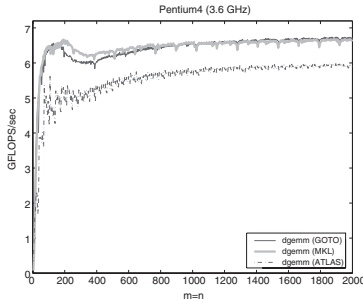

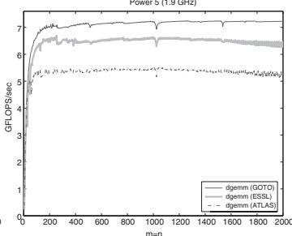

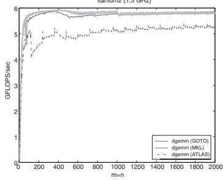

Fig. 1. Comparison of the matrix-matrix multiplication described in this paper with various other implementations. See Section 7 for details regarding the different architectures.
 

the techniques described in this article impact the implementation of level-3 BLAS is discussed in Goto and van de Geijn [2006].

This article attempts to describe the issues at a high level so as to make it accessible to a broad audience. Low level issues are introduced only as needed. In Section 2 we introduce notation that is used throughout the remainder of the article. In Section 3 a layered approach to implementing matrix multiplication is introduced. High-performance implementation of the inner-kernels is discussed in Section 4. Practical algorithms for the most commonly encountered cases of matrix multiplication are given in Section 5. In Section 6 we give further details that are used in practice to determine parameters that must be tuned in order to optimize performance. Performance results attained with highly tuned implementations on various architectures are given in Section 7. Concluding comments can be found in the final section.

## 2. NOTATION

The partitioning of matrices is fundamental to the description of matrix multiplication algorithms. Given an $m \times n$ matrix X, we will only consider

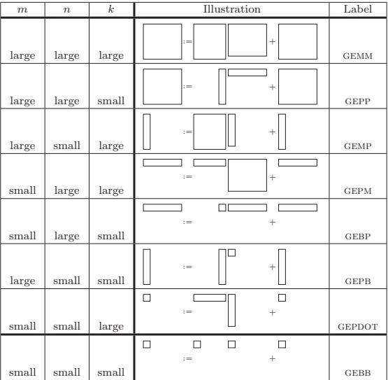

Fig. 2. Special shapes of GEMM $C:= AB + C$. Here $C, A$, and $B$ are $m \times n, m \times k$, and $k \times n$ matrices, respectively.
 

partitionings of X into blocks of columns and blocks of rows:

 $$\boldsymbol{X}=(\boldsymbol{X}_{0}|\boldsymbol{X}_{1}|\cdots|\boldsymbol{X}_{N-1})=\left(\frac{\check{\boldsymbol{X}}_{0}}{\check{\boldsymbol{X}}_{1}}\right)_{\cdots\cdots\check{\boldsymbol{X}}_{N-1}},$$

where $X_j$ has $n_b$ columns and $\tilde{X}_i$ has $m_b$ rows (except for $X_{N-1}$ and $\tilde{X}_{M-1}$, which may have fewer columns and rows, respectively).

The implementations of matrix multiplication will be composed from multiplications with submatrices. We have given these computations special names, as tabulated in Figures 2 and 3. We note that these special shapes are very frequently encountered as part of algorithms for other linear algebra operations. For example, computation of various operations supported by LAPACK is cast mostly in terms of GEPP, GEMP, and GEPM. Even given a single dense linear algebra operation, multiple algorithms often exist where each of the algorithms casts the computation in terms of these different cases of GEMM multiplication [Bientinesi et al.].

<table border=1 style='margin: auto; word-wrap: break-word;'><tr><td style='text-align: center; word-wrap: break-word;'>Letter</td><td style='text-align: center; word-wrap: break-word;'>Shape</td><td style='text-align: center; word-wrap: break-word;'>Description</td></tr><tr><td style='text-align: center; word-wrap: break-word;'>M</td><td style='text-align: center; word-wrap: break-word;'>Matrix</td><td style='text-align: center; word-wrap: break-word;'>Both dimensions are large or unknown.</td></tr><tr><td style='text-align: center; word-wrap: break-word;'>P</td><td style='text-align: center; word-wrap: break-word;'>Panel</td><td style='text-align: center; word-wrap: break-word;'>One of the dimensions is small.</td></tr><tr><td style='text-align: center; word-wrap: break-word;'>B</td><td style='text-align: center; word-wrap: break-word;'>Block</td><td style='text-align: center; word-wrap: break-word;'>Both dimensions are small.</td></tr></table>

Fig. 3. The labels in Figure 2 have the form GEXY where the letters chosen for x and y indicate the shapes of matrices A and B, respectively, according to the above table. The exception to this convention is the GEPDOT operation, which is a generalization of the dot product.
 

## 3. A LAYERED APPROACH TO GEMM

In Figure 4 we show how GEMM can be decomposed systematically into the special cases that were tabulated in Figure 2. The general GEMM can be decomposed into multiple calls to GEPP, GEMP, or GEPM. These themselves can be decomposed into multiple calls to GEBP, GEPB, or GEPDOT kernels. The idea now is that if these three lowest level kernels attain high performance, then so will the other cases of GEMM. In Figure 5 we relate the path through Figure 4 that always take the top branch to a triple-nested loop. In that figure C, A, and B are partitioned into submatrices as

 $$C=\left(\begin{array}{c c c}C_{11}&\cdots&C_{1N}\\ \vdots&&\vdots\\ C_{M1}&\cdots&C_{M N}\end{array}\right),A=\left(\begin{array}{c c c}A_{11}&\cdots&A_{1K}\\ \vdots&&\vdots\\ A_{M1}&\cdots&A_{M K}\end{array}\right),\mathrm{and}C=\left(\begin{array}{c c c}C_{11}&\cdots&C_{1N}\\ \vdots&&\vdots\\ C_{M1}&\cdots&C_{M N}\end{array}\right),$$

where $C_{ij} \in \mathbb{R}^{m_c \times n_r}$, $A_{ip} \in \mathbb{R}^{m_c \times k_c}$, and $B_{pj} \in \mathbb{R}^{k_c \times n_r}$. The block sizes $m_c$, $n_r$, and $k_c$ will be discussed in detail later in the paper.

A theory that supports an optimality claim regarding the general approach mentioned in this section can be found in Gunnels et al. [2001]. In particular, that paper supports the observation that computation should be cast in terms of the decision tree given in Figure 4 if data movement between memory layers is to be optimally amortized. However, the present article is self-contained, since, we show that the approach amortizes such overhead well and thus optimality is not crucial to our discussion.

## 4. HIGH-PERFORMANCE GEBP, GEPB, AND GEPDOT

We now discuss techniques for the high-performance implementation of GEBP, GEPB, and GEPDOT. We do so by first analyzing the cost of moving data between memory layers with an admittedly naive model of the memory hierarchy. In Section 4.2 we add more practical details to the model. This then sets the stage for algorithms for GEPP, GEMP, and GEPM in Section 5.

### 4.1 Basics

In Figure 6 (left) we depict a very simple model of a multilevel memory. One layer of cache memory is inserted between the Random-Access Memory (RAM) and the registers. The top-level issues related to the high-performance implementation of GEBP, GEPB, and GEPDOT can be described using this simplified architecture.

Let us first concentrate on $\mathrm{GEBP}$ with $A \in \mathbb{R}^{m_c \times k_c}$, $B \in \mathbb{R}^{k_c \times n}$, and $C \in \mathbb{R}^{m_c \times n}$. Partition

 $$B=(B_{0}|B_{1}|\cdots|B_{N-1})\quad and\quad C=(C_{0}|C_{1}|\cdots|C_{N-1})$$

ACM Transactions on Mathematical Software, Vol. 34, No. 3, Article 12, Publication date: May 2008.

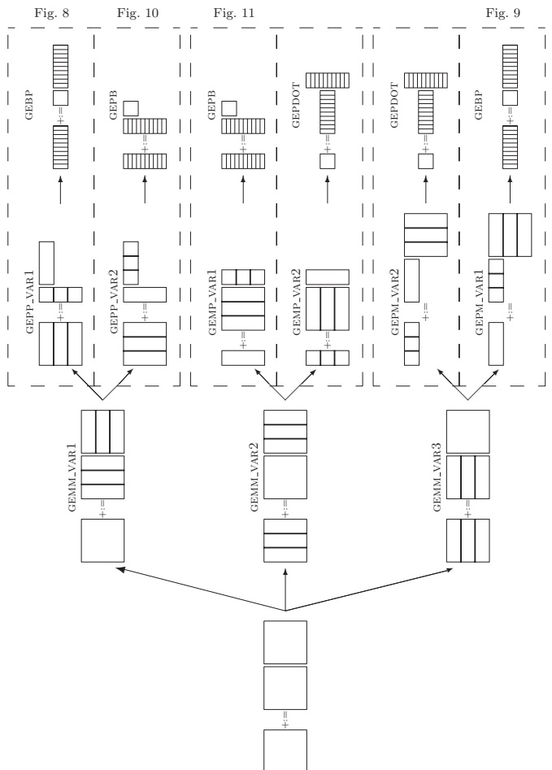

Fig. 4. Layered approach to implementing GEMM.
 

for p = 1: K

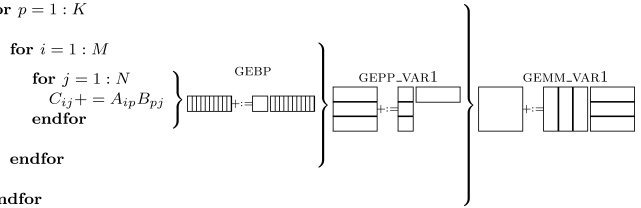

Fig. 5. The algorithm that corresponds to the path through Figure 4 that always takes the top branch expressed as a triple-nested loop.
 

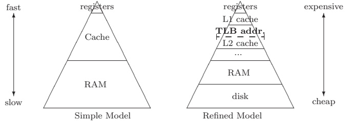

Fig. 6. The hierarchical memories viewed as a pyramid.
 

and assume that

Assumption (a). The dimensions $m_{c}$, $k_{c}$ are small enough so that A and $n_{r}$ columns from each of B and C ( $B_{j}$ and $C_{j}$, respectively) together fit in the cache.

Assumption (b). If $A$, $C_j$, and $B_j$ are in the cache then $C_j:= AB_j + C_j$ can be computed at the peak rate of the CPU.

Assumption (c). If A is in the cache it remains there until no longer needed.

Under these assumptions, the approach to GEBP in Figure 7 amortizes the cost of moving data between the main memory and the cache as follows. The total cost of updating $C$ is $m_c k_c + (2m_c + k_c)n$ memops for $2m_c k_c n$ flops. Then the ratio between computation and data movement is

 $$\frac{2m_{c}k_{c}n}{m_{c}k_{c}+(2m_{c}+k_{c})n}\frac{\mathrm{flops}}{\mathrm{memops}}\approx\frac{2m_{c}k_{c}n}{(2m_{c}+k_{c})n}\frac{\mathrm{flops}}{\mathrm{memops}}\quad\mathrm{when}k_{c}\ll n.$$

Thus

 $$\frac{2m_{c}k_{c}}{(2m_{c}+k_{c})}$$

should be maximized under the constraint that $m_{c}k_{c}$ floating-point numbers fill most of the cache, and the constraints in Assumptions (a)–(c). In practice there are other issues that influence the choice of $k_{c}$, as we will see in Section 6.3. However, the bottom line is that under the simplified assumptions A should

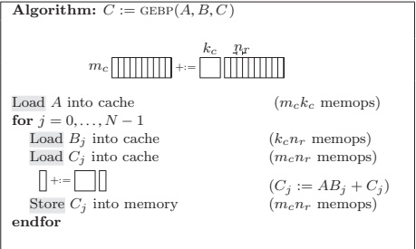

Fig. 7. Basic implementation of GEBP.
 

occupy as much of the cache as possible and should be roughly square, $^{2}$ while leaving room in the cache for at least $B_{j}$ and $C_{j}$. If $m_{c} = k_{c} \approx n/100$ then even if memops are 10 times slower than flops, the memops add only about 10% overhead to the computation.

The related operations GEPB and GEPDOT can be analyzed similarly by keeping in mind the following pictures:

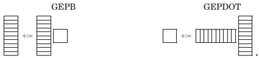

### 4.2 Refinements

In discussing practical considerations we will again focus on the high-performance implementation of GEBP. Throughout the remainder of the paper, we will assume that matrices are stored in column-major order.

4.2.1 Choosing the Cache Layer. A more accurate depiction of the memory hierarchy can be found in Figure 6(right). This picture recognizes that there are typically multiple levels of cache memory.

The first question is in which layer of cache the $m_c \times k_c$ matrix A should reside. Equation (2) tells us that (under Assumptions (a)–(c)) the larger $m_c \times n_c$, the better the cost of moving data between RAM and the cache is amortized over computation. This suggests loading matrix A in the cache layer that is farthest from the registers (can hold the most data) subject to the constraint that Assumptions (a)–(c) are (roughly) met.

The L1 cache inherently has the property that if it were used for storing A, $B_j$ and $C_j$, then Assumptions (a)–(c) are met. However, the L1 cache tends to be very small. Can A be stored in the L2 cache instead, allowing $m_c$ and $k_c$ to be

much larger? Let $R_{comp}$ and $R_{load}$ equal the rate at which the CPU can perform floating-point operations and the rate at which floating-point number can be streamed from the L2 cache to the registers, respectively. Assume A resides in the L2 cache and $B_j$ and $C_j$ reside in the L1 cache. Assume further that there is “sufficient bandwidth” between the L1 cache and the registers, so that loading elements of $B_j$ and $C_j$ into the registers is not an issue. Computing $AB_j + C_j$ requires $2m_c k_c n_r$ flops and $m_c k_c$ elements of A to be loaded from the L2 cache to registers. To overlap the loading of elements of A into the registers with computation $2n_r / R_{comp} \geq 1 / R_{load}$ must hold, or

 $$n_{r}\geq\frac{R_{comp}}{2R_{load}}.$$

4.2.2 TLB Considerations. A second architectural consideration relates to the page management system. For our discussion it suffices to consider that a typical modern architecture uses virtual memory so that the size of usable memory is not constrained by the size of the physical memory: Memory is partitioned into pages of some (often fixed) prescribed size. A table, referred to as the page table, maps virtual addresses to physical addresses and keeps track of whether a page is in memory or on disk. The problem is that this table itself is stored in memory, which adds additional memory access costs to perform virtual to physical translations. To overcome this, a smaller table, the Translation Look-aside Buffer (TLB), that stores information about the most recently used pages, is kept. Whenever a virtual address is found in the TLB, the translation is fast. Whenever it is not found (a TLB miss occurs), the page table is consulted and the resulting entry is moved from the page table to the TLB. In other words, the TLB is a cache for the page table. More recently, a level 2 TLB has been introduced into some architectures for reasons similar to those that motivated the introduction of an L2 cache.

The most significant difference between a cache miss and a TLB miss is that a cache miss does not necessarily stall the CPU. A small number of cache misses can be tolerated by using algorithmic prefetching techniques as long as the data can be read fast enough from the memory where it does exist and arrives at the CPU by the time it is needed for computation. A TLB miss, by contrast, causes the CPU to stall until the TLB has been updated with the new address. In other words, prefetching can mask a cache miss but not a TLB miss.

The existence of the TLB means that additional assumptions must be met:

Assumption (d). The dimensions $m_c$, $k_c$ are small enough so that $A$, $n_r$ columns from $B(B_j)$ and $n_r$ column from $C(C_j)$ are simultaneously addressable by the TLB so that during the computation $C_j:= AB_j + C_j$ no TLB misses occur.

Assumption (e). If A is addressed by the TLB, it remains so until no longer needed.

4.2.3 Packing. The fundamental problem now is that A is typically a sub-matrix of a larger matrix, and therefore is not contiguous in memory. This in turn means that addressing it requires many more than the minimal number

of TLB entries. The solution is to pack A in a contiguous work array, $\tilde{A}$. Parameters $m_c$ and $k_c$ are then chosen so that $\tilde{A}, B_j$, and $C_j$ all fit in the L2 cache and are addressable by the TLB.

Case 1. The TLB is the limiting factor. Let us assume that there are T TLB entries available, and let $T_{\tilde{A}}$, $T_{B_j}$, and $T_{C_j}$ equal the number of TLB entries devoted to $\tilde{A}$, $B_j$, and $C_j$, respectively. Then

 $$T_{\bar{A}}+2(T_{B_{j}}+T_{C_{j}})\leq T.$$

The reason for the factor two is that when the next blocks of columns $B_{j+1}$ and $C_{j+1}$ are first addressed, the TLB entries that address them should replace those that were used for $B_j$ and $C_j$. However, upon completion of $C_j:= \tilde{A}B_j + C_j$ some TLB entries related to $\tilde{A}$ will be the least recently used, and will likely be replaced by those that address $B_{j+1}$ and $C_{j+1}$. The factor two allows entries related to $B_j$ and $C_j$ to coexist with those for $\tilde{A}$, $B_{j+1}$ and $C_{j+1}$ and by the time $B_{j+2}$ and $C_{j+2}$ are first addressed, it will be the entries related to $B_j$ and $C_j$ that will be least recently used and therefore replaced.

The packing of A into $\bar{A}$, if done carefully, needs not to create a substantial overhead beyond what is already exposed from the loading of A into the L2 cache and TLB. The reason is as follows: The packing can be arranged so that upon completion $\bar{A}$ resides in the L2 cache and is addressed by the TLB, ready for subsequent computation. The cost of accessing A to make this happen need not be substantially greater than the cost of moving A into the L2 cache, which is what would have been necessary even if A were not packed.

Operation GEBP is executed in the context of GEPP or GEPM. In the former case, the matrix $B$ is reused for many separate GEBP calls. This means it is typically worthwhile to copy $B$ into a contiguous work array,$\tilde{B}$, as well so that $T_{\tilde{B}_j}$ is reduced when $C:= \tilde{A}\tilde{B} + C$ is computed.

Case 2. The size of the L2 cache is the limiting factor. A similar argument can be made for this case. Since the limiting factor is more typically the amount of memory that the TLB can address (e.g., the TLB on a current generation Pentium4 can address about 256Kbytes while the L2 cache can hold 2Mbytes), we do not elaborate on the details.

4.2.4 Accessing Data Contiguously. In order to move data most efficiently to the registers, it is important to organize the computation so that, as much as practical, data that is consecutive in memory is used in consecutive operations. One way to accomplish this is to not just pack A into work array $\tilde{A}$, but to arrange it carefully. We comment on this in Section 6.

From here on in this article, “Pack A into $\tilde{A}$” and “ $C:= \tilde{A}B + C$” will denote any packing that makes it possible to compute $C:= AB + C$ while accessing the data consecutively, as much as needed. Similarly, “Pack B into $\tilde{B}$” will denote a copying of $B$ into a contiguous format.

4.2.5 Implementation of GEPB and GEPDOT. Analyses of implementations of GEPB and GEPDOT can be similarly refined.

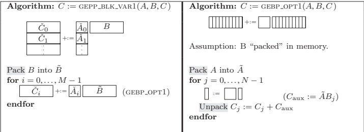

Fig. 8. Optimized implementation of GEPP (left) via calls to GEPB_OPT1 (right).
 

## 5. PRACTICAL ALGORITHMS

Having analyzed the approaches at a relatively coarse level of detail, we now discuss practical algorithms for all six options in Figure 4 while exposing additional architectural considerations.

### 5.1 Implementing GEPP with GEBP

The observations in Sections 4.2.1–4.2.4 are now summarized for the implementations of GEPP in terms of GEBP in Figure 8. The packing and computation are arranged to maximize the size of $\tilde{A}$: by packing $B$ into $\tilde{B}$ in GEPP_VAR1, $B_j$ typically requires only one TLB entry. A second TLB entry is needed to bring in $B_{j+1}$. The use of $C_{aux}$ means that only one TLB entry is needed for that buffer, as well as up to $n_r$ TLB entries for $C_j$ ( $n_r$ if the leading dimension of $C_j$ is large). Thus, $T_{\tilde{A}}$ is bounded by $T - (n_r + 3)$. The fact that $C_j$ is not contiguous in memory is not much of a concern, since that data is not reused as part of the computation of the GEPP operation.

Once $B$ and $A$ have been copied into $\tilde{B}$ and $\tilde{A}$, respectively, the loop in $GEBP\_OPT1$ can execute at almost the peak of the floating-point unit.

—The packing of $B$ is a memory-to-memory copy. Its cost is proportional to $k_c \times n$ and is amortized over $2m \times n \times k_c$ so that $O(m)$ computations will be performed for every copied item. This packing operation disrupts the previous contents of the TLB.

—The packing of $A$ to $\tilde{A}$ rearranges this data from memory to a buffer that will likely remain in the L2 cache and leaves the TLB loaded with useful entries, if carefully orchestrated. Its cost is proportional to $m_c \times k_c$ and is amortized over $2m_c \times k_c \times n$ computation so that $O(n)$ computations will be performed for every copied item. In practice, this copy is typically less expensive.

This approach is appropriate for GEMM if m and n are both large, and k is not too small.

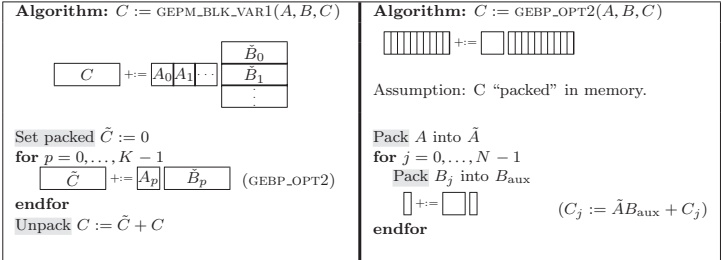

Fig. 9. Optimized implementation of GEPM (left) via calls to GEBP_OPT2 (right).
 

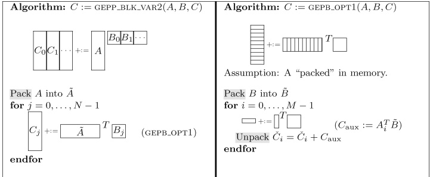

Fig. 10. Optimized implementation of GEMP (left) via calls to GEPB_OPT1 (right).
 

### 5.2 Implementing GEPM with GEBP

In Figure 9 a similar strategy is proposed for implementing GEPM in terms of GEPB. This time $C$ is repeatedly updated so that it is worthwhile to accumulate $\tilde{C} = AB$ before adding the result to $C$. There is no reuse of $\tilde{B}_p$ and therefore it is not packed. Now at most $n_r$ TLB entries are needed for $B_j$, and one each for $B_{\text{temp}}$, $C_j$ and $C_{j+1}$ so that again $T_A$ is bounded by $T - (n_r + 3)$.

### 5.3 Implementing GEPP with GEPB

Figure 10 shows how GEPP can be implemented in terms of GEPB. Now A is packed and transposed by GEPP to improve contiguous access to its elements. In GEPB B is packed and kept in the L2 cache, so that it is $T_{\bar{B}}$ that we wish to maximize. While $A_i$, $A_{i+1}$, and $C_{\text{aux}}$ each typically only require one TLB entry, $\tilde{C}_i$ requires $n_c$ if the leading dimension of C is large. Thus, $T_{\bar{B}}$ is bounded by $T - (n_c + 3)$.

### 5.4 Implementing GEMP with GEPB

In Figure 11 shows how GEMP can be implemented in terms of GEPB. This time a temporary $\tilde{C}$ is used to accumulate $\tilde{C} = (AB)^T$ and the L2 cache is mostly filled

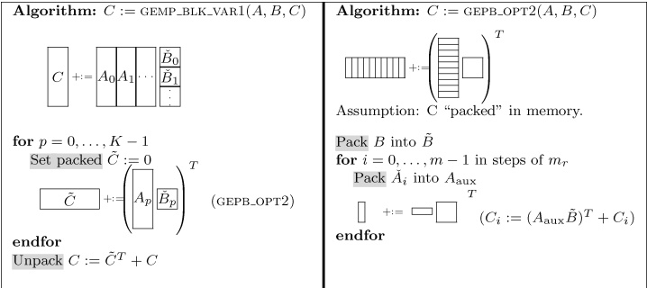

Fig. 11. Optimized implementation of GEPM (left) via calls to GEBP_OPT2 (right).
 

with a packed copy of $\tilde{B}$. Again, it is $T_{\tilde{B}}$ that we wish to maximize. While $C_i$, $C_{i+1}$, and $A_{\text{temp}}$ each take up one TLB entry, $\tilde{A}_i$ requires up to $m_c$ entries. Thus, $T_{\tilde{B}}$ is bounded by $T - (m_c + 3)$.

### 5.5 Implementing GEPM and GEMP with GEPDOT

Similarly, GEPM and GEMP can be implemented in terms of the GEPDOT operation. This places a block of C in the L2 cache and updates it by multiplying a few columns of A times a few rows of B. Since we will argue below that this approach is likely inferior, we do not give details here.

### 5.6 Discussion

Figure 4 suggests six different strategies for implementing a GEMM operation. Details for four of these options are given in Figures 8–11. We now argue that if matrices are stored in column-major order, then the approach in Figure 8, which corresponds to the path in Figure 4 that always takes the top branch in the decision tree and is also given in Figure 5, can in practice likely attain the best performance.

Our first concern is to attain the best possible bandwidth use from the L2 cache. Note that a GEPDOT-based implementation places a block of C in the L2 cache and reads and writes each of its elements as a few columns and rows of A and B are streamed from memory. This requires twice the bandwidth between the L2 cache and registers as do the GEBP and GEPPbased algorithms. Thus, we expect GEPDOT-based implementations to achieve worse performance than the other four options.

Comparing the pair of algorithms in Figures 8 and 9 the primary difference is that the former packs B and streams elements of C from and to main memory, while the latter streams B from main memory, computes C in a temporary buffer, and finally unpacks by adding this temporary result to C. In practice, the algorithm in Figure 8 can hide the cost of bringing elements of C from and to memory with computation while it exposes the packing of B as sheer

overhead. The algorithm in Figure 9 can hide the cost of bringing elements of B from memory, but exposes the cost of unpacking C as sheer overhead. The unpacking of C is a more complex operation and can therefore be expected to be more expensive than the packing of B, making the algorithm in Figure 8 preferable over the one in Figure 9. A similar argument can be used to rank the algorithm in Figure 10 over the one in Figure 11.

This leaves us with having to choose between the algorithms in Figures 8 and 10, which on the surface appear to be symmetric in the sense that the roles of A and B are reversed. Note that the algorithms access C a few columns and rows at a time, respectively. If the matrices are stored in column-major order, then it is preferable to access a block of those matrices by columns. Thus the algorithm in Figure 8 can be expected to be superior to all the other presented options.

Due to the level of effort that is required to implement kernels like GEBP, GEPB, and GEPDOT, we focus on the algorithm in Figure 8 throughout the remainder of this article.

We stress that the conclusions in this subsection are continguent on the observation that on essentially all current processors there is an advantage to blocking for the L2 cache. It is entirely possible that the insights will change if, for example, blocking for the L1 cache is preferred.

## 6. MORE DETAILS YET

We now give some final insights into how registers are used by kernels like GBEP_OPT1, after which we comment on how parameters are chosen in practice.

Since it has been argued that the algorithm in Figure 8 will likely attain the best performance, we focus on that algorithm:

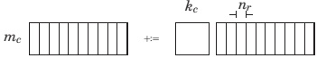

### 6.1 Register Blocking

Consider $C_{\text{aux}}:= \tilde{A} B_j$ in Figure 8, where $\tilde{A}$ and $B_j$ are in the L2 and L1 caches, respectively. This operation is implemented by computing $m_r \times n_r$ submatrices of $C_{\text{aux}}$ in the registers.

 $$k_{c}\quad n_{r}$$

 $$\begin{array}{l l l } m_{7}\underline{\bot}&\vdots&\\ \vdots&\vdots&\\ \vdots&\vdots&\end{array}$$

Notice that this means that during the computation of $C_j$ it is not necessary that elements of that submatrix remain in the L1 or even the L2 cache:$2m_r n_r k_c$ flops are performed for the $m_r n_r$ memops that are needed to store the results from the registers to whatever memory layer. We will see that $k_c$ is chosen to be relatively large.

This figure allows us to discuss the packing of A into $\tilde{A}$ in more detail. In our implementation, $\tilde{A}$ is stored so that each $m_r \times k_c$ submatrix is stored contiguously in memory. Each such submatrix is itself stored in column-major order. This allows $C_{\text{aux}}:= \tilde{A}B_j$ to be computed while accessing the elements of $\tilde{A}$ by

striding strictly contiguously through memory. Implementations by others will often store $\tilde{A}$ as the transpose of A, which requires a slightly more complex pattern when accessing $\tilde{A}$.

### 6.2 Choosing $m_r \times n_r$

The following considerations affect the choice of $m_r \times n_r$:

—Typically half the available registers are used for the storing $m_r \times n_r$ submatrix of C. This leaves the remaining registers for prefetching elements of $\tilde{A}$ and $\tilde{B}$.

—It can be shown that amortizing the cost of loading the registers is optimal when $m_{r} \approx n_{r}$.

—As mentioned in Section 4.2.1, the fetching of an element of $\tilde{A}$ from the L2 cache into registers must take no longer than the computation with a previous element so that ideally $n_r \geq R_{\text{comp}}/(2R_{\text{load}})$ must hold. $R_{\text{comp}}$ and $R_{\text{load}}$ can be found under “flops/cycle” and “Sustained Bandwidth”, respectively, in Figure 12.

A shortage of registers will limit the performance that can be attained by GEBP_OPT1, since it will impair the ability to hide constraints related to the bandwidth to the L2 cache.

### 6.3 Choosing $k_{c}$

To amortize the cost of updating $m_r \times n_r$ elements of $C_j$ the parameter $k_c$ should be picked to be as large as possible.

The choice of $k_{c}$ is limited by the following considerations:

—Elements from $B_j$ are reused many times, and therefore must remain in the L1 cache. In addition, the set associativity and cache replacement policy further limit how much of the L1 cache can be occupied by $B_j$. In practice, $k_c n_r$ floating-point numbers should occupy less than half of the L1 cache so that elements of $\tilde{A}$ and $C_{\text{aux}}$ do not evict elements of $B_j$.

—The footprint of $\tilde{A}$ ( $m_c \times k_c$ floating-point numbers) should occupy a considerable fraction of the L2 cache.

In our experience the optimal choice is such that $k_{c}$ double precision floating-point numbers occupy half of a page. This choice typically satisfies the other constraints as well as other architectural constraints that go beyond the scope of this article.

### 6.4 Choosing $m_{c}$

It was already argued that $m_c \times k_c$ matrix $\tilde{A}$ should fill a considerable part of the smaller of (1) the memory addressable by the TLB and (2) the L2 cache. In fact, this is further constrained by the set-associativity and replacement policy of the L2 cache. In practice, $m_c$ is typically chosen so that $\tilde{A}$ only occupies about half of the smaller of (1) and (2).

## 7. EXPERIMENTS

In this section we report performance attained by implementations of the DGEMM BLAS routine using the techniques described in the earlier sections. It is not the purpose of this section to show that our implementations attain better performance than those provided by vendors and other projects. (We do note, however, that they are highly competitive.) Rather, we attempt to demonstrate that the theoretical insights translate to practical implementations.

### 7.1 Algorithm Chosen

Implementing all algorithms discussed in Section 5 on a cross-section of architectures would be a formidable task. Since it was argued that the approach in Figure 8 is likely to yield the best overall performance, it is that variant which was implemented. The GEEP-opt1 algorithm was carefully assembly-coded for each of the architectures that were considered. The routines for packing A and B into $\bar{A}$ and $\bar{B}$, respectively, were coded in C, since compilers appear to be capable of optimizing these operations.

### 7.2 Parameters

In Figure 12 we report the physical and algorithmic parameters for a cross-section of architectures. Not all the parameters are taken into account in the analysis in this paper. These are given for completeness.

The following parameters require extra comments.

Duplicate. This parameter indicates whether elements of matrix B are duplicated as part of the packing of B. This is necessary in order to take advantage of SSE2 instructions on the Pentium4 (Northwood) and Opteron processors. Although the Core 2 Woodcrest has an SSE3 instruction set, instructions for duplication are issued by the multiply unit and the same techniques as for the Northwood architecture must be employed.

Sustained Bandwidth. This is the observed sustained bandwidth, in doubles/cycle, from the indicated memory layer to the registers.

Covered Area. This is the size of the memory that can be addressed by the TLB. Some architectures have a (much slower) level 2 TLB that serves the same function relative to an L1 TLB as does an L2 cache relative to an L1 cache. Whether to limit the size of $\tilde{A}$ by the number of entries in L1 TLB or L2 TLB depends on the cost of packing into $\tilde{A}$ and $\tilde{B}$.

 $\tilde{A}$ (Kbytes). This indicates how much memory is set aside for matrix  $\tilde{A}$.

### 7.3 Focus on the Intel Pentium 4 Prescott Processor (3.6 GHz, 64bit)

We discuss the implementation for the Intel Pentium 4 Prescott processor in greater detail. In Section 7.4 we more briefly discuss implementations on a few other architectures.

Equation (3) indicates that in order to hide the prefetching of elements of $\tilde{A}$ with computation parameter $n_r$ must be chosen so that $n_r \geq R_{\text{comp}}/(2R_{\text{load}})$. Thus, for this architecture, $n_r \geq 2/(2 \times 1.03) \approx 0.97$. Also, EM64T architectures,

<table border=1 style='margin: auto; word-wrap: break-word;'><tr><td colspan="2">Architecture</td><td rowspan="2">Core</td><td rowspan="2"># of registers</td><td rowspan="2">flops/cycle</td><td rowspan="2">Duplicate</td><td colspan="3">L1 cache</td><td colspan="4">L2 cache</td><td colspan="4">L3 cache</td><td colspan="4">TLB</td><td colspan="4">Block sizes</td><td style='text-align: center; word-wrap: break-word;'></td></tr><tr><td colspan="2">Sub Architecture</td><td style='text-align: center; word-wrap: break-word;'>Size (Kbytes)</td><td style='text-align: center; word-wrap: break-word;'>Line Size</td><td style='text-align: center; word-wrap: break-word;'>Associativity</td><td style='text-align: center; word-wrap: break-word;'>Sustained Bandwidth</td><td style='text-align: center; word-wrap: break-word;'>Size (Kbytes)</td><td style='text-align: center; word-wrap: break-word;'>Line Size</td><td style='text-align: center; word-wrap: break-word;'>Associativity</td><td style='text-align: center; word-wrap: break-word;'>Sustained Bandwidth</td><td style='text-align: center; word-wrap: break-word;'>Size (Kbytes)</td><td style='text-align: center; word-wrap: break-word;'>Line Size</td><td style='text-align: center; word-wrap: break-word;'>Associativity</td><td style='text-align: center; word-wrap: break-word;'>Sustained Bandwidth</td><td style='text-align: center; word-wrap: break-word;'>Size (Kbytes)</td><td style='text-align: center; word-wrap: break-word;'>L1 TLB</td><td style='text-align: center; word-wrap: break-word;'>L2 TLB</td><td style='text-align: center; word-wrap: break-word;'>Covered Area (Kbytes)</td><td style='text-align: center; word-wrap: break-word;'>$\bar{A}$ (Kbytes)</td><td style='text-align: center; word-wrap: break-word;'>$m_c \times k_c$</td><td style='text-align: center; word-wrap: break-word;'>$m_r \times n_r$</td><td style='text-align: center; word-wrap: break-word;'></td></tr><tr><td colspan="25">x86</td><td style='text-align: center; word-wrap: break-word;'></td></tr><tr><td colspan="2">Pentium3</td><td style='text-align: center; word-wrap: break-word;'>Katmai</td><td style='text-align: center; word-wrap: break-word;'>8</td><td style='text-align: center; word-wrap: break-word;'>1</td><td style='text-align: center; word-wrap: break-word;'>N</td><td style='text-align: center; word-wrap: break-word;'>16</td><td style='text-align: center; word-wrap: break-word;'>32</td><td style='text-align: center; word-wrap: break-word;'>4</td><td style='text-align: center; word-wrap: break-word;'>0.95</td><td style='text-align: center; word-wrap: break-word;'>512</td><td style='text-align: center; word-wrap: break-word;'>32</td><td style='text-align: center; word-wrap: break-word;'>4</td><td style='text-align: center; word-wrap: break-word;'>0.40</td><td style='text-align: center; word-wrap: break-word;'></td><td style='text-align: center; word-wrap: break-word;'></td><td style='text-align: center; word-wrap: break-word;'></td><td style='text-align: center; word-wrap: break-word;'></td><td style='text-align: center; word-wrap: break-word;'>4</td><td style='text-align: center; word-wrap: break-word;'>64</td><td style='text-align: center; word-wrap: break-word;'>-</td><td style='text-align: center; word-wrap: break-word;'>256</td><td style='text-align: center; word-wrap: break-word;'></td><td style='text-align: center; word-wrap: break-word;'>64 $\times$ 256</td><td style='text-align: center; word-wrap: break-word;'>2 $\times$ 2</td><td style='text-align: center; word-wrap: break-word;'></td></tr><tr><td colspan="2"></td><td style='text-align: center; word-wrap: break-word;'>Coppermine</td><td style='text-align: center; word-wrap: break-word;'>8</td><td style='text-align: center; word-wrap: break-word;'>1</td><td style='text-align: center; word-wrap: break-word;'>N</td><td style='text-align: center; word-wrap: break-word;'>16</td><td style='text-align: center; word-wrap: break-word;'>32</td><td style='text-align: center; word-wrap: break-word;'>4</td><td style='text-align: center; word-wrap: break-word;'>0.95</td><td style='text-align: center; word-wrap: break-word;'>256</td><td style='text-align: center; word-wrap: break-word;'>32</td><td style='text-align: center; word-wrap: break-word;'>4</td><td style='text-align: center; word-wrap: break-word;'>0.53</td><td style='text-align: center; word-wrap: break-word;'></td><td style='text-align: center; word-wrap: break-word;'></td><td style='text-align: center; word-wrap: break-word;'></td><td style='text-align: center; word-wrap: break-word;'></td><td style='text-align: center; word-wrap: break-word;'>4</td><td style='text-align: center; word-wrap: break-word;'>64</td><td style='text-align: center; word-wrap: break-word;'>-</td><td style='text-align: center; word-wrap: break-word;'>256</td><td style='text-align: center; word-wrap: break-word;'></td><td style='text-align: center; word-wrap: break-word;'>64 $\times$ 256</td><td style='text-align: center; word-wrap: break-word;'>2 $\times$ 2</td><td style='text-align: center; word-wrap: break-word;'></td></tr><tr><td colspan="2">Pentium4</td><td style='text-align: center; word-wrap: break-word;'>Northwood</td><td style='text-align: center; word-wrap: break-word;'>$8^1$</td><td style='text-align: center; word-wrap: break-word;'>2</td><td style='text-align: center; word-wrap: break-word;'>Y</td><td style='text-align: center; word-wrap: break-word;'>8</td><td style='text-align: center; word-wrap: break-word;'>64</td><td style='text-align: center; word-wrap: break-word;'>4</td><td style='text-align: center; word-wrap: break-word;'>1.88</td><td style='text-align: center; word-wrap: break-word;'>512</td><td style='text-align: center; word-wrap: break-word;'>64</td><td style='text-align: center; word-wrap: break-word;'>8</td><td style='text-align: center; word-wrap: break-word;'>1.06</td><td style='text-align: center; word-wrap: break-word;'></td><td style='text-align: center; word-wrap: break-word;'></td><td style='text-align: center; word-wrap: break-word;'></td><td style='text-align: center; word-wrap: break-word;'></td><td style='text-align: center; word-wrap: break-word;'>4</td><td style='text-align: center; word-wrap: break-word;'>64</td><td style='text-align: center; word-wrap: break-word;'>-</td><td style='text-align: center; word-wrap: break-word;'>256</td><td style='text-align: center; word-wrap: break-word;'>224</td><td style='text-align: center; word-wrap: break-word;'>224 $\times$ 128</td><td style='text-align: center; word-wrap: break-word;'>4 $\times$ 2</td><td style='text-align: center; word-wrap: break-word;'></td></tr><tr><td colspan="2"></td><td style='text-align: center; word-wrap: break-word;'>Prescott</td><td style='text-align: center; word-wrap: break-word;'>$8^1$</td><td style='text-align: center; word-wrap: break-word;'>2</td><td style='text-align: center; word-wrap: break-word;'>N</td><td style='text-align: center; word-wrap: break-word;'>16</td><td style='text-align: center; word-wrap: break-word;'>64</td><td style='text-align: center; word-wrap: break-word;'>4</td><td style='text-align: center; word-wrap: break-word;'>1.92</td><td style='text-align: center; word-wrap: break-word;'>2K</td><td style='text-align: center; word-wrap: break-word;'>64</td><td style='text-align: center; word-wrap: break-word;'>8</td><td style='text-align: center; word-wrap: break-word;'>1.03</td><td style='text-align: center; word-wrap: break-word;'></td><td style='text-align: center; word-wrap: break-word;'></td><td style='text-align: center; word-wrap: break-word;'></td><td style='text-align: center; word-wrap: break-word;'></td><td style='text-align: center; word-wrap: break-word;'>4</td><td style='text-align: center; word-wrap: break-word;'>64</td><td style='text-align: center; word-wrap: break-word;'>-</td><td style='text-align: center; word-wrap: break-word;'>256</td><td style='text-align: center; word-wrap: break-word;'>768</td><td style='text-align: center; word-wrap: break-word;'>768 $\times$ 128</td><td style='text-align: center; word-wrap: break-word;'>2 $\times$ 4</td><td style='text-align: center; word-wrap: break-word;'></td></tr><tr><td colspan="2">Opteron</td><td style='text-align: center; word-wrap: break-word;'></td><td style='text-align: center; word-wrap: break-word;'>$8^1$</td><td style='text-align: center; word-wrap: break-word;'>2</td><td style='text-align: center; word-wrap: break-word;'>Y</td><td style='text-align: center; word-wrap: break-word;'>64</td><td style='text-align: center; word-wrap: break-word;'>64</td><td style='text-align: center; word-wrap: break-word;'>2</td><td style='text-align: center; word-wrap: break-word;'>2.00</td><td style='text-align: center; word-wrap: break-word;'>1K</td><td style='text-align: center; word-wrap: break-word;'>64</td><td style='text-align: center; word-wrap: break-word;'>16</td><td style='text-align: center; word-wrap: break-word;'>0.71</td><td style='text-align: center; word-wrap: break-word;'></td><td style='text-align: center; word-wrap: break-word;'></td><td style='text-align: center; word-wrap: break-word;'></td><td style='text-align: center; word-wrap: break-word;'></td><td style='text-align: center; word-wrap: break-word;'>4</td><td style='text-align: center; word-wrap: break-word;'>32</td><td style='text-align: center; word-wrap: break-word;'>512</td><td style='text-align: center; word-wrap: break-word;'>$2K^2$</td><td style='text-align: center; word-wrap: break-word;'>768</td><td style='text-align: center; word-wrap: break-word;'>384 $\times$ 256</td><td style='text-align: center; word-wrap: break-word;'>2 $\times$ 4</td><td style='text-align: center; word-wrap: break-word;'></td></tr><tr><td colspan="25">x86_64 (EM64T)</td><td style='text-align: center; word-wrap: break-word;'></td></tr><tr><td colspan="2">Pentium4</td><td style='text-align: center; word-wrap: break-word;'>Prescott</td><td style='text-align: center; word-wrap: break-word;'>$16^1$</td><td style='text-align: center; word-wrap: break-word;'>2</td><td style='text-align: center; word-wrap: break-word;'>N</td><td style='text-align: center; word-wrap: break-word;'>16</td><td style='text-align: center; word-wrap: break-word;'>64</td><td style='text-align: center; word-wrap: break-word;'>4</td><td style='text-align: center; word-wrap: break-word;'>1.92</td><td style='text-align: center; word-wrap: break-word;'>2K</td><td style='text-align: center; word-wrap: break-word;'>64</td><td style='text-align: center; word-wrap: break-word;'>8</td><td style='text-align: center; word-wrap: break-word;'>1.03</td><td style='text-align: center; word-wrap: break-word;'></td><td style='text-align: center; word-wrap: break-word;'></td><td style='text-align: center; word-wrap: break-word;'></td><td style='text-align: center; word-wrap: break-word;'></td><td style='text-align: center; word-wrap: break-word;'>4</td><td style='text-align: center; word-wrap: break-word;'>64</td><td style='text-align: center; word-wrap: break-word;'>-</td><td style='text-align: center; word-wrap: break-word;'>256</td><td style='text-align: center; word-wrap: break-word;'>$\approx$ 1K</td><td style='text-align: center; word-wrap: break-word;'>696 $\times$ 192</td><td style='text-align: center; word-wrap: break-word;'>4 $\times$ 4</td><td style='text-align: center; word-wrap: break-word;'></td></tr><tr><td colspan="2">Core 2</td><td style='text-align: center; word-wrap: break-word;'>Woodcrest</td><td style='text-align: center; word-wrap: break-word;'>$16^1$</td><td style='text-align: center; word-wrap: break-word;'>4</td><td style='text-align: center; word-wrap: break-word;'>Y</td><td style='text-align: center; word-wrap: break-word;'>32</td><td style='text-align: center; word-wrap: break-word;'>64</td><td style='text-align: center; word-wrap: break-word;'>8</td><td style='text-align: center; word-wrap: break-word;'>2.00</td><td style='text-align: center; word-wrap: break-word;'>4K</td><td style='text-align: center; word-wrap: break-word;'>64</td><td style='text-align: center; word-wrap: break-word;'>8</td><td style='text-align: center; word-wrap: break-word;'>1.00</td><td style='text-align: center; word-wrap: break-word;'></td><td style='text-align: center; word-wrap: break-word;'></td><td style='text-align: center; word-wrap: break-word;'></td><td style='text-align: center; word-wrap: break-word;'></td><td style='text-align: center; word-wrap: break-word;'>4</td><td style='text-align: center; word-wrap: break-word;'>256</td><td style='text-align: center; word-wrap: break-word;'>-</td><td style='text-align: center; word-wrap: break-word;'>1K</td><td style='text-align: center; word-wrap: break-word;'>1K</td><td style='text-align: center; word-wrap: break-word;'>512 $\times$ 256</td><td style='text-align: center; word-wrap: break-word;'>4 $\times$ 4</td><td style='text-align: center; word-wrap: break-word;'></td></tr><tr><td colspan="2">Opteron</td><td style='text-align: center; word-wrap: break-word;'></td><td style='text-align: center; word-wrap: break-word;'>$16^1$</td><td style='text-align: center; word-wrap: break-word;'>2</td><td style='text-align: center; word-wrap: break-word;'>Y</td><td style='text-align: center; word-wrap: break-word;'>64</td><td style='text-align: center; word-wrap: break-word;'>64</td><td style='text-align: center; word-wrap: break-word;'>2</td><td style='text-align: center; word-wrap: break-word;'>2.00</td><td style='text-align: center; word-wrap: break-word;'>1K</td><td style='text-align: center; word-wrap: break-word;'>64</td><td style='text-align: center; word-wrap: break-word;'>16</td><td style='text-align: center; word-wrap: break-word;'>0.71</td><td style='text-align: center; word-wrap: break-word;'></td><td style='text-align: center; word-wrap: break-word;'></td><td style='text-align: center; word-wrap: break-word;'></td><td style='text-align: center; word-wrap: break-word;'></td><td style='text-align: center; word-wrap: break-word;'>4</td><td style='text-align: center; word-wrap: break-word;'>32</td><td style='text-align: center; word-wrap: break-word;'>512</td><td style='text-align: center; word-wrap: break-word;'>$2K^2$</td><td style='text-align: center; word-wrap: break-word;'>608</td><td style='text-align: center; word-wrap: break-word;'>384 $\times$ 256</td><td style='text-align: center; word-wrap: break-word;'>4 $\times$ 4</td><td style='text-align: center; word-wrap: break-word;'></td></tr><tr><td colspan="25">IA64</td><td style='text-align: center; word-wrap: break-word;'></td></tr><tr><td colspan="2">Itanium2</td><td style='text-align: center; word-wrap: break-word;'></td><td style='text-align: center; word-wrap: break-word;'>128</td><td style='text-align: center; word-wrap: break-word;'>4</td><td style='text-align: center; word-wrap: break-word;'>N</td><td style='text-align: center; word-wrap: break-word;'>16</td><td style='text-align: center; word-wrap: break-word;'>64</td><td style='text-align: center; word-wrap: break-word;'>4</td><td style='text-align: center; word-wrap: break-word;'>-</td><td style='text-align: center; word-wrap: break-word;'>256</td><td style='text-align: center; word-wrap: break-word;'>128</td><td style='text-align: center; word-wrap: break-word;'>8</td><td style='text-align: center; word-wrap: break-word;'>4.00</td><td style='text-align: center; word-wrap: break-word;'>6K</td><td style='text-align: center; word-wrap: break-word;'>128</td><td style='text-align: center; word-wrap: break-word;'>24</td><td style='text-align: center; word-wrap: break-word;'>2.00</td><td style='text-align: center; word-wrap: break-word;'>16</td><td style='text-align: center; word-wrap: break-word;'>-</td><td style='text-align: center; word-wrap: break-word;'>128</td><td style='text-align: center; word-wrap: break-word;'>$2K^2$</td><td style='text-align: center; word-wrap: break-word;'>1K</td><td style='text-align: center; word-wrap: break-word;'>128 $\times$ 1K</td><td style='text-align: center; word-wrap: break-word;'>8 $\times$ 8</td><td style='text-align: center; word-wrap: break-word;'></td></tr><tr><td colspan="25">POWER</td><td style='text-align: center; word-wrap: break-word;'></td></tr><tr><td colspan="4">POWER3</td><td style='text-align: center; word-wrap: break-word;'>32</td><td style='text-align: center; word-wrap: break-word;'>4</td><td style='text-align: center; word-wrap: break-word;'>N</td><td style='text-align: center; word-wrap: break-word;'>64</td><td style='text-align: center; word-wrap: break-word;'>128</td><td style='text-align: center; word-wrap: break-word;'>4</td><td style='text-align: center; word-wrap: break-word;'>2.00</td><td style='text-align: center; word-wrap: break-word;'>1K</td><td style='text-align: center; word-wrap: break-word;'>128</td><td style='text-align: center; word-wrap: break-word;'>1</td><td style='text-align: center; word-wrap: break-word;'>0.75</td><td style='text-align: center; word-wrap: break-word;'></td><td style='text-align: center; word-wrap: break-word;'></td><td style='text-align: center; word-wrap: break-word;'></td><td style='text-align: center; word-wrap: break-word;'>4</td><td style='text-align: center; word-wrap: break-word;'>256</td><td style='text-align: center; word-wrap: break-word;'>-</td><td style='text-align: center; word-wrap: break-word;'>1K</td><td style='text-align: center; word-wrap: break-word;'>512</td><td style='text-align: center; word-wrap: break-word;'>256 $\times$ 256</td><td style='text-align: center; word-wrap: break-word;'>4 $\times$ 4</td><td style='text-align: center; word-wrap: break-word;'></td></tr><tr><td colspan="4">POWER4</td><td style='text-align: center; word-wrap: break-word;'>32</td><td style='text-align: center; word-wrap: break-word;'>4</td><td style='text-align: center; word-wrap: break-word;'>N</td><td style='text-align: center; word-wrap: break-word;'>32</td><td style='text-align: center; word-wrap: break-word;'>128</td><td style='text-align: center; word-wrap: break-word;'>2</td><td style='text-align: center; word-wrap: break-word;'>1.95</td><td style='text-align: center; word-wrap: break-word;'>1.4K</td><td style='text-align: center; word-wrap: break-word;'>128</td><td style='text-align: center; word-wrap: break-word;'>4</td><td style='text-align: center; word-wrap: break-word;'>0.93</td><td style='text-align: center; word-wrap: break-word;'>128K</td><td style='text-align: center; word-wrap: break-word;'>512</td><td style='text-align: center; word-wrap: break-word;'>8</td><td style='text-align: center; word-wrap: break-word;'>-</td><td style='text-align: center; word-wrap: break-word;'>4</td><td style='text-align: center; word-wrap: break-word;'>$128^4$</td><td style='text-align: center; word-wrap: break-word;'>$1K^4$</td><td style='text-align: center; word-wrap: break-word;'>4 $K^2$</td><td style='text-align: center; word-wrap: break-word;'>288</td><td style='text-align: center; word-wrap: break-word;'>144 $\times$ 256</td><td style='text-align: center; word-wrap: break-word;'>4 $\times$ 4</td></tr><tr><td colspan="4">PPC970</td><td style='text-align: center; word-wrap: break-word;'>32</td><td style='text-align: center; word-wrap: break-word;'>4</td><td style='text-align: center; word-wrap: break-word;'>N</td><td style='text-align: center; word-wrap: break-word;'>32</td><td style='text-align: center; word-wrap: break-word;'>128</td><td style='text-align: center; word-wrap: break-word;'>2</td><td style='text-align: center; word-wrap: break-word;'>2.00</td><td style='text-align: center; word-wrap: break-word;'>512</td><td style='text-align: center; word-wrap: break-word;'>128</td><td style='text-align: center; word-wrap: break-word;'>8</td><td style='text-align: center; word-wrap: break-word;'>0.92</td><td style='text-align: center; word-wrap: break-word;'></td><td style='text-align: center; word-wrap: break-word;'></td><td style='text-align: center; word-wrap: break-word;'></td><td style='text-align: center; word-wrap: break-word;'>4</td><td style='text-align: center; word-wrap: break-word;'>$128^4$</td><td style='text-align: center; word-wrap: break-word;'>$1K^4$</td><td style='text-align: center; word-wrap: break-word;'>4 $K^2$</td><td style='text-align: center; word-wrap: break-word;'>320</td><td style='text-align: center; word-wrap: break-word;'>160 $\times$ 256</td><td style='text-align: center; word-wrap: break-word;'>4 $\times$ 4</td><td style='text-align: center; word-wrap: break-word;'></td></tr><tr><td colspan="4">POWER5</td><td style='text-align: center; word-wrap: break-word;'>32</td><td style='text-align: center; word-wrap: break-word;'>4</td><td style='text-align: center; word-wrap: break-word;'>N</td><td style='text-align: center; word-wrap: break-word;'>32</td><td style='text-align: center; word-wrap: break-word;'>128</td><td style='text-align: center; word-wrap: break-word;'>2</td><td style='text-align: center; word-wrap: break-word;'>2.00</td><td style='text-align: center; word-wrap: break-word;'>1.92K</td><td style='text-align: center; word-wrap: break-word;'>128</td><td style='text-align: center; word-wrap: break-word;'>10</td><td style='text-align: center; word-wrap: break-word;'>0.93</td><td style='text-align: center; word-wrap: break-word;'></td><td style='text-align: center; word-wrap: break-word;'>128</td><td style='text-align: center; word-wrap: break-word;'></td><td style='text-align: center; word-wrap: break-word;'>4</td><td style='text-align: center; word-wrap: break-word;'>$128^4$</td><td style='text-align: center; word-wrap: break-word;'>$1K^4$</td><td style='text-align: center; word-wrap: break-word;'>4 $K^2$</td><td style='text-align: center; word-wrap: break-word;'>512</td><td style='text-align: center; word-wrap: break-word;'>256 $\times$ 256</td><td style='text-align: center; word-wrap: break-word;'>4 $\times$ 4</td><td style='text-align: center; word-wrap: break-word;'></td></tr><tr><td colspan="4">PPC440 FP2</td><td style='text-align: center; word-wrap: break-word;'>32 $^1$</td><td style='text-align: center; word-wrap: break-word;'>4</td><td style='text-align: center; word-wrap: break-word;'>N</td><td style='text-align: center; word-wrap: break-word;'>32</td><td style='text-align: center; word-wrap: break-word;'>32</td><td style='text-align: center; word-wrap: break-word;'>64</td><td style='text-align: center; word-wrap: break-word;'>2.00</td><td style='text-align: center; word-wrap: break-word;'>2</td><td style='text-align: center; word-wrap: break-word;'>128</td><td style='text-align: center; word-wrap: break-word;'>Full</td><td style='text-align: center; word-wrap: break-word;'>0.75</td><td style='text-align: center; word-wrap: break-word;'>4K</td><td style='text-align: center; word-wrap: break-word;'>128</td><td style='text-align: center; word-wrap: break-word;'>8</td><td style='text-align: center; word-wrap: break-word;'>0.75</td><td style='text-align: center; word-wrap: break-word;'>$-^3$</td><td style='text-align: center; word-wrap: break-word;'>$-^3$</td><td style='text-align: center; word-wrap: break-word;'>$-^3$</td><td style='text-align: center; word-wrap: break-word;'>3K</td><td style='text-align: center; word-wrap: break-word;'>128 $\times$ 3K</td><td style='text-align: center; word-wrap: break-word;'>8 $\times$ 4</td><td style='text-align: center; word-wrap: break-word;'></td></tr><tr><td colspan="25">Alpha</td><td style='text-align: center; word-wrap: break-word;'></td></tr><tr><td colspan="4">EV4</td><td style='text-align: center; word-wrap: break-word;'>32</td><td style='text-align: center; word-wrap: break-word;'>1</td><td style='text-align: center; word-wrap: break-word;'>N</td><td style='text-align: center; word-wrap: break-word;'>16</td><td style='text-align: center; word-wrap: break-word;'>32</td><td style='text-align: center; word-wrap: break-word;'>1</td><td style='text-align: center; word-wrap: break-word;'>0.79</td><td style='text-align: center; word-wrap: break-word;'>2K</td><td style='text-align: center; word-wrap: break-word;'>32</td><td style='text-align: center; word-wrap: break-word;'>1</td><td style='text-align: center; word-wrap: break-word;'>0.15</td><td style='text-align: center; word-wrap: break-word;'></td><td style='text-align: center; word-wrap: break-word;'></td><td style='text-align: center; word-wrap: break-word;'></td><td style='text-align: center; word-wrap: break-word;'></td><td style='text-align: center; word-wrap: break-word;'>8</td><td style='text-align: center; word-wrap: break-word;'>32</td><td style='text-align: center; word-wrap: break-word;'>-</td><td style='text-align: center; word-wrap: break-word;'>256</td><td style='text-align: center; word-wrap: break-word;'>14</td><td style='text-align: center; word-wrap: break-word;'>32 $\times$ 56</td><td style='text-align: center; word-wrap: break-word;'>4 $\times$ 4</td></tr><tr><td colspan="4">EV5</td><td style='text-align: center; word-wrap: break-word;'>32</td><td style='text-align: center; word-wrap: break-word;'>2</td><td style='text-align: center; word-wrap: break-word;'>N</td><td style='text-align: center; word-wrap: break-word;'>8</td><td style='text-align: center; word-wrap: break-word;'>32</td><td style='text-align: center; word-wrap: break-word;'>1</td><td style='text-align: center; word-wrap: break-word;'>1.58</td><td style='text-align: center; word-wrap: break-word;'>96</td><td style='text-align: center; word-wrap: break-word;'>64</td><td style='text-align: center; word-wrap: break-word;'>3</td><td style='text-align: center; word-wrap: break-word;'>1.58</td><td style='text-align: center; word-wrap: break-word;'>2K</td><td style='text-align: center; word-wrap: break-word;'>64</td><td style='text-align: center; word-wrap: break-word;'>1</td><td style='text-align: center; word-wrap: break-word;'>0.22</td><td style='text-align: center; word-wrap: break-word;'>8</td><td style='text-align: center; word-wrap: break-word;'>64</td><td style='text-align: center; word-wrap: break-word;'>-</td><td style='text-align: center; word-wrap: break-word;'>512</td><td style='text-align: center; word-wrap: break-word;'>63</td><td style='text-align: center; word-wrap: break-word;'>56 $\times$ 144</td><td style='text-align: center; word-wrap: break-word;'>4 $\times$ 4</td></tr><tr><td colspan="4">EV6</td><td style='text-align: center; word-wrap: break-word;'>32</td><td style='text-align: center; word-wrap: break-word;'>2</td><td style='text-align: center; word-wrap: break-word;'>N</td><td style='text-align: center; word-wrap: break-word;'>64</td><td style='text-align: center; word-wrap: break-word;'>64</td><td style='text-align: center; word-wrap: break-word;'>2</td><td style='text-align: center; word-wrap: break-word;'>1.87</td><td style='text-align: center; word-wrap: break-word;'>4K</td><td style='text-align: center; word-wrap: break-word;'>64</td><td style='text-align: center; word-wrap: break-word;'>1</td><td style='text-align: center; word-wrap: break-word;'>0.62</td><td style='text-align: center; word-wrap: break-word;'></td><td style='text-align: center; word-wrap: break-word;'></td><td style='text-align: center; word-wrap: break-word;'></td><td style='text-align: center; word-wrap: break-word;'></td><td style='text-align: center; word-wrap: break-word;'>8</td><td style='text-align: center; word-wrap: break-word;'>128</td><td style='text-align: center; word-wrap: break-word;'>-</td><td style='text-align: center; word-wrap: break-word;'>1K</td><td style='text-align: center; word-wrap: break-word;'>512</td><td style='text-align: center; word-wrap: break-word;'>128 $\times$ 512</td><td style='text-align: center; word-wrap: break-word;'>4 $\times$ 4</td></tr><tr><td colspan="25">SPARC</td><td style='text-align: center; word-wrap: break-word;'></td></tr><tr><td colspan="4">IV</td><td style='text-align: center; word-wrap: break-word;'>32</td><td style='text-align: center; word-wrap: break-word;'>4</td><td style='text-align: center; word-wrap: break-word;'>N</td><td style='text-align: center; word-wrap: break-word;'>64</td><td style='text-align: center; word-wrap: break-word;'>32</td><td style='text-align: center; word-wrap: break-word;'>4</td><td style='text-align: center; word-wrap: break-word;'>0.99</td><td style='text-align: center; word-wrap: break-word;'>8K</td><td style='text-align: center; word-wrap: break-word;'>128</td><td style='text-align: center; word-wrap: break-word;'>2</td><td style='text-align: center; word-wrap: break-word;'>0.12</td><td style='text-align: center; word-wrap: break-word;'>8K</td><td style='text-align: center; word-wrap: break-word;'>128</td><td style='text-align: center; word-wrap: break-word;'>2</td><td style='text-align: center; word-wrap: break-word;'>0.12</td><td style='text-align: center; word-wrap: break-word;'>8</td><td style='text-align: center; word-wrap: break-word;'>16</td><td style='text-align: center; word-wrap: break-word;'>512</td><td style='text-align: center; word-wrap: break-word;'>4 $K^2$</td><td style='text-align: center; word-wrap: break-word;'>2K</td><td style='text-align: center; word-wrap: break-word;'>512</td><td style='text-align: center; word-wrap: break-word;'>512</td></tr><tr><td colspan="25">$^x$</td><td style='text-align: center; word-wrap: break-word;'></td></tr><tr><td colspan="24">$^x$ Registers hold 2 floating-point numbers each. $^2$ indicates that the Covered Area is determined from the L2 TLB. $^3$ IBM has not not disclosed this information. $^4$ On these machines there is a D-ERAT (Data cache Effective Real to Address Translation [table]) that takes the time to add the data to the full data set to the full data set.</td><td style='text-align: center; word-wrap: break-word;'></td><td style='text-align: center; word-wrap: break-word;'></td></tr></table>

Fig. 12. Parameters for a sampling of current architectures.
 

ACM Transactions on Mathematical Software, Vol. 34, No. 3, Article 12, Publication date: May 2008.

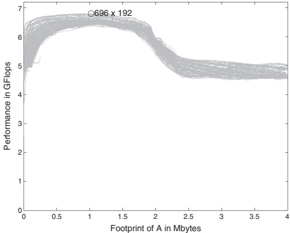

Fig. 13. Performance on the Pentium4 Prescott (3.6 GHz) of DGEMM for different choices of $m_c$ and $k_c$, where $m_c$ and $k_c$ are varied from 8 to 2000 in steps of 8. This architecture has a 2Mbyte L2 cache, which explains the performance degradation when the footprint of $\tilde{A}$ is about that size. The best performance is attained for $m_c \times k_c = 696 \times 196$, when the footprint is around 1 Mbyte.
 

of which this Pentium4 is a member, have 16 registers that can store two double precision floating-point numbers each. Eight of these registers are used for storing entries of $C: m_r \times n_r = 4 \times 4$.

The choice of parameter $k_c$ is complicated by the fact that updating the indexing in the loop that computes inner products of columns of $\tilde{A}$ and $\tilde{B}$ is best avoided on this architecture. As a result, that loop is completely unrolled, which means that storing the resulting code in the instruction cache becomes an issue, limiting $k_c$ to 192. This is slightly smaller than the $k_c = 256$ that results from the limitation discussed in Section 6.3.

In Figure 13 we show the performance of DGEMM for different choices of $m_c$ and $k_c$.³ This architecture is the one exception to the rule that $\tilde{A}$ should be addressable by the TLB, since a TLB miss is less costly than on other architectures. When $\tilde{A}$ is chosen to fill half of the L2 cache the performance is slightly better than when it is chosen to fill half of the memory addressable by the TLB.

The Northwood version of the Pentium4 relies on SSE2 instructions to compute two flops per cycle. This instruction requires entries in $B$ to be duplicated, a data movement that is incorporated into the packing into buffer $\tilde{B}$. The SSE3 instruction supported by the Prescott subarchitecture does not require this duplication when copying to $\tilde{B}$.

In Figure 14 we show the performance attained by the approach on this Pentium 4 architecture. In this figure the top graph shows the case where all matrices are square while the bottom graph reports the case where m =

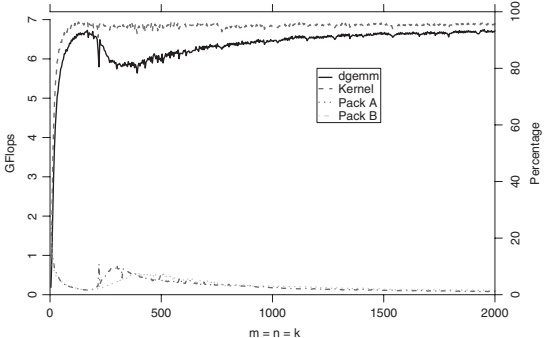

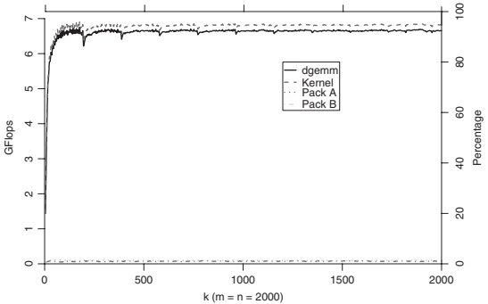

Fig. 14. Pentium4 Prescott (3.6 GHz).
 

 $n = 2000$ and k is varied. We note that GEPP with k relatively small is perhaps the most commonly encountered special case of GEMM.

—The top curve, labeled Kernel, corresponds to the performance of the kernel routine (GERP ont1).

—The next lower curve, labeled dgemm, corresponds to the performance of the DGEMM routine implemented as a sequence of GEPP operations. The GEPP operation was implemented via the algorithms in Figure 8.

—The bottom two curves correspond the percent of time incurred by routines that pack A and B into $\tilde{A}$ and $\tilde{B}$, respectively. (For these curves only the labeling along the right axis is relevant.)

The overhead caused by the packing operations accounts almost exactly for the degradation in performance from the kernel curve to the DGEMM curve.

The graphs in Figure 15 investigate the performance of the implementation when m and n are varied. In the top graph m is varied while n = k = 2000.

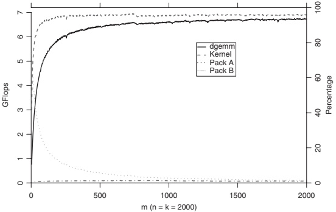

Fig. 15. Pentium4 Prescott(3.6 GHz).
 

When $m$ is small, as it would be for a GEPM operation, the packing of $B$ into $\tilde{B}$ is not amortized over sufficient computation, yielding relatively poor performance. One solution would be to skip the packing of $B$. Another would be to implement the algorithm in Figure 9. Similarly, in the bottom graph $n$ is varied while $m = k = 2000$. When $n$ is small, as it would be for a GEMP operation, the packing of $A$ into $\tilde{A}$ is not amortized over sufficient computation, again yielding relatively poor performance. Again, one could contemplate skipping the packing of $A$ (which would require the GEEP operation to be cast in terms of AXPY operations instead of inner-products). An alternative would be to implement the algorithm in Figure 11.

### 7.4 Other Architectures

For the remaining architectures we discuss briefly how parameters are selected and show performance graphs, in Figs. 16–20, that correspond to those for the Pentium 4 in Figure 14.

AMD Opteron processor (2.2 GHz, 64bit). For the Opteron architecture $n_r \geq R_{\text{comp}}/(2R_{\text{load}}) = 2/(2 \times 0.71) \approx 1.4$. The observed optimal choice for storing entries of $C$ in registers is $m_r \times n_r = 4 \times 4$.

Unrolling of the inner loop that computes the inner-product of columns of $\tilde{A}$ and $\tilde{B}$ is not necessary like it was for the Pentium4, nor is the size of the L1 cache an issue. Thus, $k_c$ is taken so that a column of $\tilde{B}$ fills half a page: $k_c = 256$. By taking $m_c \times k_c = 384 \times 256$ matrix $\tilde{A}$ fills roughly one third of the space addressable by the TLB.

The latest Opteron architectures support SSE3 instructions, we have noticed that duplicating elements of $\tilde{B}$ is still beneficial. This increases the cost of packing into $\tilde{B}$, decreasing performance by about 3%.

Performance for this architecture is reported in Figure 16.

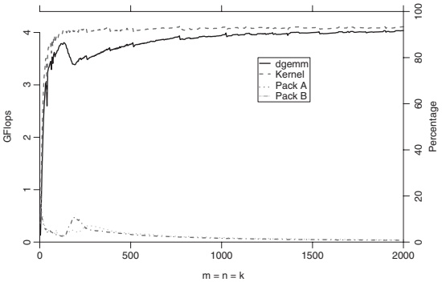

Fig. 16. Opteron (2.2 GHz).
 

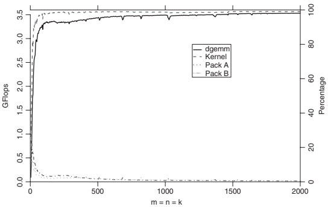

Fig. 17. Itanium2 (1.5 GHz).
 

Intel Itanium2 processor (1.5 GHz). The L1 data cache and L1 TLB are inherently ignored by this architecture for floating-point numbers. As a result, the Itanium2's L2 and L3 caches perform the role of the L1 and L2 caches of other architectures and only the L2 TLB is relevant. Thus $n_r \geq 4/(2 \times 2.0) = 1.0$. Since there are ample registers available, $m_r \times n_r = 8 \times 8$. While the optimal $k_c = 1K$ (1K doubles fill half of a page), in practice performance is almost as good when $k_c = 128$.

This architecture has many features that makes optimization easy: A very large number of registers, very good bandwidth between the caches and the registers, and an absence of out-of-order execution.

Performance for this architecture is reported in Figure 17.

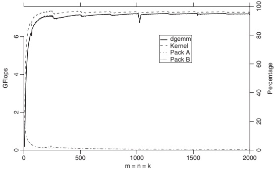

Fig. 18. POWER5 (1.9 GHz).
 

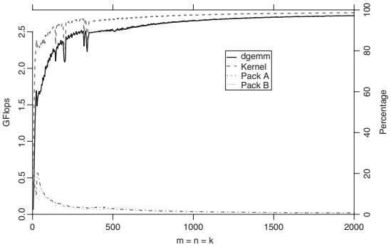

Fig. 19. PPC440 FP2 (700 MHz).
 

IBM POWER5 processor (1.9 GHz). For this architecture, $n_r \geq 4/(2 \times 0.93) \approx 2.15$ and $m_r \times n_r = 4 \times 4$. This architectures has a D-ERAT (Data cache Effective Real to Address Translation [table]) that acts like an L1 TLB and a TLB that acts like an L2 TLB. Parameter $k_c = 256$ fills half of a page with a column of $\tilde{B}$. By choosing $m_c \times k_c = 256 \times 256$ matrix $\tilde{A}$ fills about a quarter of the memory addressable by the TLB. This is a compromise: The TLB is relatively slow. By keeping the footprint of $\tilde{A}$ at the size that is addressable by the D-ERAT, better performance has been observed.

Performance for this architecture is reported in Figure 18.

PowerPC440 FP2 processor (700 MHz). For this architecture, $n_r \geq 4/(2 \times 0.75) \approx 2.7$ and $m_r \times n_r = 8 \times 4$. An added complication for this architecture is that the combined bandwidth required for moving elements of $\tilde{B}$ and $\tilde{A}$ from the L1 and L2 caches to the registers saturates the total bandwidth. This means

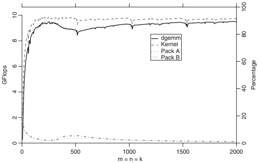

Fig. 20. Core 2 Woodcrest (2.66 GHz).
 

that the loading of elements of $C$ into the registers cannot be overlapped with computation, which in turn means that $k_c$ should be taken to be very large in order to amortize this exposed cost over as much computation as possible. The choice $m_c \times n_c = 128 \times 3K$ fills 3/4 of the L2 cache.

Optimizing for this architecture is made difficult by lack of bandwidth to the caches, an L1 cache that is FIFO (First-In-First-Out) and out-of-order execution of instructions. The addressable space of the TLB is large due to the large page size.

It should be noted that techniques similar to those discussed in this paper were used by IBM to implement their matrix multiply [Bachega et al. 2004] for this architecture.

Performance for this architecture is reported in Figure 19.

Core 2 Woodcrest (2.66 GHz) processor. At the time of the final revision of this paper, the Core 2 Woodcrest was recently released and thus performance numbers for this architecture are particularly interesting.

For this architecture, $n_r \geq 4/(2 \times 1.0) = 2$ and $m_r \times n_r = 4 \times 4$. As for the Prescott architecture, sixteen registers that can hold two double precision numbers each are available, half of which are used to store the $m_r \times n_r$ entries of $C$. The footprint of matrix $\tilde{A}$ equals that of the memory covered by the TLB.

Performance for this architecture is reported in Figure 20.

## 8. CONCLUSION

We have given a systematic analysis of the high-level issues that affect the design of high-performance matrix multiplication. The insights were incorporated in an implementation that attains extremely high performance on a variety of architectures.

Almost all routines that are currently part of LAPACK [Anderson et al. 1999] perform the bulk of computation in GEPP, GEMP, or GEPM operations. Similarly, the important Basic Linear Algebra Subprograms (BLAS) kernels can be cast

in terms of these three special cases of GEMM [Kågstrom et al. 1998]. Our recent research related to the FLAME project shows how for almost all of these routines there are algorithmic variants that cast the bulk of computation in terms of GEPP [Gunnels et al. 2001; Bientinesi et al. 2005a; Bientinesi et al. 2005b; Low et al. 2005; Quintana et al. 2001]. These alternative algorithmic variants will then attain very good performance when interfaced with matrix multiplication routines that are implemented based on the insights in this paper.

One operation that cannot be recast in terms of mostly GEPP is the QR factorization. For this factorization, about half the computation can be cast in terms of GEPP while the other half inherently requires either the GEMP or the GEPM operation. Moreover, the panel must inherently be narrow since the wider the panel, the more extra computation must be performed. This suggests that further research into the high-performance implementation of these special cases of GEMM is warranted.

The source code for the discussed implementations is available from http://www.tacc.utexas.edu/resources/software.

## ACKNOWLEDGMENTS

We would like to thank Victor Eijkhout, John Gunnels, Gregorio Quintana, and Field Van Zee for comments on drafts of this paper, as well as the anonymous referees.

## REFERENCES

AGARWAL, R., GUSTAVSON, F., AND ZUBAIR, M. 1994. Exploiting functional parallelism of POWER2 to design high-performance numerical algorithms. IBM J. Resear. Devel. 38, 5 (Sept.).

ANDERSON, E., BAI, Z., BISCHOF, C., BLACKFORD, S., DEMMEL, J., DONGARRA, J., CROZ, J. D., GREENBAUM, A., HAMMARLING, S., McKENNEY, A., AND SORENSEN, D. 1999. LAPACK Users' Guide, 3rd Ed. SIAM Press.

BACHEGA, L., CHATTERJEE, S., DOCKSER, K. A., GUNNELS, J. A., GUPTA, M., GUSTAVSON, F. G., LAPKOWSKI, C. A., LIU, G. K., MENDELL, M. P., WAIT, C. D., AND WARD, T. J. C. 2004. A high-performance simd floating-point unit for bluegene/l: Architecture, compilation, and algorithm design. In Proceedings of the 13th International Conference on Parallel Architectures and Compilation Techniques (PACT '04). IEEE Computer Society, 85–96.

BIENTINESI, P., GUNNELS, J. A., MYERS, M. E., QUINTANA-ORTI, E. S., AND VAN DE GELJN, R. A. 2005a. The science of deriving dense linear algebra algorithms. ACM Trans. Math. Softw. 31, 1–26.

BIENTINESI, P., GUNTER, B., AND VAN DE GEIJN, R. Families of algorithms related to the inversion of a symmetric positive definite matrix. ACM Trans. Math. Softw.. To appear.

BIENTINESI, P., QUINTANA-ORTÍ, E. S., AND VAN DE GELJN, R. A. 2005b. Representing linear algebra algorithms in code: The FLAME APIs. ACM Trans. Math. Softw. 31, 1, 27–59.

DONGARRA, J. J., DU CROZ, J., HAMMARLING, S., AND DUFF, I. 1990. A set of level 3 basic linear algebra subprograms. ACM Trans. Math. Softw. 16, 1, 1–17.

Goto, K. 2005. www.tacc.utexas.edu/resources/software/.

GOTO, K. AND VAN DE GELJN, R. 2006. High-performance implementation of the level-3 BLAS. FLAME Working Note #20, Tech. rep. TR-2006-23, Department of Computer Sciences, The University of Texas at Austin.

GOTO, K. AND VAN DE GELJN, R. A. 2002. On reducing TLB misses in matrix multiplication. Tech. rep. CS-TR-02-55, Department of Computer Sciences, The University of Texas at Austin.

GUNNELS, J., GUSTAVSON, F., HENRY, G., AND VAN DE GELJN, R. A. 2005. A family of high-performance matrix multiplication algorithms. Lecture Notes in Computer Science, vol. 3732. Springer-Verlag, 256–265.

ACM Transactions on Mathematical Software, Vol. 34, No. 3, Article 12, Publication date: May 2008.

GUNNELS, J. A., GUSTAVSON, F. G., HENRY, G. M., AND VAN DE GELJN, R. A. 2001. FLAME: Formal linear algebra methods environment. ACM Trans. Math. Softw. 27, 4, 422–455.

GUNNELS, J. A., HENRY, G. M., AND VAN DE GEIJN, R. A. 2001. A family of high-performance matrix multiplication algorithms. In Proceedings of the International Conference on Computational Science (ICCS'01), Part I, V. N. Alexandrov, J. J. Dongarra, B. A. Juliano, R. S. Renner, and C. K. Tan, Eds. Lecture Notes in Computer Science, vol. 2073. Springer-Verlag, 51–60.

KÄGSTRÖM, B., LING, P., AND LOAN, C. V. 1998. GEMM-based level 3 BLAS: High performance model implementations and performance evaluation benchmark. ACM Trans. Math. Softw. 24, 3, 268–302.

Low, T. M., VAN DE GELJN, R., AND VAN ZEE, F. 2005. Extracting SMP parallelism for dense linear algebra algorithms from high-level specifications. In Proceedings of ACM SIGPLAN Symposium on Principles and Practice of Parallel Programming (PPoPP'05).

QUINTANA, E. S., QUINTANA, G., SUN, X., AND VAN DE GELJN, R. 2001. A note on parallel matrix inversion. SIAM J. Sci. Comput. 22, 5, 1762–1771.

STRAZDINS, P. E. 1998. Transporting distributed BLAS to the Fujitsu AP3000 and VPP-300. In Proceedings of the 8th Parallel Computing Workshop (PCW98). 69–76.

WHALEY, R. C. AND DONGARRA, J. J. 1998. Automatically tuned linear algebra software. In Proceedings of IEEE/ACM Conference on Supercomputing (SC'98).

WHALEY, R. C., PETTET, A., AND DONGARRA, J. J. 2001. Automated empirical optimization of software and the ATLAS project. Parall. Comput. 27, 1–2, 3–35.

Received November 2005; revised November 2006, April 2007; accepted April 2007

