# Anatomy of High-Performance Many-Threaded Matrix Multiplication

Tyler M. Smith $^{*}$, Robert van de Geijn $^{*}$, Mikhail Smelyanskiy $^{\dagger}$, Jeff R. Hammond $^{\ddagger}$ and Field G. Van Zee $^{*}$

 $^{*}$ Institute for Computational Engineering and Sciences and Department of Computer Science

The University of Texas at Austin, Austin TX, 78712

Email: tms.rvdg.field@cs.utexas.edu

Parallel Computing Lab Intel Corporation

Santa Clara, CA 95054

Email: mikhail.smelyanskiy@intel.com

 $^{\dagger}$ Leadership Computing Facility Argonne National Lab

Argonne, IL 60439

Email: jhammond@alcf.anl.gov

Abstract—BLIS is a new framework for rapid instantiation of the BLAS. We describe how BLIS extends the “GotoBLAS approach” to implementing matrix multiplication (GEMM). While GEMM was previously implemented as three loops around an inner kernel, BLIS exposes two additional loops within that inner kernel, casting the computation in terms of the BLIS microkernel so that porting GEMM becomes a matter of customizing this micro-kernel for a given architecture. We discuss how this facilitates a finer level of parallelism that greatly simplifies the multithreading of GEMM as well as additional opportunities for parallelizing multiple loops. Specifically, we show that with the advent of many-core architectures such as the IBM PowerPC A2 processor (used by Blue Gene/Q) and the Intel Xeon Phi processor, parallelizing both within and around the inner kernel, as the BLIS approach supports, is not only convenient, but also necessary for scalability. The resulting implementations deliver what we believe to be the best open source performance for these architectures, achieving both impressive performance and excellent scalability.

Index Terms—linear algebra, libraries, high-performance, matrix, BLAS, multicore

## I. INTRODUCTION

High-performance implementation of matrix-matrix multiplication (GEMM) is both of great practical importance, since many computations in scientific computing can be cast in terms of this operation, and of pedagogical importance, since it is often used to illustrate how to attain high performance on a novel architecture. A few of the many noteworthy papers from the past include Agarwal et al. [1] (an early paper that showed how an implementation in a high level language—Fortran—can attain high performance), Bilmer et al. [2] (which introduced auto-tuning and code generation using the C programming language), Whaley and Dongarra [3] (which produced the ideas behind PHiPAC), Kågstöm et al. [4] (which showed that the level-3 BLAS operations can be implemented in terms of the general rank- $k$ update (GEMM)), and Goto and van de Geijn [5] (which described what is currently accepted to be the most effective approach to implementation, which we will call the GotoBLAS approach).

Very recently, we introduced the BLAS-like Library In-

stantiation Software (BLIS) [6] which can be viewed as a

systematic reimplementation of the GotoBLAS, but with a

number of key insights that greatly reduce the effort for the

library developer. The primary innovation is the insight that

the inner kernel—the smallest unit of computation within the

GotoBLAS GEMM implementation—can be further simplified

into two loops around a micro-kernel. This means that the li-

lary developer needs only implement and optimize a routine $^{1}$

that implements the computation of $C:= AB + C$ where $C$ is a

small submatrix that fits in the registers of a target architecture.

In a second paper [7], we reported experiences regarding

portability and performance on a large number of current

processors. Most of that paper is dedicated to implementation

and performance on a single core. A brief demonstration of

how BLIS also supports parallelism was included in that paper,

but with few details.

The present paper describes in detail the opportunities for parallelism exposed by the BLIS implementation of GEMM. It focuses specifically on how this supports high performance and scalability when targeting many-core architectures that require more threads than cores if near-peak performance is to be attained. Two architectures are examined: the PowerPC A2 processor with 16 cores that underlies IBM's Blue Gene/Q supercomputer, which supports four-way hyperthreading for a total of 64 threads; and the Intel Xeon Phi processor with 60 cores $^{2}$ and also supports four-way hyperthreading for a total of 240 threads. It is demonstrated that excellent performance and scalability can be achieved specifically because of the extra parallelism that is exposed by the BLIS approach within the inner kernel employed by the GotoBLAS approach.

It is also shown that when many threads are employed it is necessary to parallelize in multiple dimensions. This builds upon Marker et al. [8], which we believe was the first paper to look at 2D work decomposition for GEMM on multithreaded architectures. The paper additionally builds upon work that describes the vendor implementations for the

<div style="text-align: center;">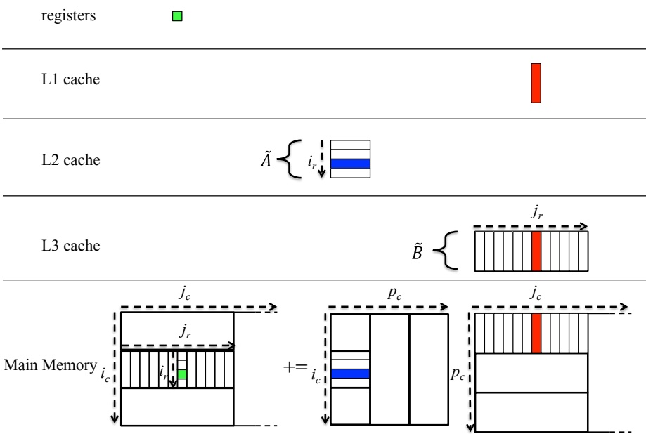</div>


<div style="text-align: center;"><div style="text-align: center;">Fig. 1. Illustration of which parts of the memory hierarchy each block of A and B reside in during the execution of the micro-kernel.</div> </div>


PowerPC A2 [9] and the Xeon Phi [10]. BLIS wraps many of those insights up in a cleaner framework so that exploration of the algorithmic design space is, in our experience, simplified. We show performance to be competitive relative to that of Intel's Math Kernel Library (MKL) and IBM's Engineering and Scientific Subroutine Library (ESSL) $^{3}$.

## II. BLIS

In our discussions in this paper, we focus on the special case $C:= AB + C$, where $A$, $B$, and $C$ are $m \times k$, $k \times n$, and $m \times n$, respectively. $^4$ It helps to be familiar with the GotoBLAS approach to implementing GEMM, as described in [5]. We will briefly review the BLIS approach for a single core implementation in this section, with the aid of Figure 1.

Our description starts with the outer-most loop, indexed by $j_c$. This loop partitions $C$ and $B$ into (wide) column panels. Next, $A$ and the current column panel of $B$ are partitioned into column panels and row panels, respectively, so that the current column panel of $C$ (of width $n_c$) is updated as a sequence of rank- $k$ updates (with $k = k_c$), indexed by $p_c$. At this point, the GotoBLAS approach packs the current row panel of $B$ into a contiguous buffer, $\widetilde{B}$. If there is an L3 cache, the computation is arranged to try to keep $\widetilde{B}$ in the L3 cache. The primary reason for the outer-most loop, indexed by $j_c$, is to limit the amount of workspace required for $\widetilde{B}$, with a secondary reason to allow $\widetilde{B}$ to remain in the L3 cache. $^5$

Now, the current panel of A is partitioned into blocks, indexed by $i_{c}$, that are packed into a contiguous buffer, A. The block is sized to occupy a substantial part of the L2 cache, leaving enough space to ensure that other data does not evict the block. The GotoBLAS approach then implements the “block-panel” multiplication of $\overline{AB}$ as its inner kernel, making this the basic unit of computation. It is here that the BLIS approach continues to mimic the GotoBLAS approach, except that it explicitly exposes two additional loops. In BLIS, these loops are coded portably in C, whereas in GotoBLAS they are hidden within the implementation of the inner kernel (which is oftentimes assembly-coded).

At this point, we have $\widetilde{A}$ in the L2 cache and $\widetilde{B}$ in the L3 cache (or main memory). The next loop, indexed by $j_r$, now partitions $\widetilde{B}$ into column "slivers" (micro-panels) of width $n_r$. At a typical point of the computation, one such sliver is in the L1 cache, being multiplied by $\widetilde{A}$. Panel $\widetilde{B}$ was packed in such a way that this sliver is stored contiguously, one row (of width $n_r$) at a time. Finally, the inner-most loop, indexed by $i_r$, partitions $\widetilde{A}$ into row slivers of height $m_r$. Block $\widetilde{A}$ was packed in such a way that this sliver is stored contiguously, one column (of height $m_r$) at a time.

The BLIS approach captures this layering as five nested loops around the micro-kernel:

```text
for j_c = 0, ..., n-1  in steps of n_c       // 5th loop (outermost): partition C/B
  for p_c = 0, ..., k-1  in steps of k_c     // 4th loop: rank-k updates
    for i_c = 0, ..., m-1  in steps of m_c   // 3rd loop: pack panel of A into Ã
      for j_r = 0, ..., n_c-1  in steps of n_r // 2nd loop: micro-panel of B in L1
        for i_r = 0, ..., m_c-1  in steps of m_r // 1st loop (micro-kernel): registers
          C(i_r:i_r+m_r-1, j_r:j_r+n_r-1) += A_i * B_j
        endfor
      endfor
    endfor
  endfor
endfor
```

<div style="text-align: center;"><div style="text-align: center;">Fig. 2. Illustration of the three inner-most loops. The loops indexed by $i_{r}$ and $j_{r}$ are the loops that were hidden inside the GotoBLAS inner kernel.</div> </div>


The BLIS micro-kernel then multiplies the current sliver of $\widetilde{A}$ by the current sliver of $\widetilde{B}$ to update the corresponding $m_r \times n_r$ block of $C$. This micro-kernel performs a sequence of rank-1 updates (outer products) with columns from the sliver of $\widetilde{A}$ and rows from the sliver of $\widetilde{B}$.

A typical point in the computation is now captured by Figure 1. A $m_r \times n_r$ block of $C$ is in the registers. A $k_c \times n_r$ sliver of $\widetilde{B}$ is in the L1 cache. The $m_r \times k_c$ sliver of $\widetilde{A}$ is streamed from the L2 cache. And so forth. The key takeaway

We have now set the stage to discuss opportunities for parallelism and when those opportunities may be advantageous. There are two key insights in this section:

here is that the layering described in this section can be captured by the five nested loops around the micro-kernel in Figure 2.

## III. OPPORTUNITIES FOR PARALLELISM

- In GotoBLAS, the inner kernel is the basic unit of computation and no parallelization is incorporated within that inner kernel $^{6}$. The BLIS framework exposes two

loops within that inner kernel, thus exposing two extra opportunities for parallelism, for a total of five.

- It is important to use a given memory layer wisely. This gives guidance as to which loop should be parallelized.

### A. Parallelism within the micro-kernel

The micro-kernel is typically implemented as a sequence of rank-1 updates of the $m_r \times n_r$ block of $C$ that is accumulated in the registers. Introducing parallelism over the loop around these rank-1 updates is ill-advised for three reasons: (1) the unit of computation is small, making the overhead considerable, (2) the different threads would accumulate contributions to the block of $C$, requiring a reduction across threads that is typically costly, and (3) each thread does less computation for each update of the $m_r \times n_r$ block of $C$, so the amortization of the cost of the update is reduced.

This merely means that parallelizing the loop around the rank-1 updates is not advisable. One could envision carefully paralleling the micro-kernel in other ways for a core that requires hyperthreading in order to attain peak performance. But that kind of parallelism can be described as some combination of parallelizing the first and second loop around the micro-kernel. We will revisit this topic later on.

The key for this paper is that the micro-kernel is a basic unit of computation for BLIS. We focus on how to get parallelism without having to touch that basic unit of computation.

B. Parallelizing the first loop around the micro-kernel (indexed by $i_{r}$).

<div style="text-align: center;">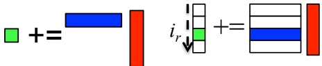</div>


<div style="text-align: center;"><div style="text-align: center;">Fig. 3. Left: the micro-kernel. Right: the first loop around the micro-kernel.</div> </div>


Let us consider the first of the three loops in Figure 2. If one parallelizes the first loop around the micro-kernel (indexed by $i_{r}$), different instances of the micro-kernel are assigned to different heads. Our objective is to optimally use fast memory resources. In this case, the different threads share the same sliver of $\widetilde{B}$, which resides in the L1 cache.

Notice that regardless of the size of the matrices on which we operate, this loop has a fixed number of iterations, $\left\lceil \frac{m_c}{m_r} \right\rceil$, since it loops over $m_c$ in steps of $m_r$. Thus, the amount of parallelism that can be extracted from this loop is quite limited. Additionally, a sliver of $\tilde{B}$ is brought from the L3 cache into the L1 cache and then used during each iteration of this loop. When parallelized, less time is spent in this loop and thus the cost of bringing that sliver of $\tilde{B}$ into the L1 cache is amortized over less computation. Notice that the cost of bringing $\tilde{B}$ into the L1 cache may be overlapped by computation, so it may be completely or partially hidden. In this case, there is a minimum amount of computation required to hide the cost of bringing $\tilde{B}$ into the L1 cache. Thus, parallelizing is acceptable only when this loop has a large number of iterations. These two factors mean that this loop should be parallelized only when the ratio of $m_c$ to $m_r$ is large. Unfortunately, this is not usually the case, as $m_c$ is usually on the order of a few hundred elements.

C. Parallelizing the second loop around the micro-kernel (indexed by $j_{r}$).

<div style="text-align: center;">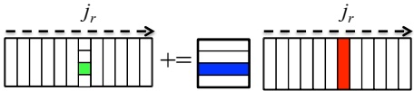</div>


<div style="text-align: center;"><div style="text-align: center;">Fig. 4. The second loop around the micro-kernel.</div> </div>


Now consider the second of the loops in Figure 2. If one parallelizes the second loop around the micro-kernel (indexed by $j_r$), each thread will be assigned a different sliver of $\widetilde{B}$, which resides in the L1 cache, and they will all share the same block of $\widetilde{A}$, which resides in the L2 cache. Then, each thread will multiply the block of $\widetilde{A}$ with its own sliver of $\widetilde{B}$.

Similar to the first loop around the micro-kernel, this loop has a fixed number of iterations, as it iterates over $n_c$ in steps of $n_r$. The time spent in this loop amortizes the cost of packing the block of $\tilde{A}$ from main memory into the L2 cache. Thus, for similar reasons as the first loop around the micro-kernel, this loop should be parallelized only if the ratio of $n_c$ to $n_r$ is large. Fortunately, this is almost always the case, as $n_c$ is typically on the order of several thousand elements.

Consider the case where this loop is parallelized and each thread shares a single L2 cache. Here, one block $\widetilde{A}$ will be moved into the L2 cache, and there will be several slivers of $\widetilde{B}$ which also require space in the cache. Thus, it is possible that either $\widetilde{A}$ or the slivers of $\widetilde{B}$ will have to be resized so that all fit into the cache simultaneously. However, slivers of $\widetilde{B}$ are small compared to the size of the L2 cache, so this will likely not be an issue.

Now consider the case where the L2 cache is not shared, and this loop over $n_c$ is parallelized. Each thread will pack part of $\widetilde{A}$, and then use the entire block of $\widetilde{A}$ for its local computation. In the serial case of GEMM, the process of packing of $\widetilde{A}$ moves it into a single L2 cache. In contrast, parallelizing this loop results in various parts of $\widetilde{A}$ being placed into different L2 caches. This is due to the fact that the packing of $\widetilde{A}$ is parallelized. Within the parallelized packing routine, each thread will pack a different part of $\widetilde{A}$, and so that part of $\widetilde{A}$ will end up in that thread's private L2 cache. A cache coherency protocol must then be relied upon to guarantee that the pieces of $\widetilde{A}$ are duplicated across the L2 caches, as needed. This occurs during the execution of the microkernel and may be overlapped with computation. Because this results in extra memory movements and relies on cache coherency, this may or may not be desirable depending on the cost of duplication among the caches. Notice that if the architecture does not provide cache coherency, the duplication of the pieces of $\widetilde{A}$ must be done manually.

D. Parallelizing the third loop around the inner-kernel (indexed by $i_{c}$).

<div style="text-align: center;">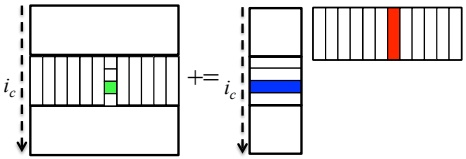</div>


<div style="text-align: center;"><div style="text-align: center;">Fig. 5. The third loop around the micro-kernel (first loop around Goto's inner kernel).</div> </div>


Next, consider the third loop around the micro-kernel at the bottom of Figure 2. If one parallelizes this first loop around what we call the macro-kernel (indexed by $i_c$), which corresponds to Goto's inner kernel, each thread will be assigned a different block of $\widetilde{A}$, which resides in the L2 cache, and they will all share the same row panel of $\widetilde{B}$, which resides in the L3 cache or main memory. Subsequently, each thread will multiply its own block of $\widetilde{A}$ with the shared row panel of $\widetilde{B}$.

Unlike the inner-most two loops around the micro-kernel, the number of iterations of this loop is not limited by the blocking sizes; rather, the number of iterations of this loop depends on the size of $m$. Notice that when $m$ is less than the product of $m_{c}$ and the degree of parallelization of the loop, blocks of $\widetilde{A}$ will be smaller than optimal and performance will suffer.

Now consider the case where there is a single, shared L2 cache. If this loop is parallelized, there must be multiple blocks of $\tilde{A}$ in this cache. Thus, the size of each $\tilde{A}$ must be reduced in size by a factor equal to the degree of parallelization of this loop. The size of $\tilde{A}$ is $m_c \times k_c$, so either or both of these may be reduced. Notice that if we choose to reduce $m_c$, parallelizing this loop is equivalent to parallelizing the first loop around the micro-kernel. If instead each thread has its own L2 cache, each block of $\tilde{A}$ resides in its own cache, and thus it would not need to be resized.

Now consider the case where there are multiple L3 caches. If this loop is parallelized, each thread will pack a different part of the row panel of $\widetilde{B}$ into its own L3 cache. Then a cache coherency protocol must be relied upon to place every portion of $\widetilde{B}$ in each L3 cache. As before, if the architecture does not provide cache coherency, this duplication of the pieces of $\widetilde{B}$ must be done manually.

E. Parallelizing the fourth loop around the inner-kernel (indexed by $p_{c}$).

Consider the fourth loop around the micro-kernel. If one parallelizes this second loop around the macro-kernel (indexed by $p_{c}$), each thread will be assigned a different block of $\tilde{A}$ and a different block of $\tilde{B}$. Unlike in the previously discussed opportunities for parallelism, each thread will update the same block of $C$, potentially creating race conditions. Thus, parallelizing this loop either requires some sort of locking mechanism or the creation of copies of the block of $C$.

<div style="text-align: center;">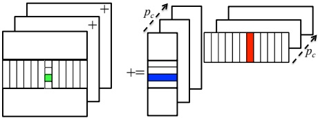</div>


<div style="text-align: center;"><div style="text-align: center;">Fig. 6. Parallelization of the $p_{c}$ loop requires local copies of the block of C to be made, which are summed upon completion of the loop.</div> </div>


(initialized to zero) so that all threads can update their own copy, which is then followed by a reduction of these partial results, as illustrated in Figure 6. This loop should only be parallelized under very special circumstances. An example would be when C is small so that (1) only by parallelizing this loop can a satisfactory level of parallelism be achieved and (2) reducing (summing) the results is cheap relative to the other costs of computation. It is for these reasons that so-called 3D (sometimes called 2.5D) distributed memory matrix multiplication algorithms [12], [13] choose this loop for parallelization (in addition to parallelizing one or more of the other loops).

F. Parallelizing the outer-most loop (indexed by $j_{c}$).

<div style="text-align: center;">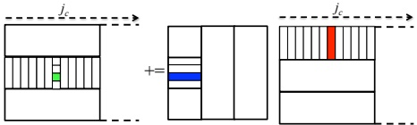</div>


<div style="text-align: center;"><div style="text-align: center;">Fig. 7. The fifth (outer) loop around the micro-kernel.</div> </div>


Finally, consider the fifth loop around the micro-kernel (the third loop around the macro-kernel, and the outer-most loop). If one parallelizes this loop, each thread will be assigned a different row panel of $\widetilde{B}$, and each thread will share the whole matrix A which resides in main memory.

Consider the case $\underline{w}$ here there is a single L3 cache. Then the size of a panel of $\widetilde{B}$ must be reduced so that multiple of $\widetilde{B}$ will fit in the L3 cache. If $n_{c}$ is reduced, then this is equivalent to parallelizing the 2nd loop around the micro-kernel, in terms of how the data is partitioned among threads. If instead each thread has its own L3 cache, then the size of $\widetilde{B}$ will not have to be altered, as each panel of $\widetilde{B}$ will reside in its own cache.

Parallelizing this loop thus may be a good idea on multi-socket systems where each CPU has a separate L3 cache. Additionally, such systems often have a non-uniform memory access (NUMA) design, and thus it is important to have a separate panel of $\widetilde{B}$ for each NUMA node, with each panel residing in that node's local memory.

Notice that since threads parallelizing this loop do not share any packed buffers of $\widetilde{A}$ or $\widetilde{B}$, parallelizing this loop is, from

a data-sharing perspective, equivalent to gaining parallelism outside of BLIS.

## IV. INTEL XEON PHI

We now discuss how BLIS supports high performance and scalability on the Xeon Phi architecture.

### A. Architectural Details

The Xeon Phi has 60 cores, each of which has its own 512 KB L2 cache and 32 KB L1 data cache. Each core has four hardware threads, all of which share the same L1 cache. A core is capable of dispatching two instructions per clock cycle, utilizing the core's two pipelines. One of these may be used to execute vector floating-point instructions or vector memory instructions. The other may only be used to execute scalar instructions or prefetch instructions. If peak performance is to be achieved, the instruction pipeline that is capable of executing floating-point operations should be executing a fused multiply accumulate instruction (FMA) as often as possible. One thread may only issue one instruction to each pipeline every other clock cycle. Thus, utilizing two hardware threads is the minimum necessary to fully occupy the floating-point unit. Using four hardware threads further alleviates instruction latency and bandwidth issues [14].

Although these hardware threads may seem similar to the hyper-threading found on more conventional CPUs, the fact is that hyper-threading is not often used for high-performance computing applications, and these hardware threads must be used for peak performance.

### B. The BLIS implementation on the Intel Xeon Phi

Because of the highly parallel nature of the Intel Xeon Phi, the micro-kernel must be designed while keeping the parallelism gained from the core-sharing hardware threads in mind. On conventional architectures, slivers of $\widetilde{A}$ and $\widetilde{B}$ are sized such that $\widetilde{B}$ resides in the L1 cache, and $\widetilde{B}$ is streamed from memory. However, this regime is not appropriate for the Xeon Phi. This is due to the fact that with four threads sharing an L1 cache, parallelizing in the $m$ and $n$ dimensions means that there must be room for at least two slivers of $\widetilde{A}$ and two slivers of $\widetilde{B}$ in the L1 cache. On the Xeon Phi, to fit so much data into the L1 cache would mean reducing $k_c$ to a point where the cost of updating the $m_r \times n_r$ block of $C$ is not amortized by enough computation. The solution is to instead only block for the L2 cache. In order for the GotoBLAS approach to be applied to this case, we can think of the region of the L2 cache that contains the slivers of $\widetilde{A}$ and $\widetilde{B}$ as a virtual L1 cache, where the cost of accessing its elements is the same as accessing elements in the L2 cache.

We now discuss the register and cache blocksizes for the BLIS implementation of Xeon Phi, as they affect how much parallelism can be gained from each loop. Various pipeline restrictions for the Xeon Phi mean that its micro-kernel must either update a $30 \times 8$ or $8 \times 30$ block of $C$. For this paper, we have chosen $30 \times 8$. Next, the block of $\tilde{A}$ must fit into the 512 KB L2 cache. $m_c$ is chosen to be 120, and $k_c$ is chosen to be 240. There is no L3 cache, so $n_c$ is only bounded by main memory, and by the amount of memory we want to use for the temporary buffer holding the panel of $\tilde{B}$. For this reason we choose $n_c$ to be 14400, which is the largest $n$ dimension for any matrix we use for our experiments. $^7$

### C. Which loops to parallelize

The sheer number of threads and the fact that hardware threads are organized in a hierarchical manner suggests that we will want to consider parallelizing multiple loops. We use the fork-join model to parallelize multiple loops. When a thread encounters a loop with $P$-way parallelism, it will spawn $P$ children, and those $P$ threads parallelize that loop instance. The total number of threads is the product of the number of threads parallelizing each loop. We will now take the insights from the last section to determine which loops would be appropriate to parallelize, and to what degree. In this section we will use the name of the index variable to identify each loop.

• The $i_{r}$ loop: With an $m_{c}$ of 120 and $m_{r}$ of 30, this loop only has four iterations, thus it does not present a favorable opportunity for parallelization.

- The $j_{r}$ loop: Since $n_{c}$ is 14400, and $n_{r}$ is only 8, this loop provides an excellent opportunity for parallelism. This is especially true among the hardware threads. The four hardware threads share an L2 cache, and if this loop is parallelized among those threads, they will also share a block of $\tilde{A}$.

- The $i_c$ loop: Since this loop has steps of 120, and it iterates over all of m, this loop provides a good opportunity when m is large. Additionally, since each core of the Xeon Phi has its own L2 cache, parallelizing this loop is beneficial because the size of $\bar{A}$ will not have to be changed as long as the loop is not parallelized by threads within a core. Notice that if the cores share an L2 cache, parallelizing this loop would result in multiple blocks of $\bar{A}$, each of which would have to be reduced in size since they would all have to fit into one L2 cache.

- The $p_{c}$ loop: We do not consider this loop for reasons explained in Section III-E above.

- The $j_c$ loop: Since the Xeon Phi lacks an L3 cache, this loop provides no advantage over the $j_r$ loop for parallelizing in the $n$ dimension. It also offers worse spatial locality than the $j_r$ loop, since there would be different buffers of $\widetilde{B}$.

We have now identified two loops as opportunities for parallelism on the Xeon Phi, the $j_{r}$ and $i_{c}$ loops.

### D. Parallelism within cores

It is advantageous for hardware threads on a single core to parallelize the $j_{r}$ loop. If this is done, then each hardware thread is assigned a sliver of $\widetilde{B}$, and the four threads share the same block of $\widetilde{A}$. If the four hardware threads are synchronized, they will access the same sliver of $\widetilde{A}$ concurrently. Not

only that, if all four threads operate on the same region of $\tilde{A}$ at the same time, one of the threads will load an element of $\tilde{A}$ into the L1 cache, and all four threads will use it before it is evicted. Thus, parallelizing the $j_r$ loop and synchronizing the four hardware threads will reduce bandwidth requirements of the micro-kernel. The synchronization of the four hardware threads is accomplished by periodically executing a barrier. Synchronizing threads may be important even when threads are located on different cores. For example, multiple cores conceptually will share a sliver of $\tilde{B}$, which is read into their private L2 caches. If they access the $\tilde{B}$ sliver at the same time, the sliver will be read just once out of L3 (or memory) and replicated using the cache coherence protocol. However, if cores fall out of synch, a sliver of $\tilde{B}$ may be read from main memory multiple times. This may penalize performance or energy.

For our Xeon Phi experiments, the four threads on a core parallelize the $j_{r}$ loop, and a barrier is executed every 8 instances of the micro-kernel. However, we do not enforce any synchronization between cores.

### E. Parallelism between cores

As noted, it is particularly advantageous to parallelize the $i_c$ loop between cores as each core has its own L2 cache. However, if parallelism between cores is only attained by this loop, performance will be poor when $m$ is small. Also, all cores will only work with an integer number of full blocks of $\tilde{A}$ (where the size of the $\tilde{A}$ is $m_c \times k_c$) when $m$ is a multiple of 7200. For this reason, we seek to gain parallelism in both the $m$ and $n$ dimensions. Thus, we parallelize the $j_r$ loop in addition to the $i_c$ loop to gain parallelism between cores, even though this incurs the $\tilde{e}$ extra cost of the cache-coherency protocol to duplicate all of $\tilde{A}$ to each L2 cache.

### F. Performance results

Given that (1) each core can issue one floating-point multiply-accumulate instruction per clock cycle, and (2) the SIMD vector length for double-precision real elements is 8, each core is capable of executing 16 floating-point operations per cycle, where a floating-point operation is either a floating-point multiply or addition. At 1.1 GHz, this corresponds to a peak of 17.6 GFLOPS per core, or 1056 GFLOPS for 60 cores. In the performance results presented in this paper, the top of each graph represents the theoretical peak of that machine.

Figure 8 compares the performance of different parallelization schemes within BLIS on the Xeon Phi. There are four parallelization schemes presented. They are labeled with how much parallelism was gained from the $i_{c}$ and $j_{r}$ loops. In all cases, parallelization within a core is done by parallelizing the $j_{r}$ loop. Single-thread results are not presented, as such results would be meaningless on the Xeon Phi.

The case labeled 'j_r': 240 way', where all parallelism is gained from the $j_r$ loop, yields very poor performance. Even when $n = 14400$, which is the maximum tested (and a rather large problem size), each thread is only multiplying each $\tilde{A}$ with seven or eight slivers of $\tilde{B}$. In this case, not

<div style="text-align: center;">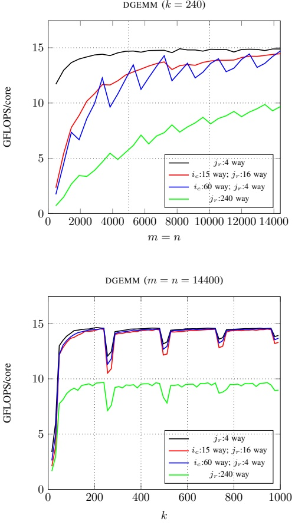</div>


<div style="text-align: center;"><div style="text-align: center;">Fig. 8. Different parallelization schemes of BLIS on the Intel Xeon Phi. $i_{c}:n$ way' indicates n-way parallelization of the third loop (indexed by $i_{c}$) around the micro-kernel, and $j_{r}:n$ way' indicates n-way parallelization of the second loop (indexed by $j_{r}$) around the micro-kernel.</div> </div>


enough time is spent in computation to amortize the packing of $\tilde{A}$. Additionally, $\tilde{A}$ is packed by all threads and then the cache coherency protocol duplicates all slivers of $\tilde{A}$ among the threads (albeit at some cost due to extra memory traffic). Finally, $\tilde{A}$ is rather small compared to the number of threads, since it is only $240 \times 120$. A relatively small block of $\tilde{A}$ means that there is less opportunity for parallelism in the packing routine. This makes load balancing more difficult, as some threads will finish packing before others and then sit idle.

Next consider the case labeled 'i_c:60 way; j_r:4 way'. This is the case where parallelism between cores is gained from the $i_c$ loop, and it has good performance when m is large. However,

<div style="text-align: center;">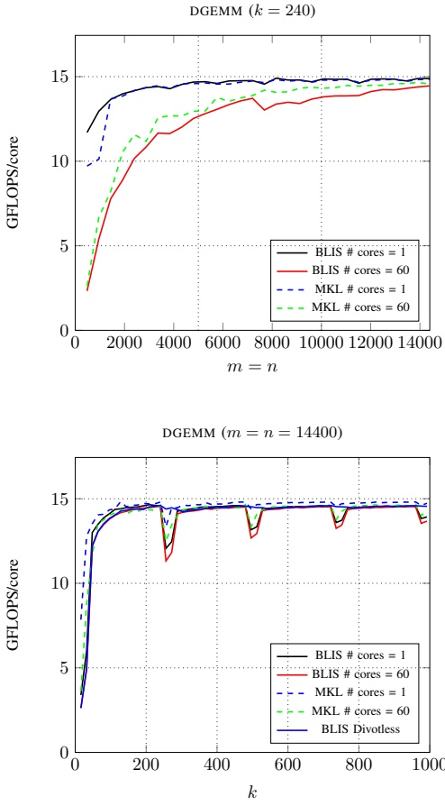</div>


<div style="text-align: center;"><div style="text-align: center;">Fig. 9. Performance comparison of BLIS with MKL on the Intel Xeon Phi.</div> </div>


load balancing issues arise when $m_r$ multiplied by the number of threads parallelizing the $i_c$ loop does not divide $m$ (that is, when $m$ is not divisible by 1800). This is rooted in the $m_r \times n_r$ micro-kernel's status as the basic unit of computation. Now consider the case labeled $i_c: 15$; $j_r:16$. This case ramps up more smoothly, especially when $m$ and $n$ are small.

In Figure 9, we compare the best BLIS implementation against Intel's Math Kernel Library (MKL), which is a highly-tuned implementation of the BLAS. For the top graph, we compare the 'i_c:15 way; j_r:16 way' scheme against MKL when m and n vary. For the bottom graph, we use the 'i_c:60 way; j_r:4 way' scheme, since it performs slightly better when m is large. Notice that this case is particularly favorable for this parallelization scheme because each thread is given an integer number of blocks of $\bar{A}$. This only happens when m is divisible by 7200.

In the bottom graph of Figure 9, when both $m$ and $n$ are fixed to 14400, notice that there are ‘divots’ that occur when $k$ is very slightly larger than $k_c$, which is 240 in the BLIS implementation of GEMM, and evidently in the MKL implementation of GEMM as well. When $k$ is just slightly larger than a multiple of 240, an integer number of rank-$k$ updates will be performed with the optimal blocksize $k_c$, and one rank-$k$ update will be performed with a smaller rank. The rank-$k$ update with a small value of $k$ is expensive because in each micro-kernel call, an $m_r \times n_r$ block of $C$ must be both read from and written to main memory. When $k$ is small, this update of the $m_r \times n_r$ submatrix of $C$ is not amortized by enough computation. It is more efficient to perform a single rank-$k$ update with a $k$ that is larger than the optimal $k_c$ than to perform a rank-$k$ update with the optimal $k_c$ followed by a rank-$k$ update with a very small value of $k$. This optimization is shown in the curve in Figure 9 labeled “BLIS Divotless”.

Figure 9 shows BLIS attaining very similar performance to that of Intel's highly-tuned MKL, falling short by only one or two percentage points from the achieved performance of the Xeon Phi. We also demonstrate great scaling results when using all 60 cores of the machine. Additionally, we demonstrate that the performance 'divots' that occur in both MKL and BLIS when k is slightly larger than some multiple of 240 can be eliminated.

## V. IBM BLUE GENE/Q

We now discuss how BLIS supports high performance and scalability on the IBM Blue Gene/Q PowerPC A2 architecture [15].

### A. Architectural Details

The Blue Gene/Q PowerPC A2 processor has 16 cores available for use by applications. Much like the Intel Xeon Phi, each core is capable of using up to four hardware threads, each with its own register file. The PowerPC A2 supports the QPX instruction set, which supports SIMD vectors of length four for double-precision real elements. QPX allows fused multiply-accumulate instructions, operating on SIMD vectors of length four. This lets the A2 execute 8 flops per cycle.

The 16 cores of Blue Gene/Q that can be used for GEMM share a single 32 MB L2 cache. This cache is divided into 2 MB slices. When multiple threads are simultaneously reading from the same slice, there is some contention between the threads. Thus there is a cost to having multiple threads access the same part of $\tilde{A}$ at the same time. The L2 cache has a latency of 82 clock cycles and 128 byte cache lines.

Each core has its own L1 prefetch, L1 instruction, and L1 data cache. The L1 prefetch cache contains the data prefetched by the stream prefetcher and has a capacity of 4 KB [16]. It has a latency of 24 clock cycles and a cache line size of 128 bytes. The L1 data cache has a capacity of 16 KB, and a cache line size of 64 bytes. It has a latency of 6 clock cycles [17].

The PowerPC A2 has two pipelines. The AXU pipeline is used to execute QPX floating-point operations. The XU pipeline can be used to execute memory and scalar operations. Each clock cycle, a hardware thread is allowed to dispatch one instruction to one of these pipelines. In order for the A2 to be dispatching a floating-point instruction each clock cycle, every instruction must either execute on the XU pipeline, or it must be a floating-point instruction. Additionally, since there are inevitably some instructions that are executed on the XU pipeline, we use four hardware threads so that there will usually be an AXU instruction available to dispatch alongside each XU instruction.

### B. The BLIS implementation on the IBM PowerPC A2

As on the Intel Xeon Phi, $\bar{A}$ and the sliver of $\bar{B}$ reside in the L2 cache and no data resides in the L1 cache. (Notice that the amount of L1 cache per thread on the A2 is half that of the Xeon Phi.)

For the BLIS PowerPC A2 implementation, we have chosen $m_r$ and $n_r$ to both be 8. The block of $\tilde{A}$ takes up approximately half of the 32 MB L2 cache, and in the BLIS implementation,$m_c$ is 1024 and $k_c$ is 2048. The PowerPC A2 does not have an L3 cache and thus $n_c$ is limited by the size of memory; therefore, we have chosen a rather large value of $n_c = 10240$.

### C. Which loop to parallelize

While there are fewer threads to use on the PowerPC A2 than on the Xeon Phi, 64 hardware threads is still enough to require the parallelization of multiple loops. Again, we refer to each loop by the name of its indexing variable.

- The $i_{r}$ loop: With an $m_{c}$ of 1024 and $m_{r}$ of 8, this loop has many iterations. Thus, unlike the Intel Xeon Phi, the first loop around the micro-kernel presents an excellent opportunity for parallelism.

- The $j_r$ loop: Since $n_c$ is large and $n_r$ is only 8, this loop also provides an excellent opportunity for parallelism. However when threads parallelize this loop, they share the same $\tilde{A}$, and may access the same portions of $\tilde{A}$ concurrently. This poses problems when it causes too many threads to access the same 2 MB portion of the L2 cache simultaneously.

- The $i_c$ loop: Since all threads share the same L2 cache, this loop has similar advantages as the $i_r$ loop. If multiple threads parallelize this loop,$\tilde{A}$ will have to be reduced in size. This reduction in size reduces the computation that amortizes the movement of each sliver of $\tilde{B}$ into the virtual L1 cache. Notice that if we reduce $m_c$, then parallelizing the $i_c$ loop reduces this cost by the same amount as parallelizing $i_r$.

- The $p_{c}$ loop: Once again, we do not consider this loop for parallelization.

- The $j_c$ loop: This loop has the same advantages and disadvantages as the $j_r$ loop, except that this loop should not be parallelized among threads that share a core, since they will not then share a block of $\widetilde{A}$.

Since the L2 cache is shared, and there is no L3 cache, our choices for the PowerPC A2 is between parallelizing either the $i_c$ or $i_r$ loops, and either the $j_c$ or $j_r$ loops. In both of these cases, we prefer the inner loops to the outer loops. The reason for this is two-fold. Firstly, it is convenient to not change any of the cache blocking sizes from the serial implementation of BLIS when parallelizing. But more importantly, parallelizing the inner loops instead of the outer loops engenders better spatial locality, as there will be one contiguous block of memory, instead of several blocks of memory that may not be contiguous.

### D. Performance results

Like the Xeon Phi, each core of the PowerPC A2 can issue one double-precision fused multiply-accumulate instruction each clock cycle. The SIMD vector length for double-precision arithmetic is 4, so each core can execute 8 floating-point operations per cycle. At 1.6 GHz, a single core has a double-precision peak performance of 12.8 GFLOPS. This becomes the top line in Figures 10 and 11. The theoretical peak with all 16 cores is 204.8 GFLOPS.

Figure 10 compares the performance of different parallelization schemes within BLIS on the PowerPC A2. It is labeled similarly to Figure 8, described in the previous section. Notice that all parallelization schemes have good performance when m and n are large, but the schemes that only parallelize in either the m or the n dimensions have performance that varies according to the amount of load balancing. Proper load balancing for the 'i_r:64 way' case is only achieved when m is divisible by 512, and similarly, proper load balancing for the 'j_r:64 way' case is only achieved when n is divisible by 512.

The performance of BLIS is compared with that of ESSL in Figure 11. The parallelization scheme used for this comparison is the one labeled 'j_{r}:8' way; i_{r}:8' way'. Notice that parallel performance scales perfectly to 16 cores for large m and n.

## VI. CONCLUDING REMARKS

In this paper, we exposed the five loops around a microkernel that underly matrix-matrix multiplication within the BLIS framework. We discussed where, at a prototypical point in the computation, data resides and used this to motivate insights about opportunities for parallelizing the various loops. We discussed how parallelizing the different loops affects the sharing of data and amortization of data movement. These insights were then applied to the parallelization of this operation on two architectures that require many threads to achieve peak performance: The IBM PowerPC A2 that underlies the Blue Gene/Q supercomputer and the Intel Xeon Phi. It was shown how parallelizing multiple loops is the key to high performance and scalability. On the Xeon Phi the resulting performance matched that of Intel's highly tuned MKL. For the PowerPC A2, the parallelization yielded a considerable performance boost over IBM's ESSL, largely due to better scalability. Thus, adding parallelism to the BLIS framework

<div style="text-align: center;">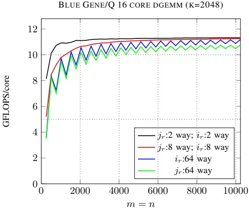</div>


<div style="text-align: center;">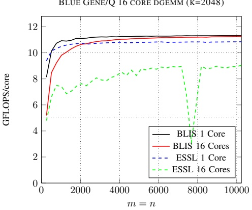</div>


<div style="text-align: center;"><div style="text-align: center;">BLUE GENE/Q 16 CORE DGEMM (M=N=10240)</div> </div>


<div style="text-align: center;"><div style="text-align: center;">Fig. 10. Different parallelization schemes for the IBM PowerPC A2. 'j_r:n way' indicates n-way parallelization of the second loop (indexed by j_r) around the micro-kernel, and 'i_r:n way' indicates n-way parallelization of the first loop (indexed by i_r) around the micro-kernel.</div> </div>


<div style="text-align: center;">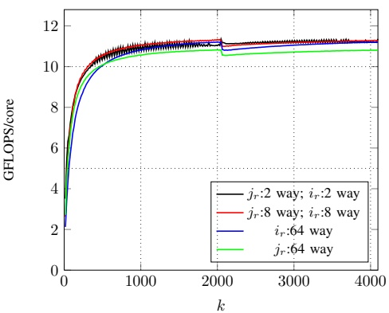</div>


for matrix multiplication appears to support high performance on these architectures. This will soon give the community another open source solution for multithreaded BLAS.

A curiosity is that on both of these architectures the L1 cache is too small to support the multiple hardware threads that are required to attain near-peak performance. This is overcome by using a small part of the L2 cache for data that on more conventional architectures resides in the L1 cache. It will be interesting to see whether this will become a recurring theme in future many-core architectures.

<div style="text-align: center;"><div style="text-align: center;">BLUE GENE/Q 16 CORE DGEMM (M=N=10240)</div> </div>


<div style="text-align: center;">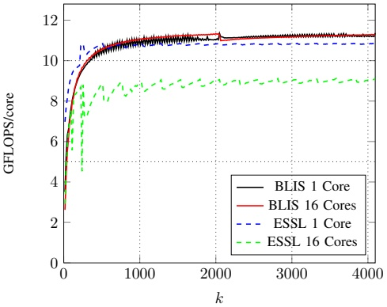</div>


<div style="text-align: center;"><div style="text-align: center;">Fig. 11. Performance comparison of BLIS with ESSL on the PowerPC A2.</div> </div>


## ACKNOWLEDGMENTS

We thank Tze Meng Low and the rest of the FLAME team for their support. The technical expertise of John Gunnels was much appreciated. This work was partially sponsored by the NSF (Grant OCI-1148125/1340293). Some of this work was pursued while Tyler Smith was an intern with the Argonne Leadership Computing Facility (ALCF). This research used resources of the Argonne Leadership Computing Facility at Argonne National Laboratory, which is supported by the Office of Science of the U.S. Department of Energy under contract DE-AC02-06CH11357. We also thank TACC for access to the Stampede cluster.

Any opinions, findings and conclusions or recommendations expressed in this material are those of the author(s) and

do not necessarily reflect the views of the National Science Foundation (NSF).

## REFERENCES

[1] R. C. Agarwal, F. Gustavson, and M. Zubair, “Exploiting functional parallelism on Power2 to design high-performance numerical algorithms,” IBM Journal of Research and Development, vol. 38, no. 5, 1994.

[2] J. Bilmes, K. Asanović, C. Chin, and J. Demmel, “Optimizing matrix multiply using PHiPAC: a Portable, High-Performance, ANSI C coding methodology,” in Proceedings of International Conference on Supercomputing, Vienna, Austria, July 1997.

[3] R. C. Whaley and J. J. Dongarra, “Automatically tuned linear algebra software,” in Proceedings of SC'98, 1998.

[4] B. Kågstrom, P. Ling, and C. V. Loan, “GEMM-based level 3 BLAS: High performance model implementations and performance evaluation benchmark,” ACM Transactions on Mathematical Software, vol. 24, no. 3, pp. 268–302, 1998.

[5] K. Goto and R. van de Geijn, “Anatomy of high-performance matrix multiplication,” ACM Transactions on Mathematical Software, vol. 34, no. 3, May 2008.

[6] F. G. Van Zee and R. A. van de Geijn, “BLIS: A framework for rapid in-stantiation of BLAS functionality,” ACM Transactions on Mathematical Software, 2014, to appear.

[7] F. G. Van Zee, T. Smith, F. D. Igual, M. Smelyanskiy, X. Zhang, M. Kistler, V. Austel, J. Gunnels, T. M. Low, B. Marker, L. Killough, and R. A. van de Geijn, “Implementing level-3 BLAS with BLIS: Early experience FLAME Working Note #69,” The University of Texas at Austin, Department of Computer Sciences, Technical Report TR-13-03, April 2013, a modified version of this paper has been submitted to ACM TOMS.

[8] B. A. Marker, F. G. Van Zee, K. Goto, G. Quintana-Ortí, and R. A. van de Geijn, “Toward scalable matrix multiply on multithreaded architectures,” in European Conference on Parallel and Distributed Computing, February 2007, pp. 748–757.

[9] J. Gunnels, “Making good enough... better - addressing the multiple objectives of high-performance parallel software with a mixed global-local worldview,” 2012, synchronization-reducing and Communication-reducing Algorithms and Programming Models for Large-scale Simulations, talk presented at ICERM.

[10] A. Heinecke, K. Vaidyanathan, M. Smelyanskiy, A. Kobotov, R. Dubtsov, G. Henry, A. G. Shet, G. Chrysos, and P. Dubey, "Design and implementation of the Linpack benchmark for single and multi-node systems based on Intel(r) Xeon Phi(tm) coprocessor," in 27th IEEE International Parallel & Distributed Processing Symposium (IPDPS 2013), 2013.

[11] Z. Xianyi, W. Qian, and Z. Yunquan, “Model-driven level 3 BLAS performance optimization on Loongson 3A processor,” in 2012 IEEE 18th International Conference on Parallel and Distributed Systems (ICPADS), 2012.

[12] E. Solomonik and J. Demmel, “Communication-optimal parallel 2.5D matrix multiplication and LU factorization algorithms,” in Proceedings of the 17th international conference on Parallel processing - Volume Part II, ser. Euro-Par'11. Berlin, Heidelberg: Springer-Verlag, 2011.

[13] R. Agarwal, S. M. Balle, F. G. Gustavson, M. Joshi, and P. Palkar, “A three-dimensional approach to parallel matrix multiplication,” IBM Journal of Research and Development, vol. 39, 1995.

[14] Intel Xeon Phi Coprocessor System Software Developers Guide, Intel, June 2013.

[15] R. A. Haring, M. Ohmacht, T. W. Fox, M. K. Gschwind, D. L. Satterfield, K. Sugavanam, P. W. Coteus, P. Heidelberger, M. A. Blumrich, R. W. Wisniewski, A. Gara, G. L.-T. Chiu, P. A. Boyle, N. H. Chist, and C. Kim, “The IBM Blue Gene/Q compute chip,” Micro, IEEE, vol. 32, no. 2, pp. 48–60, March-April 2012.

[16] I.-H. Chung, C. Kim, H.-F. Wen, and G. Cong, “Application data prefetching on the IBM Blue Gene/Q supercomputer,” in Proceedings of the International Conference on High Performance Computing, Networking, Storage and Analysis, ser. SC '12, Los Alamitos, CA, USA, 2012, pp. 88:1–88:8.

[17] M. Gilge, IBM system Blue Gene solution: Blue Gene/Q application development, IBM, June 2013.
