# The Best Refactoring You've Never Heard Of

**Update 12/31/2019**: I have also written a guest post on this topic for PL Perspectives, with fewer details but more applications.

**Update 7/23/2023**: This title is now a snowclone! See The best multicore-parallelization refactoring you’ve never heard of

(video and transcript of my Compose 2019 talk, given June 25th, 2019.)

## 
*Transcript*

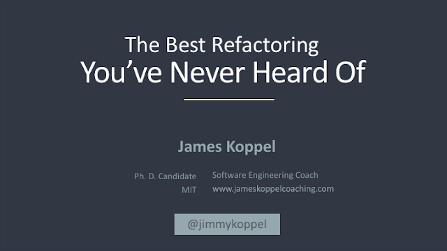

It explains so many changes that I see people like myself already do. This got all of one slide in my web course I teach, but now I'll get a chance to really explain why it's so cool

You are all here to learn.

Learning is about mental representations.

Mental representations are about abstractions.

And abstractions are about equivalences.

Let's look at another equivalence: the equivalence between recursion and iteration.

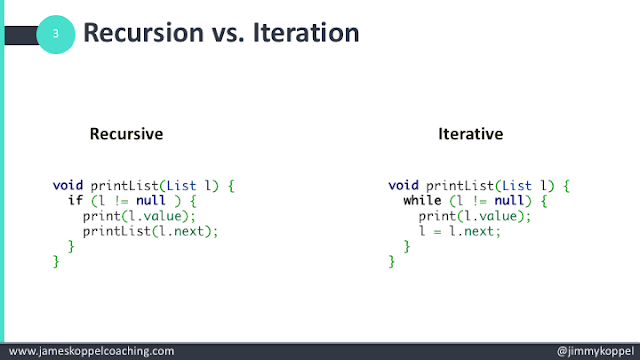 

Many moons ago, you may have been asked to write a recursive function that prints everything in a list, and you write code like so. And then someone else comes up and says, "Oh, I know. I have another way of doing it. Another approach: an iterative version." And now, you know that these are equivalent and it's not really two ideas but two faces of the same approach. You can turn one into the other.

Learning is about mental representations.

Mental representations are about abstractions.

And abstractions are about equivalences.

Let's look at another equivalence: the equivalence between recursion and iteration.

Many moons ago, you may have been asked to write a recursive function that prints everything in a list, and you write code like so. And then someone else comes up and says, "Oh, I know. I have another way of doing it. Another approach: an iterative version." And now, you know that these are equivalent and it's not really two ideas but two faces of the same approach. You can turn one into the other.

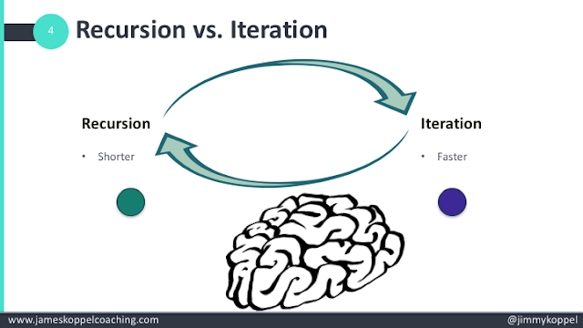

The trade-offs: one is shorter, the other is more memory efficient. You can automatically convert one to the other, get the benefits of both. And because you see this, these two ideas have fused in your head into one and programming becomes that much easier.

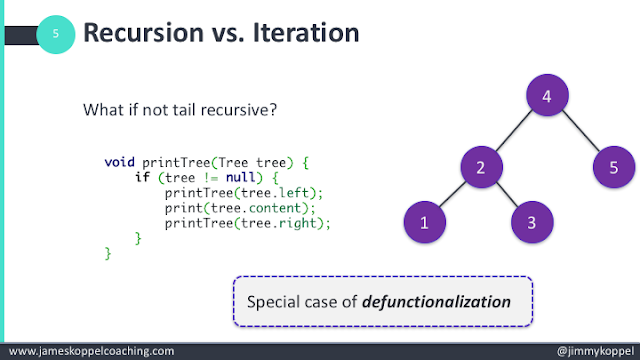

So, equivalences help you see things at a deeper level. But this is not just any random equivalence that I'm bringing up because, imagine, for a second, you're asked to not print everything in a list, but to print everything in a tree. This is no longer a tail recursive function, and you can puzzle out how you would turn this into a loop. You know it has to be possible, using a stack, but: not so cookie-cutter.

Well, what I'd like you to do is now forget anything you knew before about how you would make this iterative, because you don't need that. It's actually a special case of defunctionalization which is what I'm going to be teaching you today.

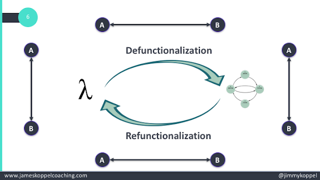

We're going to actually be looking at four different equivalences; variants A and B. Every case, they are the same. There's a way of getting it from one to the other. Perhaps you've already done one of these changes yourself.

But then further, we'll see that actually all four of these techniques are really all instances of one general transformation, defunctionalization, and its inverse, refunctionalization.

 

But then further, we'll see that actually all four of these techniques are really all instances of one general transformation, defunctionalization, and its inverse, refunctionalization.

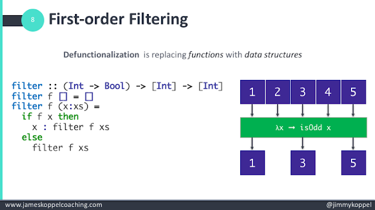

Defunctionalization is about turning functions into not-functions, into data structures. And it starts with the simplest example of: a filter. So, here's a filter function. It's nothing special. It takes in a list of integers and it filters according to some predicate and gives you a smaller list. This is the code you might have seen a thousand times before. But, in the way that filters actually show up in applications, there's something missing here.

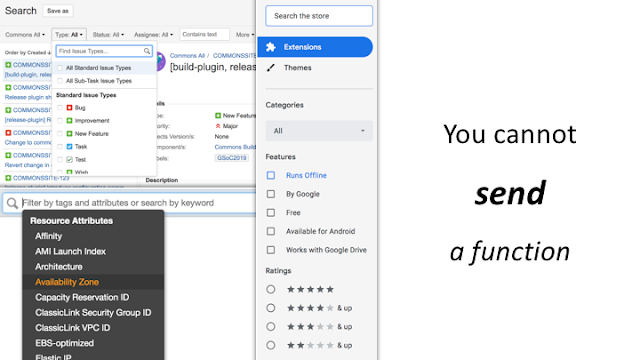

This is Jira. These are its filters. When you're selecting a checkbox from there, you're not picking up a lambda and sending it over to the server. Filtering for instances in AWS, filtering for Chrome extensions — you are never clicking on a lambda and then sending that. You're clicking on something else. Why? Because, barring magic, you cannot send a function.

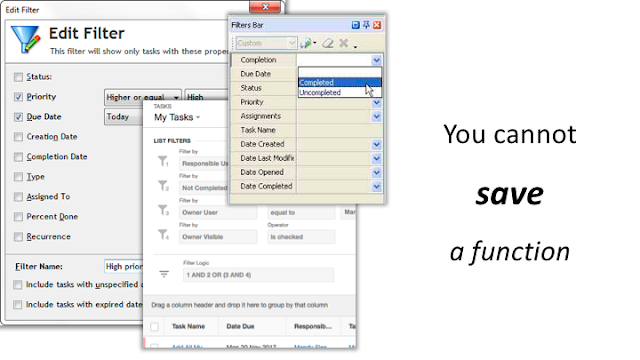

And same goes for desktop apps. Here's a desktop task manager, desktop Jira. Here are a couple other things. All of these have filters that you can save in your preferences so you only view a subset of things.

In every case, you are selecting checkboxes that are not lambdas. So, you probably have an idea of how we implement this. But how does this correspond to the higher-order filter function we had a slide ago? What we're going to do is go from this filter function that takes a predicate as a parameter to something that takes a filter data type as a parameter.

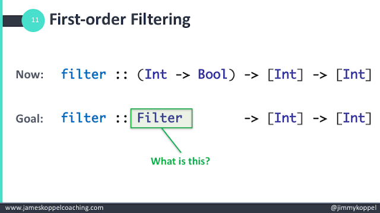 

So, what is this filter data type? We're going to turn the functions into the data type by example. This is defunctionalization by example.

In every case, you are selecting checkboxes that are not lambdas. So, you probably have an idea of how we implement this. But how does this correspond to the higher-order filter function we had a slide ago? What we're going to do is go from this filter function that takes a predicate as a parameter to something that takes a filter data type as a parameter.

So, what is this filter data type? We're going to turn the functions into the data type by example. This is defunctionalization by example.

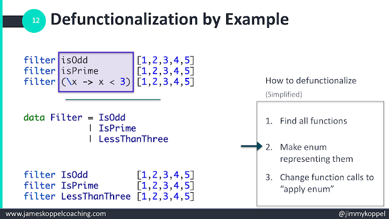

Our first step is: we gather all invocations of the filter function, and there's only a finite number of lambdas you can pass in when we're looking at the whole program. Okay? Now, we create an enum with one case for each function. Three possible functions. Now, we need a way to use them so we go to "filter," we replace all uses of that function with the data type. Now we have to change the filter definition accordingly so, the function type becomes a data structure, and, where before we called the function directly, now we apply a data structure.

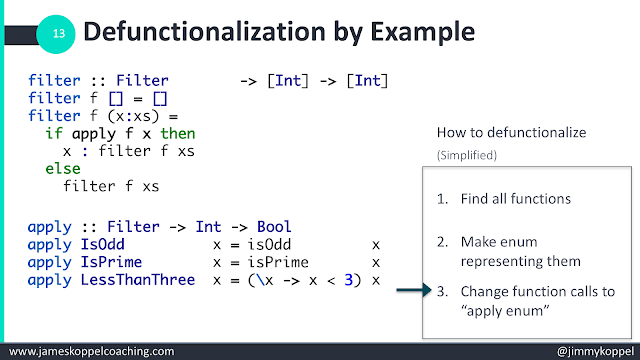

[An animation on this slide shows the old filter function and its invocation morphing into the use of Filter and apply.]

How does that apply work? We grab the code from the places where we use filter. Each case of the data type corresponds to a use of this function. And we put that into our apply. So this was turning all uses of this higher-order function, finding all arguments passed for this function parameter, and we turn it into a data type with those uses as the code for applying it.

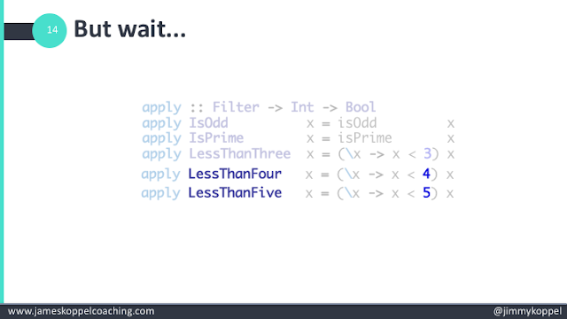

Now, there's something a little unsatisfying about this story. So, I have a LessThanThree built in into my filter language. What if I want LessThanFour? LessThanFive? Do I need an infinite-case data structure? The answer is yes — if you manage to call filter infinitely-many times in your source code, like an infinite-line program. If you don't, then it collapses down. More likely than having infinitely-many calls of case, infinitely-many calls of filter, each with a different integer, you will have one or two calls with a free variable for that other integer.

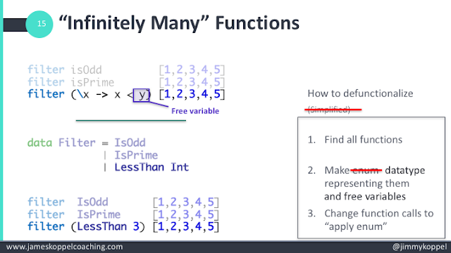

So, the full story of defunctionalization is that those free variables get stored into your data structure. So, it's actually just LessThan and we take that "y" and we stuff it in the data structure. And now, the apply will get updated to use that.

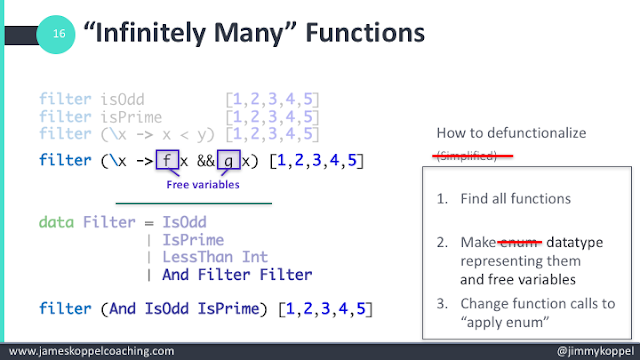

And moreover, these free variables can even be functions. So, here is a lambda that takes in two other functions and gives you the "And" of them. So those functions are free variables, and they even have the same type as the filter itself. Which means, when we turn this into a data type, we get a recursive data type. So this data type is a language of filters, recursive filters.

And I didn't design this data type, it just appeared by moving around the code that was already there. And thus, we get a huge language of filters of "and"'s and "or"'s, purely mechanically.

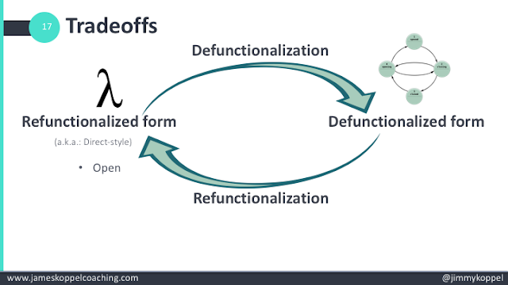

So, now we've seen enough of defunctionalization to start talking about its general trade-offs. The higher-order version, the refunctionalized style or direct style, is open.

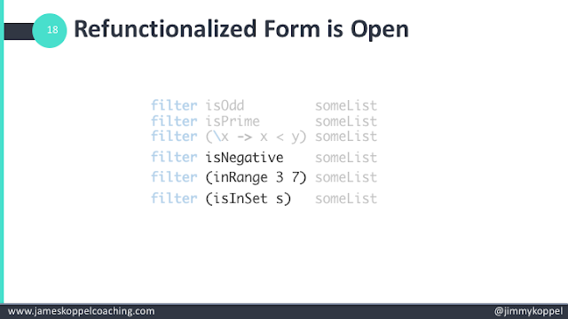

What that means is: imagine that I'm using filter a few times and wanted to call with a different function. All I need to do is call filter again with some other lambda. So the higher order version is open: it's easy to add new variants.

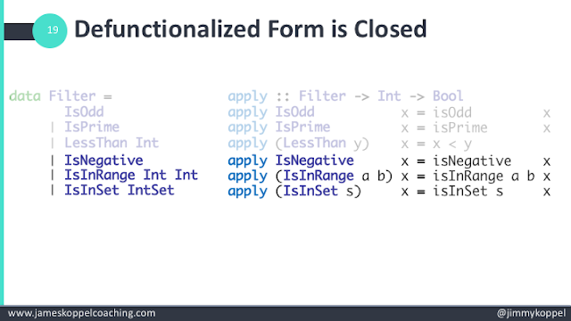

Whereas the defunctionalized version is closed. If I wanted to add one of these new operations, I need to go into filter.hs, into my definition of filter, add this to the data type, add it to apply and only then can I use a new case.

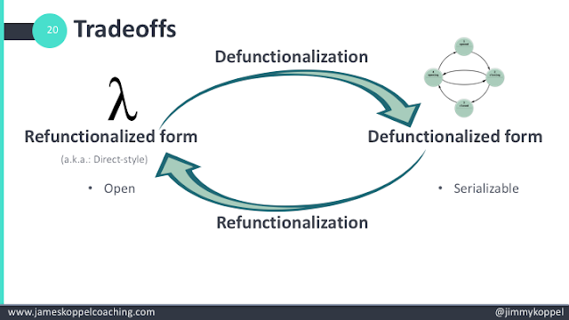

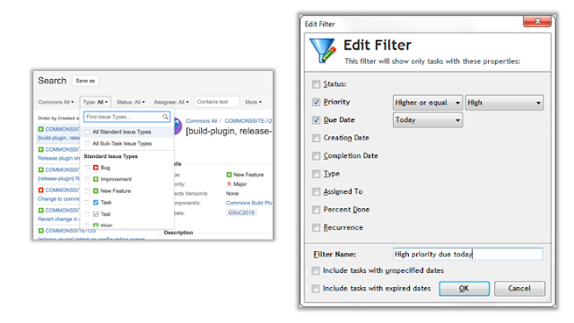

But, what I get from that is that it's serializable. It is possible to, very trivially, send this data structure over the wire, to save to disk, and in doing so, I get the checkboxes that you saw in the actual apps.

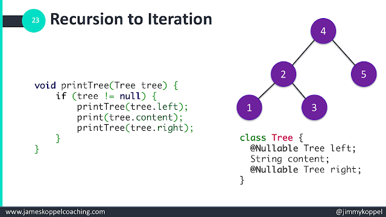

Let's look at another example. In that one, you could have looked at both the before and after code and seen how they correspond, even without this talk. Let's look at an example where that's a lot harder.

So, we're back to printing the tree. So, here's my tree data type, it's nothing special, has a left and a right. We'll just do an inorder traversal, so traverse like this [animation of tree traversal plays] and I'd like you to take a few seconds and try to think to yourself: how would you go about turning this code into the iterative version? And, if that comes to you too easily, then think about, what if you wanted to add parentheses before and after these calls? Then, how do you turn this into the iterative version? Take a few seconds.

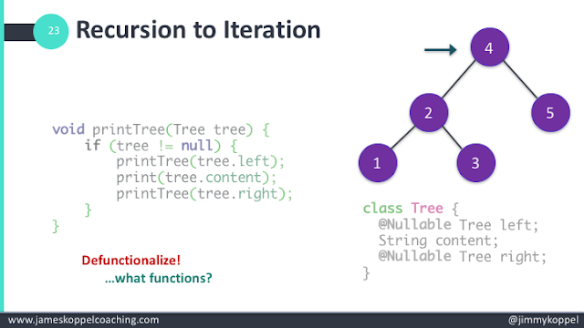

So, the solution, of course, is to use defunctionalization. We'll see the actual code, the iterative version, in a few slides. So, we're going to use defunctionalization but...what functions are there in this to defunctionalize?

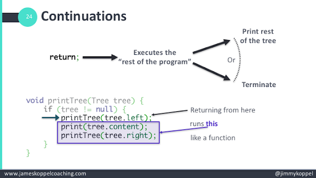

This function returns. It finishes at some point. What happens when you call return? It runs some more code, it runs the rest of the program and, in this case, the rest is either to print the right half of a tree or to be done, finish the entire tree. So, when you run return, it does it like a function. From the perspective of the first printTree, returning from it runs the thing to print the node and the right half of the tree, like a function.

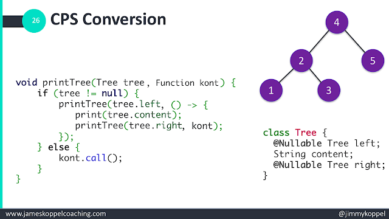

[On this slide, an animation shows the process of pulling the latter half of the body of printTree into a callback.]

So, a lot of you in the room already know about continuations, continuation-passing style, exactly what I was just talking about. So, the first step is to do CPS conversion on this code. So, we're going to pass in the thing to do after the code is finished and wherever we call print tree, we say do this thing after. We wrap that into a function, and, after the whole thing is done — we printed both halves of this tree — then we say "Do the thing after the entire function."

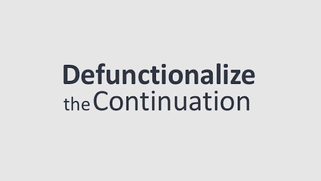

Now, we have some functions to defunctionalize. So what we're going to do: we're going to

**defunctionalize**

**the continuation**. Let's do that.

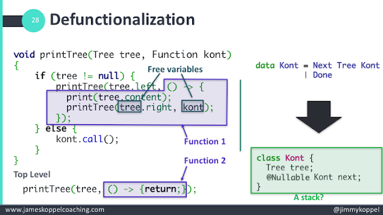

So, there are two possible continuations, two functions to put into our data structure. One is this thing to print a node and the right half of a tree but the other is that, when all is said and done, we're going to finish. So, let's grab these things — oh yes, and when you print the right half of a tree you have to remember what tree you're printing and the thing to do after you've printed the sub-tree.

So, let's rip those out and we have our continuation data type. And it's either done or it prints a tree and then goes on. And, in this case, if you're using a language like Java, then this data type can be encoded elegantly as: we have a tree and a continuation, except that your next continuation might actually be "Done."

Okay, so what is this thing? You have a value and a next pointer. This is a linked list. Not only that but the way we're going to use it is as a stack. We know we want a stack at the end so this is kind of exciting.

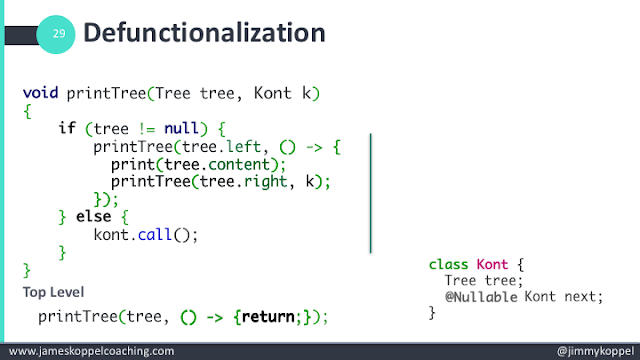

[On this slide, an animation shows ripping out the body of the two callbacks to form the apply function on the next slide.]

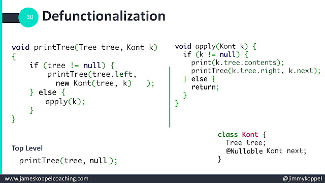

Okay, so let's carry out the defunctionalization, rip out the code; those two cases become my apply. Now, where before, I actually used the action, instead I'm going to pass in a data structure representing the thing to do. And here's a stack, a linked list — a continuation of the rest of the tree to print.

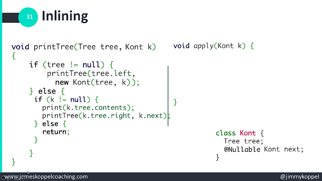

[On this slide, an animation plays showing replacing the call to apply with its body.]

So, it evolves and it kind of looks like a stack but this doesn't look like it's really taking us anywhere. We still have this big recursive function. How is it getting us closer? Well, we're just going to move some things around. Let's do some inlining. Apply is called once; let's move it over. Now this is interesting: printTree is always the last thing called in this function, whenever it's called. This is now a tail-recursive function.

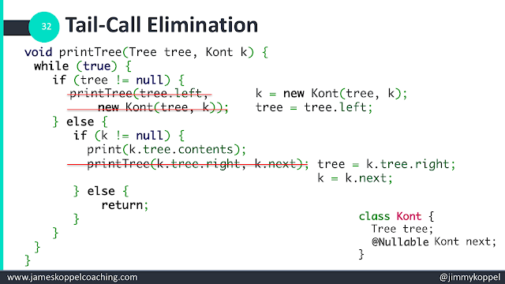

And that means we do the normal trick for making a tail-recursive function iterative. Wrap it in a while(true). Every place before where we would have done a recursive call, we just update the parameters and go on to the next run of the loop.

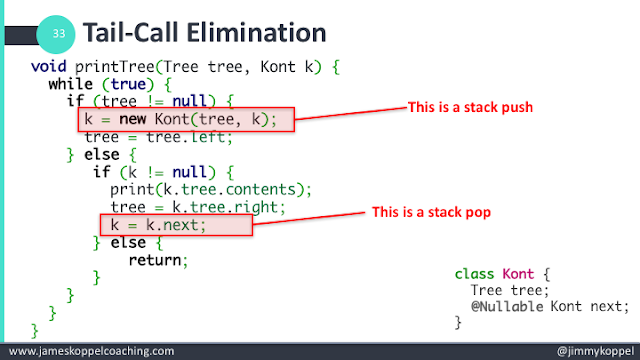

And there's actually something interesting about our use of this continuation type. Where we say k = new Kont(tree, k), that is a stack push. k is only used once so we can make this mutable. Where it says k = k.next, that is a stack pop. And so, this is exactly the iterative solution to this problem. And, in fact, if we did have a more complicated recursion, say, if you want us to use something after you print the right half of a tree, like print a close-parenthesis, the iterative solution could get a lot more complicated. But, if you do the exact same process, you get the code for doing that. No thinking required.

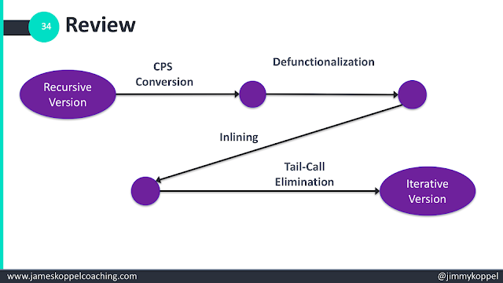

So, let's review. We did a four step process to go from the recursive to the iterative version. First, we made it CPS so these functions appeared. And then we defunctionalized those functions. So now we have these two mutually recursive functions passing around this continuation object. We inlined one to the other. Now it's tail recursive; it becomes a loop. But, of course, the inlining is just kind of moving things around, so we can do the tail-recursion elimination. The big insight that made this all possible, the real workhorse of this transformation, was to

**defunctionalize the continuation!**

So, we've seen two pretty different uses of defunctionalization. Let's take a few moments to go into the history of this.

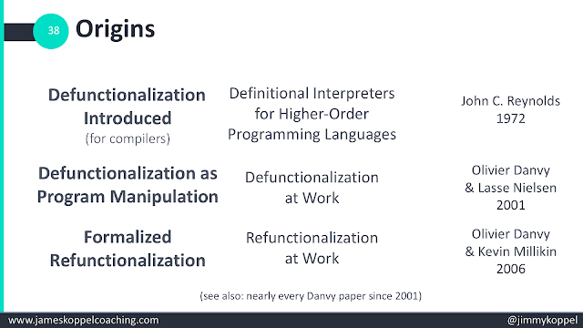

Defunctionalization was invented as a compilers technique by John Reynolds, a man well ahead of his time. I have a language like ML, I want to turn it into C, I need to get rid of all these higher-order functions — let's turn them into data types! There are some compilers that do do things this way. But the problem is, you need to see the whole program to know what this data type should be. So, if you're doing whole program optimization, you can do this, and some of them do. But most people like separate compilation — you know, compile one file at a time — so most compilers don't do this.

But then, around 30 years later, this guy Danvy, he started writing a bunch of papers and he found that this technique is actually also useful as a program manipulation technique. Not for the compiler but for people to turn a program that looks one way into something that looks very different, but does the same thing. So, he started writing a ton of papers using this technique with his colleagues. And he also showed that going the other way, refunctionalization, was also useful.

So, he'd been doing it before but in this paper, "Refunctionalization at Work," he had some cool examples where he took these very old state machine algorithms, said: this state machine, those things look a lot like defunctionalized continuations, let me refunctionalize them. Let me turn them into direct style. And so, he had these parsing algorithms that he then turned into using these nested recursions that were really beautiful, but I probably could have never come up with this fancy nested recursion unless you derive it like this.

So, if you want to see umpteen more examples, usually in programming language semantics, just read any other paper by Danvy since 2001.

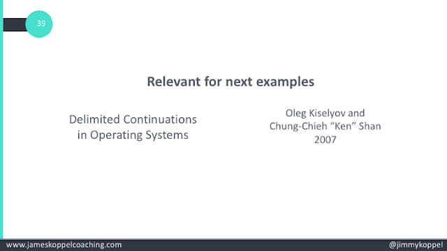

For the next few examples, we're going to be talking about turning the rest of your computation into a data structure, where the rest of the computation actually goes into the operating system and outside of your program. So, for seeing how the continuations act in operating systems, I recommend this paper by Oleg and my friend Ken.

So, let's go into something that probably a lot of people in this room actually do do on a day to day basis. An example of defunctionalization that many of you already do without realizing it: web actions.

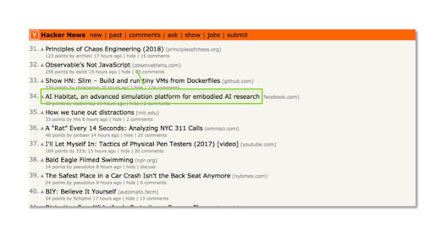

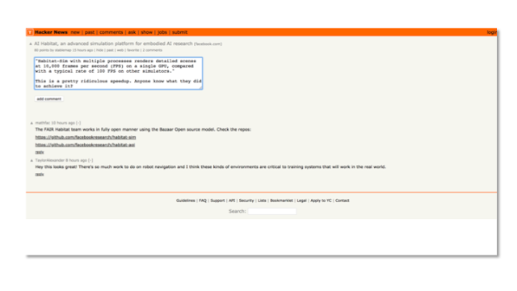

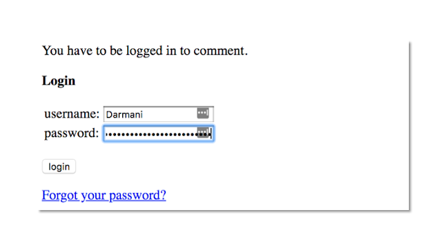

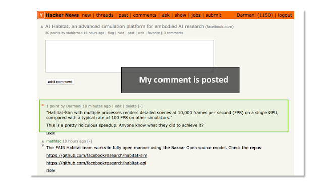

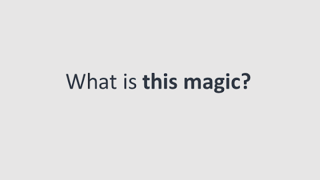

When Hacker News first came out, around 2007, it had this cool feature that was unheard of at that time and that feature was this. I'm logged out. When I start typing in a comment to leave, it takes me to login page. But then, when I finished logging in, it remembered what I was doing and it posts my comment. Wow. What is this magic?

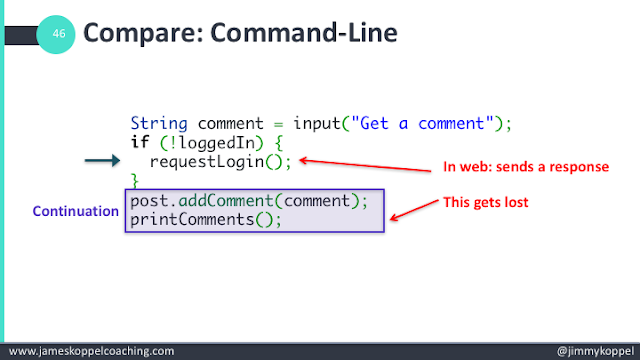

The way it worked back then is using continuations. To illustrate, I'm going to show, imagine you're writing a command-line version of Hacker News. The code will look pretty different from what you would do for the web, if you do things the normal web way.

You say, all right, give me a comment, oh wait you're not logged in! Let me print out "Enter username and password." Then you print out the result of composing the comment. This is five lines of code, all direct-style, but really there are already continuations going on here. From the perspective of a request to login, the rest of the action is a continuation. And so, in web, when you request login, it actually sends a response across the network to get a new web page. But the same idea is going on that the rest of this action is a continuation.

But, when you do things the normal way, just go to login page, the rest of the action just gets lost. So, for Hacker News, they decided to not lose the continuation.

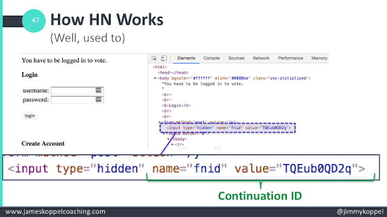

So, here is the old version of Hacker News, the open-source version. And my login screen, it's actually tracking this function ID. The server knows that this is the hash of a lambda that is a continuation. The rest of my action that I want to do when it completes the login. And so that's how it remembers the comment I was in the middle of posting.

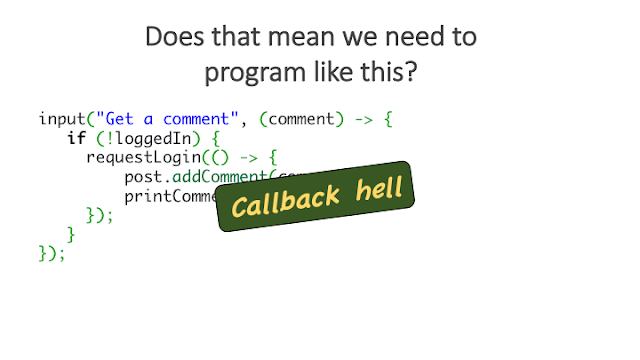

So, continuations. Before, in all my slides, I've had to nest lambdas and everything whenever we did continuations. Does that mean that Hacker News is written like this? This is callback hell. If you've done server-side JavaScript pre-ES6, then it's all too familiar to you. Well, yes and no, but even still, there's something really unsatisfying about this. So we take that continuation and just turn it into an ID, a lambda, there are things you can't do.

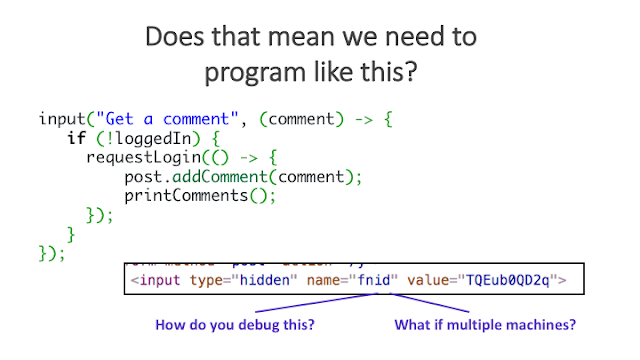

So, what if something goes wrong? Oh, I was in the middle of doing continuation "TQE.." — what does that mean? And also, what if you wanted to load-balance Hacker News so that, when you log in, it actually sends you to a different server, that other server doesn't have a map saying "this hash ID is this lambda." You cannot send a function.

So, in order to load balance this, to make this work across machines, you need to do something else. And that something else is, repeat after me:

**defunctionalize the continuation!**

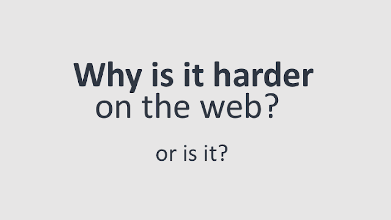

Pause for a second. Let's think about why is doing this kind of interaction harder on the web than direct-style? Well, is it really? I've already explained that direct style is involving continuations behind the scenes. So let's take a closer look at that.

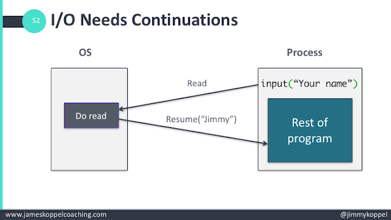

So, when I do a read, it sends a system call to your operating system. Really, the operating system now captures the rest of my program as continuation. It stores this continuation. Then it does its thing and then it invokes the continuation to jump back to my program. So this style of continuations is coroutines.

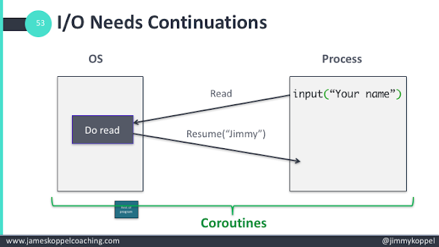

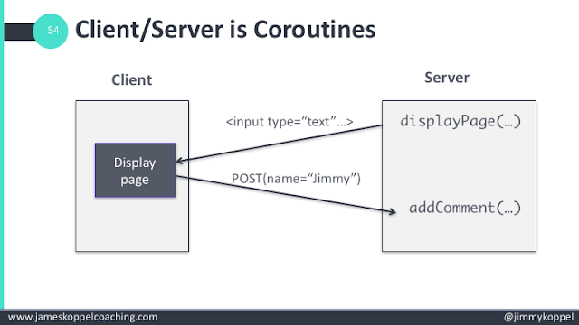

Client/server is also coroutines. I have a big interaction and I've just split into parts, so: go display the page. That's like a system call. Then I invoke the continuation, jump back into the server; it's one action split across two processes. Coroutines. So that suggests that we can use similar tricks to how the operation system is making your thing direct-style to also make the web version nice code.

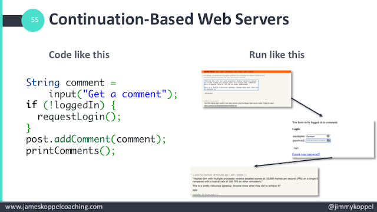

So, Hacker News was written in a continuation-based web server where your code is direct-style like on the left but it still runs across multiple web pages like on the right.

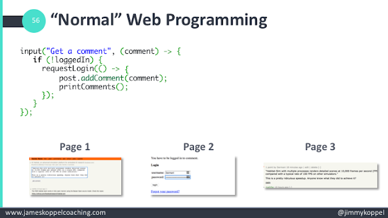

[On this slide, an animation runs, transforming the three parts of the code snippet into the three webpages.]

And, of course, when you do normal web programming, you really have done this part by hand. You've broken your action to pieces, one for each continuation, split into parts. Each of those is its own web page. And now, let's talk about defunctionalizing the, help me, continuation!

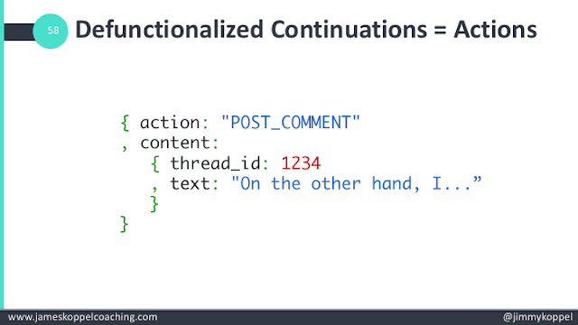

When you defunctionalize the continuation, it looks like this. That's kind of, well, that looks kind of familiar. So, I have an ID saying which continuation. I have some parameters for the free variables of that continuation, for the things it has to remember and what it needs to do next. And, that looks a lot like things that web programmers do every single day.

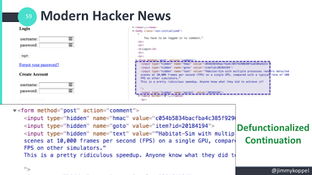

And that is, in fact, how modern Hacker News works, where instead of having a function ID, it now has an action name and values, saying what to do next. So, presumably, the modern maintainers of Hacker News have, by hand, defunctionalized these continuations and split everything into parts and ruined all the beautiful, beautiful code that Paul Graham used to brag about.

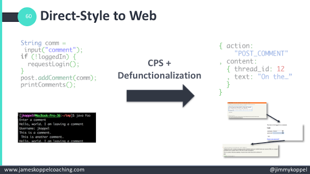

So, this is the story of why doing interactions in web is kind of nastier than on a command line, in that we, by hand, have to take these actions, break them into pieces, defunctionalize them, give them names and data structures. So, if you're a normal web programmer and you really are trying hard to do things as cleanly as for the command line then, either you figure out how to automate this process, or you throw up your hands and weep and accept fate.

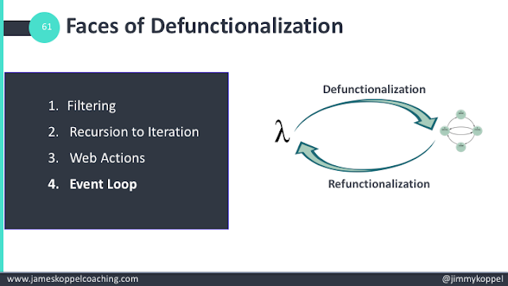

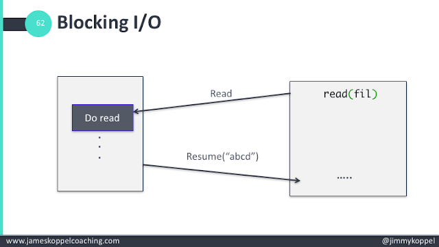

Going to do one more example which is very similar in flavor to this last one. Let's talk about blocking I/O again. So, as before, you do a read, it does a system call then the computer goes, does its thing, then it invokes the rest of your program and resumes. So, a lot of people don't like that. It's slow, things stop. So there are many styles of non-blocking I/O and I'm going to talk about non-blocking I/O via notifications.

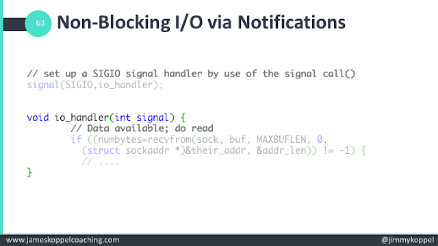

In Linux, this is done via SIGIO. That means you tell the operating system, "I want you to read this file and give it to me in this buffer." And then, you keep going and do your thing and a bit later, the operating system says, "Stop! I finished your read, here it is," and it runs some code in your process saying, "You can now use this data." So, now we're going to talk about this non-blocking via notifications I/O system.

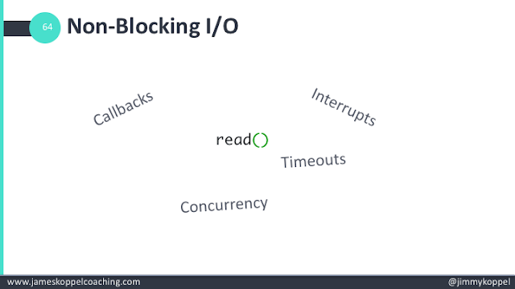

Now, of course, there are many ways to do non-blocking I/O but, for pretty much all of them, you have all this extra stuff to worry about and concurrency and so, let's talk about how, really, these kind of I/O notifications are just like the direct style but where you have defunctionalized the continuation.

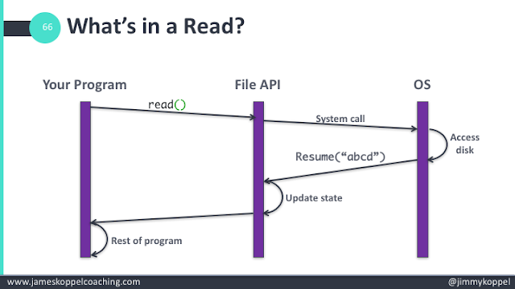

Let's take our laser eyes back to the read. So, here we've split your system up into three parts: Your program, the actual file.h code, and the operating system. So, you tell the file to read, it does some stuff; it eventually goes to the operating system. The operating system does its thing. Now, it goes back to your file.h, updates some state, saying, "This file has read this many bytes," blah, blah blah. Then it goes through the rest of your program.

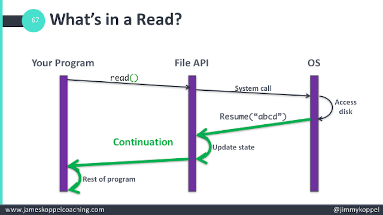

So, from the perspective of accessing the disc, all the stuff that happens afterwards is the continuation. If we take only part of this process, like the part with immediate relevance to what happens when you finish reading, that is a delimited continuation.

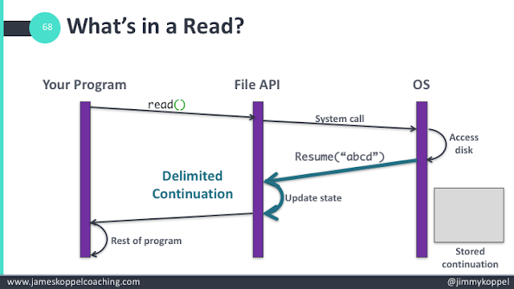

And so, when we create a notification action, it's really this delimited continuation, this piece of the rest of your program related to when you finish the read, that gets stored somewhere, and then invoked when the read is completed.

So, these notification actions are really a running a delimited continuation. But, not only that, it's running delimited continuation in defunctionalized form.

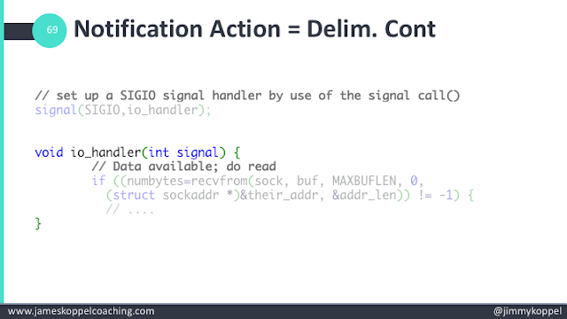

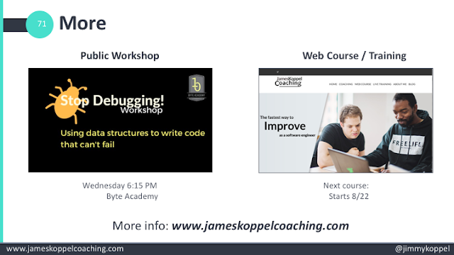

We've taken a big tour through various problems in programming and seen how one idea can unify all of them and help you see things at a deeper level. So, helping programmers see things at a deeper level, write better code as a result, is what I do. And I'd like to...

[This paragraph was an advertisement for a workshop I gave the following evening at Byte Academy in NYC, which has now passed. If you liked this talk, I encourage you to check out my web course on advanced software design.]

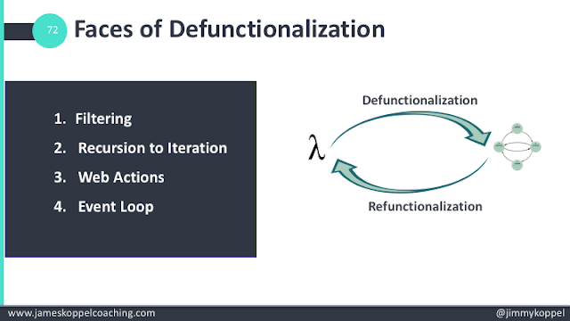

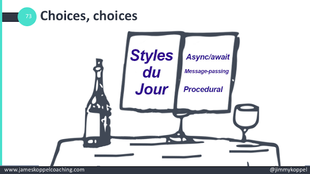

So, we looked at all these examples, and, often when you're programming, you have an idea and you have so many ways to do it. I want to do actions, async/await, method passing, so many things, can read a book about each of them, so much to learn. And it's really just too much to learn.

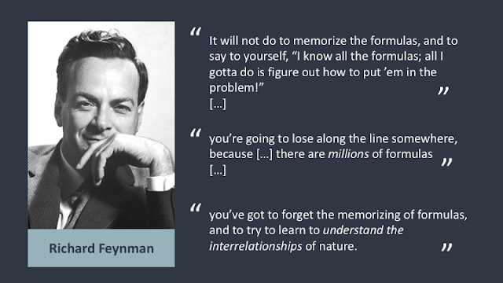

In physics, Feynman tells us that you cannot memorize formulas. You can't just go to the book, memorize formula, learn to apply it. There's too many of them. Instead, we need to learn about the relationships between the formulas. Derive them for yourself when they're needed.

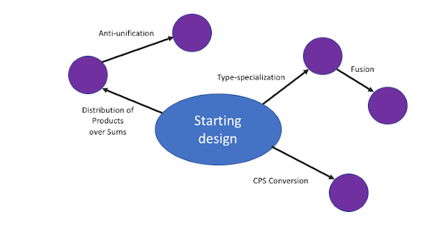

And so, we want to do the same in programming. See many different APIs, many concepts, and see how there are fewer deeper ideas behind them. So, instead of seeing a bunch of approaches to a problem, I want you to see a web of, a single design and various ways you manipulate it to exactly the outcome that you want. So these are many transformations. Each of them could be their own talk or article. But today, I've taught you one very important transformation, not to rule them all but to rule a lot of them. And that is to, everyone with me,

**defunctionalize the continuation!**

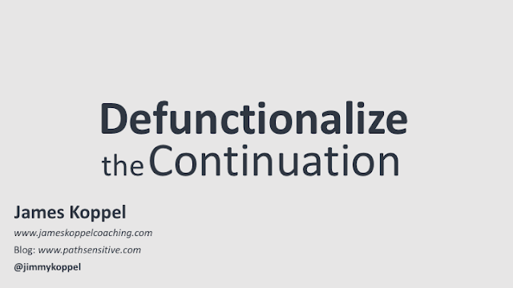

Thank you — this is great!! It ties together so many things I've been interested in over several decades (open vs closed, noun vs verb, recursive vs iterative, continuations, operating systems, compilers, serialization). I got out of the programming language research world by the late 90s and hadn't seen Danvy's papers since then.

ReplyDelete
Also, thank you for the transcript. I am better at reading than at listening.

On slide 56, how is post handled if you are already logged in?

ReplyDelete
I am probably not understanding the notation here, but it looks like you would need an explicit else.

Great article!

Yep, that's off-screen.

Delete
But ... do you know anything Brooks and Ritchie and Thompson didn't teach us?

ReplyDelete
A great article - thank you. Very useful when working with graphs which, when done correctly, are "defunctionalized (bits of) data" using the terminology/concepts of this article.

ReplyDelete
This is a very clear explanation. We are also exploring related systems at our university. Feel free to check our research at https://surabaya.telkomuniversity.ac.id/. Thanks for this useful post!

ReplyDelete
At first this comment looked like a cyberattack, but I'm thinking now it probably isn't. I'm leaving it up, but I still haven't dared to open the link directly in my browser. It appears to be the front page of a university in Indonesia, so it probably does not directly contain information about research in defunctionalization -- maybe you can share some publication links directly?

Delete
