# Fearless Concurrency on the GPU

Melih Elibol

melibol@nvidia.com

NVIDIA

USA

Jared Roesch

jroesch@nvidia.com

NVIDIA

USA

Isaac Gelado

igelado@nvidia.com

NVIDIA

USA

Eric Buehler

eric@huggingface.co

Hugging Face

USA

Michael Garland

mgarland@nvidia.com

NVIDIA

USA

## Abstract

Rust has made safe systems programming practical on the CPU, but writing custom GPU kernels in Rust still forces programmers outside the language's ownership guarantees. We present cuTile Rust, a tile-based system for safe, idiomatic GPU kernel authoring in Rust. cuTile Rust extends Rust's ownership discipline to tile-based GPU kernels: mutable outputs are split into disjoint pieces, kernel launches preserve the host-side ownership contract, and programmers can opt out locally when they need lower-level control. The system also provides a composable host execution model spanning synchronous launches, asynchronous pipelines, and CUDA graph replay.

Our evaluation shows that these abstractions can preserve performance on high-end GPUs. On the NVIDIA B200 GPU, cuTile Rust achieves 7 TB/s for element-wise operations and 2 PFlop/s for GEMM (96% of cuBLAS), matching cuTile Python within measurement noise. Grout, a cuTile-Rust-based inference engine, exercises cuTile Rust across an end-to-end Qwen3 inference path. In batch-1 decode, Grout reaches 171 generated tokens/s for Qwen3-4B on the NVIDIA GeForce RTX 5090 and 82 generated tokens/s for Qwen3-32B on the B200, competitive with vLLM and SGLang and consistent with an HBM roofline sanity check.

## 1 Introduction

The Rust language makes programming with static safety guarantees both practical and efficient. These qualities are particularly attractive in applications that must coordinate the activity of many threads working on shared data objects. Modern AI frameworks and LLM inference engines are both important examples of such applications. Several Rust-based projects in these areas have been developed [5, 6, 10], focusing on host-side tensor programming and engine integration. Such applications perform computations where parallelism is abundant, and significant portions of their workloads are built around tensor operations. Consequently, they have a strong desire to use GPUs for these computations. However, GPUs do not fit comfortably into the current Rust ecosystem.

GPU-accelerated applications contain code for both the CPU (host) and GPU (device) processors. The host code allocates data, builds kernel arguments, and submits work for execution on the device. Host and device code must typically execute asynchronously for best performance. Some means of transmitting ownership information across the host/device boundary is necessary for the type information that made the host program safe to be carried across to the GPU kernel. Device kernels themselves execute code in a single-program multiple-data (SPMD) fashion. Many threads begin execution at the same entry point with the same arguments, and they are differentiated only by access to a per-thread coordinate. Correct synchronization and prevention of data races is left in the hands of the programmer.

The Rust compiler (rustc) is able to generate device code for NVIDIA GPU's via the LLVM PTX backend. Other projects have experimented with other code generation paths [7, 19, 21], further demonstrating that the Rust language can be compiled to efficient GPU machine code. However, in each of these cases the kernels being compiled are treated as unsafe code.

With cuTile Rust, we aim to create a programming model that provides Rust's safety guarantees across both host and device code. We adopt a tile-based model for kernels [17, 18]. Tiles are immutable array-like values of fixed size. Kernels consist of a grid of tile programs, each of which is modeled as a single logical thread of execution over tiles of data. Loading from a tensor in memory produces a tile, tile operations produce new tiles, and stores target mutable sub-tensors in memory. For grids that require more than one output sub-tensor per program, cuTile Rust provides branded partition indices and bounded dimension iterators, letting the front end prove that common partition accesses are bounded and disjoint. We define tensor types that allow immutable tensors to be passed from host to device as is, while mutable tensors are partitioned before launch and mapped to mutable sub-tensors within the kernel grid. For efficiency, our compiler removes dynamic checks when the invariants are known, and we use iterator types to carry the disjoint bounds information needed for partition access. The tensor operations performed in host code compose into lazy GPU work that can be executed synchronously, submitted asynchronously to a stream, or captured as a CUDA Graph for later replay.

We make the following contributions:

1. A safe, high-performance model for Rust in which host tensors map to device-side tensor and partition views, tile kernels execute with single-threaded semantics, and branded bounded indices let the front end prove common partition accesses safe while avoiding dynamic checks in hot loops.

2. A collection of explicit unchecked types that provide the means to opt out of the safe tensor API for unsafe code that requires complete low-level control.

3. A macro system that automatically generates host launching code that prepares host tensors and borrows for kernel execution, prevents host access while GPU work is in flight, and returns ownership in the same form after the stream completes.

4. Lazy composition of device operations supporting synchronous execution, async execution, and scoped CUDA graph capture over the same typed kernel launches.

The resulting system provides both expressive and efficient mechanisms for programming GPUs within safe Rust. Our benchmarks on an NVIDIA DGX B200 reach roughly 7 TB/s for element-wise operations and 2 PFlop/s for GEMM, which is within about 96% of cuBLAS performance. Our empirical results match cuTile Python performance within measurement noise. Furthermore, we measure end-to-end performance on Grout, a Qwen3 LLM inference engine built upon cuTile Rust, and demonstrate that throughput is consistent with an HBM roofline sanity check.

## 2 Overview

In this section, we walk through a complete cuTile Rust program showing a safe host API, a typed launch boundary, and backend tensor and partition views. We start with a complete element-wise add program. The example shows the user-facing model: host code constructs tensors and partitions the mutable output, while device code runs a tile program for each output partition.

Listing 1 separates host-side tensor setup from the device-side tile program. On the host (lines 19–25), the program creates two input tensors, partitions the mutable output into 128-element chunks, and launches the generated operation with .sync(). The launch holds the tensors while GPU work is in flight and returns them only after the stream completes.

The kernel signature (lines 7–11) carries the access discipline into the device code. The output parameter is an exclusive mutable tensor tile (&mut Tensor), while the inputs are shared read-only tensors (&Tensor). The body (lines 13–15) loads input tiles matching the output partition with

```rust
use cutile::prelude::*;

#[cutile::module]
mod kernel {
  use cutile::core::*;

  #[cutile::entry()]
  fn add<const B: i32>(
    z: &mut Tensor<f32, {[B]}>,   // exclusive write
    x: &Tensor<f32, {[-1]}>,      // shared read
    y: &Tensor<f32, {[-1]}>,      // shared read
  ) {
    let tx = load_tile_like(x, z);
    let ty = load_tile_like(y, z);
    z.store(tx + ty);
  }
}

fn main() -> Result<()> {
  let x = api::ones::<f32>([1024]);
  let y = api::ones::<f32>([1024]);
  let z = api::zeros::<f32>([1024]).partition([128]);
  let (_z, _x, _y) = kernel::add(z, x, y).sync()?;
  Ok(())
}
```

<div style="text-align: center;"><div style="text-align: center;">Listing 1. Element-wise addition in cuTile Rust. The host (lines 19–25) partitions the output and passes inputs as shared reads; the kernel (lines 4–17) operates on tiles with single-threaded semantics. No unsafe appears anywhere.</div> </div>


load_tile_like, computes a new tile, and stores it through the exclusive output reference.

### 2.1 Rust's Ownership Model

The relevant Rust rule is aliasing XOR mutability: A value may have either one mutable reference ($\&mut\ T$) or any number of immutable references ($\&T$), but not both simultaneously. This rule is zero-cost and data-race-preventing, but it is deliberately conservative for parallel writes. Rust's answer is not to make every pattern safe by default; it provides safe abstractions where the compiler can verify the invariant, runtime checks when the invariant is not known statically, and explicit unsafe escape hatches where the programmer supplies an invariant manually. On GPUs, pervasive runtime checks are especially costly because they sit on hot per-tile or per-element paths, so cuTile Rust follows Rust's structure while trying to prove common tensor invariants before launch.

### 2.2 GPU Programming Model

GPU programming splits host-side launch from device-side execution: Rust's typed values collapse to raw pointers and scalars at the launch boundary, while device kernels run many SPMD/SIMT threads whose varying integer coordinates, hierarchical memory, and explicit synchronization make address disjointness and visibility programmer-managed invariants. A tile-level abstraction narrows that safety problem. cuTile Rust keeps CUDA's host launch and device execution structure, but raises the device program to a tile-level abstraction: The programmer writes sequential code over multidimensional tiles, and the compiler maps tile operations to thread blocks, manages shared memory, and performs the parallel decomposition. This is a powerful GPU programming model: element-wise kernels, matrix multiplication, reductions, normalization, attention kernels, and many fused tensor operations are naturally tile-shaped. The safety payoff is that the important operations are loads, stores, matrix multiplies, and reductions over whole tiles, not arbitrary per-thread shared-memory protocols. Combined with host-side tensor partitioning, that structure makes ownership over mutable output regions tractable to check.

### 2.3 Memory Ordering

GPU compilers can reorder memory operations whenever the language and the IR memory model permit it. CUDA C++ exposes the required ordering through barriers, fences, atomics, and other synchronization operations; Tile IR [17] exposes it through tokens. A token produced by one memory operation and consumed by another establishes the ordering edge between them, while operations without token dependencies may be reordered. cuTile Rust uses these token chains to make mutable tensor operations internally synchronized, rather than requiring the programmer to supply an external synchronization protocol. This fits Rust's type system: exclusive tensor accesses carry ordering through the mutable view, while shared tensor reads remain free for the compiler to reorder.

This token model lets cuTile Rust preserve only the ordering implied by Rust's reference types:

• &mut Tensor → token-ordered operations. The compiler threads tokens through every load and store, preserving sequential semantics.

• &Tensor → unconstrained operations. No tokens. The compiler reorders freely for performance.

## 3 Design

Our safety model covers the host, the launch boundary, and the kernel, with per-kernel opt-outs where the programmer chooses. On the host, a composable execution model builds lazy typed GPU work (§3.2). At the launch boundary, generated host interfaces and device entry code preserve Rust's ownership and aliasing invariants as host types become kernel parameters (§3.3). Inside the kernel, tensor partitioning and Tile IR token ordering provide disjoint mutable views and intra-tile happens-before (§3.4). Mapped partitions and bounded iterators extend the same safe surface beyond one-output-sub-tensor-per-program kernels to kernels in which

```text
T := bool | int | float
D := n ∈ Z⁺ | -1
S := [D₀, D₁, ..., D_{N-1}] | [D; N], N ∈ Z≥0
Param := &mut Tensor<T, S> | &Tensor<T, S>
  | MappedPartitionMut<T, S, M>
  | T | *mut T
```

<div style="text-align: center;"><div style="text-align: center;">Figure 1. Type grammar at the kernel launch boundary. $T$ ranges over scalar element types; current upstream formats include booleans, integers, and GPU floats. For dimensions, $n \in \mathbb{Z}^{+}$ denotes a static const generic and $-1$ denotes a dynamic runtime dimension; a shape may mix the two (e.g., $[1024, -1]$). $N=0$ is a rank-0 (scalar) tensor or tile, distinct from the Param scalar form $T$. $S$ and $M$ are dimension arrays; in MappedPartitionMut, $S$ is the output sub-tensor shape and $M$ is the partition-map parameter, which controls how tile programs traverse the grid of output sub-tensors.</div> </div>


each tile program loops over a bounded sequence of output sub-tensors (§3.6). Unsupported patterns remain explicit unsafe opt-outs.

### 3.1 Programming Model Overview

A cuTile Rust program consists of a tile module (#[cutile::module]) containing device-side functions. These functions may call one another from device code. Functions marked with #[cutile::entry()] are entry points: cuTile Rust generates typed host-side launch interfaces for them, and only these entry points are directly invocable from host code. Host code creates tensors, partitions mutable outputs, and launches kernels through these generated typed entry points. The generated host interface and device entry code define the host-device launch contract, preserving Rust's ownership and aliasing invariants for safe parameters. Figure 1 defines the kernel parameters used by cuTile Rust. The proc macro enforces this grammar at compile time.

### 3.2 Device Operations

Host-side GPU work is built around DeviceOp, a trait for lazy, typed GPU work. A DeviceOp owns or borrows its operands, carrying the lifetimes required by the pending GPU work, exposes the output type that will be returned, and composes with other operations before anything is submitted to CUDA. This trait separates building work from executing work, which lets the type system check a whole launch sequence before the GPU sees it. Like Rust's iterators, DeviceOp builds work statically: its combinators compose a nested operation type at compile time, and nothing runs until a terminal consumer drives it. Composition is monadic, with then acting as bind to sequence a dependent operation onto a prior one. The same composed work can run synchronously, through any Rust async executor, or be captured as a CUDA graph. Listing 2 sketches the execution boundary:

```rust
trait DeviceOp {
  type Output: Send;
  unsafe fn execute(self, cx: &ExecutionContext)
    -> Result<Self::Output>;
  fn sync(self) -> Result<Self::Output> {
    let cx = ExecutionContext::new(next_stream()?);
    let out = unsafe { self.execute(&cx) }?;
    cx.stream().synchronize()?;
    Ok(out)
  }
}

// proc macro builds AddLaunch + DeviceOp impl
impl DeviceOp for AddLaunch {
  type Output = (Partition<Tensor<f32>>, Tensor<f32>, Tensor<f32>);
  unsafe fn execute(self, cx: &ExecutionContext) -> Result<Self::Output> {
    let (z, x, y) = self.args.execute(cx)?;
    let f = self.cached_or_jit(cx)?;
    launch(f, &z, &x, &y, cx.stream());
    Ok((z.recover(), x.recover(), y.recover()))
  }
}
```

<div style="text-align: center;"><div style="text-align: center;">Listing 2. The DeviceOp trait and the execute generated for the add launcher of Listing 1. execute is unsafe because the output's device writes may still be in flight; safe sync runs it on a stream, synchronizes, and only then returns the recovered arguments.</div> </div>


The .sync() call in Listing 1 runs the launcher's execute method, which takes an execution context (the CUDA stream, device, and memory pool). It first runs the operations that produce the kernel's arguments: in Listing 1, the zeros and ones allocations and the partition call, which asynchronously allocate $z$, $x$, and $y$ and partition the output $z$, all on the stream. It then fetches the kernel from the JIT cache or compiles it, sequences the launch on the same stream so it runs only after those inputs are ready, and recovers the arguments in their host types. Because the launch is asynchronous, the returned tensors may name memory whose writes are still in flight, so execute cannot be exposed as a safe operation. The safe sync method restores Rust's usual boundary: it runs execute on a stream, synchronizes, and only then returns the recovered output. This general pattern ensures that DeviceOp composition is safe.

Combinators include then (chain with data dependency), zip! (combine independent ops), shared (cloneable, execute-once), map, first, boxed. Chaining with then submits the dependent operation to the same stream, so it observes the prior operation's writes without explicit synchronization. The DeviceOp returned by the generated launcher uses the recover() protocol defined below (Table 1) to return ownership to the caller after execution completes.

The work represented by a DeviceOp can be executed in three primary modes:

```rust
let graph = CudaGraph::scope(&stream, |s| {
  let hidden = input.view(&[1, d])?;
  s.record(rms_norm(
    (&mut bufs.norm).partition([1, d]),
    &hidden, &w.norm_w, eps,
  ).generics(rms_generics))?;
  s.record(matvec(
    (&mut bufs.q).partition([bn]),
    &bufs.norm, &w.wq,
  ).generics(mv_generics))?;
  s.record(add(
    (&mut bufs.residual).partition([block]),
    &input, &bufs.q,
  ))?;
  Ok(())
})?;
```

<div style="text-align: center;"><div style="text-align: center;">Listing 3. One layer of an inference forward pass using CudaGraph::scope. Borrows are released between record() calls, enabling safe buffer reuse. The view() call creates a zero-copy TensorView that borrows input without copying.</div> </div>


- .sync(): Execute and block until complete; the simplest mode for ordinary host code.

- .await (via IntoFuture): Execute and yield the current task until complete, for integration with async Rust.

- .graph(): Capture the composition as a CUDA graph, replayed for work launched repeatedly that needs low-latency execution.

CUDA graphs. For imperative-style graph construction, CudaGraph::scope provides a closure-based API where each s.record(op) records a graph node. A recorded operation is added to the capture stream but is not executed as an independent kernel at that point; the recorded work runs only when the captured graph is launched. This is the key borrow-safety fact: Releasing a borrow after record() does not race with the recorded node, because the node has not yet executed. The graph preserves the stream order established during capture, enabling safe buffer reuse between kernels within a single graph. The implementation uses a GraphNode marker trait to restrict capture to non-allocating operations, so replayed graph nodes do not depend on addresses from allocations that would be unstable across replays.

Listing 3 shows one layer of an inference forward pass written with this API, in which TensorView is a borrowed tensor descriptor: It changes shape, stride, or slice metadata while pointing at the same device allocation. Several features are worth noting. The input.view(&[1, d])? call creates a view that borrows input without copying. The view is dropped after the first s.record(), releasing the borrow so input can be reused by the residual add. Mutable buffers use (&mut bufs.norm).partition([1, d]) to create partitions from exclusive borrows. These are ordinary Rust borrows: While a view or partition is live, the caller cannot mutate the underlying tensor through another path.

<div style="text-align: center;"><div style="text-align: center;">Table 1. Host-to-device type mapping at the kernel launch boundary. Each row shows the host-side Rust type, the device-side kernel parameter it maps to, and the ownership semantics enforced by the borrow checker. T is the element type; S is the shape const generic; M is the partition-map parameter. For compactness, P<X>, MP<X>, and MT<T, S, M> abbreviate Partition<X>, MappedLaunchPartition<Partition<X>>, and MappedPartitionMut<T, S, M>. Entries with move semantics transfer the host tensor into the kernel launch; tile programs on the device then see the tensor through an exclusive &mut (when partitioned) or a shared & (when not).</div> </div>

<table border=1 style='margin: auto; word-wrap: break-word;'><tr><td style='text-align: center; word-wrap: break-word;'>Host type</td><td style='text-align: center; word-wrap: break-word;'>Device type</td><td style='text-align: center; word-wrap: break-word;'>Semantics</td></tr><tr><td style='text-align: center; word-wrap: break-word;'>P&lt;Tensor&lt;T&gt;&gt;</td><td style='text-align: center; word-wrap: break-word;'>&amp;mut Tensor&lt;T, S&gt;</td><td style='text-align: center; word-wrap: break-word;'>move; exclusive</td></tr><tr><td style='text-align: center; word-wrap: break-word;'>P&lt;&amp;mut Tensor&gt;</td><td style='text-align: center; word-wrap: break-word;'>&amp;mut Tensor&lt;T, S&gt;</td><td style='text-align: center; word-wrap: break-word;'>borrow; exclusive</td></tr><tr><td style='text-align: center; word-wrap: break-word;'>MP&lt;Tensor&lt;T&gt;&gt;</td><td style='text-align: center; word-wrap: break-word;'>MT&lt;T, S, M&gt;</td><td style='text-align: center; word-wrap: break-word;'>move; mapped excl.</td></tr><tr><td style='text-align: center; word-wrap: break-word;'>MP&lt;&amp;mut Tensor&gt;</td><td style='text-align: center; word-wrap: break-word;'>MT&lt;T, S, M&gt;</td><td style='text-align: center; word-wrap: break-word;'>borrow; mapped excl.</td></tr><tr><td style='text-align: center; word-wrap: break-word;'>Tensor&lt;T&gt;</td><td style='text-align: center; word-wrap: break-word;'>&amp;Tensor&lt;T, S&gt;</td><td style='text-align: center; word-wrap: break-word;'>move; shared ref.</td></tr><tr><td style='text-align: center; word-wrap: break-word;'>Arc&lt;Tensor&lt;T&gt;&gt;</td><td style='text-align: center; word-wrap: break-word;'>&amp;Tensor&lt;T, S&gt;</td><td style='text-align: center; word-wrap: break-word;'>shared; immutable</td></tr><tr><td style='text-align: center; word-wrap: break-word;'>&amp;Tensor&lt;T&gt;</td><td style='text-align: center; word-wrap: break-word;'>&amp;Tensor&lt;T, S&gt;</td><td style='text-align: center; word-wrap: break-word;'>borrow; non-'static</td></tr><tr><td style='text-align: center; word-wrap: break-word;'>&amp;TensorView&lt;T&gt;</td><td style='text-align: center; word-wrap: break-word;'>&amp;Tensor&lt;T, S&gt;</td><td style='text-align: center; word-wrap: break-word;'>borrow; 0-copy view</td></tr></table>

### 3.3 Safe Host-to-Device Mapping

The generated launcher maps host-side Rust types to device-side kernel parameters via the KernelInput/KernelOutput traits. Each trait defines a two-phase protocol: prepare() transforms the host type into a form the launcher can pass to the GPU (relinquishing host access), and recover() returns the original type with the same ownership semantics after execution completes. The borrow checker can verify the entire launch-execute-return lifecycle because this protocol is expressed as traits. Table 1 summarizes the mapping.

A key invariant is same-type-in-same-type-out: The type returned after kernel execution matches the type passed in. If the caller passes an Arc<Tensor<T>>, they get an Arc<Tensor<T>> back. If they pass a &Tensor<T> borrow, they get the borrow back. Because borrowed tensors are not owned values, async task APIs that require owned, independently-live operations reject them at compile time; callers use Arc when a tensor must be shared with such a task.

Kernel entry generation. For each source entry point, the JIT generates a device entry wrapper. For add it is:

```rust
// generated device entry for `add`
fn add_entry(z: *mut f32, z_meta: Meta,
             x: *const f32, x_meta: Meta,
             y: *const f32, y_meta: Meta) {
  let z = partition_view(z, z_meta);
  let x = tensor_view(x, x_meta);
  let y = tensor_view(y, y_meta);
  add(z, x, y); // user kernel body
}
```

<div style="text-align: center;">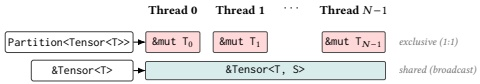</div>


<div style="text-align: center;"><div style="text-align: center;">Figure 2. Host-to-device partitioning. Partition<Tensor<T>> dispenses an exclusive &mut $T_i$ (= &mut Tensor<T, S> for the $i$-th sub-tensor) to each tile program (1:1); &Tensor<T> broadcasts a shared &Tensor<T, S> to all tile programs. Mutable cells are tinted rose; the shared band is tinted teal.</div> </div>


add_entry establishes the host/device ABI for cuTile Rust's tensor types. A CUDA kernel launch passes only raw pointers and scalars and has no notion of a tensor or partition, so cuTile Rust defines how each is encoded as kernel parameters. The launcher of §3.2 marshals the pointer together with the shape, stride, and partition scalars, and the device runs add_entry, which reconstructs the matching Tile IR views: a partition view (&mut Tensor) for the mutable output, and shared tensor views (&Tensor) for the immutable inputs. It then calls add(z, x, y), the exact user-defined kernel of Listing 1.

### 3.4 Partitioning and Ordering

A safe tensor view must satisfy two obligations. Across tile programs, mutable accesses must be disjoint; within one tile program, mutable operations must preserve the order implied by the source program. cuTile Rust handles the first obligation by partitioning mutable tensors before launch. In Listing 1, the host splits the 1024-element output into 128-element sub-tensors with .partition([128]); on the device, add_entry's partition_view call (§3.3) hands each tile program an exclusive &mut Tensor over one output sub-tensor, exposed in Tile IR as a partition view. The immutable inputs x and y arrive by pointer and become shared tensor views (&Tensor) broadcast to all programs.

The mapping from tile programs to sub-tensors is injective: No sub-tensor is assigned to more than one tile program. The launcher derives the ordinary launch grid from the partition shape, and mapped partitions validate their tile-program count against the partition grid. Because CUDA launch grids are three-dimensional, mutable tensors are capped at rank 3; immutable tensors are broadcast rather than partitioned, so their rank is not bound by the launch grid. Safe code can construct mutable partitions only through cuTile Rust's partition APIs, which start from an owned tensor or exclusive borrow and derive or validate the launch metadata. Partition<Tensor<T>> moves the tensor into the launch, while Partition<&mut Tensor<T>> borrows it exclusively; in both cases, host access is unavailable until execution completes.

The second obligation is local to one tile program. Tile IR's token-ordered operations have no default program order (§2.3), so two operations on the same mutable tensor could otherwise be reordered. The compiler threads tokens through

```rust
#[cutile::entry()]
fn add_accum<const S: [i32; 1]>(
  c: &mut Tensor<f32, S>,    // token-ordered
  a: &Tensor<f32, {[-1]}>,   // unconstrained
  b: &Tensor<f32, {[-1]}>,   // unconstrained
) {
  let tile_a = load_tile_like(a, c);  // no token
  let tile_b = load_tile_like(b, c);  // no token
  let tile_c = c.load();       // t0 -> t1
  c.store(tile_a + tile_b + tile_c); // t1 -> t2
}
```

<div style="text-align: center;"><div style="text-align: center;">Listing 4. Add-accumulate kernel. The mutable tensor c is both read and written. Without token ordering, the load and store could be reordered.</div> </div>


<div style="text-align: center;">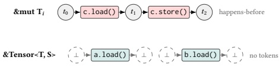</div>


<div style="text-align: center;"><div style="text-align: center;">Figure 3. Token ordering in Tile IR, within one tile program. $\tau_i$ is the tile program's mutable sub-tensor (the rose-tinted &mut Tensor<T, S> of Fig. 2). Operations on &mut $\tau_i$ are chained through tokens, establishing happens-before. Operations on a shared &Tensor<T, S> (teal) carry no token constraints; the compiler reorders them freely.</div> </div>


mutable tensor operations in the emitted Tile IR. Consider a kernel that loads from and then stores to a mutable tensor c (Listing 4):

The emitted Tile IR threads a token chain through the mutable operations:

$$t_{0}\xrightarrow{c.load()}t_{1}\xrightarrow{c.store()}t_{2}$$

The load of c consumes the initial token $t_{0}$ and produces $t_{1}$; the store consumes $t_{1}$ and produces $t_{2}$. This chain establishes a happens-before relation: The store is guaranteed to observe the load's result. Meanwhile, the loads of a and b (immutable references) carry no token constraints; the Tile compiler freely reorders them, potentially overlapping them with the mutable operations for better memory throughput.

Together, partitioning and token ordering map Rust's reference distinction onto Tile IR memory operations. &mut Tensor parameters become disjoint partition views whose loads and stores are token-ordered. &Tensor parameters become shared tensor views whose reads are unconstrained and may be reordered for performance. The user writes sequential Rust; the backend receives only the ordering that Rust's type system requires.

### 3.5 Example: Preventing Data Races

Listing 5 shows a cuTile Python kernel that permutes the head dimensions of a rank-4 attention tensor $(b, h, m, d)$.

```python
@ct.kernel # cuTile Python kernel race
def permute_heads(src, dst, H, BM, BD):
  bh1, h2 = ct.bid(0), ct.bid(1)
  b, h1 = bh1 // H, bh1 % H
  for m in range(ct.num_tiles(src, 2, (1,1,BM,BD))):
    tile = ct.load(src, (b,h1,m,0), (1,1,BM,BD))
    ct.store(dst, (b,m,h2,0), tile)  # BUG: swapped
```

<div style="text-align: center;"><div style="text-align: center;">Listing 5. A kernel index bug: the store swaps m and h2. With grid $(B \cdot H, H, 1)$, H tile threads with different h1 race on the same destination dst[b, m, h2, 0], writing different source tiles.</div> </div>


With grid $(B \cdot H, H, 1)$, for any fixed $(b, m, h_2)$, the $H$ tile programs that vary $h_1$ each load a different source tile src $[b, h_1, m, :]$ and write it to the same destination dst $[b, m, h_2, 0]$. These writes are weakly ordered (§2.3), so they are not ordered by a happens-before relation. By the Tile IR memory model, the program has a data race and its behavior is undefined. We confirmed this experimentally: Running the kernel produces non-deterministic output across runs (17–35% of elements differ between runs on our configurations).

In cuTile Rust, dst is a partition view (&mut Tensor<f32, {[1, 1, BM, BD]}>) rather than a full tensor. Each tile program owns exactly one destination sub-tensor; the store target is not an index the programmer chooses, but the partition view itself (dst.store(tile)). The "swap m and h2 in the store" bug is inexpressible: there is no store index to mix up. The class of bugs that produce data races from wrong destination indices is structurally eliminated by the partition model, and Appendix A proves data-race freedom for the safe API against Tile IR's memory model.

### 3.6 Mapped Partitions

cuTile Rust exposes a mutable output as a mapped partition: a partition of the output tensor together with a map from tile programs to the output sub-tensors they own. The plain &mut Tensor<T, S> of §3.4 is the one-sub-tensor-per-program special case, where each program owns a single output sub-tensor and the launcher derives the launch grid directly from the partition grid. MappedPartitionMut<T, S, M> generalizes it: the partition map M lets each program own a bounded sequence of output sub-tensors. Both lower to the same Tile IR partition view; the mapped form only adds the obligation to prove that the sub-tensors one program visits stay disjoint from every other program's.

This generality is what lets GEMM express an efficient schedule. With one program per output sub-tensor, each program reloads its share of the shared K-dimension operands; a mapped partition instead launches fewer programs, each walking a bounded sequence of output sub-tensors, reusing operands across them. Listing 6 shows this. MAP_SHAPE instantiates the partition map, and z.iter_indices() yields compiler-branded PartitionIndex values for the partition subset mapped to the executing tile program. Stores validate that the index

```rust
#[cutile::entry()]
fn gemm<const BM: i32, const BN: i32,
        const BK: i32, const MAP_SHAPE: [i32; 2]>(
  mut z: MappedPartitionMut<f16, {[BM, BN]}, MAP_SHAPE>,
  x: &Tensor<f16, {[-1, -1]}>,
  y: &Tensor<f16, {[-1, -1]}>,
) {
  let m_tiles = num_tiles(&z, 0);
  let n_tiles = num_tiles(&z, 1);
  let k_tiles = Dim::new(x.shape()[1] / BK);
  let px = x.partition(const_shape![BM, BK])
            .with_bounds((m_tiles, k_tiles));
  let py = y.partition(const_shape![BK, BN])
            .with_bounds((k_tiles, n_tiles));

  for out_idx in z.iter_indices() {
    let (bid_m, bid_n) = out_idx.components();
    let mut tile_z = constant(f16::ZERO, const_shape![BM, BN]);
    for k_tile in k_tiles {
      let tile_x = px.load(coord((bid_m, k_tile)));
      let tile_y = py.load(coord((k_tile, bid_n)));
      tile_z = mma(tile_x, tile_y, tile_z);
    }
    z.store(tile_z, out_idx);
  }
}
```

<div style="text-align: center;"><div style="text-align: center;">Listing 6. GEMM using bounded output sub-tensor indices z.iter_indices() produces disjoint output PartitionIndex values, while the k_tiles Dim iterator produces bounded indices along the K axis.</div> </div>


came from z's map before lowering to Tile IR, so the write stays safe even though one program now writes to many output sub-tensors.

The important point is not that the dimensions are fully static. The front end gets enough information from the iterator types themselves: out_idx is tied to z and identifies a disjoint output sub-tensor, while each k_tile is a bounded index along the K axis. The compiler can therefore lower the loads and stores without dynamic bounds checks in the hot loop while retaining the same safe surface as ordinary partitioned kernels.

Escape hatches. Using unchecked_accesses in an unsafe fn disables bounds checks the programmer can guarantee are unnecessary. For patterns the tensor API still cannot express, raw pointers (*mut T) provide direct Tile IR access; all such operations are unsafe and are intended to be isolated behind small safe wrappers. Grout (§5.3) uses all three: the safe surface for its simpler elementwise, embedding, and argmax kernels, and unchecked accesses or raw pointers for the performance-critical attention and fused-norm kernels.

<div style="text-align: center;">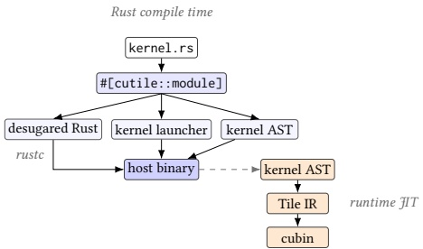</div>


<div style="text-align: center;"><div style="text-align: center;">Figure 4. A kernel from source to GPU. The #[cutile::module] proc macro emits desugared Rust checked by rustc, a typed host launch interface, and the kernel AST plus registry entry compiled into the host binary. The dashed arrow marks the first launch, when the runtime JIT loads the kernel AST and compiles it to Tile IR and a cubin.</div> </div>


## 4 Implementation

Figure 4 shows the source-to-GPU path. The module proc macro emits three host-binary artifacts: Rust code corresponding to the cuTile module, which rustc verifies; a generated host launch interface (§3.3); and an embedded AST of the cuTile module. At first launch, the runtime loads the AST, compiles it to Tile IR, and loads the resulting cubin.

The launcher uses the trait protocols described in §3.3: arguments are prepared for execution, wrapped in a lazy DeviceOp, and recovered with the same host type after the stream completes. The generated device entry point constructs the corresponding Tile IR tensor views and partition metadata, so the &mut/& distinction checked by Rust becomes token-ordered mutable operations and unconstrained immutable reads in the backend.

Embedding an AST rather than already-lowered Tile IR is mainly a proc-macro engineering constraint. Rust macros run before type checking and monomorphization, while the JIT sees the later launch-time facts needed for specialization. Rank-polymorphic traits hide the per-rank generated structs and operation impls from user code, so kernels call operations by their ordinary names while the implementation dispatches to the rank that rustc inferred.

## 5 Evaluation

Our evaluation of cuTile Rust seeks to determine both whether safety adds runtime overhead, and whether the system is general enough for real workloads. We perform experiments on two systems: an NVIDIA DGX B200 datacenter system, using only a single GPU, and a workstation containing an NVIDIA GeForce RTX 5090. The safety-overhead microbenchmarks use the B200 because it is the primary platform for high-throughput GPU performance characterization; the execution-mode microbenchmark uses the RTX 5090. End-to-end inference uses Qwen3-4B on the RTX 5090 and Qwen3-32B on the B200. The safety-overhead microbenchmarks lock SM clocks for reproducibility; inference uses default clocks because peak request throughput is the user-visible quantity.

<div style="text-align: center;">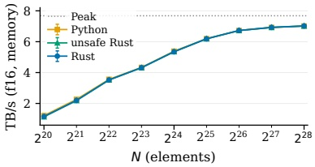</div>


<div style="text-align: center;"><div style="text-align: center;">(a) Element-wise add (memory-bound).</div> </div>


<div style="text-align: center;">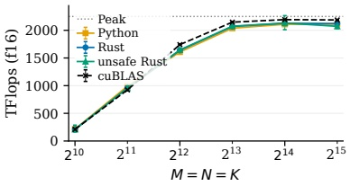</div>


<div style="text-align: center;"><div style="text-align: center;">(b) GEMM (compute-bound).</div> </div>


<div style="text-align: center;">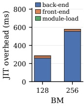</div>


<div style="text-align: center;"><div style="text-align: center;">(c) JIT overhead.</div> </div>


<div style="text-align: center;"><div style="text-align: center;">Figure 5. Safety-overhead microbenchmarks and JIT overhead. "Python" and "Rust" are cuTile Python and cuTile Rust. Dotted lines show the peak. Error bars show $p_{25}-p_{75}$ for element-wise add and time standard deviation as TFlop/s for GEMM.</div> </div>


### 5.1 Safety Overhead

To measure what safety costs on the GPU, we use two workloads on the B200: a compute-bound GEMM and a memory-bound element-wise add.

GEMM (Figure 5b) is the central safety-overhead result. It stresses tensor cores; we compare Rust, unsafe Rust, cuTile Python, and cuBLAS over $M=N=K$ in powers of two from 1024 to 32768 in f16, with tile shapes tuned once per size and shared across Rust and Python. Rust is the mapped-partition kernel of §3.6 (Listing 6), using branded output sub-tensor indices and bounded $K$-axis iteration; unsafe Rust runs the same schedule with manual raw-pointer output access as our local zero-cost baseline; cuTile Python runs the same schedule on the Tile IR backend; and cuBLAS is the vendor library baseline from a direct cuBLASLt heuristic sweep over the same sizes. We compare against same-backend baselines and the vendor library rather than other tile compilers (e.g., Triton [25]): Unsafe Rust on the same backend isolates what the safety machinery costs from backend code quality, while cuBLAS and the hardware peak anchor the results in absolute terms. At $M=N=K=8192$, Rust reaches 2.07 PFlop/s (92% of the B200's dense f16 peak, 96.4% of cuBLAS) and unsafe Rust matches it within 0.3%, so the PartitionIndex/Dim formulation imposes no measurable cost over manual pointer access; cuTile Python reaches 2.04 PFlop/s (94.9% of cuBLAS), placing both frontends on the same backend performance envelope.

Element-wise add (Figure 5a) isolates memory-bound tile loads and stores; its plotted bandwidth counts the two f16 reads and one f16 write against the device's theoretical peak DRAM bandwidth. At $N=2^{28}$, unsafe Rust and Rust both reach 7.02 TB/s and cuTile Python reaches 7.01 TB/s, so checked tile access stays on par with unsafe Rust and near the 7.68 TB/s peak.

Figure 5c reports the first-use compilation cost separate from these steady-state results. Larger GEMM tile sizes produce larger Tile IR kernels, so this cost grows with tile size.

In both the compute-bound and memory-bound regimes, the safe tensor API stays within measurement noise of unsafe Rust, so its safety guarantees impose no measurable runtime overhead.

### 5.2 Execution Mode Overhead

We next measure how host-side launch overhead scales with pipeline length, where a pipeline is a chain of N operations, and how the sync, async, and graph modes compare as N grows. We sweep N from 1 to 1000 using a small elementwise $y = x \cdot g$ kernel over a length-2048 f16 tile, so launch overhead dominates.

cuTile Rust exposes three execution modes (§3.2): sync, async, and graph. We plot sync two ways: individual .sync_on (stream) calls, which synchronize after every kernel, and a .then() chain of N launches run with .sync(), which isolates synchronization cost. Async runs the same chain through .await, yielding the host task while the GPU runs. Graph captures the pipeline and replays all N kernels with one driver call.

<div style="text-align: center;">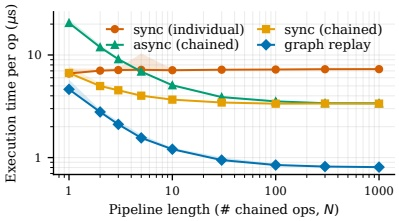</div>


<div style="text-align: center;"><div style="text-align: center;">Figure 6. Execution-mode scaling on the RTX 5090 (f16). Per-op latency for the N-kernel pipeline experiment; line is min, band is min–$p_{75}$.</div> </div>


Figure 6 separates three host-cost regimes. Individual sync pays launch plus stream synchronization per kernel, converging to about 7.3 $\mu$s/op. Chained sync and async pay one launch per kernel and one wait per pipeline, so they converge together to about 3.4 $\mu$s/op once async's fixed callback cost is amortized. Graph replay removes host-side per-kernel launch overhead and approaches the GPU-side dispatch limit, about 0.8 $\mu$s/op on this hardware. The fixed costs dominate at small $N$: async alone starts near 21 $\mu$s/op at $N=1$ (its per-pipeline callback), while the other schedules begin in the single-digit microseconds; by $N=1000$, the modes have converged.

These modes span a cost spectrum, exposed through one trait so each caller picks what its workload needs. .sync() is ordinary stream-ordered execution and is the baseline. Async adds a constant callback overhead in exchange for freeing the host thread to service I/O, cancellation, and other work while the GPU runs; this pays off when the host has concurrent work to overlap, as in interruptible voice-to-text or agentic loops where tool calling demands host CPU time. Results in Appendix B show measurable improvement in resource utilization for such heterogeneous tasks. Graph replay eliminates per-launch host overhead, the right choice for long, repetitious operation sequences. Once a graph is captured, its replay is itself a DeviceOp, so it too can be executed synchronously or asynchronously like any other operation.

### 5.3 End-to-End Inference

Finally, we ask whether cuTile Rust can support an end-to-end LLM inference path. Grout is a Qwen3 inference engine built on cuTile Rust, developed as an open-source project [11]. It is not a general-purpose serving stack; it is designed to evaluate how far a lean cuTile-Rust-based Qwen3 engine can push batch-1 throughput when common model-specific operations are fused and the runtime path is kept small. Its non-GEMM kernels are safe by default for the simpler elementwise, embedding, and argmax operations, while the performance-critical attention and fused-norm kernels opt out via unchecked accesses or raw pointers. In both inference configurations, prefill executes through a cached StepGraph of typed operations, with intermediate buffers drawn from a reusable tensor pool. Grout records the one-token decode forward pass as DeviceOp graph nodes inside CudaGraph::scope and replays it for subsequent tokens.

<div style="text-align: center;">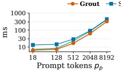</div>


<div style="text-align: center;">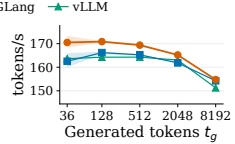</div>


<div style="text-align: center;"><div style="text-align: center;">(a) RTX 5090 / Qwen3-4B.</div> </div>


<div style="text-align: center;">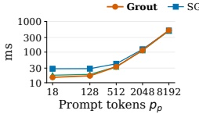</div>


<div style="text-align: center;">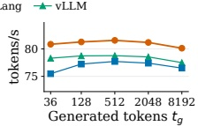</div>


<div style="text-align: center;"><div style="text-align: center;">(b) B200 / Qwen3-32B.</div> </div>


<div style="text-align: center;"><div style="text-align: center;">Figure 7. Qwen3 single-request performance (f16, batch 1, median with IQR shading; prefix caching disabled). Each subfigure shows prefill latency vs. prompt length $p_p$ at $t_g=36$ and decode throughput vs. generation length $t_g$ at $p_p=18$. The RTX 5090 subfigure uses 10 reps up to $p_p=512$ or $t_g=512$ and 3 reps for $p_p, t_g \in \{2048, 8192\}$; the B200 subfigure uses 10 reps per cell.</div> </div>


To interpret decode throughput, we compute an HBM roofline. We use this hardware- and model-normalized roofline to sanity check that our vLLM and SGLang measurements are in the same performance regime as numbers reported for other model and GPU architecture pairs. It estimates the generated-token rate when decode is bound only by peak device-memory bandwidth:

$$R=\frac{\beta}{W+\bar{K}},$$

where $\beta$ is the theoretical peak device-memory bandwidth, $W$ is the model weights in bytes, and $\bar{K}$ is the average KV-cache bytes read per generated token over the generation window. These are single-request batch-1 measurements; throughput under concurrent batching is a separate study. Prefill latency comes from each engine's per-request timing when available. vLLM [14]'s offline API does not expose prefill directly, so we use time-to-first-token from a max_tokens=1 probe.

Figure 7 reports Grout's per-request performance alongside SGLang [27] and vLLM. On RTX 5090/Qwen3-4B, Grout has the lowest measured prefill latency across the prompt sweep and the highest decode throughput across the generation sweep, reaching 154.7 tok/s at $t_g=8192$ (74.7% of the HBM roofline estimate). The throughput drop at long generation lengths is expected for autoregressive decode: as $t_g$ grows from 512 to 8192, the average KV-cache payload in the roofline model grows from 0.040 GB to 0.607 GB per generated token, and the HBM roofline estimate falls from 221.6 to 207.1 tok/s. On B200/Qwen3-32B, the larger model shifts all engines closer to the same bandwidth-dominated regime. Grout remains highest on the generation sweep, reaching 80.1 tok/s at $t_g=8192$ (66.7% of the HBM roofline estimate), compared with 77.5 tok/s for vLLM and 76.5 tok/s for SGLang. At the longest prompt length ($p_p=8192$), all three converge in decode throughput.

Grout's advantage comes from a compact single-request runtime and Qwen3-aware fusion around the bandwidth-dominated decode path. Decode uses CUDA Graph replay, device-side greedy token selection, and minimal scheduling and cache-management overhead; the kernel path fuses QK-norm, RoPE, KV-cache writes, tuned GQA decode attention, and split-K merge kernels. The dense QKV and Gate+Up projections are merged linear layers that dispatch to cuBLAS. The forward pass is expressed through DeviceOp composition and CudaGraph::scope.

These results demonstrate that cuTile Rust is expressive enough to provide the foundation for a model-specialized inference engine that delivers performance competitive with state-of-the-art inference systems. Grout is not a general-purpose serving-stack replacement, but it is a real end-to-end GPU application. We believe this demonstrates that programmers can reap the benefits of Rust without compromising the performance of their GPU-accelerated applications.

## 6 Related Work

GPU programming in Rust. Rust-CUDA [21], rust-gpu [7], and cuda-oxide [19] show that Rust can compile GPU device code and have helped establish Rust as a viable language for GPU kernels. cuTile Rust focuses on the complementary launch and tensor-access model: preserving Rust's &mut/ & aliasing contract across launch and into a tile-based kernel body. Candle [10] and Burn [6] provide safe host-side tensor APIs for Rust ML applications. CubeCL [26] supports Rust kernel authoring across GPU backends through a SIMT-style model; cuTile Rust explores a tile-based design with ownership-based partitioning (§3.3, §3). CUDA C++ supports both ahead-of-time cubins and driver JIT from PTX to SASS [16]; cuTile Rust's runtime specialization starts from a typed kernel representation whose aliasing facts must survive until the JIT-generated entry point constructs device-side view metadata.

Tile-based GPU programming. Triton [25] popularized tile-level GPU programming with a Python DSL. Pallas [24] brings a similar tile-level kernel model to JAX, and ThunderKittens [23] embeds tile primitives in CUDA C++; both prioritize performance and productivity rather than static safety guarantees. cuTile Rust follows the same tile-level direction while moving the launch boundary into Rust and carrying tensor/partition view distinctions from host types into the kernel. TensorIR [8] is another compiler abstraction for tensorized programs; cuTile Rust focuses instead on a safe Rust surface over a Tile IR backend. CUDA Tile C++ and cuTile Python [17, 18] share cuTile Rust's Tile IR backend. cuTile Python provides a productive DSL; cuTile Rust adds compile-time safety checks by making shape and ownership facts ordinary Rust type and borrow facts available before launch.

Safe heterogeneous programming. Descend [13] is closest in spirit: it uses type-level tracking of thread hierarchy and memory regions to prevent GPU data races. Descend targets SIMT with a custom type system, while cuTile Rust targets tile-based programming with ownership-based partitioning in Rust's existing type system. Mojo [15] adopts ownership and borrowing in a Python-superset language for heterogeneous hardware; like Descend, it builds a new language, whereas cuTile Rust works within Rust and its ecosystem. GPUVerify [4] verifies CUDA/OpenCL kernels, while Regent [22] uses logical regions to structure task-level parallelism; cuTile Rust instead builds kernel-local safety into the Rust launch and tile APIs. Halide [20] prevents races through a declarative algorithm/schedule split, and Futhark [9] uses purity to structure parallel programs. Prism [3] tracks thread granularity for modular GPU programming. cuTile Rust addresses a different axis: what memory is accessed and in what order.

Rust safety and verification. RustBelt [12] provides formal foundations for Rust's safety guarantees. cuTile Rust builds on Rust ownership but extends it to GPU memory across the launch boundary. Rudra [2] shows that unsafe Rust is a real ecosystem-scale bug source, motivating a narrow unsafe surface for GPU kernels. Abdi et al. [1] analyze when Rust parallelism is fearless and zero-cost; cuTile Rust applies that question to GPU kernel programming.

## 7 Conclusion

The tile programming model creates a natural correspondence with Rust's ownership system. Mutable parameters become disjoint partitioned accesses, immutable references become shared tensor views, and generated host interfaces and device entry code preserve that contract across the CPU/GPU boundary. cuTile Rust builds on this correspondence to provide data-race-free GPU kernel programming for the tensor access patterns it accepts. Branded PartitionIndex values and bounded dimension iterators let the safe tensor API express schedules where each tile program visits multiple output sub-tensors; unchecked_accesses and raw pointers remain explicit local opt-outs when the programmer supplies invariants manually.

Three system contributions make this possible. First, a safe, high-performance GPU programming model for Rust: host tensors become device-side tensor and partition views, tile kernels execute with single-threaded semantics, and branded bounded indices let the front end prove common partition accesses safe. Second, a safe kernel launch interface preserves Rust's &mut/ & contract as host tensors cross the CPU/GPU boundary. Third, a composable host-side execution model supports synchronous, asynchronous, and CUDA graph execution modes, including scoped graph capture validated by the borrow checker. The evaluation supports these claims: On GEMM, the safe mapped kernel matches a raw-pointer variant and reaches 96.4% of cuBLAS on the B200. Grout, a Qwen3 inference engine developed in collaboration with Hugging Face, exercises cuTile Rust across an end-to-end inference path and reaches single-request throughput on par with the vLLM and SGLang baselines on both the NVIDIA GeForce RTX 5090 and the DGX B200.

The composable execution model also supports resource-conscious orchestration of heterogeneous workloads: async execution lets one host thread keep GPU work in flight while servicing interleaved I/O and control tasks instead of blocking on the device. This grows more important as inference increasingly depends on tool calling, which interleaves host-side work with generation; overlapping the two raises utilization without dedicating a thread to spin on the GPU. Quantifying the CPU and power effects for embedded and server workloads remains future work.

Our approach inherits the limitations of the tile model. Tile-based programming gives up SIMT-level control (explicit warp primitives, shared memory management) in exchange for the single-threaded semantics that make static safety checking tractable. Tile IR handles implicit warp specialization, so the loss is mitigated but not eliminated; a clean safe SIMT model that composes with tile programming remains future work. Additional limitations include a GEMM performance gap with cuBLAS at some matrix sizes (Grout falls back to cuBLAS for model GEMMs), a young tensor API whose coverage still does not eliminate every raw pointer use, and a specialized case study (batch-1 engine with a small set of supported models).

Future work follows from those boundaries. Growing the safe tensor API to subsume the patterns that still require unsafe is one direction: The zero-cost GEMM result suggests that kernels like Grout's attention and fused norms can move behind the same branded-index and bounded-iterator abstractions without losing performance. Async scheduling for heterogeneous workloads is another, especially where GPU work, host work, I/O, and control-flow responsiveness must overlap. The same partitioning idea can also extend across devices, with each GPU owning a partition and collective/P2P primitives participating in the borrow system.

## Acknowledgments

We thank Gonzalo Brito for design discussions and support for tile programming in Rust, Simon Cooksey for validating the safety properties of our DSL, Jason Knight for support and direction, Nihal Pasham for early contributions, and the PSA and ARG research groups and the Tile IR and CUDA teams for support. We also thank Jed Brown for discussions on safe GPU programming in Rust.

## References

[1] Javad Abdi, Gilead Posluns, Guozheng Zhang, Boxuan Wang, and Mark C. Jeffrey. 2024. When Is Parallelism Fearless and Zero-Cost with Rust?. In Proceedings of the 36th ACM Symposium on Parallelism in Algorithms and Architectures, SPAA 2024, Nantes, France, June 17-21, 2024, Kunal Agrawal and Erez Petrank (Eds.). ACM, 27-40. https://doi.org/10.1145/3626183.3659966

[2] Yechan Bae, Youngsuk Kim, Ammar Askar, Jungwon Lim, and Tae-soo Kim. 2021. Rudra: Finding Memory Safety Bugs in Rust at the Ecosystem Scale. In Proceedings of the ACM SIGOPS 28th Symposium on Operating Systems Principles, SOSP 2021. ACM, 84–99. https://doi.org/10.1145/3477132.3483570

[3] Manya Bansal, Daniel Sainati, Joseph W. Cutler, Saman Amarasinghe, and Jonathan Ragan-Kelley. 2025. Modular GPU Programming with Typed Perspectives. arXiv:2511.11939 [cs.PL] https://arxiv.org/abs/2511.11939

[4] Adam Betts, Nathan Chong, Alastair F. Donaldson, Shaz Qadeer, and Paul Thomson. 2012. GPUVerify: a verifier for GPU kernels. In Proceedings of the 27th Annual ACM SIGPLAN Conference on Object-Oriented Programming, Systems, Languages, and Applications, OOPSLA 2012. ACM, 113–132. https://doi.org/10.1145/2384616.2384625

[5] Eric Buehler. 2024. mistral.rs: Blazingly fast LLM inference in Rust. https://github.com/EricLBuehler/mistral.rs.

[6] Burn Contributors. 2023. Burn: Dynamic Deep Learning Framework in Rust. https://github.com/tracel-ai/burn.

[7] Embark Studios. 2023. rust-gpu: Making Rust a first-class language and ecosystem for GPU shaders. https://github.com/EmbarkStudios/rust-gpu.

[8] Siyuan Feng, Bohan Hou, Hongyi Jin, Wuwei Lin, Junru Shao, Ruihang Lai, Zihao Ye, Lianmin Zheng, Cody Hao Yu, Yong Yu, and Tianqi Chen. 2023. TensorIR: An Abstraction for Automatic Tensorized Program Optimization. In Proceedings of the 28th ACM International Conference on Architectural Support for Programming Languages and Operating Systems, Volume 2, ASPLOS 2023. ACM, 804–817. https://doi.org/10.1145/3575693.3576933

[9] Troels Henriksen, Niels G. W. Serup, Martin Elsman, Fritz Henglein, and Cosmin E. Oancea. 2017. Futhark: purely functional GPU programming with nested parallelism and in-place array updates. In Proceedings of the 38th ACM SIGPLAN Conference on Programming Language Design and Implementation, PLDI 2017, Barcelona, Spain, June 18-23, 2017, Albert Cohen and Martin T. Vechev (Eds.). ACM, 556-571. https://doi.org/10.1145/3062341.3062354

[10] Hugging Face. 2023. Candle: Minimalist ML Framework for Rust. https://github.com/huggingface/candle.

[11] Hugging Face. 2026. Grout: A cuTile-Rust Qwen3 Inference Engine. https://github.com/huggingface/grout.

[12] Ralf Jung, Jacques-Henri Jourdan, Robbert Krebbers, and Derek Dreyer. 2017. RustBelt: Securing the Foundations of the Rust Programming Language. Proceedings of the ACM on Programming Languages 2, POPL (2017), 1–34. https://doi.org/10.1145/3158154

[13] Bastian Köpcke, Sergei Gorlatch, and Michel Steuwer. 2023. Descend: A Safe GPU Systems Programming Language. In Proceedings of the ACM on Programming Languages, Vol. 7. ACM, 1–23. https://doi.org/10.1145/3591269

[14] Woosuk Kwon, Zhuohan Li, Siyuan Zhuang, Ying Sheng, Lianmin Zheng, Cody Hao Yu, Joseph Gonzalez, Hao Zhang, and Ion Stoica. 2023. Efficient Memory Management for Large Language Model Serving with Paged Attention. In Proceedings of the 29th Symposium on Operating Systems Principles, SOSP 2023, Koblenz, Germany, October 23-26, 2023, Jason Flinn, Margo I. Seltzer, Peter Druschel, Antoine Kaufmann, and Jonathan Mace (Eds.). ACM, 611-626. https://doi.org/10.1145/3600006.3613165

[15] Modular Inc. 2023. Mojo: a programming language for heterogeneous compute. https://www.modular.com/mojo.

[16] NVIDIA. 2024. CUDA C++ Programming Guide. https://docs.nvidia.com/cuda/cuda-c-programming-guide/.

[17] NVIDIA. 2025. CUDA Tile MLIR. https://github.com/NVIDIA/cuda-tile.

[18] NVIDIA. 2025. cuTile: CUDA Tile Programming in Python. https://github.com/NVIDIA/cutile-python.

[19] NVIDIA. 2026. cuda-oxide: A custom rustc backend for compiling GPU kernels in pure Rust. https://github.com/NVlabs/cuda-oxide.

[20] Jonathan Ragan-Kelley, Connelly Barnes, Andrew Adams, Sylvain Paris, Frédo Durand, and Saman P. Amarasinghe. 2013. Halide: a language and compiler for optimizing parallelism, locality, and recomputation in image processing pipelines. In ACM SIGPLAN Conference on Programming Language Design and Implementation, PLDI '13, Seattle, WA, USA, June 16-19, 2013, Hans-Juergen Boehm and Cormac Flanagan (Eds.). ACM, 519–530. https://doi.org/10.1145/2491956.2462176

[21] Riidefi. 2022. Rust-CUDA: CUDA programming in Rust. https://github.com/Rust-GPU/Rust-CUDA.

[22] Elliott Slaughter, Wonchan Lee, Sean Treichler, Michael Bauer, and Alex Aiken. 2015. Regent: a high-productivity programming language for HPC with logical regions. In Proceedings of the International Conference for High Performance Computing, Networking, Storage and Analysis, SC 2015. ACM, 81:1–81:12. https://doi.org/10.1145/2807591.2807629

[23] Benjamin F. Spector, Simran Arora, Aaryan Singhal, Daniel Y. Fu, and Christopher Ré. 2024. ThunderKittens: Simple, Fast, and Adorable AI Kernels. arXiv:2410.20399 [cs.LG] https://arxiv.org/abs/2410.20399

[24] The JAX Authors. 2023. Pallas: a JAX kernel language. https://docs.jax.dev/en/latest/pallas/index.html.

[25] Philippe Tillet, Hsiang-Tsung Kung, and David D. Cox. 2019. Triton: an intermediate language and compiler for tiled neural network computations. In Proceedings of the 3rd ACM SIGPLAN International Workshop on Machine Learning and Programming Languages, MAPL@PLDI 2019, Phoenix, AZ, USA, June 22, 2019, Tim Mattson, Abdullah Muzahid, and Armando Solar-Lezama (Eds.). ACM, 10–19. https://doi.org/10.1145/3315508.3329973

[26] Tracel AI. 2024. CubeCL: Multi-platform high-performance compute language extension for Rust. https://github.com/tracel-ai/cubecl.

[27] Lianmin Zheng, Liangsheng Yin, Zhiqiang Xie, Chuyue Sun, Jeff Huang, Cody Hao Yu, Shiyu Cao, Christos Kozyrakis, Ion Stoica, Joseph E. Gonzalez, Clark W. Barrett, and Ying Sheng. 2024. SGLang: Efficient Execution of Structured Language Model Programs. In Advances in Neural Information Processing Systems 37: Annual Conference on Neural Information Processing Systems, NeurIPS 2024. https://papers.nips.cc/paper_files/paper/2024/hash/724be4472168f31ba1c9ac630f15dec8-Abstract-Conference.html

### A Data-Race Freedom

cuTile Rust's safe tensor API wraps Tile IR's load and store operations. Beyond data-race freedom, those operations carry only Tile IR's validity requirement, in-bounds access to live, initialized memory, which is the ordinary memory-safety obligation that Rust's ownership and bounds discipline already guarantee; Tile IR adds nothing there to prove. This section discharges the one requirement specific to Tile IR's weakly ordered memory model, data-race freedom, for any kernel and launch written in safe Rust. The opt-outs of §3.6 (unchecked_accesses and raw pointers) carry the requirement manually and are excluded, and the argument assumes the generated launcher and kernel entry realize the disjoint partitions and token threading of §3.4.

Memory model. We use Tile IR's definitions [17]. A kernel runs a grid of tile programs (§2.2), each a single logical thread that executes as one tile block, the granularity at which the model orders memory. Two accesses conflict when they touch the same location and at least one is a write. Ordering is carried by tokens: An operation waits-for another when it depends on a token the other produced, and restricted program order is the intersection of program order and this token order. Two same-location accesses are morally strong when they are related in restricted program order, or each names a scope that contains the other's tile block. A data race is a conflicting pair that is not related by happens-before and not morally strong; a program containing a data race has undefined behavior.

Two facts from safe Rust. Safe code supplies exactly the two properties the definition needs. First, alias-XOR-mutability across tile programs: A tile program writes only through its partition view, and the borrow checker keeps that view's sub-tensors disjoint from every other program's accessed memory. Partition maps are injective (§3.4); the mapped case is checked through branded PartitionIndex values (§3.6); and an immutable &Tensor is read-only and cannot alias any partition, because a partition derives from an owned tensor or an exclusive borrow (§3.3). Second, ordering within a tile program: The compiler threads a token chain through every load and store on a &mut view (§3.4), so any two such accesses are related in both program order and token order.

Theorem A.1. Every execution of a kernel written in safe cuTile Rust is data-race-free under Tile IR's memory model.

Proof. Consider a conflicting pair $a, b$; at least one is a write. If they belong to different tile programs, the writer acts through its partition view, which by alias-XOR-mutability is disjoint from the other program's accessed memory, so the two cannot share a location, contradicting conflict. Every conflicting pair therefore lies in a single tile program. There, a write occurs only through that program's &mut view, and all accesses to it are related in program order and token order, hence in restricted program order; $a$ and $b$ are thus morally strong and form no data race. Accesses through immutable views are reads, which do not conflict.

This is the argument that makes ordinary Rust data-race-free: Alias-XOR-mutability removes conflicts between threads and ordering removes them within a thread, with Tile IR's token order ("waits-for") in the role that sequenced-before plays in the C++ and Rust memory models. The index-swap bug of §3.5 is the canonical execution it excludes: A store in safe Rust has no programmer-chosen destination index, so the conflicting write to another program's sub-tensor is unconstructible rather than merely unordered.

### B Supplementary Work-Distribution Data

This appendix collects the supplementary execution-mode and work-distribution plots referenced in §5.2, together with the reproducibility details omitted from the main text.

<div style="text-align: center;">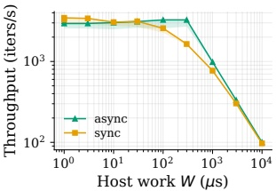</div>


<div style="text-align: center;"><div style="text-align: center;">(a) Async vs. sync at varying host work.</div> </div>


<div style="text-align: center;">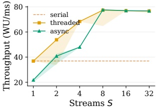</div>


<div style="text-align: center;"><div style="text-align: center;">(b) GPU work distribution (bimodal GEMMs).</div> </div>


<div style="text-align: center;">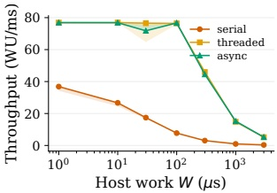</div>


<div style="text-align: center;"><div style="text-align: center;">(c) Per-task host-work sweep.</div> </div>


<div style="text-align: center;"><div style="text-align: center;">Figure 8. Supplementary async execution and work-distribution results. (a) Graph-replayed pipeline throughput while varying host-side work W. (b) Bimodal-GEMM queue throughput under serial, thread-per-stream, and async scheduling. (c) Bimodal-GEMM throughput with per-task host work W at fixed S=16 streams.</div> </div>


Async overlap sweep. Figure 6 establishes that async adds a constant callback offset on top of sync for a single pipeline. Whether paying that offset is worthwhile depends on whether the host thread, once yielded, has useful work to do. We run a fixed GPU pipeline (N=300 captured graph, $\sim 300$ $\mu$s per replay) and vary per-iteration host work W: Async schedules the host spin as cooperative work so it overlaps GPU execution, while sync runs it strictly after sync_on.

Today's single-model decode engines pair a captured graph with a synchronous outer loop; per-step host work is on the order of a microsecond and dwarfed by launch cost, so async offers nothing there. Async becomes the right tool when the host thread has something concurrent to do during the yield. Streaming ASR is a representative case: while one GPU chunk runs, the host can ingest the next audio window, run VAD and control logic, publish partial output, or react to an interrupt without parking an extra thread on GPU completion.

Figure 8a shows the regime split. Below the ~30 μs crossover, sync is strictly faster: Async pays its callback tax for no gain and should be avoided (or replaced by a captured graph, which removes the launch side of the cost entirely). Around W ≈ GPU time the host spin slots fully inside the GPU replay and async hits 1.99× sync throughput; the 2× ceiling follows from the physics of one host thread overlapping with one device stream. cuTile Rust does not prescribe the execution regime: Offering sync, async, and captured graphs through one trait lets each caller choose where on the trade-off curve their workload sits without rewriting the kernel side.

Bimodal work-distribution setup. The main text isolates host/device overlap on a single stream. In real systems the more common regime is the other axis: many GPU work units of heterogeneous sizes arriving over time, to be issued across multiple streams. We generate a queue of $N=2000$ GEMMs, 80% Small ($M=N=K=512$) interleaved with 20% Large ($M=N=K=2048$), and drain it under three strategies, sweeping stream count $S \in \{1,2,4,8,16,32\}$:

1. Serial — one host thread, one stream, sync_on per op. Establishes the single-stream ceiling.

2. Threaded — S host threads, one stream each, sync_on per op on each thread. A shared queue feeds all workers; this is the non-async baseline.

3. Async — one host thread driving S cooperative async tasks, one stream each. Each task .awaits on DeviceFuture::scheduled so launches stay on the intended stream. This is the "single host thread" configuration used to reduce host CPU footprint.

Reproducibility details. Each worker pre-allocates per-size buffers, worker threads/tasks persist across samples (so the thread-local kernel JIT cache warms once), and we fix CU_CTX_SCHED_SPIN on the context so sync behavior is identical across modes. CPU pinning is mode-specific: Serial pins to a single core; async and threaded both pin to CPUs 1–16 (the machine's 16 physical cores, avoiding SMT siblings). For async, the range matters because CUDA driver callback threads live in the process and a single-core pin would force them to contend with the async runtime for that core. For threaded, the range provides one core per worker.

Bimodal throughput. Figure 8b shows threaded and async scale past the single-stream serial baseline (~37 WU/ms) and converge at ~77 WU/ms (~2.1x serial) by S=8 — the GPU's multi-stream ceiling for this workload. Async plateaus there and holds through S=16 and S=32; threaded reaches the same ceiling at S=8 and holds through S=32 (at S>16 its S worker threads are over-subscribed on the pinned 16-physical-core range, which is a setup limit rather than a hardware one). At S=1 async trails serial and threaded because the async callback path adds cost with no concurrency to amortize it across. In the mid-range (S=2-4) thread-per-stream is meaningfully ahead of async on raw throughput. At and beyond S=8 all modes are within sampling noise.

The throughput numbers themselves converge at the plateau; the substantive gap is how each mode reaches it. Threaded needs one OS thread per stream – at S=16 that is sixteen blocking threads spread across sixteen CPU cores, each spending most of its time in cuStreamSynchronize. Async does the same submission rate on a single host thread with cooperative scheduling: when a task awaits, the runtime polls the next ready task and the host thread keeps issuing launches on other streams, while GPU completion wakes the waiting tasks via cuLaunchHostFunc. The CPU-footprint delta is the programming-model payoff: a fleet driven with async needs roughly 1/S the host threads (and thus fewer host cores, with the corresponding reduction in idle CPU power) of one driven with thread-per-stream sync. That property matters most when host cores are scarce: edge conversational systems and other embedded GPU applications can remain responsive to I/O and cancellation without reserving a core per active stream.

Bimodal host-work sweep. Figure 8c reports throughput at fixed stream count S=16 as per-task host work W grows from 0 to 3 ms. Each GEMM is followed by a host-side "think-time" of W microseconds, modeling CPU work interleaved with GPU work. The async path uses cooperative yielding against a wall-clock deadline, so the task releases the executor at each yield and the 16 per-stream tasks overlap their waits on a single host thread. We use this rather than a timer sleep because millisecond-scale timer granularity is too coarse for these measurements. Serial and threaded use a busy spin, since neither has an executor to yield to. Across four orders of magnitude of $W$, async $-T=1$ tracks threaded ($S=16$ threads) within sample noise: both degrade in lockstep as $W$ grows. Serial collapses because a single thread cannot overlap host with device work. Adding host work does not break the single-thread async executor's equivalence to thread-per-stream on throughput; it only trades off against the equivalent threaded cost.

Together, Figures 8a and 8b demonstrate that the async primitive is meaningful along two axes of heterogeneity: across resources (host ↔ device) and across task units (small ↔ large). One host thread can orchestrate both through the same DeviceOp API. We evaluate synthetic workloads so the overheads are isolated, but the intended use is concrete: resource-constrained interactive systems where GPU work, I/O, and control-flow responsiveness must coexist. Scheduler-specific designs built on this primitive remain future work.
