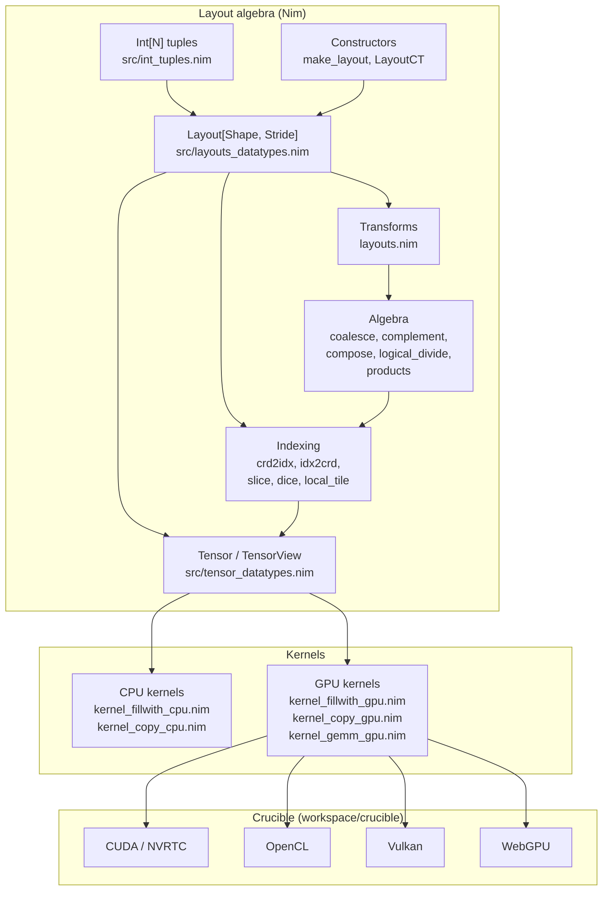

# Ceramic — Architecture

## Position in the stack

Ceramic is the layout-algebra / tensor layer of the tattletale monorepo. It
sits between the GPU codegen backend (Crucible) and the higher-level
inference code (transformers). Its job is to describe *where data lives in
memory* — as a compile-time `Layout[Shape, Stride]` — and to provide kernels
that read and write those layouts on CPU and GPU.

The headline property: the layout description is hardware-agnostic. The same
`Layout` and `TensorView` types drive CPU kernels (Nim, compiled to C++) and
GPU kernels (Nim, lowered to CUDA/OpenCL/Vulkan/WebGPU by Crucible). There is
no NVIDIA-specific layout model.

## Structural diagram



## Annotated tree

```
workspace/ceramic/
├── ceramic.nim                  # public facade; re-exports src modules
├── AGENTS.md                    # access ([ ] vs ()), param order, kernel naming
├── src/
│   ├── int_tuples.nim           # Int[N] tuples: prefix/suffix scans, folds, zips
│   ├── layouts_datatypes.nim    # Layout[Sh, St]; rank/size/cosize; predicates
│   ├── layout_constructors.nim  # make_layout, col_major_strides, LayoutCT
│   ├── layouts.nim              # mode, isCompact, padLeft/Right, upcast/downcast,
│   │                            #   zipModes, groupModes, takeModes, replaceMode
│   ├── layout_algebra.nim       # coalesce, complement, compose, logical_divide,
│   │                            #   zipped_divide, right/left_inverse, products
│   ├── layout_indexing.nim      # crd2idx/idx2crd wrappers; slice/dice; X/Y markers
│   ├── layout_indexing_gpu.nim  # raw 3-arg crd2idx (divmod) overloads
│   ├── tensor_datatypes.nim     # Tensor (owning) / TensorView (non-owning)
│   ├── tensors.nim              # []/() access, slice, inner/outer_partition,
│   │                            #   local_tile, local_partition, displace
│   ├── kernel_fillwith_cpu.nim  # fill: contiguity-fused zeroMem / loops
│   ├── kernel_copy_cpu.nim      # copy: copyMem-fused + permuted variants
│   ├── kernel_fillwith_gpu.nim  # fill: flat-index iteration
│   ├── kernel_copy_gpu.nim      # copy: flat-index iteration
│   └── kernel_gemm_gpu.nim      # gemm: outer product, flat-index (epilogue fused, src/tile_algebra/epilogues.nim)
├── benchmark/
│   ├── bench_ex02_matmul_cpu_simd.nim  # CPU GEMM vs OpenBLAS/Laser
│   └── laser_matmul/                   # Laser strided-GEMM reimplementation
├── examples/
│   ├── ex02a_matmul_handtuned.nim
│   ├── ex02b_matmul_layout_algebra.nim
│   └── ex02_matmul_microkernels/       # AVX/AVX512 microkernels
├── experiments/nvidia_cutlass_cute_tutorial/sgemm_1.nim  # GPU batch-GEMM (WIP)
└── tests/                        # layout, kernel, tensor tests
```

## Data-flow walkthrough

How a layout and tile flow into a kernel:

1. **Describe a layout.** `make_layout((M, K), (1, M))` builds a
   `Layout[(M, K), (1, M)]` — column-major (layout-left) strides. Shapes and
   strides are statically typed: integer leaves become `Int[N]`, so constant
   folding happens at compile time (`src/layout_constructors.nim`).

2. **Transform it.** Layout algebra rewrites the description without touching
   data. For example, `logical_divide(layout, tiler)` splits a layout into
   (tile, rest) modes via the CuTe formula
   `compose(layout, Layout(tiler, complement(tiler, shape(coalesce(layout)))))`
   (`src/layout_algebra.nim`). `coalesce` merges contiguous modes; `compose`
   layers two layouts so `R(i) = A(B(i))`.

3. **Bind memory.** `make_view(ptr, layout)` or `make_view(data, shape, stride)`
   produces a non-owning `TensorView` (`src/tensor_datatypes.nim`). An owning
   `Tensor` is a stack `array[cosize, T]` with no heap.

4. **Slice into tiles.** `local_tile(mA, cta_tiler, cta_coord, proj)` and
   `local_partition(tv, thread_layout, idx)` select a tile or a per-thread
   partition, returning a sub-view whose data pointer is offset and whose
   layout is the sliced tile (`src/tensors.nim`). This mirrors CuTe's
   `zipped_divide` + `slice_and_offset`.

5. **Run a kernel.** A CPU kernel walks the view's layout with
   contiguity-fused loops; a GPU kernel iterates with flat-index `crd2idx`.
   The tile is read/written identically regardless of backend, because both
   consume the same `TensorView`/`Layout` types.

In the `sgemm_1` port (`experiments/nvidia_cutlass_cute_tutorial/sgemm_1.nim`),
steps 1–5 match CuTe `sgemm_1.cu` statement-by-statement: CTA coordinate,
`local_tile` with `Step` projection for A/B/C, `make_tensor_like` shared-memory
tiles, `local_partition` for thread data, `fillWith` to clear the accumulator,
main loop of `copyFrom` + `gemm`, epilogue `axpby` (CuTe tutorial naming; the ceramic epilogue is `EpiAXPBY`, `src/tile_algebra/epilogues.nim`).

## GEMM thread organization — who owns what (worked example)

The tensor-core GEMM levels differ in *who owns which state* as much as in what they compute.
The levels are `gemm_atom`, `gemm_warp`, `gemm_tiled`, `gemm_cta` and `gemm_kernel`, defined in `src/kernel_gemm_gpu.nim`.
The canonical worked example lives in that module's header.
This section mirrors it so the partitioning is visible away from the kernel code.

**Config (worked example):**
- atom: m16n8k8
- thread layout: (2, 2, 1)
- tile: (32, 16, 32)
- CTA: one tile, 128 lanes = 4 warps

The same 32 lanes are the cooperation unit at both `gemm_atom` and `gemm_warp`.

```
CTA (gemm_cta)            128 lanes = 4 warps, owns the (32, 16) output tile
  └─ warp (tm, tn) ∈ (2, 2)      [gemm_tiled partition]
     owns the (16, 8) sub-tile: A rows tm·16..tm·16+16, B rows tn·8..tn·8+8
     └─ lane l ∈ 0..31           [hardware fragment layouts]
        owns V values per atom: A: 4, B: 2, C: 4
```

- `gemm_atom`: one `mma.sync`. The warp's 32 lanes jointly perform
  one 16×8×8 MMA into their C fragment (16×8 = 128 values = 32 lanes × 4).
- `gemm_warp`: the same 32 lanes loop kSlice = 0 ..< 4, with RepeatK = tileK/atomK = 32/8.
  Each iteration issues one warp-wide `mma.sync` into the C fragment.
  Per lane:
  - A: (4, 1, 4)
  - B: (2, 1, 4)
  - C: (4, 1, 1)
- The (2, 2, 1) thread layout never splits an atom across lanes:
  it replicates the atom 2×2 = 4 times across the 4 warps, so the warps together cover the (32, 16) CTA tile.

State/data flow (per CTA tile, one tileK-sized slice of K at a time):

```
gmem A (32, kView), B (16, kView)
  ── gemm_cta cp.async ──▶ smem A (32, 32), B (16, 32)
  ── gemm_tiled gather ──▶ lane registers A (4, 1, 4), B (2, 1, 4)
  ── gemm_cta zeroes C (4, 1, 1) once, before the K-loop
  ── gemm_warp 4× mma.sync ──▶ C (4, 1, 1) accumulated
  ── gemm_cta epilogue ──▶ gmem D (32, 16)
```

**Terminology:**
- **lane**: one thread (`threadIdx.x % 32`)
- **warp**: 32 lanes, the unit that executes `mma.sync`
- **CTA / threadblock**: the unit scheduled on one SM (`blockIdx`), made of warps

## Extension points

- **New layout transform.** Add to `src/layouts.nim` (structural transforms) or
  `src/layout_algebra.nim` (algebraic transforms). Follow the existing macro
  patterns (`LayoutCT`, `getTypeInst`, `mapLeavesWith`) so results stay
  compile-time constant-folded. Reference the CuTe counterpart in the doc
  comment.
- **New kernel.** Add a `kernel_<op>_cpu.nim` and a `kernel_<op>_gpu.nim`
  following the naming in `AGENTS.md`, then re-export both from `ceramic.nim`.
  CPU kernels prefer contiguity-fused paths; GPU kernels use flat-index
  iteration. Parameter ordering is output-first (see `AGENTS.md`).
- **New backend.** Crucible owns lowering to CUDA/OpenCL/Vulkan/WebGPU
  (`workspace/crucible/`). Ceramic only needs to produce backend-agnostic
  `TensorView`/`Layout` code; no per-backend layout logic lives here.
- **Microkernel tuning.** Replace the generic GEMM body in
  `benchmark/laser_matmul/gemm_ukernel_generic.nim` with an ISA-specific one
  (`gemm_ukernel_x86_avx512.nim`, etc.) and re-run the benchmark to validate.

## Related docs

- [README.md](README.md) — pitch, capability proof, status, build/run.
- [AGENTS.md](AGENTS.md) — code conventions for this project.
- [Crucible](../crucible/AGENTS.md) — the GPU codegen backend.
- [tattletale README](../README.md) — repository context.
