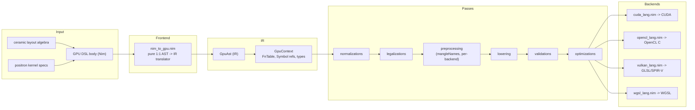

# Crucible Architecture

Crucible is the GPU code generator in the tattletale monorepo. This document describes how a GPU DSL body written in Nim becomes native GPU source, the pass pipeline that transforms it, and how to extend it with new passes and backends.

## Position in the stack

Crucible sits between the higher-level layers that describe computation and the native GPU toolchains that run it:

- **Consumes** the layout algebra from [`workspace/ceramic/`](../ceramic/) and kernel specifications from [`workspace/positron/`](../positron/) (per the header in [`workspace/crucible/crucible.nim`](crucible.nim)).
- **Produces** native GPU source strings handed to external toolchains: NVRTC (CUDA → PTX), shaderc (GLSL → SPIR-V), and the host ABI bindings under [`src/abis/`](src/abis/) / runtimes under [`src/codegen/exec/`](src/codegen/exec/) for execution.

Crucible itself is a compiler pipeline, not a runtime.

## Pipeline

The compiler is a linear pipeline: a frontend that lowers Nim AST to a backend-neutral IR, a sequence of named passes, and per-backend syntax printers.



All four backends share the same IR and the same common pass set (`registerCommonPasses` in [`src/codegen/gpu_compiler.nim`](src/codegen/gpu_compiler.nim)); they diverge only in backend-specific passes and reserved-keyword checks, then each printer emits its target language.

## Annotated tree

```
src/codegen/
  gpu_compiler.nim          Entry point. `cuda`/`opencl`/`vulkan`/`webgpu`
                            macros build a GpuContext + PassRegistry, run passes,
                            and call codegenCuda/OpenCL/Vulkan/WebGPU. Also a
                            runtime `codegen(gen, ast, backend)` proc.
  ir/
    gpu_types.nim           IR core: GpuAst node kinds, GpuType, GpuContext.
                            FnTableEntry + unified fnTable; Symbol (ref) with
                            immutable iSym fingerprint + mutatable name;
                            GpuRangeKind (rkInclusive/rkExclusive); base58 encoder.
    gpu_type_constructors.nim  GpuType constructors / helpers.
    nim_to_gpu.nim          Frontend: walks typed Nim AST, emits GpuAst 1:1.
                            Pure translator — no semantic decisions here.
    resolvers.nim           Type / overload resolution during construction.
  passes/
    pass_datatypes.nim      GpuPass, PassKind, PassPhase, PassRegistry types;
                            `walk` traversal; `runPasses` (checks dependsOn).
    pass_registry.nim       PassRegistry.new().
    passes_normalizations.nim  Extracted from the old frontend monolith
                            (e.g. lowerIfExpr, patchBoolToI32, mapOperators).
    passes_legalizations.nim   Legalization transforms (result insertion, etc.).
    passes_preprocessing.nim   Preprocessing: rewriteIndexDeref, decomposeMemcpy,
                            emitFunctionSignatures, mangleNames, plus per-backend
                            registrations (WGSL/Vulkan/OpenCL passes).
    passes_lowering.nim     Lowering: gtSpan -> ptr + len, byref params, etc.
    passes_validations.nim  Pre/post validation passes (e.g. warnUnassigned).
    passes_optimizations.nim   Optimizations (stub scope).
  targets/
    targets_lang.nim        Dispatches codegenCuda/OpenCL/Vulkan/WebGPU to printers.
    cuda_lang.nim opencl_lang.nim vulkan_lang.nim wgsl_lang.nim
                            "Dumb syntax printers": walk IR, emit native text.
    lang_utils.nim          Shared printer helpers.
  builtins/                 Per-backend + Nim builtins.
  exec/                     Host runtimes: cuda_runtime, opencl_runtime,
                            vulkan_runtime, wgpu_runtime, runtime_utils.
```

## Data-flow walkthrough

1. **Frontend (`nim_to_gpu.nim`).** The user writes a `cuda:`, `opencl:`, `vulkan:`, or `webgpu:` block. The corresponding macro in `gpu_compiler.nim` calls `ctx.toGpuAst(typeReg, body)`, which walks the typed Nim AST and emits a `GpuAst` 1:1 — one IR node per AST construct, with no semantic rewriting. Symbols are created as `ref` objects carrying a stable `iSym` fingerprint (see `Symbol` in `gpu_types.nim`).

2. **IR construction.** The frontend populates the `GpuContext`: the unified `fnTable` (all known functions keyed by `iSym`), `types`, `globalBlocks`, and per-scope symbol tables. Range nodes record their `GpuRangeKind` (`rkInclusive`/`rkExclusive`) instead of encoding exclusivity with a `+1`.

3. **Pass pipeline.** `registerCommonPasses` registers validation, normalization, legalization, preprocessing, lowering, and post-validation passes. `runPasses` (in `pass_datatypes.nim`) executes them in registration order, verifying each pass's `dependsOn` list was satisfied. Passes mutate the IR in place. Representative work:
   - `lowerIfExpr` rewrites `gpuIf(isExpr: true)` to `gpuTernary` (`passes_normalizations.nim`).
   - `mangleNames` applies a `NamePolicy`; `npHashSuffix` appends a 7-char base58 hash of the 64-bit signature to collision-sensitive names (`passes_preprocessing.nim`).
   - `lowerSsboParams` / `lowerPushConstants` (Vulkan) and `injectAddressOf` / `makeCodeValid` (WGSL) are registered per backend from the same file.

4. **Backend printing (`targets/`).** `codegenCuda/OpenCL/Vulkan/WebGPU` (in `targets_lang.nim`) call a printer's `preprocess` then `codegen`, which walks the now-annotated IR and emits native text. The printers are deliberately "dumb": they format the IR, not reason about it.

5. **Runtime path.** `codegen(gen, ast, backend)` in `gpu_compiler.nim` clones the IR before running passes (passes mutate in place, so cloning keeps one compilation from contaminating another) and emits for the chosen backend. The `nvrtc`/`shaderc` wrappers and `exec/` runtimes compile and launch the result.

## Extension points

### Adding a pass

1. Create or extend a file under `src/codegen/passes/`. Implement the transform/validation as a `proc(ctx: var GpuContext): void`.
2. Register it with `reg.register("name", kind, phase, "description", run = ...)` — see `registerCommonPasses` in `gpu_compiler.nim` or the per-backend registrations in `passes_preprocessing.nim`. `PassKind` is `pkValidation` (check-only), `pkTransform` (mutates IR), or `pkAnalysis` (metadata only); `PassPhase` orders it (`phaseEarly`/`phasePreprocessing`/`phaseMain`).
3. Set `dependsOn` to any passes it requires; `runPasses` enforces the dependency.
4. Add an IR-level test under `tests/codegen/ir/` (see `test_ir_*.nim`) and, if it affects output, per-backend tests.

### Adding a backend

1. Add a printer file under `src/codegen/targets/` exposing `preprocess` and `codegen`.
2. Wire it into `targets_lang.nim` (`codegen<Backend>` proc) and add a `BackendKind` case in `gpu_compiler.nim`, registering any backend-specific passes and reserved-keyword checks.
3. Add a `tests/codegen/<backend>/` suite following the naming convention and `execute()` requirement in [`AGENTS.md`](AGENTS.md) (or a `manual_*` test if the backend cannot auto-run).

## Related docs

- [`README.md`](README.md) — capability proof, status, source layout, run commands.
- [`AGENTS.md`](AGENTS.md) — test conventions and run commands.
- [`workspace/ceramic/`](../ceramic/) and [`workspace/positron/`](../positron/) — inputs consumed by Crucible.
