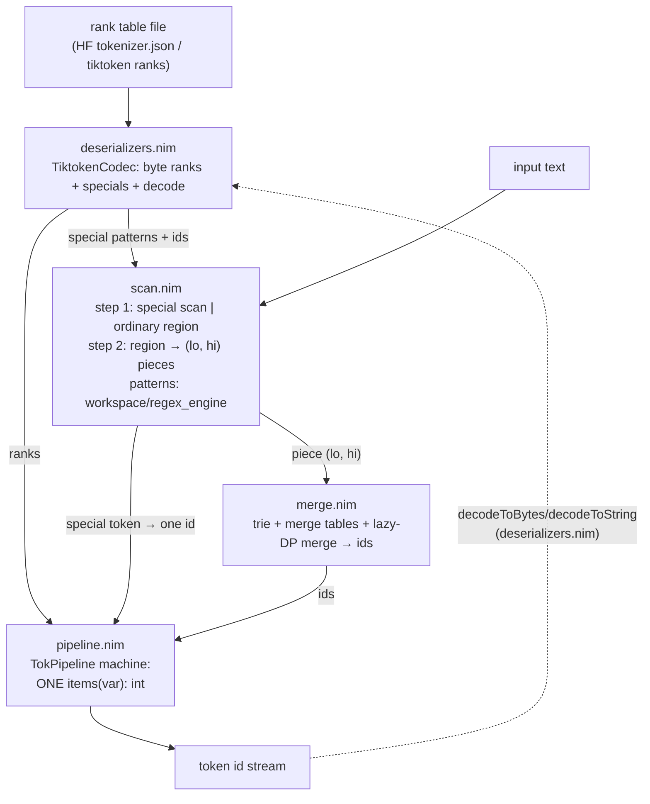

# toktoktok src/ — machine-pipeline stage files

A text file becomes token ids through five files,
one per dataflow stage.

- `machine.nim` fixes the protocol every stage implements, the shape
  is a value object with a constructor, position state advanced before
  each yield, exactly ONE `items(var)` iterator.
- Break mid-stream, re-enter, and the machine
  resumes at the first unconsumed element.

## Files

| File | Stage | Role |
|------|-------|------|
| `deserializers.nim` | load | HF `tokenizer.json` and tiktoken rank files → `TiktokenCodec` (byte ranks, special tokens, decoders). Nothing downstream reads files or JSON. `decodeToBytes`/`decodeToString` implement the decoder step in the reverse direction. Also the GPT-2 byte↔unicode remap as procs/tables (`ByteLevelRemap`, `bytesToUnicode`, `unmap`): checkpoint-format artifacts, decoder-side only. A normalizer spec, if a checkpoint ever ships one, lives here (no staged checkpoint declares one). |
| `machine.nim` | protocol | The machine protocol all stages implement: object + ctor + ONE `items`, position state advanced before each yield. Also `SpecialDecision` (the element type shared by scan and pipeline) and `IdentityStream` (the reference machine). |
| `scan.nim` | text → pieces | Step 1: the special-token scan (`SpecialScanner`/`SpecialScan`, greedy leftmost-start, longest match wins on equal starts). Step 2: the per-family pre-tokenization (`PreTokenizer`, Isolated Split-chain semantics, patterns compiled through `workspace/regex_engine`) with its pattern-split fast path (`SplitPattern` triple + `scanSplit`; the frontier-engine scan stays compiled and in-tree as the equality reference). |
| `merge.nim` | pieces → ids | The double-array vocab trie, the load-time merge-table derivation (PairIndex, SplitTable, dense ids, load-time re-encode self-check) and the served lazy-DP merge core (`BpeEngine`, `isValidTokenPair`, `encodeSegment`). The naive merge reference is `bpe_codec.bytePairEncode`, the differential fuzz suites cross-check the two. |
| `pipeline.nim` | api | `TokPipeline`: the composed machine. `init(ranks, specials, ids, family)` then `resetText`/`beginStream`/`feed`/`finishStream` with ONE `items(var): int` of token ids and `drained()`. Composition rule: one scan decision in flight at a time, its ids yielded before the next decision (chain-depth constraint, Nim issue #9422). |

Consumers outside src/:

| File | Role |
|------|------|
| `../toktoktok.nim` | Facade: re-exports the machine types, the pipeline and the byte-level codec modules for importers. |
| `../tests/pytoktoktok.nim` | Python binding: drains the pipeline machine in caller-sized batches. |

## Encode dataflow

## Composition contract

- Special token occurrences skip step 2 and the merge, one special id
  per occurrence, no piece splitting, no merging, and ordinary regions
  take every step in order.
- Each machine hands out offsets or views into caller- or machine-owned
  buffers. Zero allocation in the steady state. Buffers reset between
  calls and grow only at segment starts.
- Encoder and decoder are independent positions: `deserializers.nim`
  owns the decoders and the unicode remap, both inactive on the served
  byte-rank encode path.
