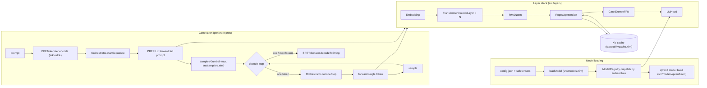

# Transformers — Architecture

## Position in the stack

`workspace/transformers` is the inference engine, the project that composes
the lower-level libraries of the Tattletale monorepo into a working model.

It consumes their public APIs, with no hard dependency on internals:

| Concern | Library | Role |
|---------|---------|------|
| Tensors / device | `workspace/libtorch` | `Tensor` type, CUDA/CPU device, tensor ops |
| Tokenizer | `workspace/toktoktok` | `BPETokenizer` encode/decode |
| Model I/O | `workspace/safetensors` | weight loading / deserialization |
| Kernels | `workspace/positron` | e.g. Hadamard transforms for EXL3 |

`workspace/transformers/transformers.nim` is the public entry point, it
imports and re-exports `src/models.nim`, so consuming code imports
`workspace/transformers` and nothing else.

## Structural overview



## Annotated tree

```
workspace/transformers/
├── transformers.nim            # public entry: imports + re-exports src/models
├── transformers.nimble         # package metadata, deps: packedjson@#head, iface
├── src/
│   ├── models.nim              # loadModel + generate top-level procs
│   ├── models/
│   │   ├── all_interfaces.nim  # Model iface (iface pkg) + compile-time ModelRegistry
│   │   ├── all_reexports.nim
│   │   └── qwen3.nim           # Qwen3 model implementation, registers in registry
│   ├── layers.nim              # Layer union type; to() device/dtype conversion
│   ├── layers/
│   │   ├── embedding.nim       # token embeddings
│   │   ├── linear.nim          # linear projection (incl. EXL3-quantized path)
│   │   ├── lmhead.nim          # language-model head
│   │   ├── ffn.nim             # gated MLP
│   │   ├── norm.nim            # RMSNorm
│   │   ├── rope.nim            # rotary position embeddings (cos/sin cache)
│   │   ├── attn.nim            # grouped attention over KV pages
│   │   └── decoder_layers.nim  # DecoderLayer generic composition
│   ├── quantizations/
│   │   ├── exl3.nim            # EXL3 decode constants / codebook decoding
│   │   ├── exl3_codecs.nim     # trellis + lattice codecs
│   │   ├── datatypes.nim       # quantized datatypes
│   │   └── unquantized_codecs.nim
│   ├── samplers.nim            # Gumbel-max sampling
│   ├── deserialization.nim     # weight deserialization
│   └── stateful/
│       ├── inference_context.nim   # per-sequence ctx passed to forward
│       ├── kvcache.nim             # PagedRadixTrie + intrusive WAVL LPM index
│       ├── kvcache.lean            # Lean 4 formal spec of the KVCache
│       ├── orchestrator.nim        # page lifecycle: init/startSequence/decodeStep/end
│       ├── page_pool.nim           # GPU page allocation
│       └── stateful_testutils.nim
├── docs/
│   └── DESIGN.md               # design principles (stateless forward pass)
└── tests/
    ├── q_exl3/                 # EXL3 tests (CUDA-only) + README.md
    ├── testgen/                # fixture generation (FIXTURE_GENERATION.md)
    ├── kvcache/                # KV cache tests
    ├── q_bf16/                 # bf16 tests
    ├── harness/                # harness modules + selftest + invariants
    ├── samplers/               # sampler tests
    ├── layer_invariance/       # layer invariance property suites
    └── fixtures/, hf_models/   # shared fixtures / HF reference models
```

## Data-flow walkthrough

1. **Load.** `loadModel` parses `config.json`, reads `architectures[0]`, then
   dispatches through the compile-time `ModelRegistry` to a model builder
   (`src/deserialization.nim` handles the safetensors weights) deserializing
   into a `Model` object. Each model module populates the registry
   via a static block.
2. **Tokenize.** `generate` encodes the prompt with the model's
   `BPETokenizer` (`toktoktok`), producing token ids.
3. **Orchestrate.** An `Orchestrator` (`src/stateful/orchestrator.nim`) owns
   the KV cache and page pool. `startSequence` and `decodeStep` allocate pages
   and track `kv_position`, while `endSequence` releases them.
4. **Prefill.** The full prompt tensor is forwarded through the layer stack.
   Each `TransformerDecodeLayer` runs embedding → attention (`RopeGQAttention`) →
   gated MLP → RMSNorm, ending in the `LMHead`. Attention reads/writes KV pages
   through the cache. `kv_position` is set after prefill to reflect total
   prefill tokens before decode allocation.
5. **Decode loop.** One token at a time.
   `decodeStep` advances the KV write offset, one single-token forward runs,
   and `sample` (`src/samplers.nim`) applies Gumbel-max to the logits
   to pick the next token.
   `kv_position` advances *after* forward so the attention layer's write
   offset stays at the prior position, avoiding a GPU→CPU sync. The loop ends
   on EOS or on the `maxTokens`/`maxCtx` limits.
6. **Decode.** The accumulated ids are decoded back to a string.

## KV cache design

The cache (`src/stateful/kvcache.nim`) is a PagedRadixTrie with path
compression and page (256-token) granularity. Key properties, summarized
from the design notes in the file:

- No hashmaps. The full token sequence must be processed anyway,
  hashmaps add hash compute, collision resolution, and no early exit.
  Divergence usually happens within the first 10-20 tokens
  of a system prompt, so early exit wins.
- No amortized or global heap eviction. Eviction uses statistics
  propagated after `graftPages`, plus an intrusive WAVL tree per node
  to pick the oldest unlocked child in O(log n). This avoids tombstones, refcounting churn, and the ~100 ns
  kernel-syscall clock that a global LRU would require.
- The WAVL tree doubles as an LPM index. Its comparator returns the signed
  position of the first token mismatch, so `wavlFindBestMatch` returns
  the neighbor with the longer shared prefix in O(log n) with zero redundant
  comparison. Both LPM hit and miss are pure O(log n).

The Lean 4 formalization spans `src/stateful/kvcache.lean`,
`formalities/kvcache.lean`, and `formalities/wavl_tree.lean`, and it
partially verifies this design.

**WIP:** attention does not yet consume matched pages via a CSR-style kernel.
It copies page KV into contiguous views (`copyFrom` in `src/layers/attn.nim`).

## Extension points

- **New architectures.** Add a model module under `src/models/` that implements
  the `Model` iface and registers itself in `ModelRegistry` via a static block.
  `loadModel` then dispatches to it automatically.
- **New quantization schemes.** Add codecs under `src/quantizations/` and wire
  them into the layer implementations, the linear layer already carries
  an EXL3-quantized path.
- **New layer types.** Add the type to `src/layers/` and to the `Layer` union
  in `src/layers.nim`, which drives the generic `to()` device/dtype conversion.
- **Sampling strategies.** Replace or extend `sample` in `src/samplers.nim`.
- **Cache / attention.** The `Orchestrator` + `KVCache` boundary inside
  `src/stateful/` is where page lifecycle and prefix matching integrate.

### Extension points come with their tests

A new architecture, layer, or codec is not done until its test tree
exists:

- generators, one per fixture tier inside `tests/testgen/`, named
  `gen_<dtype>_<model>_<NN>_<tier>.py` per the generator-naming scheme
- suites, the fixture-replay tiers (per-op, chain, full forward, greedy)
  plus the analytic suites (batch invariance, unit properties)
- the assert surface, `assertStats` / `assertArgMax`, the contract
  inside [`tests/harness/README.md`](tests/harness/README.md)

The full recipe (tiers, recording, suite shape, linters) lives inside
the [testing skill](../../.agents/skills/testing/SKILL.md) together
with [tests README](tests/README.md), each part carrying its share.

Skipped recipes fail the commit.

The `tests/linters/` checks flag generators outside the naming scheme,
fixtures over the size caps, suites off the assert surface.

## Related docs

- [`README.md`](README.md), capabilities, WIP status, build/run
- [`docs/DESIGN.md`](docs/DESIGN.md), design principles, stateless forward
- `AGENTS.md`, monorepo build/test/lint conventions and CUDA test setup
- root `README.md` and `AGENTS.md`, project goals, cross-project conventions
