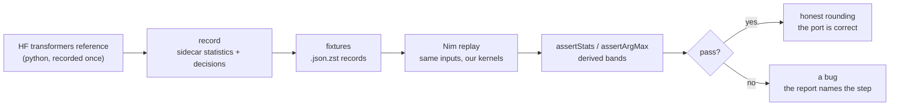

# Transformers test suites

How the suites tell honest rounding apart from real bugs, and how
the suites themselves stay honest.

- writing rules live in [testing skill](../../../.agents/skills/testing/SKILL.md)
- assert API in [harness README](./harness/README.md)
- recording rules in [FIXTURE_GENERATION.md](./testgen/FIXTURE_GENERATION.md)
- extension recipe in [ARCHITECTURE extension points](../ARCHITECTURE.md#extension-points)

## Stakes

We reimplement the HF transformers models in Nim, kernel by kernel.

- two faithful implementations of the same math never agree bit for bit
- one bf16 ulp is a relative step of about 0.4 percent, honest drift
  and small bugs live in the same size class
- deciding wrong costs days, these suites make the decision mechanical

## Test kinds

| kind | expected side | dirs |
|---|---|---|
| fixture-replay | recorded sidecar statistics + decision records from the python reference, replayed by our kernels | `q_bf16/`, `q_exl3/` |
| analytic | truth computed in-process: closed forms, in-process reference ops, exact order statistics | `kvcache/`, `samplers/`, `layer_invariance/` |

Replay resolves the device through `select_device`, GPU over CPU.
Metal serves m4max, CUDA serves rtxpro6000.
cpu replay must not be automatic, a missing device kernel fails loudly.

- PYTORCH_ENABLE_MPS_FALLBACK is banned, it defeats PR #104, the device
  policy linter counts it
- a `= kCPU` default device parameter is banned across transformers src,
  callers pass the device explicitly

## Check ladder

Each tier assumes the ones above it:

| tier | what it proves |
|---|---|
| analytic unit cases | the math against in-process truth: closed forms, invariants |
| unit tier (01) | one suite per model family against one fixture file, mixer op surface, layer chain, routed block, kinded bands, per-op rows are dead, the chain asserts the ops at block-output level |
| chain records (02) | drift composes within the depth-scaled band, the scaling rule separates sqrt-shaped faults |
| full forward (03) | the whole stack: boundaries as record sequences, routing ids exact, logits as decisions |
| greedy decoding (04) | per-step decisions: argmax, top-k, margins, the flip behavior |
| layer invariance | batched prefill equals step decode on identical inputs; this suite owns the prefill/decode axis, tier-01 records one path per op |
| the HF fuzz (`t_vs_hf_Qwen3.5-0.8B.py`) | the ultimate end-to-end check: live HF against our model, seeded, whole model |

## Tree

| path | contents |
|---|---|
| `q_bf16/`, `q_exl3/` | fixture-replay suites per model family and tier |
| `layer_invariance/` | layer invariance property suites |
| `vs_python/` | the HF fuzz against the live transformers library |
| `kvcache/`, `samplers/` | analytic unit suites |
| `harness/` | the assert API + selftest (see the [harness README](./harness/README.md)) |
| `linters/` | the fixture-tree linters (see below) |
| `testgen/` | the generators (`gen_*.py` only, enforced), the recorder, [FIXTURE_GENERATION.md](./testgen/FIXTURE_GENERATION.md) |
| `fixtures/` | recorded families: tensors, sidecar records |
| `stateful_utils.nim`, `layer_utils.nim`, `ulp_utils.nim` | shared suite helpers |

`hf_models/` holds the checkpoints a checkout tests against.

Gitignored machine-local contents, all standing:
- real model downloads
- symlinks into a local store
- an empty dir

## Linters

Nothing commits without them:

| linter | domain |
|---|---|
| `lint_gen_scripts.py` | the generators: docs, config over consts, entry shape, the directory allowlist |
| `lint_fixtures.py` | the fixtures: size caps (the EXL3 carve-out is explicit), one dir per tier, record schema |
| `lint_nim_fixtures_consumers.py` | the suites: the assert allowlist, one flat main, filepath-only consts, shared-helper imports, docs |
| `lint_docs.py` (in the writing-docs skill) | doc comments everywhere, including this tree |

Run commands and rule tables live in each linter header and inside
the [testing skill](../../../.agents/skills/testing/SKILL.md).

## Guardrails: the suites check themselves

The harness selftest (`tests/test_tf_harness_selftest`) is two-sided,

- a fault corpus of injected, known-size faults must be rejected
- the honest drift corpus must be accepted as the pass condition

Every self-check routes through statistical theory, analytic answers
over synthetic tensors, and fixture data never validates the harness.

## FAQ

### How can a suite catch small systematic errors?

Order statistics move with every element, a coherent relative scale
of `1 + 2^-20` shifts the max quantile and the signed mean while
staying invisible element-by-element.

The band catches it through the record.

### How do I tell a tie flip from a real bug?

A margin-zero flip at the top of the distribution is legitimate
rounding. The decision record carries the margin and the top-k pair,
and the flip cap bounds how often a chain may flip before it is a bug.

### Why are computed outputs never compared bit-exactly?

Honest rounding is the checked quantity, two correct implementations
of the same math disagree within the kind band, so a bit-exact demand
would reject the correct port.

Bit-exact exists only in the authority variant, the same-device
migration tooling, and inside analytic suites where the math is exact.

### What can the suites not catch?

Sparse corruption below the histogram sensitivity and single-element
faults off the boundary elements stay outside deterministic reach.

Floors are measured and published inside the selftest, and the HF
fuzz bounds whatever slips past every tier.

## Asserts

Only assertStats and assertArgMax may enforce.

Counted violations:
- any other harness assert proc
- any check* call
- any verify*, ensure*, or require* call
- the `runCppTest` sections
