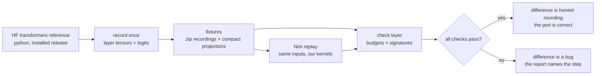
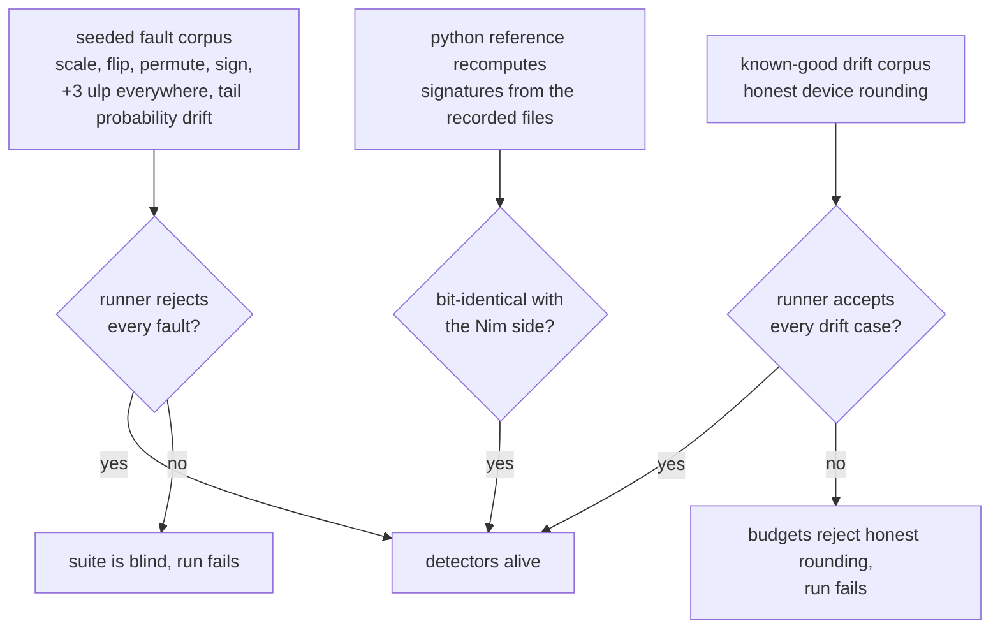
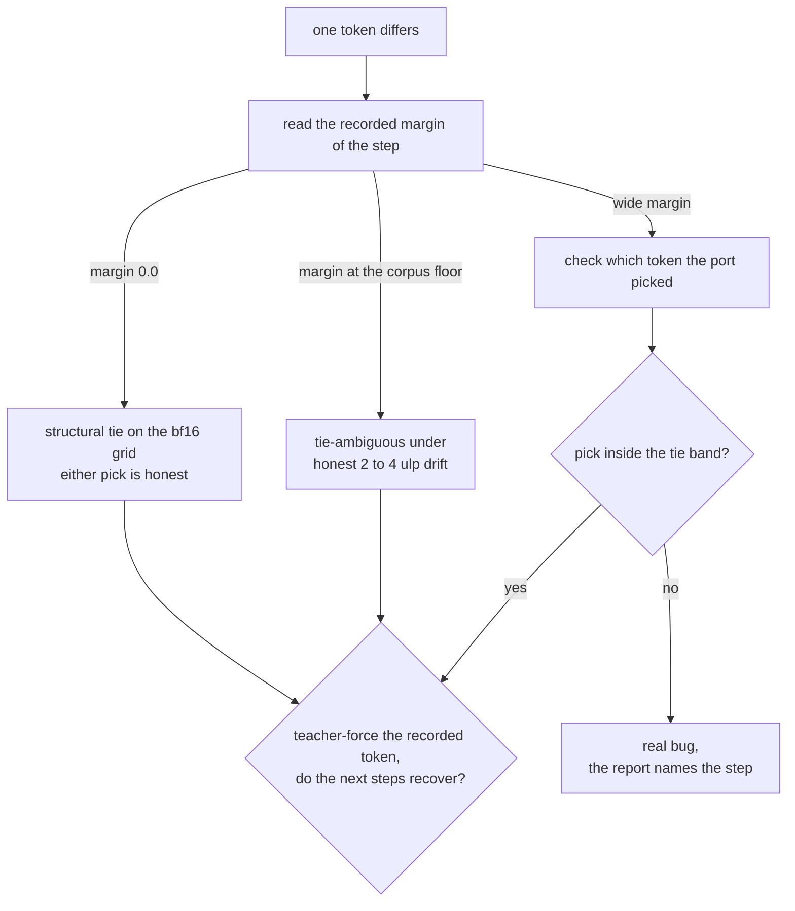
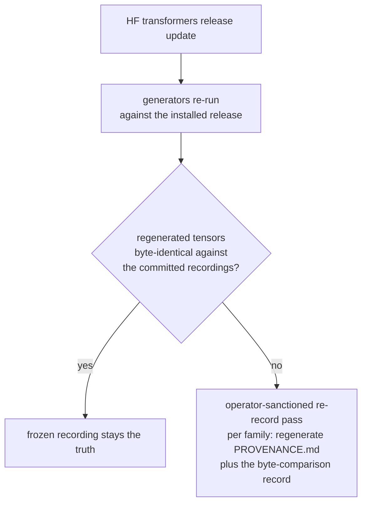

# Qwen3-family test suites

How the suites tell honest rounding differences apart from real bugs, and
how the suites themselves stay honest.

Honest rounding: the drift two correct implementations of the same math
produce.

## The stakes

We reimplement the HF transformers models in Nim, kernel by kernel. Two
faithful implementations of the same math never agree bit for bit:

- Float math rounds differently when the order of operations differs by even
  one instruction.
- Different devices (CPU, Metal) round differently again.
- One bf16 ulp is a relative step of about 0.4 percent, so honest drift and
  small bugs live in the same size class.

A divergence is therefore either honest rounding or a bug, and deciding
wrong costs days: chasing legitimate rounding as a bug, or shipping a real
bug that "passed the test". These suites make that decision mechanical.

## The solution: record once, replay everywhere

A python script runs the HF reference model once per fixture family and
writes what it computed to `fixtures/`. The Nim suites feed the same inputs
to our kernels and compare against those recordings.



- Zip recordings carry chosen tokens, top-32 logits and margins per step for
  greedy decoding.
- Decision projections compress million-element logits to a few hundred
  bytes: argmax, the top-2 competing pair, and the tail probability
  per position, the probability of tokens outside the recorded top ranks.
- `PROVENANCE.md` per family records date, versions, platform, generator and
  seed, enough to recreate the recording run.
- Layer-boundary tensors stay as committed slices. Everything else is a
  compact signature (order statistics, histograms) so removed raw tensors
  keep a distribution check.

## Internal and external consistency

Tests answer two different questions.
The distinction decides what a check can catch and what it costs.

Internal consistency:

The code is checked against the code.
No recording is involved.

The same math has two implementations in several places:

- batched and unbatched evaluation
- recurrent and chunked evaluation of a linear attention layer
- fast and reference implementations

Both paths receive the same inputs.
Their outputs are compared.
Neither path is privileged.
A difference between them is evidence that one of them is wrong.

```
same inputs -> path A -> outputs -\
                                   compare -> one path is wrong
same inputs -> path B -> outputs -/
```

Layers also carry mathematical properties that must hold:

- a normalization preserves the direction of the vector it scales
- a probability distribution sums to one
- the output of causal attention at position i does not change
  when tokens after position i change
- a router sends each token to exactly the experts its weights say

The property is tested directly on computed outputs.
None of these checks need a recorded model output.
They work for any model, at any size, on any device, with no fixture cost.

Determinism is a record-time check:

Regenerating a recording re-runs the generator and compares the output
bytes against the committed recording.
The suites replay fixed fixtures, so the same comparison paths read the
same bytes on every development run.
A mismatch points at races or uninitialized memory, not at math.

External consistency:

The code is checked against the python reference.

A script runs the Hugging Face model once and records what it computed.
Our kernels redo the computation.
The test compares the results through short summaries:

- the largest difference
- the average difference
- how often the top prediction matches
- the total probability sitting outside the compared tokens

Summaries instead of full tensors keep the fixtures small.
This holds no matter how large the model is.

Each kind catches faults the others cannot:

- two paths can agree with each other and still both be wrong
  about the reference
- a layer can pass every property yet disagree with the reference
- a kernel can match its recordings while breaking a property
  the suite never stated

The full test run (`nim test_transformers`) needs both kinds.

## The check ladder

Checks tighten from raw bytes up to whole generated sentences:

- **Bit-exact**: deterministic ops on recorded inputs (codecs, codebooks,
  scales). Any difference is a bug by definition.
- **Element-wise budgets**: same-device computed outputs take 2 to 4 ulp of
  freedom. The budgets sit just above measured honest rounding and far below
  any seeded fault size.
- **Distribution checks**: outputs compared through order statistics,
  binade histograms and match rates. Catches shifts that element-wise
  sampling can miss, and vice versa.
- **Generation chains**: greedy (temperature 0) decoding of full sentences
  against recorded margins. Per-step logit caps, the tail probability
  and truncated KL, plus tie handling for the steps where two ids can
  hold the same maximal logit.

Throughout: band is the per-element tolerance `rtol * |expected| + abstol`,
band width is the measured drift of an element divided by its band.

## Guardrails: the suites test themselves

A suite that always prints PASS proves nothing, so the runner verifies its
own detectors from both sides:



- The seeded fault corpus covers uniform scale, single-element flips,
  permuted tensors, sign flips, codebook corruption, a +3 ulp shift of every
  element, sparse corruption and tail-probability drift. The chain-level
  corpus adds synthetic checkpoint sequences and a synthetic greedy chain:
  coherent per-checkpoint bias past the chain drift bound (rejected by
  the mean-drift check), the same bias below the bound (accepted, in
  bound), compounding band width growth (rejected at the tail
  by the drift-scaling check), margin-0 tie flips with re-anchor (the
  recorded token fed back in after the flip, teacher forcing) and
  re-convergence (accepted within the flip cap), endless flip chains
  (rejected at the cap) and wide-margin corruption (rejected).
- Detection floors are documented, including the cases one detector cannot
  see: sparse mass below the histogram sensitivity passes the signature
  check and is caught by the match-rate check instead. Tail-probability
  drift keeps row sums at 1, so the tail-probability check
  does that work.
- A batch-vs-single property test requires that forwarding a batch equals
  forwarding its rows one by one, within 2 bf16 ulp.
- The cross-implementation corpus recomputes signatures in python and Nim
  from the same recorded files and requires bit-identical results.
- The chain-level checks (band, drift scaling, mean drift, margins, tie
  handling, flip cap) are validated two-sided by the seeded chain corpus:
  every fault row is rejected, every in-bound drift case is accepted,
  and the chain drift bound sits exactly where the derivation
  says.

## Suite map

- `harness/` — the check layer itself: budgets and assertions, fixture
  stats, provenance rows, the two-sided selftest, invariants. `SPEC.md`
  states the check semantics, `PLAYBOOK.md` the how-to.
- `q_bf16/` — four fixture families per dense port: one chain suite per
  model (3-block long residual replay, sidecar checkpoints per block,
  drift-scaling check), one full-forward-to-logits suite, one greedy suite (with
  the t2t entry as the forced first step), and the per-op unit suites
  (`t_bf16_unit_rope`, `t_bf16_unit_attn`) shared across the dense ports
  with one recorded family per op. The 35B MoE port keeps its own suites.
- `q_exl3/` — EXL3 quantized checkpoints. The fixture suites compare through
  the recorded-summary surface (stats sidecars, chain bands, decision
  projections) and run on any device; the recorded payloads come from the
  production CUDA kernel, so only a CUDA replay is the bit-exact reference
  class.
- `samplers/`, `synthetic/` — sampler behavior and layer-level synthetic
  comparisons.
- `kvcache/` — the stateful KV context suites: page pool, radix trie,
  orchestrator, fork stability, longest prefix match, batch guard.
  CPU-only and model-free, they link libtorch and run in the full test
  run (`nim test_transformers`).
- `vs_python/` — the python-side fuzzing comparison.
- `testgen/` — the python generators, `FIXTURE_GENERATION.md` for the
  recording rules.
- Run everything with `nim test_transformers` from the repo root.

## Future tests

Chunked prefill and paged KV caches bring edge sizes worth testing:

- a chunk at 512 wants traces of 511, 512 and 513 tokens
- a page at 16 or 64 wants 15/16/17 and 63/64/65

One model per attention type carries the sweep. Storing full input
tensors at those sizes would cost tens of MB per sweep, so the sweeps
run differently:

- the inputs are pattern-generated from a deterministic formula of the
  index. The stored fixture is a few pattern parameters, not the
  tensor.
- both code paths receive the same pattern input and their outputs are
  compared directly. This is the internal-consistency tier at work: paged
  against flat KV, chunked against monolithic prefill.
- outputs are compared through short summaries plus a small probe, a
  few kB per layer.

The result: a boundary sweep costs tens of kB per attention type.
The python reference can run the same pattern inputs, so even the
recorded-reference comparison at a boundary size stores only summaries.

## FAQ

### How can a test suite catch small systematic errors?

In depth, one check per size class, each with a published detection floor:

1. Analytic invariants on the unit under check (a norm preserves its scale,
   a softmax row sums to 1).
2. Bit-exact signatures on recorded files (order statistics are exact
   order statistics, reproducible bit for bit across implementations).
3. Binade histograms over the value distribution, sensitive to shifts of a
   bucket or more.
4. Layer-boundary slices compared element-wise under one budget, with a
   mismatch-fraction allowance of zero for the sensitive ops.
5. Chain-level checks on generated text: per-step margins, the tail
   probability and truncated KL, which see what single-layer budgets
   cannot.

Depth matters because the accumulation models separate the failure
kinds: honest per-block drift is bounded by the depth-linear chain
band, a compounding fault outruns the flat band width bound, and a
coherent bias shows in the signed mean over the checkpoint elements
even while every per-element band passes.

### How do I tell a tie flip from a real bug?

A tie flip and a real bug produce the same symptom (one token differs) with
completely different root causes. The recorded margin data decides:



1. **Read the recorded margin of the diverging step.** Every step stores the
   f32 gap between the top-1 and top-2 logits. A margin of 0.0 is a
   structural tie on the bf16 grid: two ids hold the same maximal logit, and
   which one a faithful port picks is an argmax first-index detail that
   device numerics may reorder. A margin at or below the corpus
   floor (0.0625, one bf16 ulp) is tie-ambiguous under honest 2 to 4 ulp
   device drift.
2. **Check which token the port picked.** A tie flip's pick sits inside
   the tie band: its logit is within 4 bf16 ulp (plus the margin term) of
   the recorded top-1. A real bug's pick has a logit far from the recorded
   top-1, or the recorded margin was wide (a clear winner) and the port
   still diverged.
3. **Check re-convergence.** After teacher-forcing the recorded token back
   in, a tie flip recovers: the next steps pass again. A real bug keeps
   diverging or fails its logit caps at the same step.
4. **Check the flip cap.** Flips within the cap (4 per chain) are honest
   rounding of a tie. Endless flips mean the two implementations disagree
   on more than tie ordering, which is a bug.

Report format on failure: step, recorded margin, observed pick and its
logit, the tie band, and the worst deviating top-32 support id. A divergence
whose report shows margin 0.0 and the pick inside the band is a tie flip.
Anything else is a real bug and the report's step number is the
localization to start from.

### Why are computed outputs never compared bit-exactly?

- Same-device float math drifts 1 to 2 ulp through honest rounding alone
  (measured with the rmsnorm benchmark), so a bit-exact demand on computed
  outputs rejects honest rounding.
- Bit-exact comparison is reserved for pure deterministic ops on recorded
  inputs (codecs, codebooks, scales), where any difference is a bug by
  definition, and for the recorded fixture files themselves, whose integrity
  is verified against recorded checksums.
- Raw output dumps carry no distribution information worth their size: the
  compact signatures keep a distribution check after the raw tensors are
  removed.

### What happens when the HF transformers reference updates?



- The GDN families regenerate byte-identically, so a frozen recording stays
  the truth at no cost.
- Silent re-records do not happen, a recording is replaced only with a
  verified re-record record: every family carries `PROVENANCE.md` with the
  versions, platform and seed of the recording run, plus the
  byte-comparison record of the regeneration run.

### Where do the budgets come from, and when may they change?

Each budget in the table is derived, not tuned. Measurement checks
the numbers, it never sets them.

Derived, not tuned:

- Each op differs between two correct implementations by at most a bf16
  ulp or two.
- Inside one op, rounding error compounds like a random walk and
  saturates inside the normalized branches (RMSNorm, softmax).
- Along the chain, the honest cross-device drift of a residual-stream
  element is absolute-scale, tracks the activation bulk, and accumulates
  linearly with depth: the per-block differences from the addition
  order are bounded but not zero-mean. The chain budget states that model: an
  absolute term of 2^-3 times the depth times the bulk scale of the
  recorded checkpoint, plus two ulp of relative slack. The first chain
  budget assumed a zero-mean random walk and scaled its absolute term
  with sqrt(depth). The 9-checkpoint measurement falsified that
  assumption at depth 8, and the budget changed through the derivation
  procedure (the budget-change log in harness/SPEC.md carries the
  record).

Measurement checks, never sets:

- A recorded checkpoint sitting inside the band the model predicts is
  corroboration.
- A checkpoint outside its budget is a flaw signal, from one of three
  sources, each with its own remedy:
  - a stale recording, remedy: a verified re-record
  - a code defect, remedy: a code fix
  - a wrong modeling assumption, remedy: a refined derivation and a
    restated budget
- Widening a budget so that a checkpoint outside its budget passes is
  forbidden, because it turns the suite into a description of whatever
  the last recording happened to contain.

Valid budget changes:

- state which assumption of the model changed
- re-derive the number from the new model
- show the seeded fault corpus still rejects every fault at the new budget
- document the reasoning in the suite docs
- every constant in the budget table traces to a step of a derivation,
  never to a run that passed

### What can the suites not catch?

- Anything below the budget, by contract: a systematic shift of 1 ulp
  inside a 2 ulp budget is correct as far as the budget states, and its
  accumulation is policed by the chain-level checks instead.
- Sparse corruption below the histogram sensitivity passes the signature
  check and is caught by the match-rate check. Tail-probability drift
  is invisible to row sums and caught by the tail-probability check.
  Every not-detected case names its compensating detector in the selftest
  floor table.
- Fault classes outside the seeded corpus. The corpus covers the known
  classes. A new class needs a seeded corpus entry and a check at the
  layer where it becomes visible.
- A coherent per-checkpoint bias at or under the chain drift bound
  (about 8 percent of the checkpoint bulk) is correct as far as the
  derivation states: the mean-drift check accepts it by design.
  Compounding accumulation is policed by the drift-scaling check
  instead.
- A single-element cross-device fault below the chain band passes the
  chain budget. The compensating detectors are the reference-device
  bit-exact replay (any drift there is a bug) and the greedy chain
  checks downstream.
- Per-block fixtures cover the first 8 blocks and the tail layer only,
  by design. The prefix is unit-test territory. The deep blocks in
  between are integration territory, covered end to end by the greedy
  chains. A late-block per-op regression surfaces only when it perturbs
  the generated text or the tail checkpoint.
